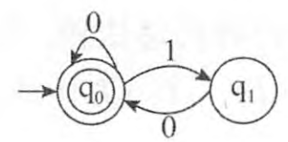

## 三.文法定义

 

### 3.1 文法类型

 

---

 

### 3.2 语法推导树

 

> 例:

 

### 3.3 有限自动机

 

> 例:

某有限自动机的状态转换图如下图所示，与该自动机等价的正规式是（&nbsp; ）。 

 

问题1选项
  A.(0|1)*
  B.(0|10)*
  C.0*(10)*
  D.0*(1|0)*
 

 

解:

从题中的自动机可分析出，初态q0同时是终态，从q0到q0的弧(标记0)表明该 自动机识别零个或多个0构成的串，路径q0→q1→q0的循环表明“10”的多次重复，因此该自动机识别的字符串是“0|10”的无穷多次，表示为(0|10)*。

https://www.educity.cn/tiku/20986222.html

 

---

 

### 3.4 正规式

 

> 例:

 

---

 

## 四.表达式

 

> 例

 

---

 

参考:

[编译原理](https://blog.csdn.net/weixin_43823808/article/details/108291401)