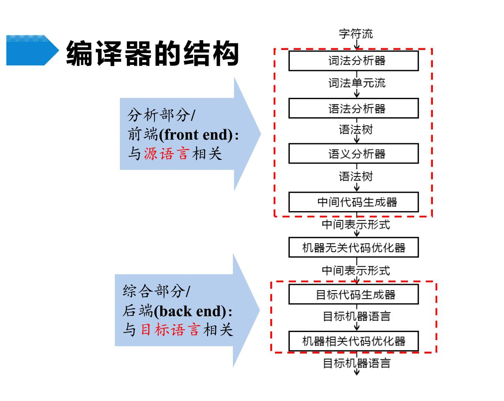
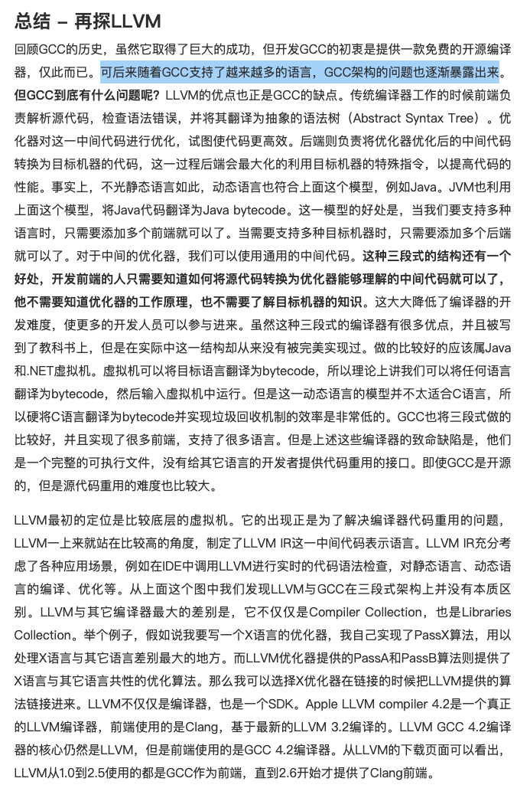
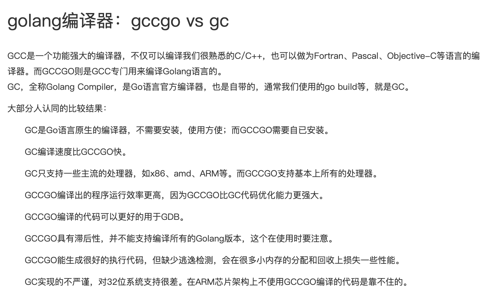
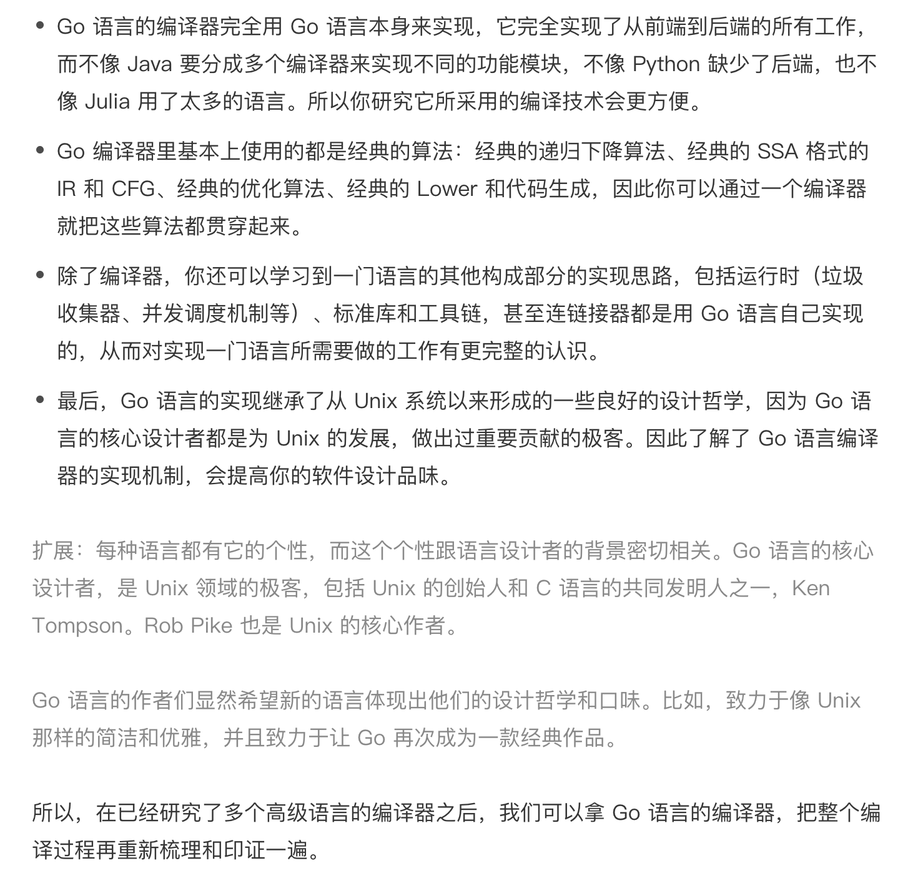
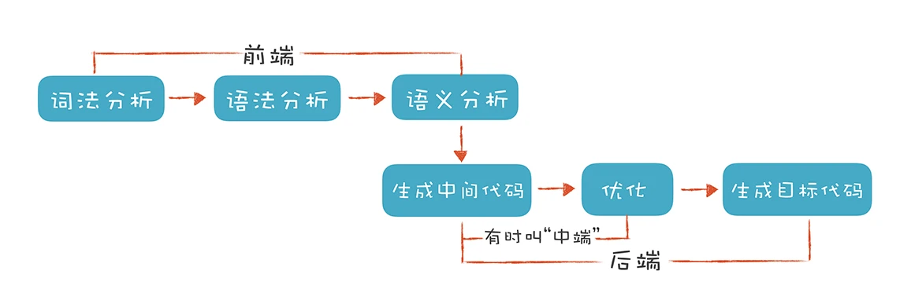
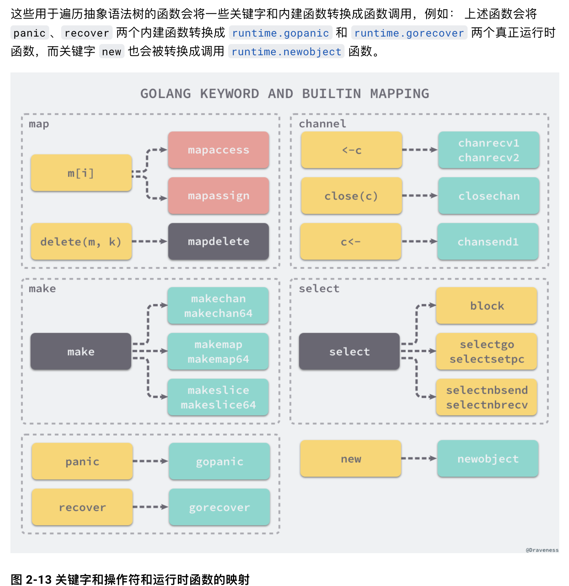
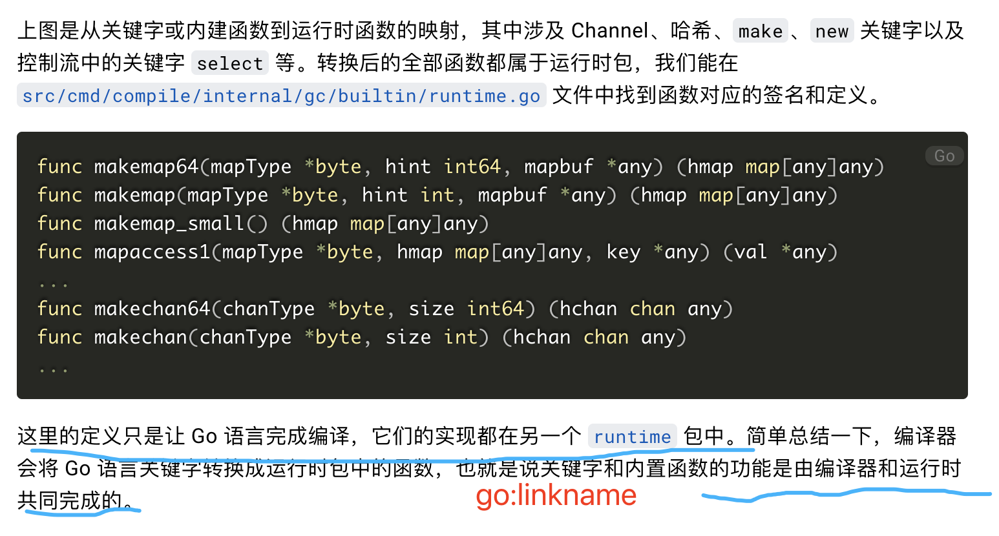
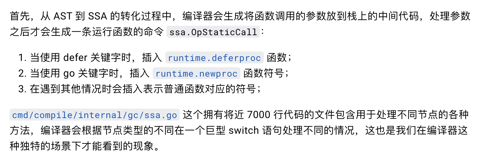
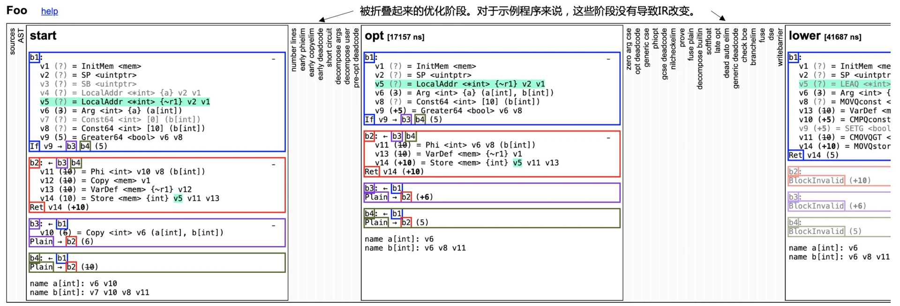
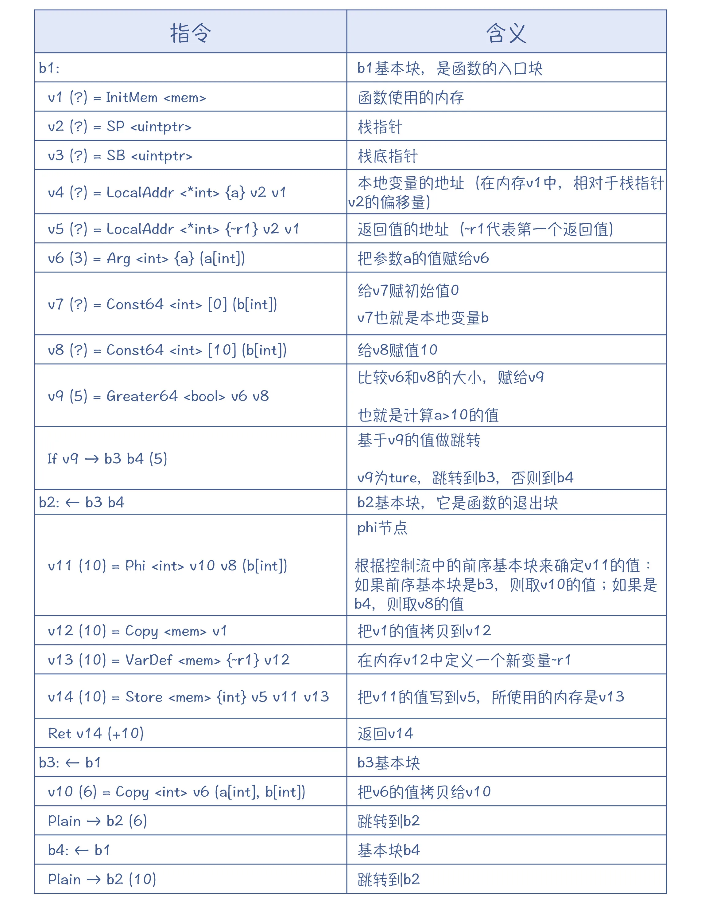

https://pandolia.net/tinyc/

[阮一峰-编译器的工作过程](https://www.ruanyifeng.com/blog/2014/11/compiler.html)

 

GCC是 [RMS](https://dashen.tech/2020/05/07/%E5%A4%A9%E7%A5%9E%E8%8D%9F%E8%90%83/#Richard-Matthew-Stallman) 主导的烂尾项目GNU,遗存下来的不多的硕果(glibc算另外一个). GNU全称 *Compile Collection*(GNU编译器套装)

 

LLVM(Low Level Virtual Machine) 和 Clang作者都是编译器领域大名鼎鼎的 [Chris Lattner](). 

LLVM引入IR（Intermediate Representation）概念,兼容性高

 

这个logo应该是在致敬 [龙书](https://book.douban.com/subject/1134994/)

随着后来GCC支持越来越多的语言,GCC架构的问题也逐渐暴露出来

LLVM与GCC在三段式架构上并没有本质区别。LLVM与其它编译器最大的差别是，它不仅仅是Compiler Collection，也是Libraries Collection。

(其实llvm和clang关系比较微妙)

 

机器只认字节码,至于这个字节码中间是怎么编译成的,机器并不关心

 

更多参考:

[GNU、GCC、LLVM和Clang](https://juejin.cn/post/6844903621176328206)

[GCC, the GNU Compiler Collection](https://gcc.gnu.org/)

[llvm.org](https://llvm.org/)

[LLVM编译原理和使用](https://blog.csdn.net/yayaayaya123/article/details/83993041)

[Resources for Amateur Compiler Writers](https://c9x.me/compile/bib/)

 

###  [Go语言编译器](https://github.com/golang/go/blob/release-branch.go1.13/src/cmd/compile/README.md)

 

Go 1.3之前编译器用C实现, [1.3之后](https://docs.google.com/document/d/1P3BLR31VA8cvLJLfMibSuTdwTuF7WWLux71CYD0eeD8/edit)用Go实现,即实现了 [自举](https://www.cnblogs.com/lidyan/p/6727184.html)

 

当前Go的编译器有默认的 GC,以及基于GCC的 GCCGO.  关于这二者区别:

 

也有[基于LLVM的实现](https://go.googlesource.com/gollvm/),但支持[还不够好](https://blog.gopheracademy.com/advent-2018/llvm-ir-and-go/)

 

`go tool compile -w 文件名`,展示 抽象语法树 的转换

 -l :禁用内联的标志

 AST 生成后, 其允许编译器使用 SSA 表示转到较低级别的中间表示

 

 

---

 

[Go 程序是如何编译成目标机器码的](https://segmentfault.com/a/1190000016523685)

[Go编译器——AST到SSA流程分析](https://blog.csdn.net/qq_42633819/article/details/107250685)

[编译原理实战课](https://time.geekbang.org/column/article/266379?utm_source=related_read&utm_medium=article&utm_term=related_read)

> Go 语言的编译器完全用 Go 语言本身来实现，它完全实现了从前端到后端的所有工作，而不像 Java 要分成多个编译器来实现不同的功能模块，不像 Python 缺少了后端，也不像 Julia 用了太多的语言。所以你研究它所采用的编译技术会更方便。

 

[Go 编译器概述](https://studygolang.com/articles/24554)

 

---

 

### Go 编译过程

 

#### 词法分析和语法分析

 

词法分析器: [cmd/compile/internal/syntax.scanner](https://github.com/golang/go/blob/d902791b509b641683d4ec58b282180c56918aec/src/cmd/compile/internal/syntax/scanner.go#L30)

> Go 的词法分析器并没有像 V8 那样在不遗余力地压榨性能，它跟你平常编码的方式是很一致的，非常容易阅读。

语法分析器: [cmd/compile/internal/syntax.parser](https://github.com/golang/go/blob/6965b01ea248cabb70c3749fd218b36089a21efb/src/cmd/compile/internal/syntax/parser.go#L17)

> 它是一个标准的手写的递归下降算法。在解析二元表达式的时候，Go 的语法分析器也是采用了运算符优先级算法，这个已经是第 N 次见到这个算法了！不过，每个编译器的实现都不大一样，而 Go 的实现方式相当的简洁，可以去自己看一下，或者用调试器来跟踪一下它的执行过程。

 

在 `cmd/compile/internal/syntax` 目录下，还有词法分析器和语法分析器的测试程序，可以去运行测试一下

 

[Go语言编译器：把它当作教科书吧](https://time.geekbang.org/column/article/266379?utm_source=related_read&utm_medium=article&utm_term=related_read)

[Lexical Scanning in Go - Rob Pike](https://www.youtube.com/watch?v=HxaD_trXwRE)

[Go 1.5 Bootstrap Plan](https://docs.google.com/document/d/1OaatvGhEAq7VseQ9kkavxKNAfepWy2yhPUBs96FGV28/edit)

[The Go Programming Language Specification](https://golang.org/ref/spec)

 

#### 语义分析 --- 包括 类型检查和 AST 变换(即中间代码IR的生成?)

 

通过词法和语法分析器的解析得到了抽象语法树，然后编译器会继续执行下一阶段 `---` 类型检查。

> 类型检查是 Go 语言编译的第二个阶段，在词法和语法分析之后我们得到了每个文件对应的抽象语法树，随后的类型检查会遍历抽象语法树中的节点，对每个节点的类型进行检验，找出其中存在的语法错误，在这个过程中也可能会对抽象语法树进行改写，这不仅能够去除一些不会被执行的代码、对代码进行优化以提高执行效率，而且也会修改 make、new 等关键字对应节点的操作类型。

 

> 词法与语法分析以 及 类型检查 两个部分都属于编译器前端，它们负责对源代码进行分析并检查其中存在的词法和语法错误，经过这两个阶段生成的抽象语法树已经不存在语法错误了，之后就到了编译器的后端工作部分  `---` 中间代码生成

> 中间代码是编译器或者虚拟机使用的语言，它可以来帮助分析计算机程序。在编译过程中，编译器会在将源代码转换到机器码的过程中，先把源代码转换成一种中间的表示形式，即中间代码

 

从 AST 到 SSA 中间代码的生成过程，有将近 50 个生成中间代码的步骤

[Introduction to the Go compiler's SSA backend](https://github.com/golang/go/blob/release-branch.go1.14/src/cmd/compile/internal/ssa/README.md)

更多参见 [编译原理实战课](https://time.geekbang.org/column/article/266379?utm_source=related_read&utm_medium=article&utm_term=related_read)

 

#### 生成机器码

 

最后，编译器就可以调用 **gc/ssa.go** 中的[genssa](https://github.com/golang/go/blob/release-branch.go1.14/src/cmd/compile/internal/gc/ssa.go#L5899)方法，来生成汇编码

至于指令排序，我没看到过在 gc 编译器中的实现。我请教了谷歌的一位研究员，他给我的信息是：像 AMD64 这样的 CPU，已经能够很好地支持乱序执行了，所以指令重排序给 gc 编译器的优化工作，带来的好处很有限。

而 gc 目前没有做指令排序，还有一个原因就是，指令重排序算法的实现代价比较高，而 gc 的一个重要设计目标，就是要求编译速度要快。

扩展：Go 语言的另外两个编译器，gccgo 和 GoLLVM 都具备指令重排序功能。

 

> 最开始的计算机使用复杂指令集是因为当时计算机的性能和内存比较有限，业界需要尽可能地减少机器需要执行的指令，所以更倾向于高度编码、长度不等以及多操作数的指令。不过随着计算机性能的提升，出现了精简指令集这种牺牲代码密度换取简单实现的设计；除此之外，硬件的飞速提升还带来了更多的寄存器和更高的时钟频率，软件开发人员也不再直接接触汇编代码，而是通过编译器和汇编器生成指令，复杂的机器指令对于编译器来说很难利用，所以精简指令在这种场景下更适合。

> 复杂指令集和精简指令集的使用是设计上的权衡，经过这么多年的发展，两种指令集也相互借鉴和学习，与最开始刚被设计出来时已经有了较大的差别，对于软件工程师来讲，复杂的硬件设备对于我们来说已经是领域下三层的知识了，其实不太需要掌握太多，但是对指令集架构感兴趣的读者可以找一些资料开拓眼界

 

> 汇编器是将汇编语言翻译为机器语言的程序，Go 语言的汇编器是基于 Plan 9 汇编器的输入类型设计的，Go 语言对于汇编语言 Plan 9 和汇编器的资料十分缺乏，网上能够找到的资料也大多都含糊不清，官方对汇编器在不同处理器架构上的实现细节也没有明确定义

> 作为软件工程师，如果不是 Go 语言编译器的开发者或者需要经常处理汇编语言和机器指令，掌握这些知识的投资回报率实在太低，我们只需要对这个过程有所了解，补全知识上的盲点，在遇到问题时能够快速定位即可

 

[机器码生成](https://draveness.me/golang/docs/part1-prerequisite/ch02-compile/golang-machinecode/)

[Go 程序到机器码的编译之旅](https://studygolang.com/articles/15648)

[go编译器](https://zhuanlan.zhihu.com/p/52614346)

附加参数      | 备注 |  
-|-|
-v | 编译时显示包名 | 
-p n| 开启并发编译，默认情况下该值为 CPU 逻辑核数 | 
-a | 强制重新构建, 强行对所有涉及到的代码包（包含标准库中的代码包）进行重新构建,即使它们已是最新的 | 
-n | 打印编译时会用到的所有命令，但不真正执行 | 
-x | 打印编译时会用到的所有命令 | 
-race | 开启竞态检测 | 
-work | 打印出编译时生成的临时工作目录的路径,并在编译结束时保留它;在默认情况下,编译结束时会删除该目录 | 

