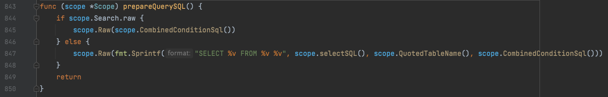
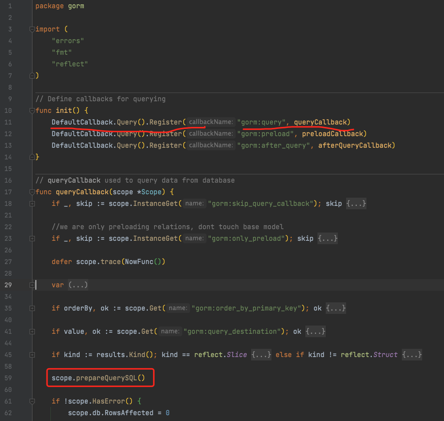

V2：

https://gorm.io/zh_CN/docs/v2_release_note.html

https://gorm.io/zh_CN/docs/session.html

https://gorm.io/zh_CN/docs/write_plugins.html

https://gorm.io/zh_CN/docs/hooks.html

https://www.zhangshengrong.com/p/q0XpVee6aK/

https://jiajunhuang.com/articles/2019_03_19-gorm.md.html

https://github.com/go-gorm/gorm/blob/master/prepare_stmt.go

https://juejin.cn/post/6844903843969368072

https://segmentfault.com/a/1190000039097157

https://xie.infoq.cn/article/f061726cf5611637a77e026ae

https://gorm.io/zh_CN/docs/write_plugins.html

https://3ks.dev/2020/07/28/gorm-faq/

V1：

https://learnku.com/docs/gorm/v1/write_plugins/3803#965348

https://cloud.tencent.com/developer/article/1830811

https://blog.csdn.net/weixin_39769183/article/details/112609741

https://jasperxu.com/gorm-zh/advanced.html

mysql使用ROW_COUNT()返回插入、更新、删除操作影响行数。即gorm中的RowsAffected字段

而读取的行数，

**github.com/jinzhu/gorm@v1.9.16/scope.go:**

**github.com/jinzhu/gorm@v1.9.16/callback_query.go:**

核心的步骤在于 scope.prepareQuerySQL() 构建 SQL 语句.
然后通过 rows, err := scope.SQLDB().Query(scope.SQL, scope.SQLVars...), 执行了数据库查询.

那么查询到的结果是如何传递的, 传递给谁呢?

函数的开头定义了 results = scope.IndirectValue(), 这就是最终查询结果的归属地.

https://segmentfault.com/a/1190000022987438

