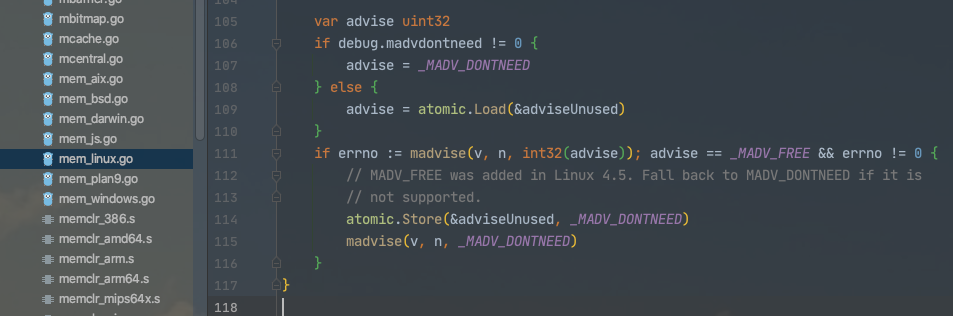

### 概述:


<br>

"改进" 加引号,因为社区反馈问题多多 弊大于利, 于是Go 1.16又改了回去...

问题包括但不仅限于:


> - 引发用户体验的问题：Go issues 上总是出现以为内存泄露，但其实只是未满足条件，内存没有马上释放的案例。<br><br>
> - 混淆统计信息和监控工具的情况：在 Grafana 等监控上，发现容器进程内存较高，释放很慢，告警了，很慌。<br><br>
> - 导致与内存使用有关联的个别管理系统集成不良：例如 Kubernetes HPA ，或者自定义了扩缩容策略这类模式，难以评估。<br><br>
> - 挤压同主机上的其他应用资源：并不是所有的 Go 程序都一定独立跑在单一主机中，自然就会导致同一台主机上的其他应用受到挤压，这是难以评估的。<br>

(参考自 [Go1.16 新特性：详解内存管理机制的变更，你需要了解](https://segmentfault.com/a/1190000039359866))


<br>

出现这个问题 需要同时满足 Go版本在 1.12~1.15之间(都是闭区间)，同时是Linux系统且内核版本>=4.5

通过设置环境变量 `GODEBUG:madvdontneed=1`即可关闭该功能


<br>


### Go 1.12~Go 1.15

<br>


Go支持两种内存回收方式，即 **MADV_DONTNEED**与**MADV_FREE**

其中**MADV_FREE**是 *Go 1.12*版本引入，[官网上的介绍](https://golang.google.cn/doc/go1.12#runtime)如下：

```

On Linux, the runtime now uses MADV_FREE to release unused memory. This is more efficient but may result in higher reported RSS. The kernel will reclaim the unused data when it is needed. To revert to the Go 1.11 behavior (MADV_DONTNEED), set the environment variable GODEBUG=madvdontneed=1.

```


大意就是使用**MADV_FREE**方式，程序内存不会立刻回收，即*RSS值*不会立刻下降，只有当OS内存紧缺时才会回收Go程序的内存返回给OS；

而Go 1.11以及之前的版本默认采用的是 **MADV_DONTNEED**方式，程序RSS值下降很快。因此如果需要使程序内存占用下降很快的话，可设置环境变量**GODEBUG=madvdontneed=1**。

<br>

注：Go 1.12~1.15版本的这项功能, 仅限于 Linux平台; 且需要内核在 4.5及之后的版本，才默认使用MADV_FREE方式。 如果不支持会退用之前默认的**MADV_DONTNEED**

<br>


runtime/mem_linux.go源码里注释如下：


```go
	var advise uint32
	if debug.madvdontneed != 0 {
		advise = _MADV_DONTNEED
	} else {
		advise = atomic.Load(&adviseUnused)
	}
	if errno := madvise(v, n, int32(advise)); advise == _MADV_FREE && errno != 0 {
		// MADV_FREE was added in Linux 4.5. Fall back to MADV_DONTNEED if it is
		// not supported.
		atomic.Store(&adviseUnused, _MADV_DONTNEED)
		madvise(v, n, _MADV_DONTNEED)
	}
```





<br>


<br>


参考:

[Go 1.12中出现的top命令RES参数异常增高的问题](https://studygolang.com/articles/28801)

[Go进程的HeapReleased上升，但是RSS不下降造成内存泄漏？---- 并不是内存泄露](https://zhuanlan.zhihu.com/p/114340283)

[Go 1.12 关于内存释放的一个改进---并不是内存泄露](https://ms2008.github.io/2019/06/30/golang-madvfree/)


<br>


---


<br>


### Go 1.16又改了回去

<br>

在 *Go 1.16* 中,对这个问题又做了优化, 

>在 Linux 上，runtime 现在默认会迅速地（使用 MADV_DONTNEED）向操作系统释放内存，而不是在操作系统面临内存压力时（使用 MADV_FREE）惰性地释放内存。
<br>这意味着像 RSS 这样的进程级内存统计信息将更准确地反映 Go 进程所使用的物理内存数量。因此 Go1.16 中，不再需要配置 GODEBUG=madvdontneed=1 来改善内存监控行为。


通过

```go
func parsedebugvars() {
    // defaults
    debug.cgocheck = 1
    debug.invalidptr = 1
    if GOOS == "linux" {
        debug.madvdontneed = 1
    }
  ...
}
```

又 直接指定回了 *debug.madvdontneed = 1*


也算是Go Team走的一段弯路


<br>


参考&值得阅读:


[列举一些 Go1.16 中可能对大家有影响的变化](https://www.mdeditor.tw/pl/gmbc)


[Go1.16 新特性：详解内存管理机制的变更，你需要了解](https://segmentfault.com/a/1190000039359866)


[Go 1.16中值得关注的几个变化](https://tonybai.com/2021/02/25/some-changes-in-go-1-16/)


[一个 Go 程序不释放内存的问题](https://www.zenlife.tk/go-scavenge.md)


[runtime: smarter scavenging #30333](https://github.com/golang/go/issues/30333)