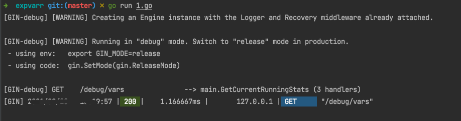
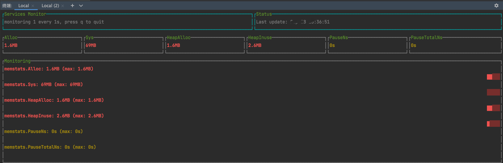

### 介绍与使用

<br>


*expvar 是 exposed variable的简写*

[expvar包](https://gitee.com/cuishuang/go1.16/tree/master/src/expvar)是 Golang 官方为暴露Go应用内部指标数据所提供的标准对外接口，可以辅助获取和调试全局变量。

其通过init函数将内置的expvarHandler(一个标准http HandlerFunc)注册到http包ListenAndServe创建的默认Server上


<br>

如以下案例:


```go
package main

import (
	"encoding/json"
	"expvar"
	"fmt"
	"github.com/gin-gonic/gin"
	"net/http"
	"runtime"
	"time"
)

func main() {
	router := gin.Default() //初始化一个gin实例

	router.GET("/debug/vars", GetCurrentRunningStats) //接口路由，如果url不是/debug/vars，则用metricBeat去获取会出问题
	s := &http.Server{
		Addr:           ":" + "6666",
		Handler:        router,
		ReadTimeout:    5 * time.Second,
		WriteTimeout:   5 * time.Second,
		MaxHeaderBytes: 1 << 20,
	}

	s.ListenAndServe() //开始监听
}

var CuMemoryPtr *map[string]string
var BTCMemoryPtr *map[string]interface{}

// 开始时间
var start = time.Now()

// calculateUptime 计算运行时间
func calculateUptime() interface{} {
	return time.Since(start).String()
}

// currentGoVersion 当前 Golang 版本
func currentGoVersion() interface{} {
	return runtime.Version()
}

// getNumCPUs 获取 CPU 核心数量
func getNumCPUs() interface{} {
	return runtime.NumCPU()
}

// getGoOS 当前系统类型
func getGoOS() interface{} {
	return runtime.GOOS
}

// getNumGoroutins 当前 goroutine 数量
func getNumGoroutins() interface{} {
	return runtime.NumGoroutine()
}

// getNumCgoCall CGo 调用次数
func getNumCgoCall() interface{} {
	return runtime.NumCgoCall()
}

// 业务特定的内存数据
func getCuMemoryMap() interface{} {
	if CuMemoryPtr == nil {
		return 0
	} else {
		return len(*CuMemoryPtr)
	}
}

// 业务特定的内存数据
func getBTCMemoryMap() interface{} {
	if BTCMemoryPtr == nil {
		return 0
	} else {
		return len(*BTCMemoryPtr)
	}
}

var lastPause uint32

// getLastGCPauseTime 获取上次 GC 的暂停时间
func getLastGCPauseTime() interface{} {
	var gcPause uint64
	ms := new(runtime.MemStats)

	statString := expvar.Get("memstats").String()
	if statString != "" {
		json.Unmarshal([]byte(statString), ms)

		if lastPause == 0 || lastPause != ms.NumGC {
			gcPause = ms.PauseNs[(ms.NumGC+255)%256]
			lastPause = ms.NumGC
		}
	}

	return gcPause
}

// GetCurrentRunningStats 返回当前运行信息
func GetCurrentRunningStats(c *gin.Context) {
	c.Writer.Header().Set("Content-Type", "application/json; charset=utf-8")

	first := true
	report := func(key string, value interface{}) {
		if !first {
			fmt.Fprintf(c.Writer, ",\n")
		}
		first = false
		if str, ok := value.(string); ok {
			fmt.Fprintf(c.Writer, "%q: %q", key, str)
		} else {
			fmt.Fprintf(c.Writer, "%q: %v", key, value)
		}
	}

	fmt.Fprintf(c.Writer, "{\n")
	expvar.Do(func(kv expvar.KeyValue) {
		report(kv.Key, kv.Value)
	})
	fmt.Fprintf(c.Writer, "\n}\n")

	c.String(http.StatusOK, "")
}

func init() { //这些都是自定义变量，发布到expvar中，每次请求接口，expvar会自动去获取这些变量，并返回
	expvar.Publish("运行时间", expvar.Func(calculateUptime))
	expvar.Publish("version", expvar.Func(currentGoVersion))
	expvar.Publish("cores", expvar.Func(getNumCPUs))
	expvar.Publish("os", expvar.Func(getGoOS))
	expvar.Publish("cgo", expvar.Func(getNumCgoCall))
	expvar.Publish("goroutine", expvar.Func(getNumGoroutins))
	expvar.Publish("gcpause", expvar.Func(getLastGCPauseTime))
	expvar.Publish("CuMemory", expvar.Func(getCuMemoryMap))
	expvar.Publish("BTCMemory", expvar.Func(getBTCMemoryMap))
}

```

运行程序，并请求`127.0.0.1:6666/debug/vars`




<details>
<summary><b>结果如下：</b></summary>


```go
{
    "BTCMemory": 0,
    "CuMemory": 0,
    "cgo": 1,
    "cmdline": [
        "/var/folders/9t/839s3jmj73bcgyp5x_xh3gw00000gn/T/go-build1753052226/b001/exe/1"
    ],
    "cores": 8,
    "gcpause": 0,
    "goroutine": 3,
    "memstats": {
        "Alloc": 1516104,
        "TotalAlloc": 1516104,
        "Sys": 71961616,
        "Lookups": 0,
        "Mallocs": 12075,
        "Frees": 1237,
        "HeapAlloc": 1516104,
        "HeapSys": 66650112,
        "HeapIdle": 63930368,
        "HeapInuse": 2719744,
        "HeapReleased": 63930368,
        "HeapObjects": 10838,
        "StackInuse": 458752,
        "StackSys": 458752,
        "MSpanInuse": 46376,
        "MSpanSys": 49152,
        "MCacheInuse": 9600,
        "MCacheSys": 16384,
        "BuckHashSys": 4156,
        "GCSys": 4227128,
        "OtherSys": 555932,
        "NextGC": 4473924,
        "LastGC": 0,
        "PauseTotalNs": 0,
        "PauseNs": [
            0,
            0,
            0,
            0,
            0,
            0,
            0,
            0,
            0,
            0,
            0,
            0,
            0,
            0,
            0,
            0,
            0,
            0,
            0,
            0,
            0,
            0,
            0,
            0,
            0,
            0,
            0,
            0,
            0,
            0,
            0,
            0,
            0,
            0,
            0,
            0,
            0,
            0,
            0,
            0,
            0,
            0,
            0,
            0,
            0,
            0,
            0,
            0,
            0,
            0,
            0,
            0,
            0,
            0,
            0,
            0,
            0,
            0,
            0,
            0,
            0,
            0,
            0,
            0,
            0,
            0,
            0,
            0,
            0,
            0,
            0,
            0,
            0,
            0,
            0,
            0,
            0,
            0,
            0,
            0,
            0,
            0,
            0,
            0,
            0,
            0,
            0,
            0,
            0,
            0,
            0,
            0,
            0,
            0,
            0,
            0,
            0,
            0,
            0,
            0,
            0,
            0,
            0,
            0,
            0,
            0,
            0,
            0,
            0,
            0,
            0,
            0,
            0,
            0,
            0,
            0,
            0,
            0,
            0,
            0,
            0,
            0,
            0,
            0,
            0,
            0,
            0,
            0,
            0,
            0,
            0,
            0,
            0,
            0,
            0,
            0,
            0,
            0,
            0,
            0,
            0,
            0,
            0,
            0,
            0,
            0,
            0,
            0,
            0,
            0,
            0,
            0,
            0,
            0,
            0,
            0,
            0,
            0,
            0,
            0,
            0,
            0,
            0,
            0,
            0,
            0,
            0,
            0,
            0,
            0,
            0,
            0,
            0,
            0,
            0,
            0,
            0,
            0,
            0,
            0,
            0,
            0,
            0,
            0,
            0,
            0,
            0,
            0,
            0,
            0,
            0,
            0,
            0,
            0,
            0,
            0,
            0,
            0,
            0,
            0,
            0,
            0,
            0,
            0,
            0,
            0,
            0,
            0,
            0,
            0,
            0,
            0,
            0,
            0,
            0,
            0,
            0,
            0,
            0,
            0,
            0,
            0,
            0,
            0,
            0,
            0,
            0,
            0,
            0,
            0,
            0,
            0,
            0,
            0,
            0,
            0,
            0,
            0,
            0,
            0,
            0,
            0,
            0,
            0,
            0,
            0,
            0,
            0,
            0,
            0,
            0,
            0,
            0,
            0,
            0,
            0
        ],
        "PauseEnd": [
            0,
            0,
            0,
            0,
            0,
            0,
            0,
            0,
            0,
            0,
            0,
            0,
            0,
            0,
            0,
            0,
            0,
            0,
            0,
            0,
            0,
            0,
            0,
            0,
            0,
            0,
            0,
            0,
            0,
            0,
            0,
            0,
            0,
            0,
            0,
            0,
            0,
            0,
            0,
            0,
            0,
            0,
            0,
            0,
            0,
            0,
            0,
            0,
            0,
            0,
            0,
            0,
            0,
            0,
            0,
            0,
            0,
            0,
            0,
            0,
            0,
            0,
            0,
            0,
            0,
            0,
            0,
            0,
            0,
            0,
            0,
            0,
            0,
            0,
            0,
            0,
            0,
            0,
            0,
            0,
            0,
            0,
            0,
            0,
            0,
            0,
            0,
            0,
            0,
            0,
            0,
            0,
            0,
            0,
            0,
            0,
            0,
            0,
            0,
            0,
            0,
            0,
            0,
            0,
            0,
            0,
            0,
            0,
            0,
            0,
            0,
            0,
            0,
            0,
            0,
            0,
            0,
            0,
            0,
            0,
            0,
            0,
            0,
            0,
            0,
            0,
            0,
            0,
            0,
            0,
            0,
            0,
            0,
            0,
            0,
            0,
            0,
            0,
            0,
            0,
            0,
            0,
            0,
            0,
            0,
            0,
            0,
            0,
            0,
            0,
            0,
            0,
            0,
            0,
            0,
            0,
            0,
            0,
            0,
            0,
            0,
            0,
            0,
            0,
            0,
            0,
            0,
            0,
            0,
            0,
            0,
            0,
            0,
            0,
            0,
            0,
            0,
            0,
            0,
            0,
            0,
            0,
            0,
            0,
            0,
            0,
            0,
            0,
            0,
            0,
            0,
            0,
            0,
            0,
            0,
            0,
            0,
            0,
            0,
            0,
            0,
            0,
            0,
            0,
            0,
            0,
            0,
            0,
            0,
            0,
            0,
            0,
            0,
            0,
            0,
            0,
            0,
            0,
            0,
            0,
            0,
            0,
            0,
            0,
            0,
            0,
            0,
            0,
            0,
            0,
            0,
            0,
            0,
            0,
            0,
            0,
            0,
            0,
            0,
            0,
            0,
            0,
            0,
            0,
            0,
            0,
            0,
            0,
            0,
            0,
            0,
            0,
            0,
            0,
            0,
            0
        ],
        "NumGC": 0,
        "NumForcedGC": 0,
        "GCCPUFraction": 0,
        "EnableGC": true,
        "DebugGC": false,
        "BySize": [
            {
                "Size": 0,
                "Mallocs": 0,
                "Frees": 0
            },
            {
                "Size": 8,
                "Mallocs": 251,
                "Frees": 0
            },
            {
                "Size": 16,
                "Mallocs": 4258,
                "Frees": 0
            },
            {
                "Size": 24,
                "Mallocs": 490,
                "Frees": 0
            },
            {
                "Size": 32,
                "Mallocs": 1194,
                "Frees": 0
            },
            {
                "Size": 48,
                "Mallocs": 745,
                "Frees": 0
            },
            {
                "Size": 64,
                "Mallocs": 572,
                "Frees": 0
            },
            {
                "Size": 80,
                "Mallocs": 72,
                "Frees": 0
            },
            {
                "Size": 96,
                "Mallocs": 84,
                "Frees": 0
            },
            {
                "Size": 112,
                "Mallocs": 2268,
                "Frees": 0
            },
            {
                "Size": 128,
                "Mallocs": 79,
                "Frees": 0
            },
            {
                "Size": 144,
                "Mallocs": 19,
                "Frees": 0
            },
            {
                "Size": 160,
                "Mallocs": 164,
                "Frees": 0
            },
            {
                "Size": 176,
                "Mallocs": 11,
                "Frees": 0
            },
            {
                "Size": 192,
                "Mallocs": 16,
                "Frees": 0
            },
            {
                "Size": 208,
                "Mallocs": 73,
                "Frees": 0
            },
            {
                "Size": 224,
                "Mallocs": 5,
                "Frees": 0
            },
            {
                "Size": 240,
                "Mallocs": 4,
                "Frees": 0
            },
            {
                "Size": 256,
                "Mallocs": 30,
                "Frees": 0
            },
            {
                "Size": 288,
                "Mallocs": 28,
                "Frees": 0
            },
            {
                "Size": 320,
                "Mallocs": 50,
                "Frees": 0
            },
            {
                "Size": 352,
                "Mallocs": 11,
                "Frees": 0
            },
            {
                "Size": 384,
                "Mallocs": 30,
                "Frees": 0
            },
            {
                "Size": 416,
                "Mallocs": 25,
                "Frees": 0
            },
            {
                "Size": 448,
                "Mallocs": 3,
                "Frees": 0
            },
            {
                "Size": 480,
                "Mallocs": 0,
                "Frees": 0
            },
            {
                "Size": 512,
                "Mallocs": 9,
                "Frees": 0
            },
            {
                "Size": 576,
                "Mallocs": 18,
                "Frees": 0
            },
            {
                "Size": 640,
                "Mallocs": 57,
                "Frees": 0
            },
            {
                "Size": 704,
                "Mallocs": 8,
                "Frees": 0
            },
            {
                "Size": 768,
                "Mallocs": 1,
                "Frees": 0
            },
            {
                "Size": 896,
                "Mallocs": 19,
                "Frees": 0
            },
            {
                "Size": 1024,
                "Mallocs": 26,
                "Frees": 0
            },
            {
                "Size": 1152,
                "Mallocs": 23,
                "Frees": 0
            },
            {
                "Size": 1280,
                "Mallocs": 36,
                "Frees": 0
            },
            {
                "Size": 1408,
                "Mallocs": 1,
                "Frees": 0
            },
            {
                "Size": 1536,
                "Mallocs": 3,
                "Frees": 0
            },
            {
                "Size": 1792,
                "Mallocs": 22,
                "Frees": 0
            },
            {
                "Size": 2048,
                "Mallocs": 7,
                "Frees": 0
            },
            {
                "Size": 2304,
                "Mallocs": 3,
                "Frees": 0
            },
            {
                "Size": 2688,
                "Mallocs": 38,
                "Frees": 0
            },
            {
                "Size": 3072,
                "Mallocs": 6,
                "Frees": 0
            },
            {
                "Size": 3200,
                "Mallocs": 2,
                "Frees": 0
            },
            {
                "Size": 3456,
                "Mallocs": 3,
                "Frees": 0
            },
            {
                "Size": 4096,
                "Mallocs": 20,
                "Frees": 0
            },
            {
                "Size": 4864,
                "Mallocs": 2,
                "Frees": 0
            },
            {
                "Size": 5376,
                "Mallocs": 15,
                "Frees": 0
            },
            {
                "Size": 6144,
                "Mallocs": 6,
                "Frees": 0
            },
            {
                "Size": 6528,
                "Mallocs": 1,
                "Frees": 0
            },
            {
                "Size": 6784,
                "Mallocs": 2,
                "Frees": 0
            },
            {
                "Size": 6912,
                "Mallocs": 0,
                "Frees": 0
            },
            {
                "Size": 8192,
                "Mallocs": 3,
                "Frees": 0
            },
            {
                "Size": 9472,
                "Mallocs": 2,
                "Frees": 0
            },
            {
                "Size": 9728,
                "Mallocs": 3,
                "Frees": 0
            },
            {
                "Size": 10240,
                "Mallocs": 8,
                "Frees": 0
            },
            {
                "Size": 10880,
                "Mallocs": 8,
                "Frees": 0
            },
            {
                "Size": 12288,
                "Mallocs": 0,
                "Frees": 0
            },
            {
                "Size": 13568,
                "Mallocs": 0,
                "Frees": 0
            },
            {
                "Size": 14336,
                "Mallocs": 0,
                "Frees": 0
            },
            {
                "Size": 16384,
                "Mallocs": 0,
                "Frees": 0
            },
            {
                "Size": 18432,
                "Mallocs": 1,
                "Frees": 0
            }
        ]
    },
    "os": "darwin",
    "version": "go1.16.7",
    "运行时间": "30.037286084s"
}
```

</details>


其中，expvar包会默认携带**memstats**，该字段内含 各种内存堆栈以及GC的一些信息，具体可见源码注释


<details>
<summary><b>src/runtime/mstats.go</b></summary>


[src/runtime/mstats.go](https://gitee.com/cuishuang/go1.16/blob/master/src/runtime/mstats.go#L107)

```go
// A MemStats records statistics about the memory allocator.
type MemStats struct {
	// General statistics.

	// Alloc is bytes of allocated heap objects.
	//
	// This is the same as HeapAlloc (see below).
	Alloc uint64

	// TotalAlloc is cumulative bytes allocated for heap objects.
	//
	// TotalAlloc increases as heap objects are allocated, but
	// unlike Alloc and HeapAlloc, it does not decrease when
	// objects are freed.
	TotalAlloc uint64

	// Sys is the total bytes of memory obtained from the OS.
	//
	// Sys is the sum of the XSys fields below. Sys measures the
	// virtual address space reserved by the Go runtime for the
	// heap, stacks, and other internal data structures. It's
	// likely that not all of the virtual address space is backed
	// by physical memory at any given moment, though in general
	// it all was at some point.
	Sys uint64

	// Lookups is the number of pointer lookups performed by the
	// runtime.
	//
	// This is primarily useful for debugging runtime internals.
	Lookups uint64

	// Mallocs is the cumulative count of heap objects allocated.
	// The number of live objects is Mallocs - Frees.
	Mallocs uint64

	// Frees is the cumulative count of heap objects freed.
	Frees uint64

	// Heap memory statistics.
	//
	// Interpreting the heap statistics requires some knowledge of
	// how Go organizes memory. Go divides the virtual address
	// space of the heap into "spans", which are contiguous
	// regions of memory 8K or larger. A span may be in one of
	// three states:
	//
	// An "idle" span contains no objects or other data. The
	// physical memory backing an idle span can be released back
	// to the OS (but the virtual address space never is), or it
	// can be converted into an "in use" or "stack" span.
	//
	// An "in use" span contains at least one heap object and may
	// have free space available to allocate more heap objects.
	//
	// A "stack" span is used for goroutine stacks. Stack spans
	// are not considered part of the heap. A span can change
	// between heap and stack memory; it is never used for both
	// simultaneously.

	// HeapAlloc is bytes of allocated heap objects.
	//
	// "Allocated" heap objects include all reachable objects, as
	// well as unreachable objects that the garbage collector has
	// not yet freed. Specifically, HeapAlloc increases as heap
	// objects are allocated and decreases as the heap is swept
	// and unreachable objects are freed. Sweeping occurs
	// incrementally between GC cycles, so these two processes
	// occur simultaneously, and as a result HeapAlloc tends to
	// change smoothly (in contrast with the sawtooth that is
	// typical of stop-the-world garbage collectors).
	HeapAlloc uint64

	// HeapSys is bytes of heap memory obtained from the OS.
	//
	// HeapSys measures the amount of virtual address space
	// reserved for the heap. This includes virtual address space
	// that has been reserved but not yet used, which consumes no
	// physical memory, but tends to be small, as well as virtual
	// address space for which the physical memory has been
	// returned to the OS after it became unused (see HeapReleased
	// for a measure of the latter).
	//
	// HeapSys estimates the largest size the heap has had.
	HeapSys uint64

	// HeapIdle is bytes in idle (unused) spans.
	//
	// Idle spans have no objects in them. These spans could be
	// (and may already have been) returned to the OS, or they can
	// be reused for heap allocations, or they can be reused as
	// stack memory.
	//
	// HeapIdle minus HeapReleased estimates the amount of memory
	// that could be returned to the OS, but is being retained by
	// the runtime so it can grow the heap without requesting more
	// memory from the OS. If this difference is significantly
	// larger than the heap size, it indicates there was a recent
	// transient spike in live heap size.
	HeapIdle uint64

	// HeapInuse is bytes in in-use spans.
	//
	// In-use spans have at least one object in them. These spans
	// can only be used for other objects of roughly the same
	// size.
	//
	// HeapInuse minus HeapAlloc estimates the amount of memory
	// that has been dedicated to particular size classes, but is
	// not currently being used. This is an upper bound on
	// fragmentation, but in general this memory can be reused
	// efficiently.
	HeapInuse uint64

	// HeapReleased is bytes of physical memory returned to the OS.
	//
	// This counts heap memory from idle spans that was returned
	// to the OS and has not yet been reacquired for the heap.
	HeapReleased uint64

	// HeapObjects is the number of allocated heap objects.
	//
	// Like HeapAlloc, this increases as objects are allocated and
	// decreases as the heap is swept and unreachable objects are
	// freed.
	HeapObjects uint64

	// Stack memory statistics.
	//
	// Stacks are not considered part of the heap, but the runtime
	// can reuse a span of heap memory for stack memory, and
	// vice-versa.

	// StackInuse is bytes in stack spans.
	//
	// In-use stack spans have at least one stack in them. These
	// spans can only be used for other stacks of the same size.
	//
	// There is no StackIdle because unused stack spans are
	// returned to the heap (and hence counted toward HeapIdle).
	StackInuse uint64

	// StackSys is bytes of stack memory obtained from the OS.
	//
	// StackSys is StackInuse, plus any memory obtained directly
	// from the OS for OS thread stacks (which should be minimal).
	StackSys uint64

	// Off-heap memory statistics.
	//
	// The following statistics measure runtime-internal
	// structures that are not allocated from heap memory (usually
	// because they are part of implementing the heap). Unlike
	// heap or stack memory, any memory allocated to these
	// structures is dedicated to these structures.
	//
	// These are primarily useful for debugging runtime memory
	// overheads.

	// MSpanInuse is bytes of allocated mspan structures.
	MSpanInuse uint64

	// MSpanSys is bytes of memory obtained from the OS for mspan
	// structures.
	MSpanSys uint64

	// MCacheInuse is bytes of allocated mcache structures.
	MCacheInuse uint64

	// MCacheSys is bytes of memory obtained from the OS for
	// mcache structures.
	MCacheSys uint64

	// BuckHashSys is bytes of memory in profiling bucket hash tables.
	BuckHashSys uint64

	// GCSys is bytes of memory in garbage collection metadata.
	GCSys uint64

	// OtherSys is bytes of memory in miscellaneous off-heap
	// runtime allocations.
	OtherSys uint64

	// Garbage collector statistics.

	// NextGC is the target heap size of the next GC cycle.
	//
	// The garbage collector's goal is to keep HeapAlloc ≤ NextGC.
	// At the end of each GC cycle, the target for the next cycle
	// is computed based on the amount of reachable data and the
	// value of GOGC.
	NextGC uint64

	// LastGC is the time the last garbage collection finished, as
	// nanoseconds since 1970 (the UNIX epoch).
	LastGC uint64

	// PauseTotalNs is the cumulative nanoseconds in GC
	// stop-the-world pauses since the program started.
	//
	// During a stop-the-world pause, all goroutines are paused
	// and only the garbage collector can run.
	PauseTotalNs uint64

	// PauseNs is a circular buffer of recent GC stop-the-world
	// pause times in nanoseconds.
	//
	// The most recent pause is at PauseNs[(NumGC+255)%256]. In
	// general, PauseNs[N%256] records the time paused in the most
	// recent N%256th GC cycle. There may be multiple pauses per
	// GC cycle; this is the sum of all pauses during a cycle.
	PauseNs [256]uint64

	// PauseEnd is a circular buffer of recent GC pause end times,
	// as nanoseconds since 1970 (the UNIX epoch).
	//
	// This buffer is filled the same way as PauseNs. There may be
	// multiple pauses per GC cycle; this records the end of the
	// last pause in a cycle.
	PauseEnd [256]uint64

	// NumGC is the number of completed GC cycles.
	NumGC uint32

	// NumForcedGC is the number of GC cycles that were forced by
	// the application calling the GC function.
	NumForcedGC uint32

	// GCCPUFraction is the fraction of this program's available
	// CPU time used by the GC since the program started.
	//
	// GCCPUFraction is expressed as a number between 0 and 1,
	// where 0 means GC has consumed none of this program's CPU. A
	// program's available CPU time is defined as the integral of
	// GOMAXPROCS since the program started. That is, if
	// GOMAXPROCS is 2 and a program has been running for 10
	// seconds, its "available CPU" is 20 seconds. GCCPUFraction
	// does not include CPU time used for write barrier activity.
	//
	// This is the same as the fraction of CPU reported by
	// GODEBUG=gctrace=1.
	GCCPUFraction float64

	// EnableGC indicates that GC is enabled. It is always true,
	// even if GOGC=off.
	EnableGC bool

	// DebugGC is currently unused.
	DebugGC bool

	// BySize reports per-size class allocation statistics.
	//
	// BySize[N] gives statistics for allocations of size S where
	// BySize[N-1].Size < S ≤ BySize[N].Size.
	//
	// This does not report allocations larger than BySize[60].Size.
	BySize [61]struct {
		// Size is the maximum byte size of an object in this
		// size class.
		Size uint32

		// Mallocs is the cumulative count of heap objects
		// allocated in this size class. The cumulative bytes
		// of allocation is Size*Mallocs. The number of live
		// objects in this size class is Mallocs - Frees.
		Mallocs uint64

		// Frees is the cumulative count of heap objects freed
		// in this size class.
		Frees uint64
	}
}
```


</details>


对于各个字段的意义 可参考：

```go
1、Alloc uint64 //Go语言框架 堆空间分配的字节数
2、TotalAlloc uint64 //从服务开始运行至今分配器为分配的堆空间总和，只增加，释放时不减少
3、Sys uint64 //服务现在使用的系统内存
4、Lookups uint64 //被runtime监视的指针数
5、Mallocs uint64 //服务malloc的次数
6、Frees uint64 //服务回收的heap objects的字节数
7、HeapAlloc uint64 //服务分配的堆内存字节数
8、HeapSys uint64 //系统分配的作为运行栈的内存
9、HeapIdle uint64 //申请但未分配的堆内存或者回收了的堆内存（空闲）字节数
10、HeapInuse uint64 //正在使用的堆内存字节数
10、HeapReleased uint64 //返回给OS的堆内存，类似C/C++中的free
11、HeapObjects uint64 //堆内存块申请的量
12、StackInuse uint64 //正在使用的栈字节数
13、StackSys uint64 //系统分配的作为运行栈的内存
14、MSpanInuse uint64 //用于测试用的结构体使用的字节数
15、MSpanSys uint64 //系统为测试用的结构体分配的字节数
16、MCacheInuse uint64 //mcache结构体申请的字节数(不会被视为垃圾回收)
17、MCacheSys uint64 //操作系统申请的堆空间用于mcache的字节数
18、BuckHashSys uint64 //用于剖析桶散列表的堆空间
19、GCSys uint64 //垃圾回收标记元信息使用的内存
20、OtherSys uint64 //golang系统架构占用的额外空间
21、NextGC uint64 //垃圾回收器检视的内存大小
22、LastGC uint64 // 垃圾回收器最后一次执行时间。
23、PauseTotalNs uint64 // 垃圾回收或者其他信息收集导致服务暂停的次数。
24、PauseNs [256]uint64 //一个循环队列，记录最近垃圾回收系统中断的时间
25、PauseEnd [256]uint64 //一个循环队列，记录最近垃圾回收系统中断的时间开始点。
26、NumForcedGC uint32 //服务调用runtime.GC()强制使用垃圾回收的次数。
27、GCCPUFraction float64 //垃圾回收占用服务CPU工作的时间总和。如果有100个goroutine，垃圾回收的时间为1S,那么就占用了100S。
28、BySize //内存分配器使用情况
```


以上参考[golang程序的监控神器----expvar](https://blog.csdn.net/jeffrey11223/article/details/78886923/)


<br>

社区同行开发的[expvarmon](https://github.com/divan/expvarmon)工具，可以在命令行终端以图形化的方式**实时展示特定的指标数据的变化**，（expvarmon 即expvar monitor）

`go get github.com/divan/expvarmon`


启动刚才的程序，然后执行如下命令，可实时查看应用指标变化 （期间可以进行不同qps的请求）


`expvarmon -ports="http://localhost:6666/debug/vars" -i 1s`





参考 [给expvarmon插上数据持久化的“翅膀”](https://tonybai.com/2021/04/14/expvarmon-save-and-convert-to-xlsx/)


<br>


---

<br>

### 源码分析

<br>


[expvar包](https://gitee.com/cuishuang/go1.16/blob/master/src/expvar/expvar.go)代码只有300多行


详细分析可参考 

[Golang 公共变量包——expvar](https://blog.cyeam.com/golang/2017/06/12/expvar)


[Go语言学习之expvar包](https://blog.csdn.net/weixin_42452301/article/details/112608877)


<br>


---


<br>

### 官方库或知名项目中的使用

<br>


[src/net/http/triv.go](https://gitee.com/cuishuang/go1.16/blob/master/src/net/http/triv.go) 中使用了这个包


另外
golang.org/x/tools@v0.1.6/cmd/godoc/main.go

golang.org/x/tools@v0.1.6/go/internal/gccgoimporter/gccgoinstallation_test.go

go/test/bench/garbage/parser.go

也有使用


<br>


以及前面提到的[expvarmon](https://github.com/divan/expvarmon)


