本文是对[#102 Go 官方标准编译器中实现的优化集锦汇总](https://www.bilibili.com/video/BV1YZ4y1K7w2) 内容的记录与总结.


<br>


<br>

### 优化1-4: 字符串和字节切片之间的转化

<br>

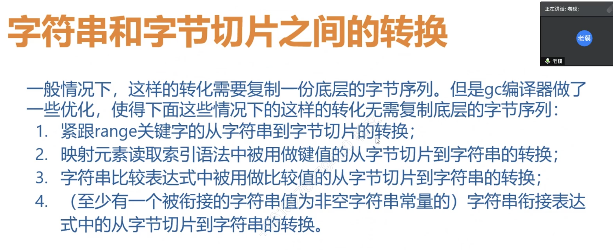


<br>

#### 1.紧跟*range*关键字的 从字符串到字节切片的转换；

<br>

```go
package main

import (
	"fmt"
	"strings"
	"testing"
)

var cs10086 = strings.Repeat("shuang!", 10086)

func main() {
	fmt.Println(testing.AllocsPerRun(1, f)) //0
	fmt.Println(testing.AllocsPerRun(1, g)) //1

}

func f() {
	for range []byte(cs10086) {

	}
}

func g() {
	bs := []byte(cs10086)
	for range bs {

	}
}

```

<br>

**f没有开辟内存,g开辟了一次内存.**


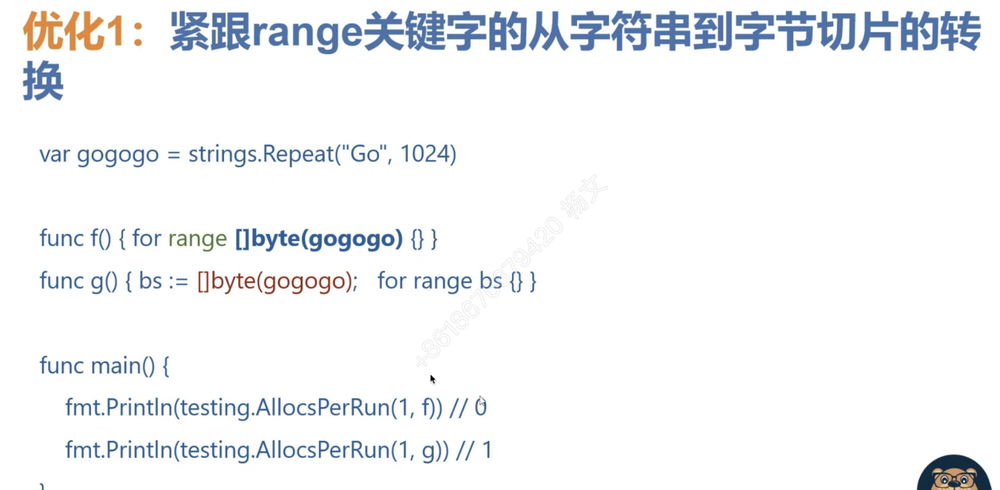

<br>


#### 2.映射元素读取索引语法中被用做键值的 从字节切片到字符串的转换；

<br>

```go
package main

import (
	"bytes"
	"fmt"
	"testing"
)

var name = bytes.Repeat([]byte{'x'}, 188)

var m = make(map[string]string, 10)
var s = ""

func main() {

	fmt.Println(testing.AllocsPerRun(1, f2)) //0
	fmt.Println(testing.AllocsPerRun(1, g2)) //1
	fmt.Println(testing.AllocsPerRun(1, h2)) //1
}

func f2() {
	s = m[string(name)] // 有效
}

func g2() {
	key := string(name)
	s = m[key] // 无效
}

func h2() {
	m[string(name)] = "Golang" // 无效
}
```

<br>

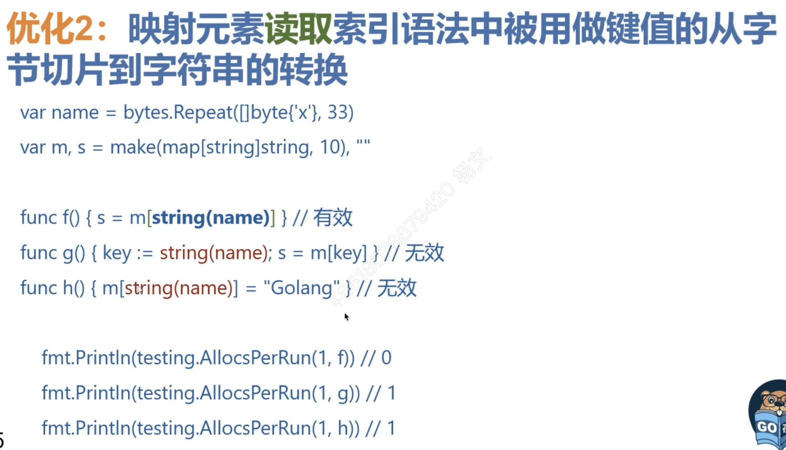

<br>


#### 3.字符串比较表达式中被用做比较值的 从字节切片到字符串的转换

<br>

```go
package main

import (
	"fmt"
	"testing"
)

var x = []byte{1023: 'x'}
var y = []byte{1023: 'y'}

var b bool

func main() {
	fmt.Println(testing.AllocsPerRun(1, f3)) //0
	fmt.Println(testing.AllocsPerRun(1, g3)) //2

}

func f3() {
	b = string(x) != string(y)
}

func g3() {
	sx, sy := string(x), string(y)
	b = sx == sy
}

```

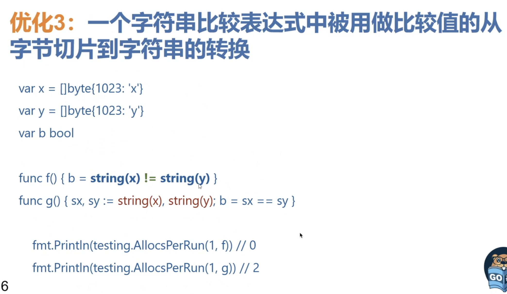

<br>


#### 4.含 *非空字符串常量* 的字符串衔接表达式中的 从字节切片到字符串的转换

<br>

```go
package main

import (
	"fmt"
	"testing"
)

var p = []byte{1023: 'p'}

var q = []byte{1023: 'q'}

var str string

func main() {

	fmt.Println(testing.AllocsPerRun(1, f4)) //1
	fmt.Println(testing.AllocsPerRun(1, g4)) //3
}

func f4() {
	str = ("-" + string(p) + string(q))[1:]
}

func g4() {
	str = string(p) + string(q)
}

```


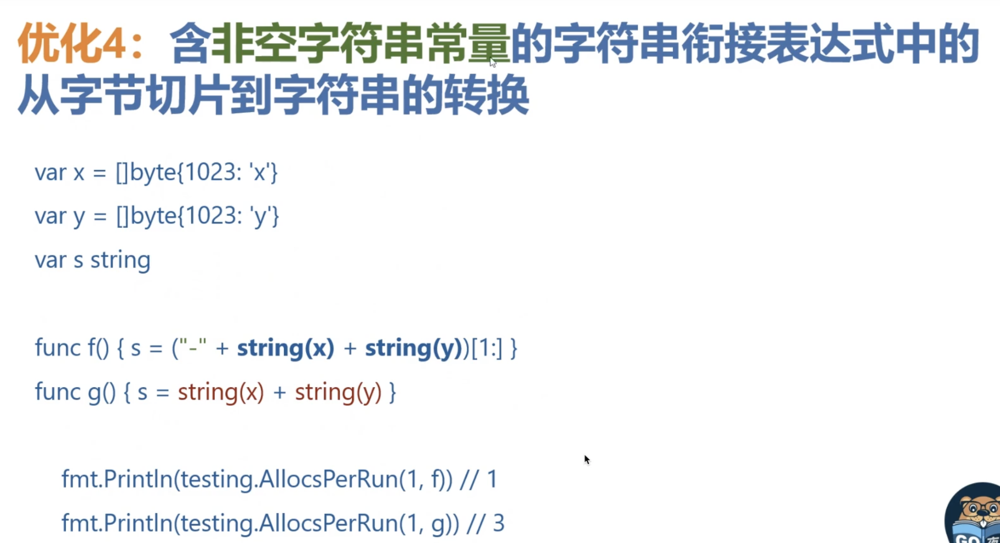


<br>


---

<br>


### 5.[]rune(aString)转换的时间和空间复杂度都是O(n),但len([]rune(aString))中的此转换 不需要开辟内存


<br>

Go 1.12引入


```go
package main

import (
	"fmt"
	"strings"
	"testing"
)

var shuang = strings.Repeat("shuang!", 10086)

func main() {

	fmt.Println(testing.AllocsPerRun(1, f5)) //0
	fmt.Println(testing.AllocsPerRun(1, g5)) //1
}

func f5() {
	_ = len([]rune(shuang))
}

func g5() {
	_ = len([]byte(shuang)) //未对len([]byte(aString))做优化
}

```

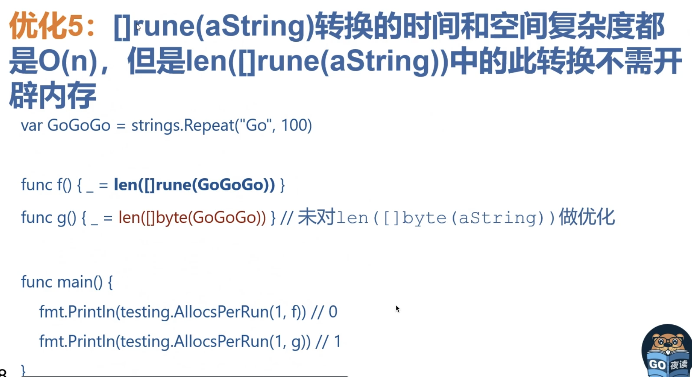


<br>


---

<br>


### 6.字符串衔接表达式只需开辟一次内存,无论需要衔接多少个字符串


<br>

```go
package main

import (
	"fmt"
	"testing"
)

var h, i, j, k = "Hello", "World", "Let's", "Go"

var str6 string

func main() {
	fmt.Println(testing.AllocsPerRun(1, f6)) //1
	fmt.Println(testing.AllocsPerRun(1, g6)) //3

}

func f6() {
	str6 = h + i + j + k
}

func g6() {
	str6 = h + i
	str6 += j
	str6 += k
}
```


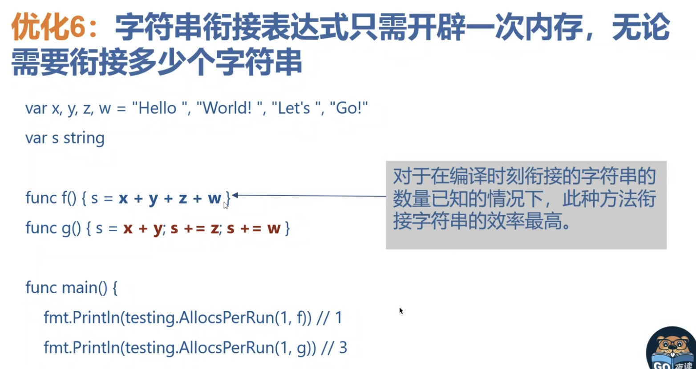


<br>


---

<br>


### 7.for i := range anArrayOrSlice{anArrayOrSlice[i]} = zeroElement} 形式 将被优化为一个内部的memclr操作


<br>

```go
package main

const N = 1024 * 100

var arr [N]int

func clearArray() {
	for i := range arr {
		arr[i] = 0
	}
}

func clearSlice() {
	sli := arr[:]
	for i := range sli {
		sli[i] = 0
	}
}

func clearArrayPtr() {
	for i := range &arr {
		arr[i] = 0
	}
}
```

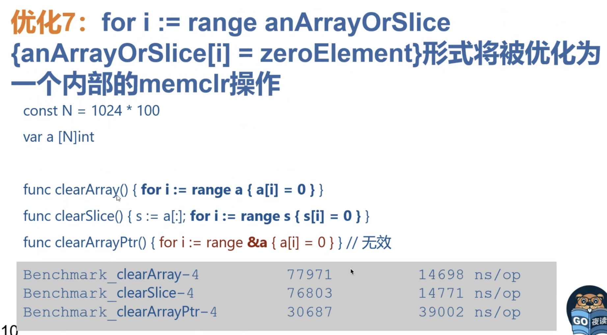

<br>

**benchmark:**

```go
package main

import (
	"testing"
)

func BenchmarkTest1(b *testing.B) {
	for i := 0; i < b.N; i++ {
		clearArray()
	}
}

func BenchmarkTest2(b *testing.B) {
	for i := 0; i < b.N; i++ {
		clearSlice()
	}
}

func BenchmarkTest3(b *testing.B) { //无效
	for i := 0; i < b.N; i++ {
		clearArrayPtr()
	}
}
```

<br>

执行结果:

```go
goos: darwin
goarch: amd64
pkg: xxxx
cpu: Intel(R) Core(TM) i7-8557U CPU @ 1.70GHz
BenchmarkTest1-8           73000             15309 ns/op
BenchmarkTest2-8           76464             15167 ns/op
BenchmarkTest3-8           40194             30096 ns/op
PASS
ok      xxxx    4.213s
```

<br>


---

<br>


### 8.for k = range m {delete(m,k)}形式 将被优化为一个内部的map清空操作


<br>


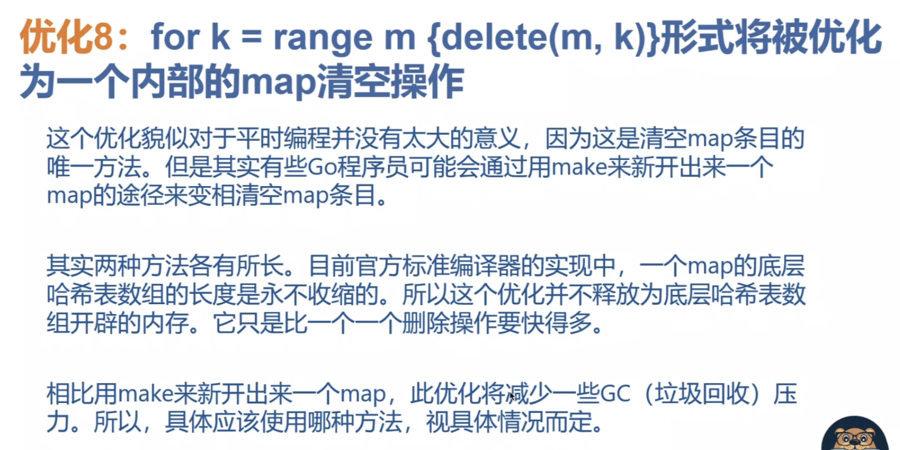


<br>


---

<br>


### 9.尺寸不大于4个原生字(即int),并且字段数不超过4个的结构体值被视为是小尺寸值


<br>


```go
package main

type S1 struct {
	a int
}

type S2 struct {
	a, b int
}

type S3 struct {
	a, b, c int
}

type S4 struct {
	a, b, c, d int
}

type S5 struct {
	a, b, c, d, e int
}

type S6 struct {
	a, b, c, d, e, f int
}

var ss1, ss2, ss3, ss4, ss5, ss6 = make([]S1, 1000), make([]S2, 1000), make([]S3, 1000), make([]S4, 1000), make([]S5, 1000), make([]S6, 1000)

var x1, x2, x3, x4, x5, x6 int

```

<br>

**benchmark:**

```go
package main

import "testing"

func Benchmark_Range1(b *testing.B) {
	for i := 0; i < b.N; i++ {
		for _, v := range ss1 {
			x1 = v.a
		}
	}
}

func Benchmark_Range2(b *testing.B) {
	for i := 0; i < b.N; i++ {
		for _, v := range ss2 {
			x2 = v.a
		}
	}
}

func Benchmark_Range3(b *testing.B) {
	for i := 0; i < b.N; i++ {
		for _, v := range ss3 {
			x3 = v.a
		}
	}
}

func Benchmark_Range4(b *testing.B) {
	for i := 0; i < b.N; i++ {
		for _, v := range ss4 {
			x4 = v.a
		}
	}
}

func Benchmark_Range5(b *testing.B) {
	for i := 0; i < b.N; i++ {
		for _, v := range ss5 {
			x5 = v.a
		}
	}
}

func Benchmark_Range6(b *testing.B) {
	for i := 0; i < b.N; i++ {
		for _, v := range ss6 {
			x6 = v.a
		}
	}
}

```

执行结果:

```go
goos: darwin
goarch: amd64
pkg: xxxx
cpu: Intel(R) Core(TM) i7-8557U CPU @ 1.70GHz
Benchmark_Range1-8       4759434               248.4 ns/op
Benchmark_Range2-8       3910621               306.0 ns/op
Benchmark_Range3-8       3735921               328.9 ns/op
Benchmark_Range4-8       3677784               325.9 ns/op
Benchmark_Range5-8        814666              1517 ns/op
Benchmark_Range6-8        728656              1568 ns/op
PASS
ok      xxxx     8.868s
```


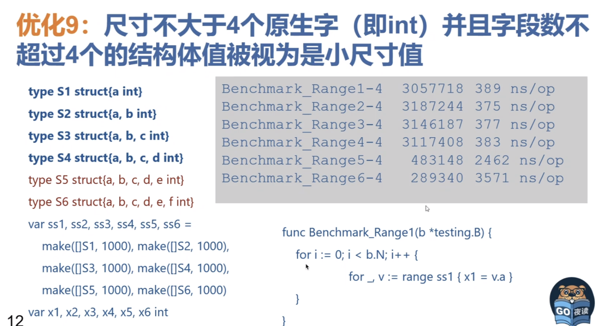


因为很多一等公民,其底层结构体的元素,都没有超过4个

<br>


---

<br>


### 10.接口值包裹 指针值 比 包裹 其他类型的值 要快


<br>


```go
package main

var p, p2 = new([100]int), new([100]int)

var ip interface{}
```

<br>

```go
package main

import "testing"


func Benchmark_PointerAssign(b *testing.B) {
	for i := 0; i < b.N; i++ {
		p = p2
	}
}

func Benchmark_BoxPointer(b *testing.B) {
	for i := 0; i < b.N; i++ {
		ip = p
	}
}

func Benchmark_PointerAssert(b *testing.B) {
	for i := 0; i < b.N; i++ {
		p = ip.(*[100]int)
	}
}

```

<br>

```go
goos: darwin
goarch: amd64
pkg: xxxx
cpu: Intel(R) Core(TM) i7-8557U CPU @ 1.70GHz
Benchmark_PointerAssign-8       1000000000               0.5251 ns/op          0 B/op          0 allocs/op
Benchmark_BoxPointer-8          1000000000               0.5833 ns/op          0 B/op          0 allocs/op
Benchmark_PointerAssert-8       1000000000               0.6418 ns/op          0 B/op          0 allocs/op
PASS
ok      xxxx   2.372s

```

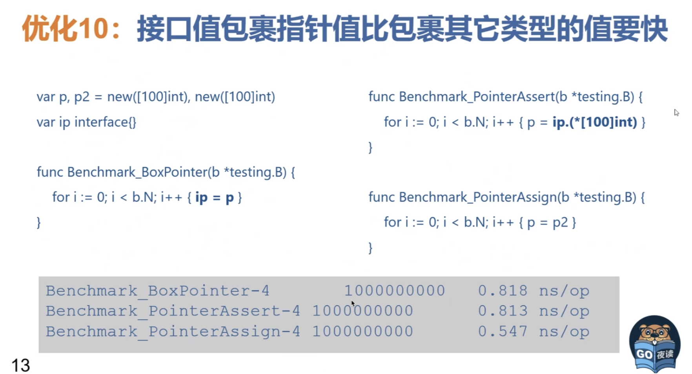

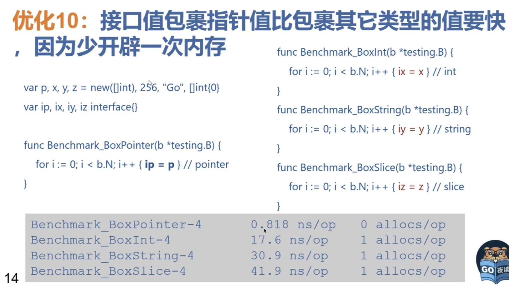


<br>


---

<br>


### 11.接口值包裹 指针值 比 包裹 其他类型的值 要快


<br>


Go 1.15新增优化


```go
package main

var x,y = 255,256

var ix,iy interface{}
```

<br>

```go
package main

import "testing"

func Benchmark_x(b *testing.B) {

	for i := 0; i < b.N; i++ {
		ix = x
	}
}

func Benchmark_y(b *testing.B) {

	for i := 0; i < b.N; i++ {
		iy = y
	}
}

```

<br>


```go
goos: darwin
goarch: amd64
pkg: xxxx
cpu: Intel(R) Core(TM) i7-8557U CPU @ 1.70GHz
Benchmark_x-8           565624285                2.033 ns/op           0 B/op          0 allocs/op
Benchmark_y-8           92127024                12.71 ns/op            8 B/op          1 allocs/op
PASS
ok      xxxx     2.653s
```

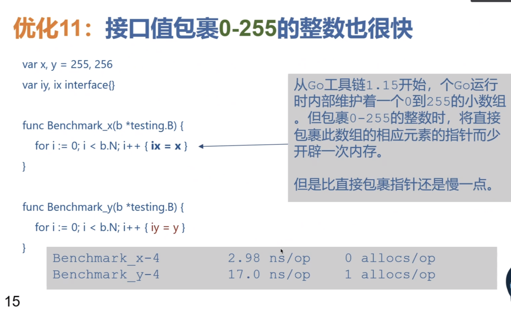


<br>


---

<br>


### 12.Bounds Check Elimination


<br>


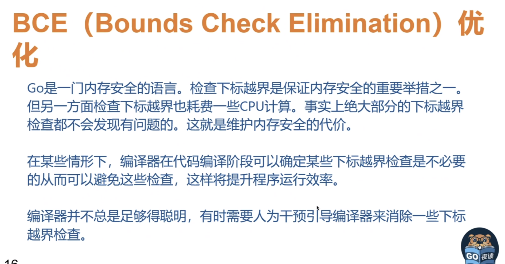

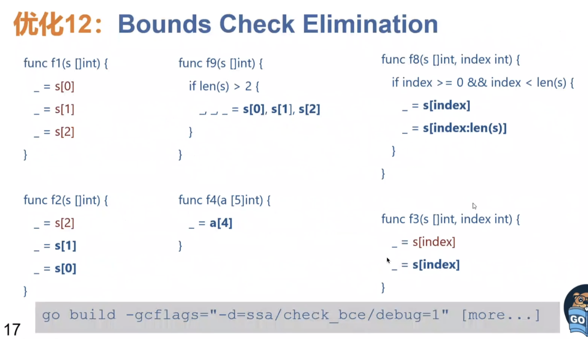


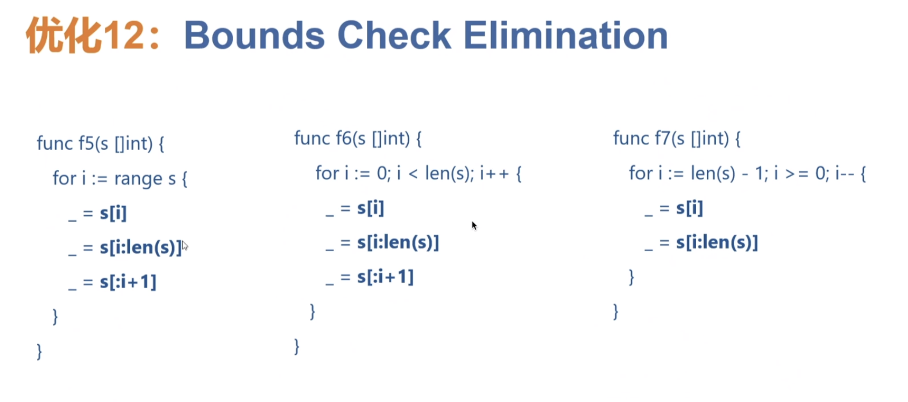


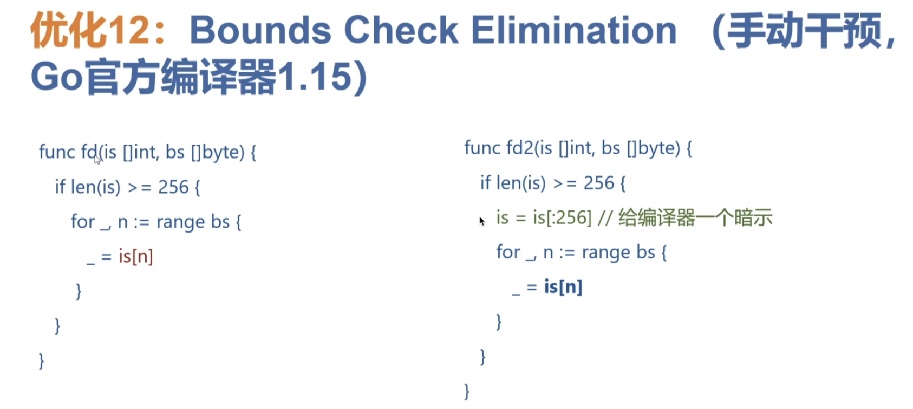


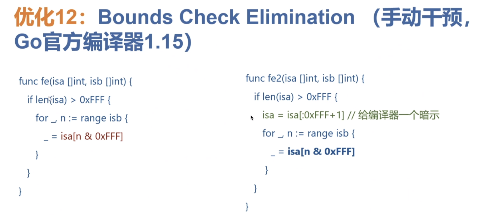


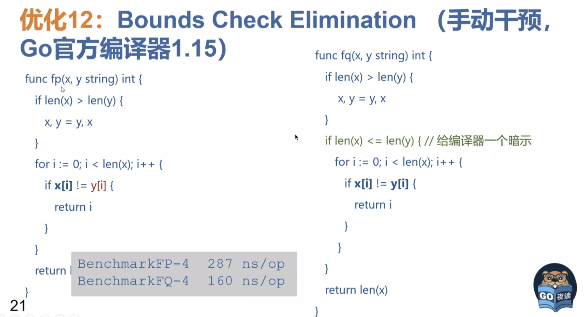

