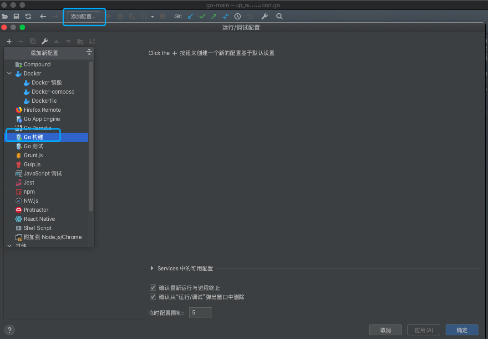
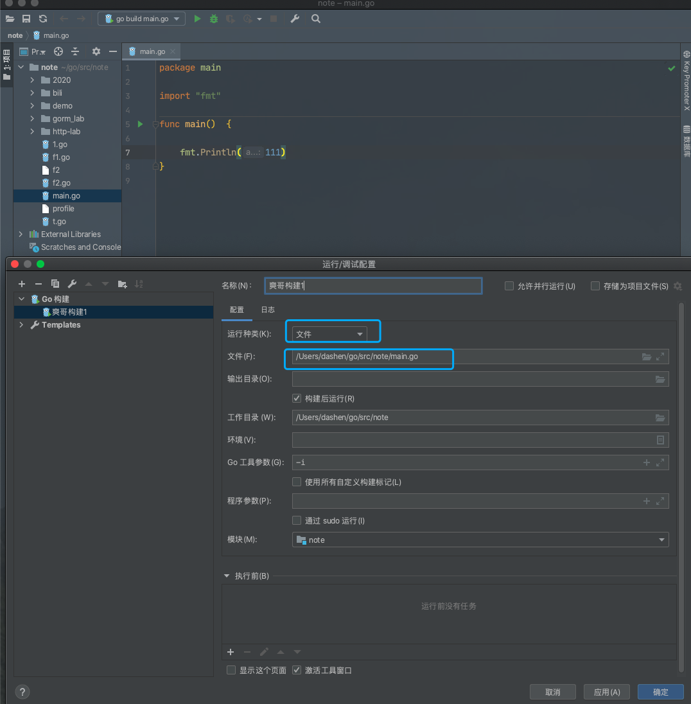
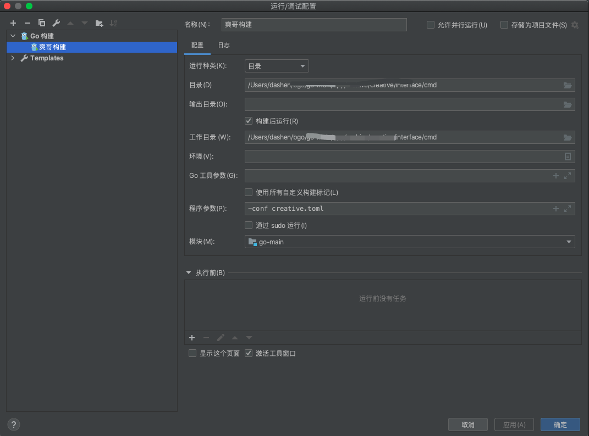

### 配置 一键运行/调试

 

运行种类共有三个选项,选择哪个视情况而定...

我在三家企业,就因不同的项目结构,分别用到了"文件","包"和"目录", 详情可见参考链接.

参考:

[Goland 调试](https://note.youdao.com/web/#/file/5D3CB6F633F94D2FB6838013F615CFA7/note/WEB39960c15062e8acca79ec1bc93f75af5/?search=goland)

---

 

### 打断点

 

步过，就是遇到方法，不进入，直接下一行

步入，就是遇到函数会进入函数

步出，就是运行到退出本函数、返回上一级的下一行

>>>

继续（resume）每按一次，都跳向下一个断点。

单步（step over）一行一行执行。

步进（step in）如果在一个函数处步进，可以进入该函数。

步出（step out）如果在一个调用函数中，从此函数退出，回到调用该函数的地方。