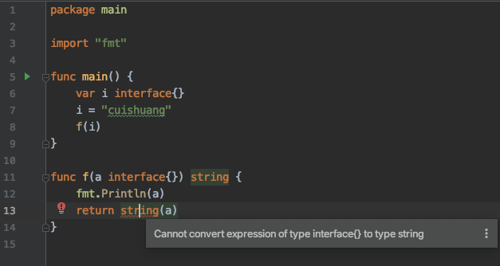

<br>


系列文章：


[golang实现多态](https://dashen.tech/2014/03/01/golang%E5%AE%9E%E7%8E%B0%E5%A4%9A%E6%80%81/)

[golang利用组合实现继承,和php或java面向对象的继承有何不同](https://dashen.tech/2014/03/01/golang%E5%88%A9%E7%94%A8%E7%BB%84%E5%90%88%E5%AE%9E%E7%8E%B0%E7%BB%A7%E6%89%BF-%E5%92%8Cphp%E6%88%96java%E9%9D%A2%E5%90%91%E5%AF%B9%E8%B1%A1%E7%9A%84%E7%BB%A7%E6%89%BF%E6%9C%89%E4%BD%95%E4%B8%8D%E5%90%8C/)


[Golang类型断言](https://dashen.tech/2017/07/26/Golang%E7%B1%BB%E5%9E%8B%E6%96%AD%E8%A8%80/)


[golang之interface入门](https://dashen.tech/2010/03/02/golang%E4%B9%8Binterface%E5%85%A5%E9%97%A8/)


[interface,鸭子类型与泛型](https://dashen.tech/2020/09/05/interface-%E9%B8%AD%E5%AD%90%E7%B1%BB%E5%9E%8B%E4%B8%8E%E6%B3%9B%E5%9E%8B/)


<br>


所谓 **类型断言(type assertion)**:





<font color="red">cannot convert a (type interface{}) to type string: need type assertion</font>

<br>


### 直接转换

<br>

如果明确知道a的类型,可以直接转换:


```go
package main

import "fmt"

func main() {
	var i interface{}
	i = "cuishuang"
	f(i)
}

func f(a interface{}) string {
	fmt.Println(a)

	return a.(string)
}
```

则编译通过.

<br>

**格式为 a.(对应的类型)**


但如果"()"里面的类型不对,则会直接panic

```go
package main

import "fmt"

func main() {
	var i interface{}
	i = "cuishuang"
	f(i)
}

func f(a interface{}) string {
	fmt.Println(a.(int))

	return ""
}
```


输出为:

```go
panic: interface conversion: interface {} is string, not int

goroutine 1 [running]:
```

<br>

---

<br>

### OK判别式

<br>

在断言时进行判断:

- 如果断言失败,那么ok的值将会是false. 

- 如果断言成功, ok的值将会是true, 同时value就是所期待的正确的值


```go
package main

import "fmt"

func main() {
	var i interface{}
	i = "cuishuang"
	f(i)
}

func f(a interface{}) string {
	value,ok := a.(int)

	if ok {
		fmt.Println(a.(int)) //a.(int) 即 value
		fmt.Println(value)
	} else {
		fmt.Println("i中不是int类型")
	}

	return ""
}
```

输出为:

```go
i中不是int类型
```

<br>


---


<br>


### 配合switch语句进行判断


<br>

```go
package main

import "fmt"

func main() {
	var i interface{}
	i = "cuishuang"
	f(i)
}

func f(a interface{}) string {

	switch val := a.(type) {
	default:
		fmt.Printf("unexpected type %T", val) // %T prints whatever type t has
		break
	case bool:
		fmt.Printf("boolean: %t\n", val) // t has type bool
		break
	case int:
		fmt.Printf("integer: %d\n", val) // t has type int
		break
	case string:
		fmt.Printf("string: %s\n", val) // t has type string
		break
	case *bool:
		fmt.Printf("pointer to boolean: %t\n", *val) // t has type *bool
		break
	case *int:
		fmt.Printf("pointer to integer: %d\n", *val) // t has type *int

	case *string:
		fmt.Printf("pointer to string: %s\n", *val) // t has type *string
		break

	}

	return ""
}
```

输出为:

```go
string: cuishuang
```


---


参考:

[深入Go语言 - 6](https://colobu.com/2016/06/21/dive-into-go-6/)

[golang类型断言的使用（Type Assertion）](https://www.cnblogs.com/qxxnxxFight/p/11008060.html)


