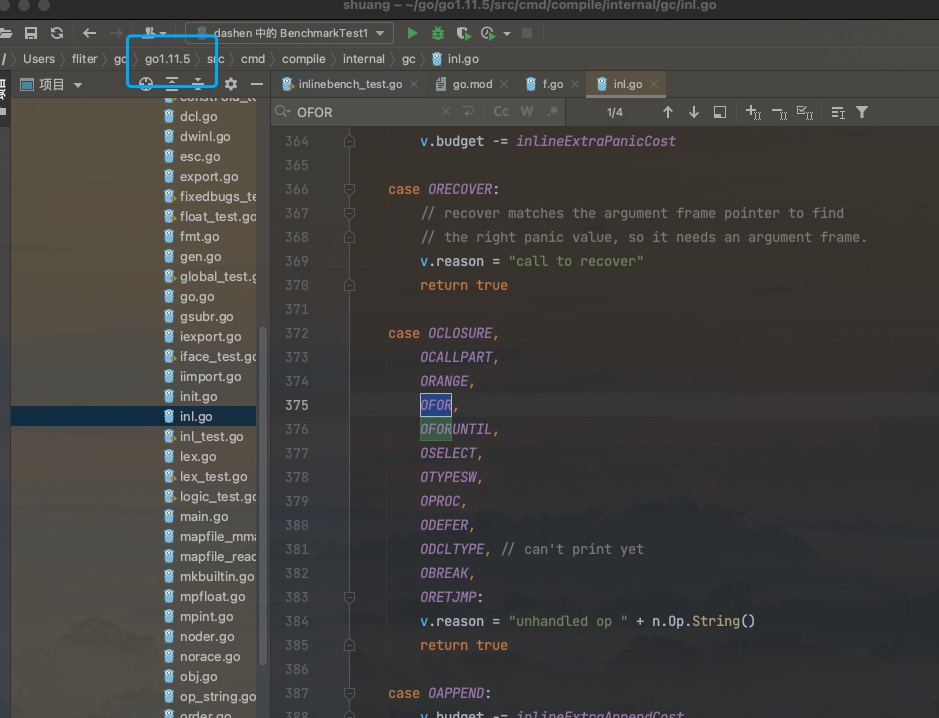
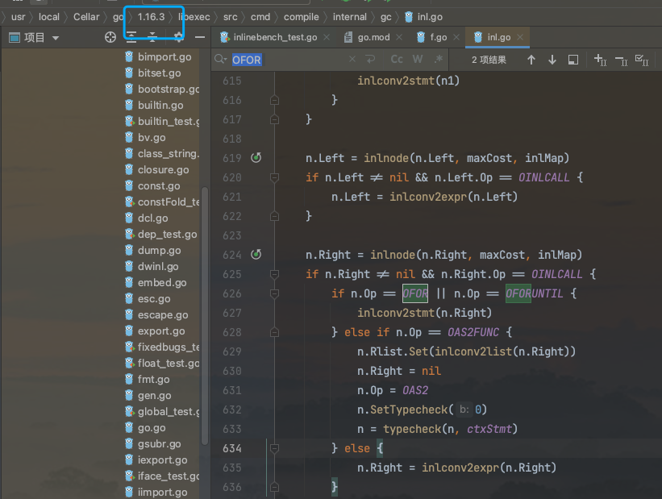

全文参考自 [详解 Go 内联优化](https://mp.weixin.qq.com/s/89QLSqGzH0yUM6cO6V4zmQ)


<br>

### 概念:

<br>

内联(*inline*),不是一个多么高大上的概念,虽然作用于编译阶段,但不难理解 `----` f1()调用f2(),编译器将f2的代码"拷贝"到f1(),从而避免调用f2(),这就是所谓的内联.

即 将一个被调用f2()在调用处原地展开,替换成这个函数f2()的实现

(在前端html中,也有内联,但意思有所不同)

<br>

> 为了保证程序的执行高效与安全,现代编译器并不会将程序员的代码直接翻译成相应地机器码,它需要做一系列的检查与优化. Go编译器默认做了很多相关工作,例如未使用的引用包检查、未使用的声明变量检查、有效的括号检查、[逃逸分析](https://dashen.tech/2021/05/29/golang%E9%80%83%E9%80%B8%E6%8A%80%E6%9C%AF%E5%88%86%E6%9E%90/)、内联优化、删除无用代码等。

> 栈分配内存会比堆分配高效得多, 我们自然希望对象能尽可能被分配在栈上. 在Go中,一个goroutine会有一个单独的栈,栈又会包含多个栈帧,栈帧是函数调用时在栈上为函数所分配的区域.  但其实函数调用是存在一些固定开销的, 如维护帧指针寄存器BP、栈溢出检测等. **因此,对于一些代码行比较少的函数,编译器倾向于将它们在编译期展开从而消除函数调用,这种行为就是内联。**


<br>

内联的优点有二: 第一 是它消除了函数调用本身的开销(函数调用有固定的开销,如栈和抢占检查);  第二是它使得编译器能更高效地执行其他的优化策略。

一般只有 较简短的函数,进行内联优化才会性价比比较高~

(内联只对叶子函数有效,叶子函数指不调用其他func的函数)

<br>

想要禁止编译器内联优化很简单, 在函数定义前一行添加`//go:noinline`即可


<br>

---

<br>


### 效果:

<br>

```go
➜   tree
.
├── go.mod
└── inlinebench_test.go

0 directories, 2 files
```

<br>

**inlinebench_test.go**:

```go
package shuangInline

import (
	"testing"
)

func BenchmarkTest1(b *testing.B) {
	x, y := 1, 2
	b.ResetTimer()
	for i := 0; i < b.N; i++ {
		MaxNoinline(x, y)
	}
}

func BenchmarkTest2(b *testing.B) {
	x, y := 1, 2
	b.ResetTimer()
	for i := 0; i < b.N; i++ {
		MaxInline(x, y)
	}
}

//go:noinline
func MaxNoinline(a, b int) int {
	if a < b {
		return b
	}
	return a
}

func MaxInline(a, b int) int {
	if a < b {
		return b
	}
	return a
}

```


执行 `go test --bench=. -benchmem  -count=3`,

```go
goos: darwin
goarch: amd64
pkg: 1(go.mod里写的module名)
cpu: Intel(R) Core(TM) i7-8557U CPU @ 1.70GHz
BenchmarkTest1-8        834522109                1.349 ns/op           0 B/op          0 allocs/op
BenchmarkTest1-8        880187982                1.335 ns/op           0 B/op          0 allocs/op
BenchmarkTest1-8        881400147                1.339 ns/op           0 B/op          0 allocs/op
BenchmarkTest2-8        1000000000               0.2317 ns/op          0 B/op          0 allocs/op
BenchmarkTest2-8        1000000000               0.2349 ns/op          0 B/op          0 allocs/op
BenchmarkTest2-8        1000000000               0.2316 ns/op          0 B/op          0 allocs/op
PASS
ok      1       4.790s

```

(相关命令可参考 [不同写法的性能差异](https://www6.dashen.tech/2021/04/12/%E4%B8%8D%E5%90%8C%E5%86%99%E6%B3%95%E7%9A%84%E6%80%A7%E8%83%BD%E5%B7%AE%E5%BC%82/))


<br>


函数体内部的执行逻辑非常简单,此时的性能差异主要体现在函数调用的固定开销上,即内联与否. 显而易见, 同样的函数,*不许内联*用时是*允许内联*的6倍,差异非常巨大

<br>

---

<br>

### 选择:

<br>


**内联优化**效果显著,但编译器并不会对所以函数调用都进行内联.  因为内联其实就是 将一个被调用函数f2()在调用处原地展开,替换成这个函数f2()的实现.  当该函数f2()被多次调用,就会被多次展开,这显然会增加编译后二进制文件的大小. 而如果不进行内联,则只需要保存一份函数体的代码,正常进行调用即可.

所以, 在空间上,一般来说**内联优化**会导致生成的可执行文件变大. 具体来说,编译器内联优化的选择策略是什么呢？

<br>

对于 `shuang.go`:

```go
package main

func add(a, b int) int {

	return a + b
}

func iter(num int) int {

	res := 1
	for i := 1; i < num; i++ {
		res = add(res, i)
	}
	return res
}

func main() {
	n := 100
	_ = iter(n)
}
```


可通过执行 `go build -gcflags="-m -m" shuang.go` 命令 查看编译器的优化策略:

<br>

对于 **Go 1.11.x**版本, 

```go
# command-line-arguments
./shuang.go:3:6: can inline add as: func(int, int) int { return a + b }
./shuang.go:8:6: cannot inline iter: unhandled op FOR
./shuang.go:12:12: inlining call to add func(int, int) int { return a + b }
./shuang.go:17:6: cannot inline main: function too complex: cost 90 exceeds budget 80
/var/folders/9z/kzqrt95n3wj9fq3189s2vvh80000gn/T/go-build729909214/b001/_gomod_.go:6:8: can inline init.0 as: func() { __debug_modinfo__ = "0w\xaf\f\x92t\b\x02A\xe1\xc1\a\xe6\xd6\x18\xe6path\tdashen\nmod\tdashen\t(devel)\t\n\xf92C1\x86\x18 r\x00\x82B\x10A\x16\xd8\xf2" }
```

编译器判断add函数可以被内联优化,并将add函数内联

iter函数由于存在循环语句并不能被内联: *cannot inline iter: unhandled op FOR*

除了for循环,还有一些情况不会被内联, 如闭包/select/defer/go关键字所开启的新goroutine等, 详细可见[src/cmd/compile/internal/gc/inl.go]():


```go
	case OCLOSURE,
		OCALLPART,
		ORANGE,
		OFOR,
		OFORUNTIL,
		OSELECT,
		OTYPESW,
		OPROC,
		ODEFER,
		ODCLTYPE, // can't print yet
		OBREAK,
		ORETJMP:
		v.reason = "unhandled op " + n.Op.String()
		return true
```

<br>

main函数 不能被内联优化,因为 **超过了80个节点的代码量,就不再内联**

cost 后面的数值代表[抽象语法树AST](https://dashen.tech/2019/04/30/Go-ast%E5%BA%93%E5%85%A5%E9%97%A8/)的节点

<br>


<details>
<summary>还可通过 <b>go build -gcflags="-m -m -m" shuang.go
</b>查看更详细信息:</summary>


```go
# command-line-arguments
./shuang.go:3:6: can inline add as: func(int, int) int { return a + b }
./shuang.go:8:6: cannot inline iter: unhandled op FOR
./shuang.go:12:12: inlining call to add func(int, int) int { return a + b }
./shuang.go:12:12: Before inlining: 
.   CALLFUNC l(12) tc(1) int
.   .   NAME-main.add a(true) l(3) x(0) class(PFUNC) tc(1) used FUNC-func(int, int) int
.   CALLFUNC-list
.   .   NAME-main.res a(true) g(3) l(10) x(0) class(PAUTO) tc(1) assigned used int

.   .   NAME-main.i a(true) g(4) l(11) x(0) class(PAUTO) tc(1) assigned used int
substituting name 
.   NAME-main.a a(true) g(2) l(3) x(0) class(PPARAM) tc(1) used int  ->  
.   NAME-main.a a(true) l(3) x(0) class(PAUTO) tc(1) assigned used int
substituting name 
.   NAME-main.b a(true) g(3) l(3) x(8) class(PPARAM) tc(1) used int  ->  
.   NAME-main.b a(true) l(3) x(0) class(PAUTO) tc(1) assigned used int
./shuang.go:12:12: After inlining 
.   INLCALL-init
.   .   DCL l(12)
.   .   .   NAME-main.a a(true) l(3) x(0) class(PAUTO) tc(1) assigned used int

.   .   DCL l(12)
.   .   .   NAME-main.b a(true) l(3) x(0) class(PAUTO) tc(1) assigned used int

.   .   DCL l(12)
.   .   .   NAME-main.~r2 a(true) l(3) x(0) class(PAUTO) tc(1) assigned used int

.   .   AS2 l(12) tc(1)
.   .   AS2-list
.   .   .   NAME-main.a a(true) l(3) x(0) class(PAUTO) tc(1) assigned used int

.   .   .   NAME-main.b a(true) l(3) x(0) class(PAUTO) tc(1) assigned used int
.   .   AS2-rlist
.   .   .   NAME-main.res a(true) g(3) l(10) x(0) class(PAUTO) tc(1) assigned used int

.   .   .   NAME-main.i a(true) g(4) l(11) x(0) class(PAUTO) tc(1) assigned used int

.   .   AS l(12) tc(1)
.   .   .   NAME-main.~r2 a(true) l(3) x(0) class(PAUTO) tc(1) assigned used int
.   INLCALL l(12) tc(1) int
.   INLCALL-rlist
.   .   NAME-main.~r2 a(true) l(3) x(0) class(PAUTO) tc(1) assigned used int
.   INLCALL-body
.   .   GOTO-init
.   .   .   AS2 l(12) tc(1)
.   .   .   AS2-list
.   .   .   .   NAME-main.~r2 a(true) l(3) x(0) class(PAUTO) tc(1) assigned used int
.   .   .   AS2-rlist
.   .   .   .   ADD l(5) tc(1) int
.   .   .   .   .   NAME-main.a a(true) l(3) x(0) class(PAUTO) tc(1) assigned used int
.   .   .   .   .   NAME-main.b a(true) l(3) x(0) class(PAUTO) tc(1) assigned used int
.   .   GOTO l(12) tc(1)
.   .   .   NAME-main..i0 a(true) l(12) x(0)

.   .   LABEL l(12) tc(1)
.   .   .   NAME-main..i0 a(true) l(12) x(0)

./shuang.go:17:6: cannot inline main: function too complex: cost 90 exceeds budget 80
/var/folders/9z/kzqrt95n3wj9fq3189s2vvh80000gn/T/go-build416805477/b001/_gomod_.go:6:8: can inline init.0 as: func() { __debug_modinfo__ = "0w\xaf\f\x92t\b\x02A\xe1\xc1\a\xe6\xd6\x18\xe6path\tdashen\nmod\tdashen\t(devel)\t\n\xf92C1\x86\x18 r\x00\x82B\x10A\x16\xd8\xf2" }
./shuang.go:5:11:[1] add esc: a
./shuang.go:5:11:[1] add esc: b
./shuang.go:5:11:[1] add esc: a + b
./shuang.go:5:2:[1] add esc: return a + b
./shuang.go:5:2:[1] add escassign: ~r2( a(true) g(1) l(3) x(16) class(PPARAMOUT))[NAME] = a + b( l(5) tc(1))[+]
./shuang.go:5:11:[1] add escassign: ~r2( a(true) g(1) l(3) x(16) class(PPARAMOUT))[NAME] = a( a(true) g(2) l(3) x(0) class(PPARAM) ld(1) tc(1) used)[NAME]
./shuang.go:5:11:[1] add escassign: ~r2( a(true) g(1) l(3) x(16) class(PPARAMOUT))[NAME] = b( a(true) g(3) l(3) x(8) class(PPARAM) ld(1) tc(1) used)[NAME]
./shuang.go:10:2:[1] iter esc: res
./shuang.go:10:2:[1] iter esc: var res int
./shuang.go:10:6:[1] iter esc: res
./shuang.go:10:9:[1] iter esc: 1
./shuang.go:10:6:[1] iter esc: res := 1
./shuang.go:10:6:[1] iter escassign: res( a(true) g(3) l(10) x(0) class(PAUTO) ld(1) tc(1) assigned used)[NAME] = 1( l(10) tc(1))[LITERAL]
./shuang.go:11:6:[1] iter esc: i
./shuang.go:11:6:[1] iter esc: var i int
./shuang.go:11:8:[1] iter esc: i
./shuang.go:11:11:[1] iter esc: 1
./shuang.go:11:8:[1] iter esc: i := 1
./shuang.go:11:8:[1] iter escassign: i( a(true) g(4) l(11) x(0) class(PAUTO) ld(1) tc(1) assigned used)[NAME] = 1( l(11) tc(1))[LITERAL]
./shuang.go:11:16:[2] iter esc: i
./shuang.go:11:16:[2] iter esc: num
./shuang.go:11:16:[2] iter esc: i < num
./shuang.go:11:24:[2] iter esc: i
./shuang.go:11:23:[2] iter esc: 1
./shuang.go:11:24:[2] iter esc: i++
./shuang.go:11:24:[2] iter escassign: i( a(true) g(4) l(11) x(0) class(PAUTO) ld(1) tc(1) assigned used)[NAME] = 1( l(11) tc(1))[LITERAL]
./shuang.go:12:7:[2] iter esc: res
./shuang.go:12:12:[2] iter esc: a
./shuang.go:12:12:[2] iter esc: var a int
./shuang.go:12:12:[2] iter esc: b
./shuang.go:12:12:[2] iter esc: var b int
./shuang.go:12:12:[2] iter esc: ~r2
./shuang.go:12:12:[2] iter esc: var ~r2 int
./shuang.go:12:12:[2] iter esc: a
./shuang.go:12:12:[2] iter esc: b
./shuang.go:12:12:[2] iter esc: res
./shuang.go:12:12:[2] iter esc: i
./shuang.go:12:12:[2] iter esc: a, b = res, i
./shuang.go:12:12:[2] iter escassign: a( a(true) l(3) x(0) class(PAUTO) ld(2) tc(1) assigned used)[NAME] = res( a(true) g(3) l(10) x(0) class(PAUTO) ld(1) tc(1) assigned used)[NAME]
./shuang.go:12:12:[2] iter escassign: b( a(true) l(3) x(0) class(PAUTO) ld(2) tc(1) assigned used)[NAME] = i( a(true) g(4) l(11) x(0) class(PAUTO) ld(1) tc(1) assigned used)[NAME]
./shuang.go:12:12:[2] iter esc: ~r2
./shuang.go:12:12:[2] iter esc: ~r2 = <N>
./shuang.go:12:12:[2] iter esc: ~r2
./shuang.go:12:12:[2] iter esc: a
./shuang.go:12:12:[2] iter esc: b
./shuang.go:12:12:[2] iter esc: a + b
./shuang.go:12:12:[2] iter esc: ~r2 = a + b
./shuang.go:12:12:[2] iter escassign: ~r2( a(true) l(3) x(0) class(PAUTO) ld(2) tc(1) assigned used)[NAME] = a + b( l(5) tc(1))[+]
./shuang.go:12:12:[2] iter escassign: ~r2( a(true) l(3) x(0) class(PAUTO) ld(2) tc(1) assigned used)[NAME] = a( a(true) l(3) x(0) class(PAUTO) ld(2) tc(1) assigned used)[NAME]
./shuang.go:12:12:[2] iter escassign: ~r2( a(true) l(3) x(0) class(PAUTO) ld(2) tc(1) assigned used)[NAME] = b( a(true) l(3) x(0) class(PAUTO) ld(2) tc(1) assigned used)[NAME]
./shuang.go:12:12:[2] iter esc: .i0
./shuang.go:12:12:[2] iter esc: goto .i0
./shuang.go:12:12:[2] iter esc: .i0
./shuang.go:12:12:[2] iter esc: .i0: 
./shuang.go:12:12:.i0:  non-looping label
./shuang.go:12:7:[2] iter esc: ~r2
./shuang.go:12:7:[2] iter esc: int(~r2)
./shuang.go:12:7:[2] iter escassign: int(~r2)( l(12) tc(1) hascall)[CONVNOP] = ~r2( a(true) l(3) x(0) class(PAUTO) ld(2) tc(1) assigned used)[NAME]
./shuang.go:12:7:[2] iter esc: res = int(~r2)
./shuang.go:12:7:[2] iter escassign: res( a(true) g(3) l(10) x(0) class(PAUTO) ld(1) tc(1) assigned used)[NAME] = int(~r2)( l(12) tc(1) hascall)[CONVNOP]
./shuang.go:12:7:[2] iter escassign: res( a(true) g(3) l(10) x(0) class(PAUTO) ld(1) tc(1) assigned used)[NAME] = ~r2( a(true) l(3) x(0) class(PAUTO) ld(2) tc(1) assigned used)[NAME]
./shuang.go:11:2:[1] iter esc: for loop
./shuang.go:14:2:[1] iter esc: res
./shuang.go:14:2:[1] iter esc: return res
./shuang.go:14:2:[1] iter escassign: ~r1( a(true) g(1) l(8) x(8) class(PPARAMOUT))[NAME] = res( a(true) g(3) l(10) x(0) class(PAUTO) ld(1) tc(1) assigned used)[NAME]
./shuang.go:18:2:[1] main esc: n
./shuang.go:18:2:[1] main esc: var n int
./shuang.go:18:4:[1] main esc: n
./shuang.go:18:7:[1] main esc: 10
./shuang.go:18:4:[1] main esc: n := 10
./shuang.go:18:4:[1] main escassign: n( a(true) g(1) l(18) x(0) class(PAUTO) ld(1) tc(1) used)[NAME] = 10( l(18) tc(1))[LITERAL]
./shuang.go:19:4:[1] main esc: _
./shuang.go:19:10:[1] main esc: iter
./shuang.go:19:10:[1] main esc: n
./shuang.go:19:10:[1] main esc: iter(n)
./shuang.go:19:4:[1] main esc: _ = iter(n)
/var/folders/9z/kzqrt95n3wj9fq3189s2vvh80000gn/T/go-build416805477/b001/_gomod_.go:7:22:[1] init.0 esc: __debug_modinfo__
/var/folders/9z/kzqrt95n3wj9fq3189s2vvh80000gn/T/go-build416805477/b001/_gomod_.go:7:24:[1] init.0 esc: "0w\xaf\f\x92t\b\x02A\xe1\xc1\a\xe6\xd6\x18\xe6path\tdashen\nmod\tdashen\t(devel)\t\n\xf92C1\x86\x18 r\x00\x82B\x10A\x16\xd8\xf2"
/var/folders/9z/kzqrt95n3wj9fq3189s2vvh80000gn/T/go-build416805477/b001/_gomod_.go:7:22:[1] init.0 esc: __debug_modinfo__ = "0w\xaf\f\x92t\b\x02A\xe1\xc1\a\xe6\xd6\x18\xe6path\tdashen\nmod\tdashen\t(devel)\t\n\xf92C1\x86\x18 r\x00\x82B\x10A\x16\xd8\xf2"
/var/folders/9z/kzqrt95n3wj9fq3189s2vvh80000gn/T/go-build416805477/b001/_gomod_.go:7:22:[1] init.0 escassign: __debug_modinfo__( a(true) l(5) x(0) class(PEXTERN) tc(1) assigned)[NAME] = "0w\xaf\f\x92t\b\x02A\xe1\xc1\a\xe6\xd6\x18\xe6path\tdashen\nmod\tdashen\t(devel)\t\n\xf92C1\x86\x18 r\x00\x82B\x10A\x16\xd8\xf2"( l(7) tc(1))[LITERAL]
```
</details>

<br>


对于 **Go 1.16.x**版本, 情况有所不同


```go
# command-line-arguments
./shuang.go:3:6: can inline add with cost 4 as: func(int, int) int { return a + b }
./shuang.go:8:6: can inline iter with cost 29 as: func(int) int { res := 1; for loop; return res }
./shuang.go:12:12: inlining call to add func(int, int) int { return a + b }
./shuang.go:17:6: can inline main with cost 39 as: func() { n := 100; _ = iter(n) }
./shuang.go:19:10: inlining call to iter func(int) int { res := 1; for loop; return res }
./shuang.go:19:10: inlining call to add func(int, int) int { return a + b }
```

add,iter,main均可内联.

这应该是某次版本升级带来的优化

 

 


<br>


---

<br>


### 内联表:

<br>


内联会将函数调用的过程抹掉,这会引入一个新的问题：代码的堆栈信息还能否保证?

举个例子,如果上面的add方法发生了panic,内联之后的程序,还能否准确的打印出堆栈信息？


```go
package main

func sub(a, b int) {
	a = a - b
	panic("panic information")
}

func max(a, b int) int {
	if a < b {
		sub(a, b)
	}
	return a
}

func main() {
	x, y := 1, 2
	_ = max(x, y)
}
```

在 *Go 1.16*下,这段代码 `go build -gcflags="-m -m" cui.go` 结果为:


```go
# command-line-arguments
./cui.go:3:6: can inline sub with cost 8 as: func(int, int) { a = a - b; panic("panic information") }
./cui.go:8:6: can inline max with cost 18 as: func(int, int) int { if a < b { sub(a, b) }; return a }
./cui.go:10:6: inlining call to sub func(int, int) { a = a - b; panic("panic information") }
./cui.go:15:6: can inline main with cost 33 as: func() { x, y := 1, 2; _ = max(x, y) }
./cui.go:17:9: inlining call to max func(int, int) int { if a < b { sub(a, b) }; return a }
./cui.go:17:9: inlining call to sub func(int, int) { a = a - b; panic("panic information") }
```

可知 max函数被内联,执行程序 `go run cui.go`

```go
panic: panic information

goroutine 1 [running]:
main.sub(...)
        /Users/fliter/go/src/shuang/lab/cui.go:5
main.max(...)
        /Users/fliter/go/src/shuang/lab/cui.go:10
main.main()
        /Users/fliter/go/src/shuang/lab/cui.go:17 +0x3a
exit status 2
```

panic依然输出了正确的程序堆栈信息,包括源文件位置和行号信息

<br>

这是由于Go内部会为每个存在内联优化的goroutine维持一个**内联树（inlining tree）**, 

<details>
<summary>该树可通过 `go build -gcflags="-d pctab=pctoinline" cui.go` 命令查看:</summary>

```go
# command-line-arguments
funcpctab "".sub [valfunc=pctoinline]
     0     -1 00000 (/Users/fliter/go/src/shuang/lab/cui.go:3)  TEXT    "".sub(SB), ABIInternal, $24-16
     0        00000 (/Users/fliter/go/src/shuang/lab/cui.go:3)  TEXT    "".sub(SB), ABIInternal, $24-16
     0     -1 00000 (/Users/fliter/go/src/shuang/lab/cui.go:3)  MOVQ    (TLS), CX
     9        00009 (/Users/fliter/go/src/shuang/lab/cui.go:3)  CMPQ    SP, 16(CX)
     d        00013 (/Users/fliter/go/src/shuang/lab/cui.go:3)  PCDATA  $0, $-2
     d        00013 (/Users/fliter/go/src/shuang/lab/cui.go:3)  JLS     58
     f        00015 (/Users/fliter/go/src/shuang/lab/cui.go:3)  PCDATA  $0, $-1
     f        00015 (/Users/fliter/go/src/shuang/lab/cui.go:3)  SUBQ    $24, SP
    13        00019 (/Users/fliter/go/src/shuang/lab/cui.go:3)  MOVQ    BP, 16(SP)
    18        00024 (/Users/fliter/go/src/shuang/lab/cui.go:3)  LEAQ    16(SP), BP
    1d        00029 (/Users/fliter/go/src/shuang/lab/cui.go:3)  FUNCDATA        $0, gclocals·33cdeccccebe80329f1fdbee7f5874cb(SB)
    1d        00029 (/Users/fliter/go/src/shuang/lab/cui.go:3)  FUNCDATA        $1, gclocals·33cdeccccebe80329f1fdbee7f5874cb(SB)
    1d        00029 (/Users/fliter/go/src/shuang/lab/cui.go:5)  LEAQ    type.string(SB), AX
    24        00036 (/Users/fliter/go/src/shuang/lab/cui.go:5)  MOVQ    AX, (SP)
    28        00040 (/Users/fliter/go/src/shuang/lab/cui.go:5)  LEAQ    ""..stmp_0(SB), AX
    2f        00047 (/Users/fliter/go/src/shuang/lab/cui.go:5)  MOVQ    AX, 8(SP)
    34        00052 (/Users/fliter/go/src/shuang/lab/cui.go:5)  PCDATA  $1, $0
    34        00052 (/Users/fliter/go/src/shuang/lab/cui.go:5)  CALL    runtime.gopanic(SB)
    39        00057 (/Users/fliter/go/src/shuang/lab/cui.go:5)  XCHGL   AX, AX
    3a        00058 (/Users/fliter/go/src/shuang/lab/cui.go:5)  NOP
    3a        00058 (/Users/fliter/go/src/shuang/lab/cui.go:3)  PCDATA  $1, $-1
    3a        00058 (/Users/fliter/go/src/shuang/lab/cui.go:3)  PCDATA  $0, $-2
    3a        00058 (/Users/fliter/go/src/shuang/lab/cui.go:3)  CALL    runtime.morestack_noctxt(SB)
    3f        00063 (/Users/fliter/go/src/shuang/lab/cui.go:3)  PCDATA  $0, $-1
    3f        00063 (/Users/fliter/go/src/shuang/lab/cui.go:3)  NOP
    40        00064 (/Users/fliter/go/src/shuang/lab/cui.go:3)  JMP     0
    42 done
wrote 3 bytes to 0xc00009e500
 00 42 00
funcpctab "".max [valfunc=pctoinline]
     0     -1 00000 (/Users/fliter/go/src/shuang/lab/cui.go:8)  TEXT    "".max(SB), ABIInternal, $24-24
     0        00000 (/Users/fliter/go/src/shuang/lab/cui.go:8)  TEXT    "".max(SB), ABIInternal, $24-24
     0     -1 00000 (/Users/fliter/go/src/shuang/lab/cui.go:8)  MOVQ    (TLS), CX
     9        00009 (/Users/fliter/go/src/shuang/lab/cui.go:8)  CMPQ    SP, 16(CX)
     d        00013 (/Users/fliter/go/src/shuang/lab/cui.go:8)  PCDATA  $0, $-2
     d        00013 (/Users/fliter/go/src/shuang/lab/cui.go:8)  JLS     89
     f        00015 (/Users/fliter/go/src/shuang/lab/cui.go:8)  PCDATA  $0, $-1
     f        00015 (/Users/fliter/go/src/shuang/lab/cui.go:8)  SUBQ    $24, SP
    13        00019 (/Users/fliter/go/src/shuang/lab/cui.go:8)  MOVQ    BP, 16(SP)
    18        00024 (/Users/fliter/go/src/shuang/lab/cui.go:8)  LEAQ    16(SP), BP
    1d        00029 (/Users/fliter/go/src/shuang/lab/cui.go:8)  FUNCDATA        $0, gclocals·33cdeccccebe80329f1fdbee7f5874cb(SB)
    1d        00029 (/Users/fliter/go/src/shuang/lab/cui.go:8)  FUNCDATA        $1, gclocals·33cdeccccebe80329f1fdbee7f5874cb(SB)
    1d        00029 (/Users/fliter/go/src/shuang/lab/cui.go:9)  MOVQ    "".a+32(SP), AX
    22        00034 (/Users/fliter/go/src/shuang/lab/cui.go:9)  MOVQ    "".b+40(SP), CX
    27        00039 (/Users/fliter/go/src/shuang/lab/cui.go:9)  CMPQ    AX, CX
    2a        00042 (/Users/fliter/go/src/shuang/lab/cui.go:9)  JLT     59
    2c        00044 (/Users/fliter/go/src/shuang/lab/cui.go:12) MOVQ    AX, "".~r2+48(SP)
    31        00049 (/Users/fliter/go/src/shuang/lab/cui.go:12) MOVQ    16(SP), BP
    36        00054 (/Users/fliter/go/src/shuang/lab/cui.go:12) ADDQ    $24, SP
    3a        00058 (/Users/fliter/go/src/shuang/lab/cui.go:12) RET
    3b        00059 (/Users/fliter/go/src/shuang/lab/cui.go:10) XCHGL   AX, AX
    3c      0 00060 (/Users/fliter/go/src/shuang/lab/cui.go:10) LEAQ    type.string(SB), AX
    43        00067 (/Users/fliter/go/src/shuang/lab/cui.go:10) MOVQ    AX, (SP)
    47        00071 (/Users/fliter/go/src/shuang/lab/cui.go:10) LEAQ    ""..stmp_1(SB), AX
    4e        00078 (/Users/fliter/go/src/shuang/lab/cui.go:10) MOVQ    AX, 8(SP)
    53        00083 (/Users/fliter/go/src/shuang/lab/cui.go:10) PCDATA  $1, $0
    53        00083 (/Users/fliter/go/src/shuang/lab/cui.go:10) CALL    runtime.gopanic(SB)
    58        00088 (/Users/fliter/go/src/shuang/lab/cui.go:10) XCHGL   AX, AX
    59        00089 (/Users/fliter/go/src/shuang/lab/cui.go:10) NOP
    59        00089 (/Users/fliter/go/src/shuang/lab/cui.go:8)  PCDATA  $1, $-1
    59        00089 (/Users/fliter/go/src/shuang/lab/cui.go:8)  PCDATA  $0, $-2
    59     -1 00089 (/Users/fliter/go/src/shuang/lab/cui.go:8)  CALL    runtime.morestack_noctxt(SB)
    5e        00094 (/Users/fliter/go/src/shuang/lab/cui.go:8)  PCDATA  $0, $-1
    5e        00094 (/Users/fliter/go/src/shuang/lab/cui.go:8)  NOP
    60        00096 (/Users/fliter/go/src/shuang/lab/cui.go:8)  JMP     0
    62 done
wrote 7 bytes to 0xc0006a2270
 00 3c 02 1d 01 09 00
-- inlining tree for "".max:
0 | -1 | "".sub (/Users/fliter/go/src/shuang/lab/cui.go:10:6) pc=59
--
funcpctab "".main [valfunc=pctoinline]
     0     -1 00000 (/Users/fliter/go/src/shuang/lab/cui.go:15) TEXT    "".main(SB), ABIInternal, $24-0
     0        00000 (/Users/fliter/go/src/shuang/lab/cui.go:15) TEXT    "".main(SB), ABIInternal, $24-0
     0     -1 00000 (/Users/fliter/go/src/shuang/lab/cui.go:15) MOVQ    (TLS), CX
     9        00009 (/Users/fliter/go/src/shuang/lab/cui.go:15) CMPQ    SP, 16(CX)
     d        00013 (/Users/fliter/go/src/shuang/lab/cui.go:15) PCDATA  $0, $-2
     d        00013 (/Users/fliter/go/src/shuang/lab/cui.go:15) JLS     64
     f        00015 (/Users/fliter/go/src/shuang/lab/cui.go:15) PCDATA  $0, $-1
     f        00015 (/Users/fliter/go/src/shuang/lab/cui.go:15) SUBQ    $24, SP
    13        00019 (/Users/fliter/go/src/shuang/lab/cui.go:15) MOVQ    BP, 16(SP)
    18        00024 (/Users/fliter/go/src/shuang/lab/cui.go:15) LEAQ    16(SP), BP
    1d        00029 (/Users/fliter/go/src/shuang/lab/cui.go:15) FUNCDATA        $0, gclocals·33cdeccccebe80329f1fdbee7f5874cb(SB)
    1d        00029 (/Users/fliter/go/src/shuang/lab/cui.go:15) FUNCDATA        $1, gclocals·33cdeccccebe80329f1fdbee7f5874cb(SB)
    1d        00029 (<unknown line number>)     NOP
    1d      0 00029 (/Users/fliter/go/src/shuang/lab/cui.go:17) XCHGL   AX, AX
    1e     -1 00030 (/Users/fliter/go/src/shuang/lab/cui.go:17) LEAQ    type.string(SB), AX
    25      1 00037 (/Users/fliter/go/src/shuang/lab/cui.go:17) MOVQ    AX, (SP)
    29        00041 (/Users/fliter/go/src/shuang/lab/cui.go:17) LEAQ    ""..stmp_2(SB), AX
    30        00048 (/Users/fliter/go/src/shuang/lab/cui.go:17) MOVQ    AX, 8(SP)
    35        00053 (/Users/fliter/go/src/shuang/lab/cui.go:17) PCDATA  $1, $0
    35        00053 (/Users/fliter/go/src/shuang/lab/cui.go:17) CALL    runtime.gopanic(SB)
    3a        00058 (/Users/fliter/go/src/shuang/lab/cui.go:17) XCHGL   AX, AX
    3b        00059 (/Users/fliter/go/src/shuang/lab/cui.go:17) NOP
    3b        00059 (/Users/fliter/go/src/shuang/lab/cui.go:15) PCDATA  $1, $-1
    3b        00059 (/Users/fliter/go/src/shuang/lab/cui.go:15) PCDATA  $0, $-2
    3b     -1 00059 (/Users/fliter/go/src/shuang/lab/cui.go:15) NOP
    40        00064 (/Users/fliter/go/src/shuang/lab/cui.go:15) CALL    runtime.morestack_noctxt(SB)
    45        00069 (/Users/fliter/go/src/shuang/lab/cui.go:15) PCDATA  $0, $-1
    45        00069 (/Users/fliter/go/src/shuang/lab/cui.go:15) JMP     0
    47 done
wrote 11 bytes to 0xc0004a0260
 00 1d 02 01 01 07 04 16 03 0c 00
-- inlining tree for "".main:
0 | -1 | "".max (/Users/fliter/go/src/shuang/lab/cui.go:17:9) pc=30
1 | 0 | "".sub (/Users/fliter/go/src/shuang/lab/cui.go:10:6) pc=29
--

```

</details>

由此便可以得到一张映射表,这张表被嵌入到了二进制文件中,在运行时可以得到准确的堆栈信息

<br>

---

<br>

### 控制:

<br>


Go程序编译时,默认将进行内联优化. 可通过`-gcflags="-l"` (或 `-gcflags=-l`)选项全局禁用内联;与一个`-l`禁用内联相反,如果传递两个或两个以上的`-l`则会启用内联,并用更为激进的内联策略.


- -gcflags=-l，禁用内联。什么都不做，常规的内联
- -gcflags='-l -l' 内联级别2，更积极，可能更快，可能会制作更大的二进制文件。
- -gcflags='-l -l -l' 内联级别3，再次更加激进，二进制文件肯定更大，也许更快，但也许会有 bug。
- -gcflags=-l=4 (4个 -l) 在 *Go 1.11* 中将支持实验性的 中间栈内联优化。


如果不想全局范围内禁止优化,而只针对某函数,则可以在函数定义上方 添加`//go:noinline` 编译指令,来阻止编译器内联该函数


<br>


---


<br>


推荐阅读:

[Go 中的内联优化](https://mp.weixin.qq.com/s/hqivL8F6NyCow_oXn-BDvQ)

[Go 中对栈中函数进行内联](https://mp.weixin.qq.com/s/zj1rjny_qXU2C1izWM0_CQ)


<br>

更多参考:


[方法内联 golang](https://www.google.com/search?q=%E6%96%B9%E6%B3%95%E5%86%85%E8%81%94+golang&newwindow=1&sxsrf=ALeKk02bRjUlZPwEaDmBZBMDpDXlgZvKRw%3A1621784200872&ei=iHaqYPPTNIbL-QaJw7nAAQ&oq=%E6%96%B9%E6%B3%95%E5%86%85%E8%81%94+golang&gs_lcp=Cgdnd3Mtd2l6EAM6CQgAELADEAcQHjoGCAAQBRAeUM-YAliAoQJglaMCaAJwAHgAgAHZAYgB9guSAQUwLjUuM5gBAKABAaoBB2d3cy13aXrIAQPAAQE&sclient=gws-wiz&ved=0ahUKEwjzt8f5kODwAhWGZd4KHYlhDhgQ4dUDCA4&uact=5)


[[译] Go语言inline内联的策略与限制](https://pengrl.com/p/20028/)

<br>

java中的内联:

[JVM代码优化：方法内联(Method inlining)](https://www.jianshu.com/p/ae28d199e612)