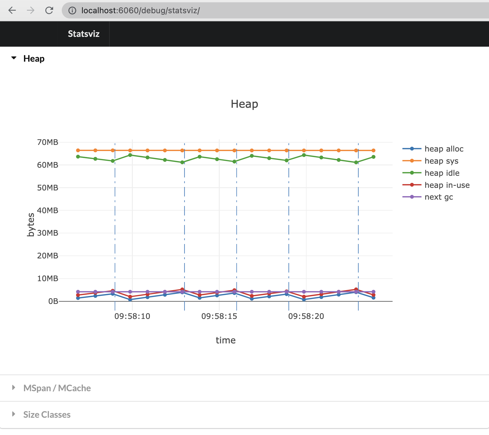
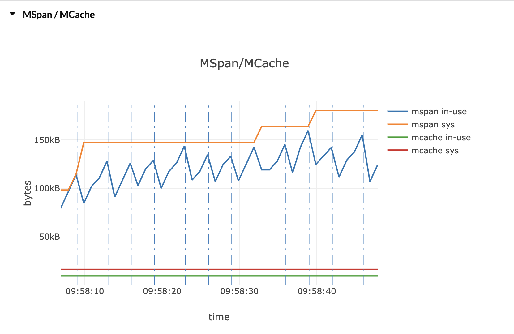
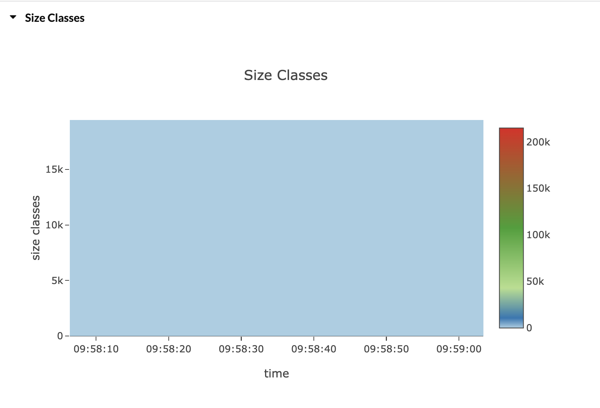
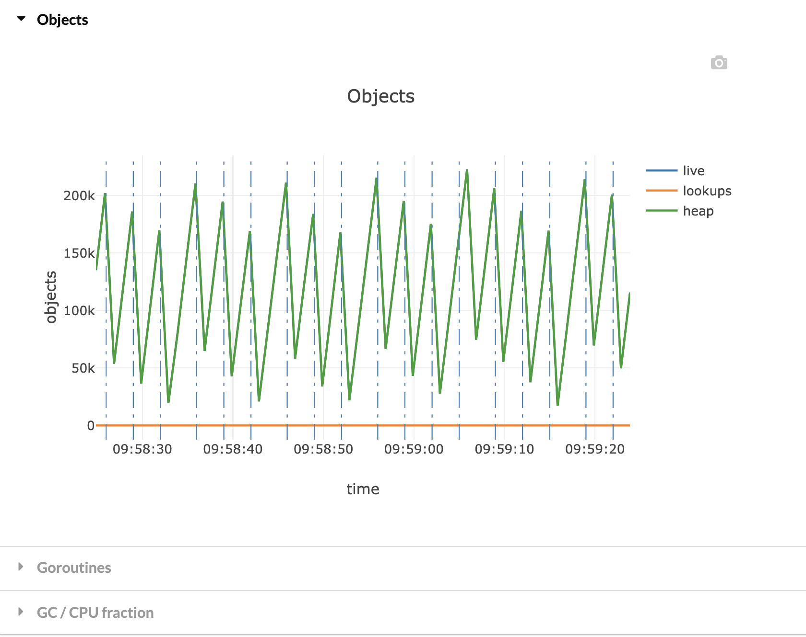
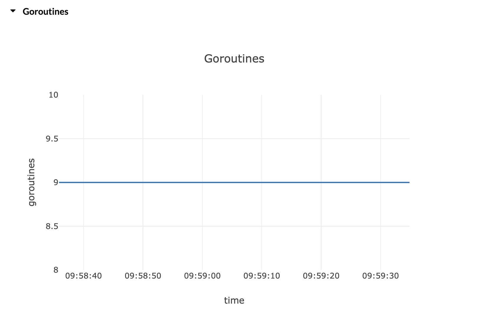
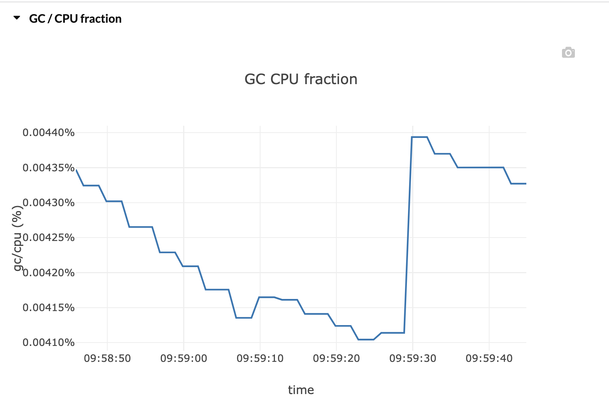

### [statsviz](https://github.com/arl/statsviz)

<br>

实时查看 Go 应用程序运行时统计信息(GC，MemStats 等)


```go
package main

import (
	"fmt"
	"github.com/arl/statsviz"
	"log"
	"net/http"
	"time"
)

func main() {
	statsviz.RegisterDefault()
	go func() {
		log.Println(http.ListenAndServe("localhost:6060", nil))
	}()

	for {
		fmt.Println(time.Now().UnixNano())
	}
}
```


运行后，打开[http://localhost:6060/debug/statsviz/](http://localhost:6060/debug/statsviz/)










<br>

> 原理是使用 WebSocket 协议，定时将runtime数据发送给浏览器，浏览器接收到之后，利用 JS 绘制图表，展示出来。Go 核心代码如下：


用了[gorilla](https://github.com/gorilla/websocket)这个websocket库

```go
// sendStats indefinitely send runtime statistics on the websocket connection.
func sendStats(conn *websocket.Conn, frequency time.Duration) error {
	tick := time.NewTicker(frequency)
	defer tick.Stop()

	stats := stats{GoVersion: runtime.Version()}
	for range tick.C {
		runtime.ReadMemStats(&stats.Mem)
		stats.NumGoroutine = runtime.NumGoroutine()
		if err := conn.WriteJSON(stats); err != nil {
			return err
		}
	}

	panic("unreachable")
}
```


参考自 [为项目集成可视化实时运行时统计](https://blog.csdn.net/weixin_30270715/article/details/112099813)


<br>

### [statsview](https://github.com/go-echarts/statsview)

<br>


[通过这个 Runtime 统计信息可视化库学到了什么？](https://www.modb.pro/db/87131)


```go
package main

import (
	"github.com/go-echarts/statsview"
	"math/rand"
	"strconv"
	"time"
)

func main() {
	go work()
	mgr := statsview.New()

	// Start() runs a HTTP server at `localhost:18066` by default.
	mgr.Start()

	// Stop() will shutdown the http server gracefully
	// mgr.Stop()
}

func work() {
	// Generate some allocations
	m := map[string][]byte{}

	for {
		b := make([]byte, 512+rand.Intn(16*1024))
		m[strconv.Itoa(len(m)%(10*100))] = b

		if len(m)%(10*100) == 0 {
			m = make(map[string][]byte)
		}

		time.Sleep(10 * time.Millisecond)
	}
}
```