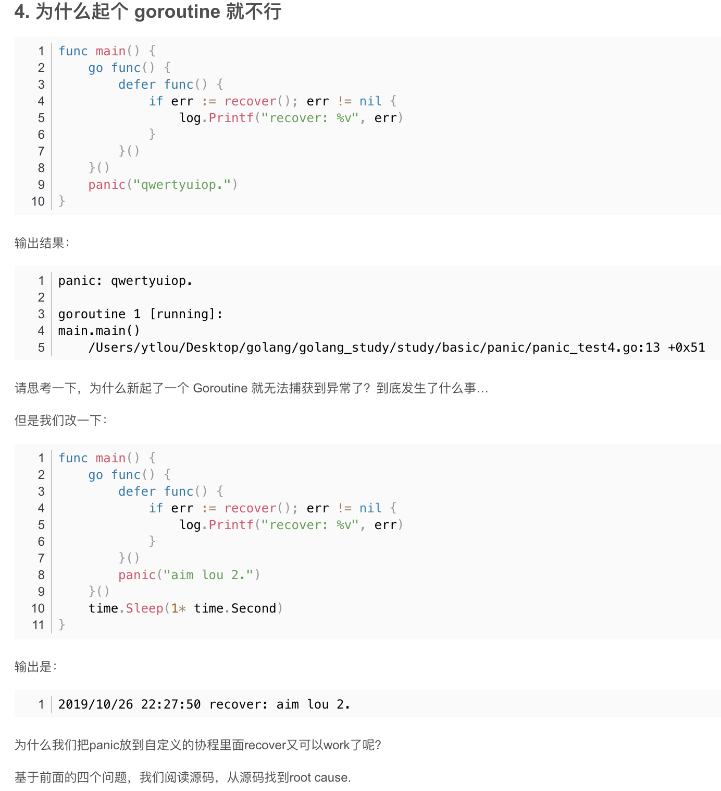

1

<br>


有关defer,参见[Golang中的defer](http://www.dashen.tech/2019/08/24/Golang%E4%B8%AD%E7%9A%84defer/)


---

### recover

<br>

> 使用panic抛出异常后, 将立即停止当前函数的执行并运行所有被defer的函数，然后将panic抛向上一层，直至程序crash。但是也可以使用被defer的recover函数来捕获异常阻止程序的崩溃，recover只有被defer后才是有意义的。

```go
func main() {

	print(123)

	print(456)
	panic("throw an error")

	print(678) //IDE会有提示: Unreachable code

}

```

结果:

```go
123456panic: throw an error

goroutine 1 [running]:
main.main()
    /Users/shuangcui/explore/panicandrecover.go:31 +0x67
```


#### 使用recover()捕获异常:

```go
func main() {

	print(123)

	defer func() {
		if err := recover(); err != nil {
			print("recover it")
		}
	}()

	print(456)
	panic("throw an error")

	print(678) //IDE会有提示: Unreachable code

}
```
结果为:

```go
123456recover it
```


如果有两个recover,则捕获异常的是后一个


```go
func main() {

	print(123)

	defer func() {
		if err := recover(); err != nil {
			print("recover it")
		}
	}()

	defer func() {
		if err := recover(); err != nil {
			print("复原!")
		}
	}()

	print(456)
	panic("throw an error")

	print(678) //IDE会有提示: Unreachable code

}
```

结果为:
```go
123456复原!
```

<br>

#### panic之后的任何代码都不会继续执行

前提是panic不在if里面

<br>

```go
package main

import "fmt"

func main() {
	defer_call()
	fmt.Println("333 Helloworld")
}

func defer_call() {
	defer func() {
		fmt.Println("11111")
	}()

	defer func() {
		fmt.Println("22222")
	}()

	defer func() {
		if r := recover(); r != nil {
			fmt.Println("Recover from r : ", r)
		}
	}()

	defer func() {
		fmt.Println("33333")
	}()

	fmt.Println("111 Helloworld")

	panic("Panic 1!")


    //使用panic抛出异常后, 将立即停止当前函数的执行并运行所有被defer的函数，然后将panic抛向上一层, 直至程序crash

    //但是也可以使用被defer的recover函数来捕获异常阻止程序的崩溃，recover只有被defer后才是有意义的。

	panic("Panic 2!") //panic1之后的panic2没有任何机会会被执行, panic2之后的任何代码更没有任何机会被执行

	fmt.Println("222 Helloworld")
}
```

输出为:

```go
111 Helloworld
33333
Recover from r :  Panic 1!
22222
11111
333 Helloworld
```

对于goroutine中的panic,recover是无法恢复的~<br>
goroutine中的recover,同样无法恢复协程外的panic



主方法中的recover,也可以恢复子方法里的panic;<br>
但如果`go subfunc()`,则同样无法捕获subfunc中的异常 


```go
func main() {

	fmt.Println(123)

	defer fmt.Println(999)

	defer func() {
		if err := recover(); err != nil {
			fmt.Println("恢复异常:",err)
		}

	}()
	subfunc()

}

func subfunc() {

	defer fmt.Println(888)
	panic("出现了bug")

	defer fmt.Println(456)

}

```

结果为:

```go
123
888
恢复异常: 出现了bug
999
```

---


> 因为panic发生的时候，panic函数后面的语句都不会执行了，所以recover函数不能放在panic语句后面执行，而要放在defer函数中执行。


> 使用 panic 抛出异常后，函数执行将从调用 panic 的地方停止，如果函数内有 defer 调用，则执行 defer 后边的函数调用，如果 defer 调用的函数中没有捕获异常信息，这个异常会沿着函数调用栈往上传递，直到 main 函数仍然没有捕获异常，将会导致程序异常退出

<br>


如何区别使用 panic 和 error 两种方式？

惯例是：导致关键流程出现不可修复性错误的使用 panic ，其他使用 error 。

panic 和 recover 的组合有如下特性：

- 有 panic 没 recover ，程序宕机。
- 有 panic 也有 recover ，程序不会宕机，执行完对应的 defer 后，从宕机点退出当前函数后继续执行。


<br>

拓展&参考:

[golang panic和recover 实现原理](https://blog.csdn.net/u010853261/article/details/102761955)


[Go 学习笔记（19）— 函数（05）[如何触发 panic、触发 panic 延迟执行、panic 和 recover 的关系]](https://blog.csdn.net/wohu1104/article/details/105571916)