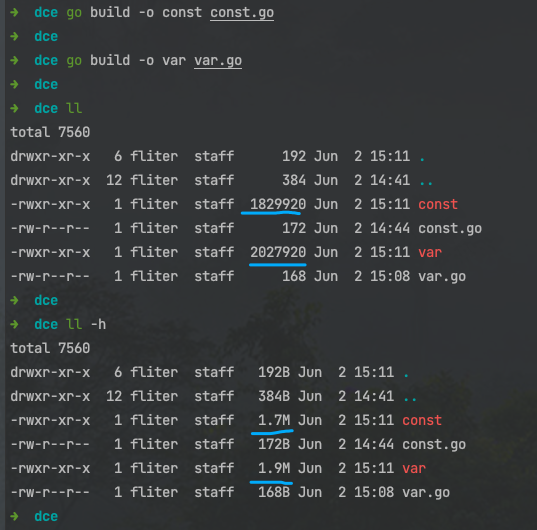
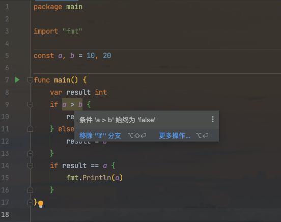
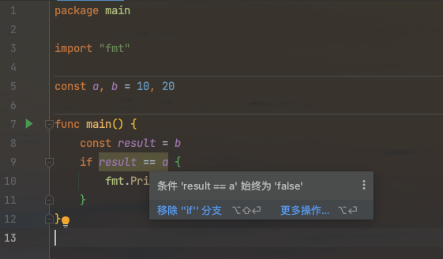

### 概念:

<br>

死码消除(dead code elimination, DCE) 是一种编译器优化技术, 作用是在编译阶段去掉对程序运行结果没有任何影响的代码

和 [逃逸分析](https://dashen.tech/2021/05/29/golang%E9%80%83%E9%80%B8%E6%8A%80%E6%9C%AF%E5%88%86%E6%9E%90/),[内联优化](https://dashen.tech/2021/05/22/Go%E4%B8%AD%E7%9A%84%E5%86%85%E8%81%94%E4%BC%98%E5%8C%96)并称为 Go编译器执行的三个重要优化


<br>

---

<br>

### 效果:

<br>


对于 **const.go**代码如下:

```go
package main

import "fmt"

func max(a, b int) int {
	if a > b {
		return a
	}
	return b
}

const a, b = 10, 20

func main() {
	if max(a, b) == a {
		fmt.Println(a)
	}
}

```

对于**var.go**代码如下:

```go
package main

import "fmt"

func max2(x, y int) int {
	if x > y {
		return x
	}
	return y
}

var x, y = 10, 20

func main() {
	if max2(x, y) == x {
		fmt.Println(x)
	}
}
```

<br>

两个文件的差异,只在于 两个参数 是变量还是常量

<br>


分别编译 **const.go** 和 **var.go**, 生成的二进制文件大小如下：


`go build -o 想要生成的二进制名称 想要编译的.go文件 `


 

<br>

不难发现, **const** 比 **var** 体积小了约 10%


<br>


为何如此?

<br>


首先编译器会对*max函数*进行内联优化, **const.go** 优化后如下:


```go
package main

import "fmt"

const a, b = 10, 20

func main() {
	var result int
	if a > b {
		result = a
	} else {
		result = b
	}
	if result == a {
		fmt.Println(a)
	}
}
```

 


因为 *a*和*b*是常量, 永远有`a<b`, 编译器可以在编译时证明该分支永远不会为true, 因此编译器可以进一步优化代码为：

 


`if a > b {}`这个分支被消除了,这称为**分支消除**

<br>

又知道结果总是等于b,因此编译器还将进一步将代码优化为:

```go
package main

const a, b = 10, 20

func main() {
	const result = b

}
```

最后就是:


```go
package main

func main() {
}
```

<br>


而对于**var.go**, 参数为 全局变量 不为常量,编译器并不知道运行过程中x、y会不会发生改变, 因此不能进行死代码消除. 

这部分代码被编译到最终的二进制程序中, 造成 二进制文件 *var* 比 *const* 体积大了约 10%


<br>


分支消除是死码消除一种. 使用静态证明来表明一段代码永远不可达,通常会被称为死代码,它不需要在最终的二进制文件中编译和优化.

编译器在编译阶段, 死码消除与内联优化一起工作, 可以减少循环和分支产生的代码数量

