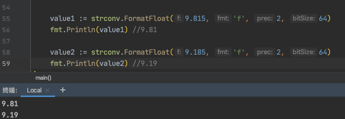

带着问题出发:

<br>


```go
	value1 := strconv.FormatFloat(9.815, 'f', 2, 64)
	fmt.Println(value1) //9.81

	value2 := strconv.FormatFloat(9.185, 'f', 2, 64)
	fmt.Println(value2) //9.19
    
```

<br>



*为什么会出现这样的情况?*

<br>

## FormatFloat

<br>

```go
// FormatFloat converts the floating-point number f to a string,
// according to the format fmt and precision prec. It rounds the
// result assuming that the original was obtained from a floating-point
// value of bitSize bits (32 for float32, 64 for float64).
//
// The format fmt is one of
// 'b' (-ddddp±ddd, a binary exponent),
// 'e' (-d.dddde±dd, a decimal exponent),
// 'E' (-d.ddddE±dd, a decimal exponent),
// 'f' (-ddd.dddd, no exponent),
// 'g' ('e' for large exponents, 'f' otherwise),
// 'G' ('E' for large exponents, 'f' otherwise),
// 'x' (-0xd.ddddp±ddd, a hexadecimal fraction and binary exponent), or
// 'X' (-0Xd.ddddP±ddd, a hexadecimal fraction and binary exponent).
//
// The precision prec controls the number of digits (excluding the exponent)
// printed by the 'e', 'E', 'f', 'g', 'G', 'x', and 'X' formats.
// For 'e', 'E', 'f', 'x', and 'X', it is the number of digits after the decimal point.
// For 'g' and 'G' it is the maximum number of significant digits (trailing
// zeros are removed).
// The special precision -1 uses the smallest number of digits
// necessary such that ParseFloat will return f exactly.
func FormatFloat(f float64, fmt byte, prec, bitSize int) string {
	return string(genericFtoa(make([]byte, 0, max(prec+4, 24)), f, fmt, prec, bitSize))
}

FormatFloat将浮点数f转换为字符串，
 根据格式fmt和precision prec。它四舍五入
 假定原始结果是从浮点数获得的结果
 bitSize位的值（float32为32，float64为64）。

 格式fmt是以下格式之一
 'b'（-ddddp±ddd，二进制指数），
 'e'（-d.dddde±dd，十进制指数），
 'E'（-d.ddddE±dd，十进制指数），
 'f'（-ddd.dddd，无指数），
 'g'（对于大指数而言为'e'，否则为'f'），
 'G'（对于大指数而言为'E'，否则为'f'），
 'x'（-0xd.ddddp±ddd，十六进制分数和二进制指数），或
 'X'（-0Xd.ddddP±ddd，十六进制分数和二进制指数）。

 precision prec控制位数（不包括指数）
 以“ e”，“ E”，“ f”，“ g”，“ G”，“ x”和“ X”格式打印。
 对于“ e”，“ E”，“ f”，“ x”和“ X”，它是小数点后的位数。
 对于“ g”和“ G”，它是有效数字的最大值（后跟
 零）。
 特殊精度-1使用最少的位数
 以便ParseFloat准确返回f。

```

<br>

`FormatFloat`四个参数,分别是:

- float64类型的待处理值

- 格式fmt,如果是f表示 无指数

- prec,精度,如果传2,即表示保留小数点后2位

- bitSize,只能传32或64


<br>


---

<br>

### max(prec+4, 24)和genericFtoa

<br>

简单比较大小.

```go
func max(a, b int) int {
	if a > b {
		return a
	}
	return b
}
```


比较传入的(精度值+4),和24的大小,取其中较大者. 即如果小数点后保留的位数小于20,这个值就是24

故而此时  make([]byte, 0, 24),就是初始化一个`uint8`类型,容量为24的切片

<br>


```go

func genericFtoa(dst []byte, val float64, fmt byte, prec, bitSize int) []byte {
	var bits uint64
	var flt *floatInfo

	//爽哥注解
	print("传入的待创处理的float64类型的值:",val,"\n")

	switch bitSize {
	case 32:
		bits = uint64(math.Float32bits(float32(val)))
		flt = &float32info
	case 64:
		bits = math.Float64bits(val)
		flt = &float64info
	default:
		panic("strconv: illegal AppendFloat/FormatFloat bitSize")
	}

	//爽哥注解
	print("得到的bits的值:",bits,"\n")

	//爽哥注解
	//如果此时打印:

	//传入的待创处理的float64类型的值:+9.815000e+000
	//得到的bits的值:4621714971847588577
	//9.81

	//传入的待创处理的float64类型的值:+9.185000e+000
	//得到的bits的值:4621360313376933151
	//9.19


	neg := bits>>(flt.expbits+flt.mantbits) != 0
	exp := int(bits>>flt.mantbits) & (1<<flt.expbits - 1)
	mant := bits & (uint64(1)<<flt.mantbits - 1)

	switch exp {
	case 1<<flt.expbits - 1:
		// Inf, NaN
		var s string
		switch {
		case mant != 0:
			s = "NaN"
		case neg:
			s = "-Inf"
		default:
			s = "+Inf"
		}
		return append(dst, s...)

	case 0:
		// denormalized
		exp++

	default:
		// add implicit top bit
		mant |= uint64(1) << flt.mantbits
	}
	exp += flt.bias

	// Pick off easy binary, hex formats.
	if fmt == 'b' {
		return fmtB(dst, neg, mant, exp, flt)
	}
	if fmt == 'x' || fmt == 'X' {
		return fmtX(dst, prec, fmt, neg, mant, exp, flt)
	}

	if !optimize {
		return bigFtoa(dst, prec, fmt, neg, mant, exp, flt)
	}

	var digs decimalSlice
	ok := false
	// Negative precision means "only as much as needed to be exact."
	shortest := prec < 0
	if shortest {
		// Try Grisu3 algorithm.
		f := new(extFloat)
		lower, upper := f.AssignComputeBounds(mant, exp, neg, flt)
		var buf [32]byte
		digs.d = buf[:]
		ok = f.ShortestDecimal(&digs, &lower, &upper)
		if !ok {
			return bigFtoa(dst, prec, fmt, neg, mant, exp, flt)
		}
		// Precision for shortest representation mode.
		switch fmt {
		case 'e', 'E':
			prec = max(digs.nd-1, 0)
		case 'f':
			prec = max(digs.nd-digs.dp, 0)
		case 'g', 'G':
			prec = digs.nd
		}
	} else if fmt != 'f' {
		// Fixed number of digits.
		digits := prec
		switch fmt {
		case 'e', 'E':
			digits++
		case 'g', 'G':
			if prec == 0 {
				prec = 1
			}
			digits = prec
		}
		if digits <= 15 {
			// try fast algorithm when the number of digits is reasonable.
			var buf [24]byte
			digs.d = buf[:]
			f := extFloat{mant, exp - int(flt.mantbits), neg}
			ok = f.FixedDecimal(&digs, digits)
		}
	}
	if !ok {
		return bigFtoa(dst, prec, fmt, neg, mant, exp, flt)
	}
	return formatDigits(dst, shortest, neg, digs, prec, fmt)
}
```