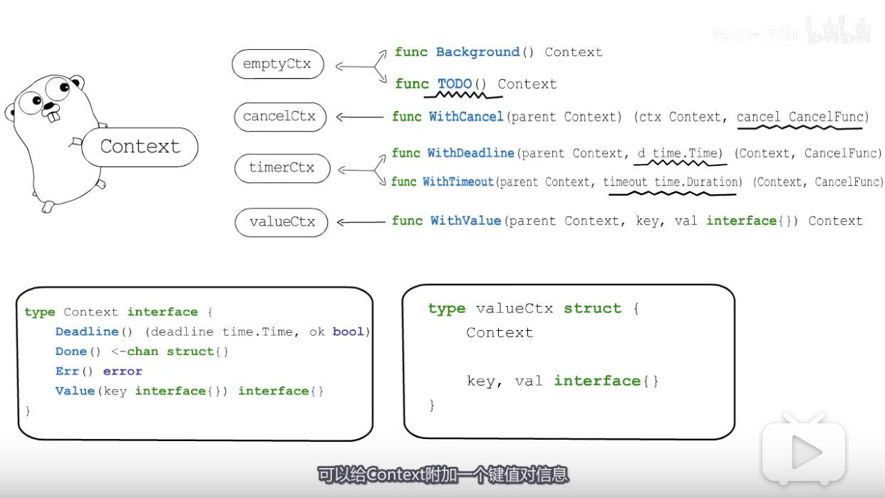

**在Go中,控制Goroutine有三种方式,即**

- **WaitGroup**

&emsp; &emsp; 可通过`go run -race main.go`查看竞态信息

&emsp; &emsp; 详见: [sync包-Waitgroup实现原理](https://dashen.tech/2017/07/25/sync%E5%8C%85-Waitgroup%E5%AE%9E%E7%8E%B0%E5%8E%9F%E7%90%86/)

- **Channel**

&emsp; &emsp; 详见; [golang之channel入门](https://dashen.tech/2017/12/04/golang%E4%B9%8Bchannel%E5%85%A5%E9%97%A8/)

- **Context**

 

本篇着重研究 Context

 

Go 1.7中加入官方库,可概括为 **一个接口,四种具体实现,六个函数**

 

### 四个方法:

 

#### <b>emptyCtx</b>

 

本质上是个整型,*emptyCtx对context接口的实现,只是简单返回nil,false等,实际上什么也没做. Backgroud和TODO这两个函数内部都会创建emptyCtx,

其中 Backgroud主要用于在初始化时获取一个Context;

TODO用在 本来应该使用外层传递的context,而外层却没有传递的地方使用.

 

 
#### <b>cancelCtx </b>

 

可取消的context. done用于获取该Context的取消通知.Children用户存储以当前节点为根节点的所有可取消的Context,以便在根节点取消时,可以把它们一并取消.err用于存储取消时指定的错误信息.mu则是用来保护这几个字段的锁,以保障cancelCtx是线程安全的.

而WithCancel可以将一个Context包装为cancelCtx,并提供一个取消函数,调用它可以Cancel对应的Context

 

#### <b>timerCtx </b>

 

 在cancelCtx的基础上,又封装了一个定时器和一个截止时间.这样既可以根据需要主动取消,也可以在到达deadline时,通过timer来触发取消动作.这个timer也会由cancelCtx.mu来保护,确保取消操作也是线程安全的.

通过WithDeadline和WithTimeout函数,都可以创建timerCtx.其区别是WithDeadline函数需要指定一个时间点,而WithTimeout函数接收一个时间段.

可取消的Context都会被注册到离它最近的,可取消的祖先节点中(会在children中增加一个键值对)

 

#### <b> ValueCtx  </b>

 

用来支持键值对打包. WithValue函数可以给Context附加一个键值对信息,这样就可以通过Context传递数据了.

"Go 语言中的 context.Context 的主要作用还是在多个 Goroutine 组成的树中同步取消信号以减少对资源的消耗和占用，虽然它也有传值的功能，但是这个功能我们还是很少用到。

在真正使用传值的功能时我们也应该非常谨慎，使用 context.Context 进行传递参数请求的所有参数一种非常差的设计，比较常见的使用场景是传递请求对应用户的认证令牌以及用于进行分布式追踪的请求 ID。"

 

 

valueCtx之间通过Context字段形成了一个链表结构. 传递数据时还要注意,Context本身是本着不可改变(immutable)的模式设计的,所以不要试图修改ctx里保存的值.

 

 

在http,sql等相关的库中,都提供了对Context的支持,方便我们在处理请求时,实现**超时自动取消**,或传递请求相关的*控制数据*等等.

 

参考:

[【Golang】Context了解下~](https://www.bilibili.com/video/BV19K411T7NL)

[【Golang】Context基础篇](https://mp.weixin.qq.com/s/wNfyP9OkUdfNnD_wS5Q3fg)

---

 

### 设计思想:

 

 

> 多个 Goroutine 同时订阅 ctx.Done() 管道中的消息，一旦接收到取消信号就立刻停止当前正在执行的工作。

 

**在多数情况下，如果当前函数没有上下文作为入参，我们都会使用 context.Background 作为起始的上下文向下传递。**

参考自 :

[上下文 Context](https://draveness.me/golang/docs/part3-runtime/ch06-concurrency/golang-context/
)

[Golang 之context库用法](https://studygolang.com/articles/29504)

 

---

 

注:以下内容参考自["码农桃花源"](https://mp.weixin.qq.com/s/GpVy1eB5Cz_t-dhVC6BJNw)公众号,定位是其阅读笔记;作者对计算机程序 理解深刻洞若观火,推荐关注;

**context 包 主要用于在 goroutine 之间传递取消信号、超时时间、截止时间以及一些共享的值**

**划重点:**

- context,译作“上下文”，准确说是 goroutine 上下文，包含 goroutine 的运行状态、环境等信息。 

- 主要用来在 goroutine 之间传递(共享)上下文信息，包括：取消信号、超时时间、截止时间、k-v 等。

- 几乎成为了并发控制和超时控制的标准做法。标准库许多方法都加上了context参数

---

总览:

图中标注`I`的是interface{},`T`的是struct{},`m`的为方法,`λ`的是函数;

 

---

 

[Go 语言坑爹的 WithCancel](https://www.zenlife.tk/with-cancel.md)