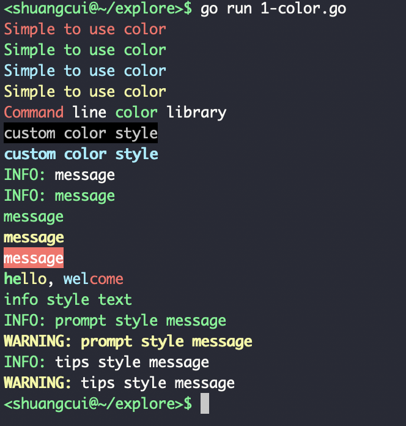
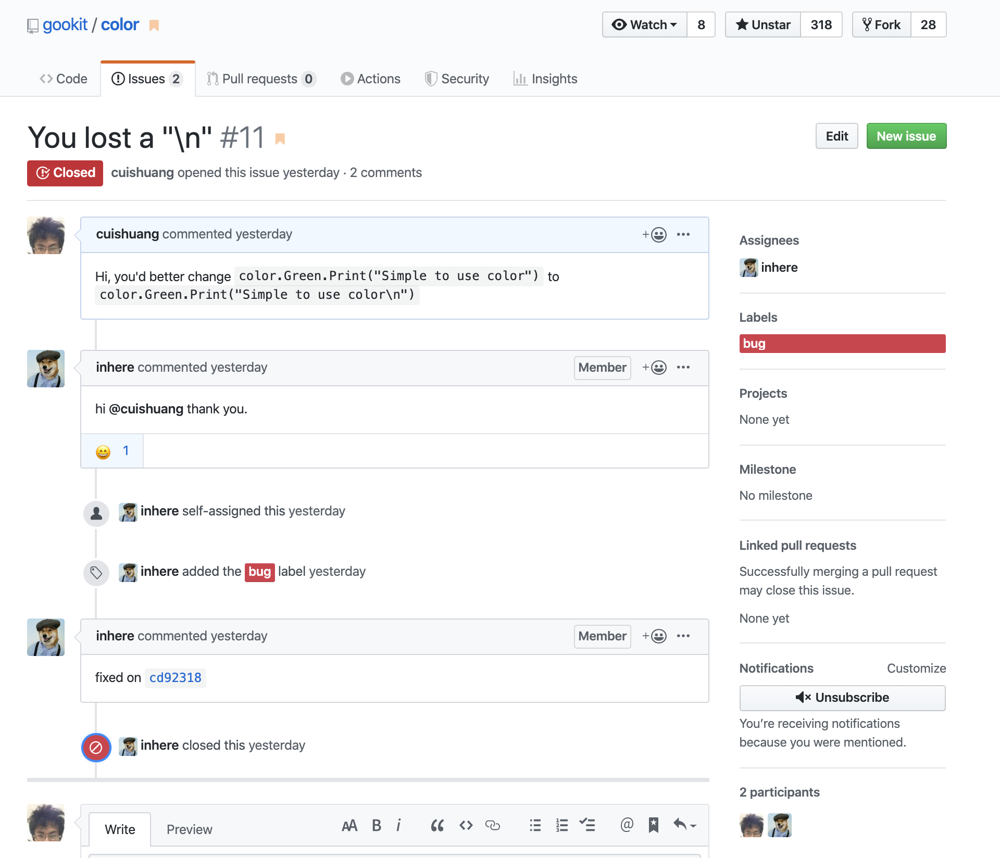

<br>

[控制台颜色渲染工具库](https://github.com/gookit/color)

示例:

```go
package main

import (
	"fmt"

	"github.com/gookit/color"
)

func main() {
	// quick use like fmt.Print*
	color.Red.Println("Simple to use color")
	color.Green.Print("Simple to use color\n")
	color.Cyan.Printf("Simple to use %s\n", "color")
	color.Yellow.Printf("Simple to use %s\n", "color")

	// use like func
	red := color.FgRed.Render
	green := color.FgGreen.Render
	fmt.Printf("%s line %s library\n", red("Command"), green("color"))

	// custom color
	color.New(color.FgWhite, color.BgBlack).Println("custom color style")

	// can also:
	color.Style{color.FgCyan, color.OpBold}.Println("custom color style")

	// internal theme/style:
	color.Info.Tips("message")
	color.Info.Prompt("message")
	color.Info.Println("message")
	color.Warn.Println("message")
	color.Error.Println("message")

	// use style tag
	color.Print("<suc>he</><comment>llo</>, <cyan>wel</><red>come</>\n")

	// apply a style tag
	color.Tag("info").Println("info style text")

	// prompt message
	color.Info.Prompt("prompt style message")
	color.Warn.Prompt("prompt style message")

	// tips message
	color.Info.Tips("tips style message")
	color.Warn.Tips("tips style message")
}


```

输出为:




<br>

**顺便学几个单词:**

Magenta:品红色

Cyan:青色


---

**顺便提了一个bug**

