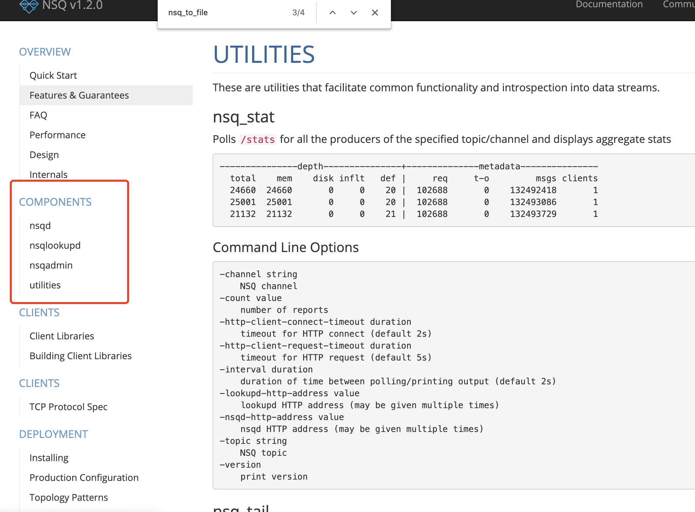
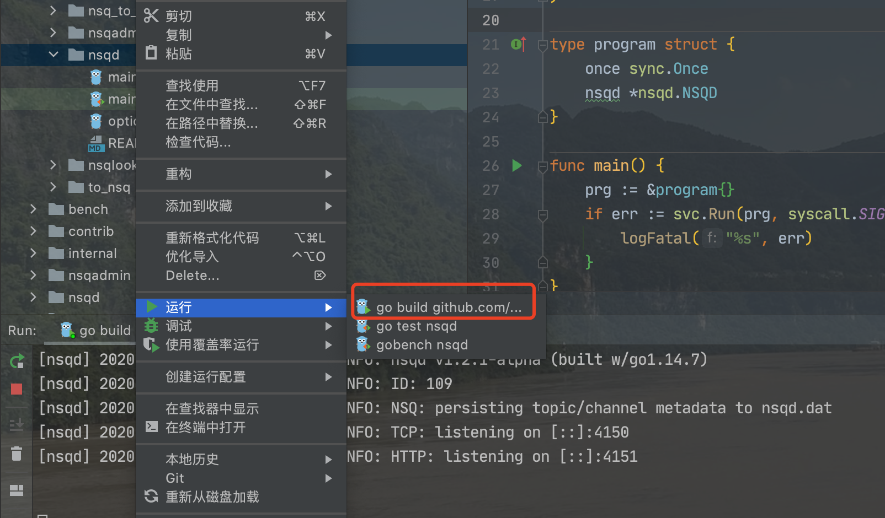
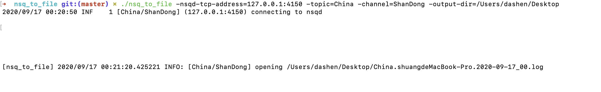
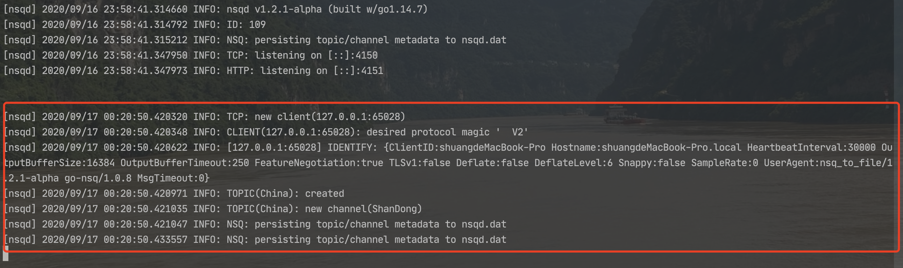
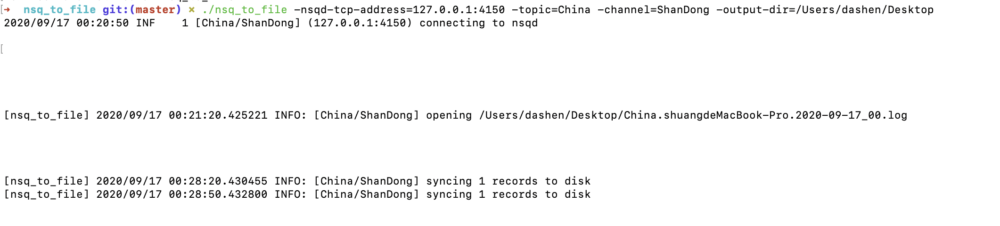

<br>


[通过NSQ消息队列来学习GO语言](https://www.bilibili.com/video/BV1hE411d7c8)

[nsq项目地址](https://github.com/nsqio/nsq.git)


<br>


```java
➜  source big             
 16M	./nsq
 16M	.
➜  source 
➜  source cd nsq   
➜  nsq git:(master) ✗ 
➜  nsq git:(master) ✗ big  
 28K	./bench
100K	./nsqlookupd
188K	./internal
2.1M	./nsqadmin
 16K	./contrib
380K	./nsqd
 13M	./.git
124K	./apps
 20K	./.idea
 16M	.
➜  nsq git:(master) ✗ 
```

<br>


<details>
<summary>tree nsq:</summary>

```golang
nsq
├── AUTHORS
├── CODE_OF_CONDUCT.md
├── CONTRIBUTING.md
├── ChangeLog.md
├── Dockerfile
├── LICENSE
├── Makefile
├── README.md
├── apps
│   ├── nsq_stat
│   │   └── nsq_stat.go
│   ├── nsq_tail
│   │   └── nsq_tail.go
│   ├── nsq_to_file
│   │   ├── file_logger.go
│   │   ├── nsq_to_file.go
│   │   ├── options.go
│   │   ├── strftime.go
│   │   └── topic_discoverer.go
│   ├── nsq_to_http
│   │   ├── http.go
│   │   ├── nsq_to_http.go
│   │   └── nsq_to_http_test.go
│   ├── nsq_to_nsq
│   │   └── nsq_to_nsq.go
│   ├── nsqadmin
│   │   └── main.go
│   ├── nsqd
│   │   ├── README.md
│   │   ├── main.go
│   │   ├── main_test.go
│   │   └── options.go
│   ├── nsqlookupd
│   │   ├── README.md
│   │   └── main.go
│   └── to_nsq
│       ├── README.md
│       └── to_nsq.go
├── bench
│   ├── bench.py
│   ├── bench_channels
│   │   └── bench_channels.go
│   ├── bench_reader
│   │   └── bench_reader.go
│   ├── bench_writer
│   │   └── bench_writer.go
│   └── requirements.txt
├── bench.sh
├── contrib
│   ├── nsq.spec
│   ├── nsqadmin.cfg.example
│   ├── nsqd.cfg.example
│   └── nsqlookupd.cfg.example
├── coverage.sh
├── dist.sh
├── fmt.sh
├── go.mod
├── go.sum
├── internal
│   ├── app
│   │   ├── float_array.go
│   │   └── string_array.go
│   ├── auth
│   │   └── authorizations.go
│   ├── clusterinfo
│   │   ├── data.go
│   │   ├── producer_test.go
│   │   └── types.go
│   ├── dirlock
│   │   ├── dirlock.go
│   │   ├── dirlock_illumos.go
│   │   └── dirlock_windows.go
│   ├── http_api
│   │   ├── api_request.go
│   │   ├── api_response.go
│   │   ├── compress.go
│   │   ├── http_server.go
│   │   ├── req_params.go
│   │   └── topic_channel_args.go
│   ├── lg
│   │   ├── lg.go
│   │   └── lg_test.go
│   ├── pqueue
│   │   ├── pqueue.go
│   │   └── pqueue_test.go
│   ├── protocol
│   │   ├── byte_base10.go
│   │   ├── byte_base10_test.go
│   │   ├── errors.go
│   │   ├── names.go
│   │   ├── protocol.go
│   │   └── tcp_server.go
│   ├── quantile
│   │   ├── aggregate.go
│   │   └── quantile.go
│   ├── statsd
│   │   ├── client.go
│   │   └── host.go
│   ├── stringy
│   │   ├── slice.go
│   │   └── template.go
│   ├── test
│   │   ├── assertions.go
│   │   ├── fakes.go
│   │   └── logger.go
│   ├── util
│   │   ├── rand.go
│   │   ├── util_test.go
│   │   └── wait_group_wrapper.go
│   ├── version
│   │   └── binary.go
│   └── writers
│       ├── boundary_buffered_writer.go
│       └── spread_writer.go
├── nsqadmin
│   ├── README.md
│   ├── bindata.go
│   ├── context.go
│   ├── gulp
│   ├── gulpfile.js
│   ├── http.go
│   ├── http_test.go
│   ├── logger.go
│   ├── notify.go
│   ├── nsqadmin.go
│   ├── nsqadmin_test.go
│   ├── options.go
│   ├── package-lock.json
│   ├── package.json
│   ├── static
│   │   ├── css
│   │   │   ├── base.scss
│   │   │   └── bootstrap.min.css
│   │   ├── fonts
│   │   │   ├── glyphicons-halflings-regular.eot
│   │   │   ├── glyphicons-halflings-regular.svg
│   │   │   ├── glyphicons-halflings-regular.ttf
│   │   │   ├── glyphicons-halflings-regular.woff
│   │   │   └── glyphicons-halflings-regular.woff2
│   │   ├── html
│   │   │   └── index.html
│   │   ├── img
│   │   │   ├── favicon.png
│   │   │   └── nsq_blue.png
│   │   └── js
│   │       ├── app_state.js
│   │       ├── collections
│   │       │   ├── nodes.js
│   │       │   └── topics.js
│   │       ├── lib
│   │       │   ├── ajax_setup.js
│   │       │   ├── handlebars_helpers.js
│   │       │   └── pubsub.js
│   │       ├── main.js
│   │       ├── models
│   │       │   ├── channel.js
│   │       │   ├── node.js
│   │       │   └── topic.js
│   │       ├── router.js
│   │       └── views
│   │           ├── app.js
│   │           ├── base.js
│   │           ├── channel.hbs
│   │           ├── channel.js
│   │           ├── counter.hbs
│   │           ├── counter.js
│   │           ├── error.hbs
│   │           ├── header.hbs
│   │           ├── header.js
│   │           ├── lookup.hbs
│   │           ├── lookup.js
│   │           ├── node.hbs
│   │           ├── node.js
│   │           ├── nodes.hbs
│   │           ├── nodes.js
│   │           ├── spinner.hbs
│   │           ├── topic.hbs
│   │           ├── topic.js
│   │           ├── topics.hbs
│   │           ├── topics.js
│   │           └── warning.hbs
│   └── test
│       ├── ca.key
│       ├── ca.pem
│       ├── ca.srl
│       ├── cert.pem
│       ├── client.key
│       ├── client.pem
│       ├── client.req
│       ├── key.pem
│       ├── server.key
│       ├── server.pem
│       └── server.req
├── nsqd
│   ├── README.md
│   ├── backend_queue.go
│   ├── buffer_pool.go
│   ├── channel.go
│   ├── channel_test.go
│   ├── client_v2.go
│   ├── context.go
│   ├── dqname.go
│   ├── dqname_windows.go
│   ├── dummy_backend_queue.go
│   ├── guid.go
│   ├── guid_test.go
│   ├── http.go
│   ├── http_test.go
│   ├── in_flight_pqueue.go
│   ├── in_flight_pqueue_test.go
│   ├── logger.go
│   ├── lookup.go
│   ├── lookup_peer.go
│   ├── message.go
│   ├── nsqd.go
│   ├── nsqd_test.go
│   ├── options.go
│   ├── protocol_v2.go
│   ├── protocol_v2_test.go
│   ├── stats.go
│   ├── stats_test.go
│   ├── statsd.go
│   ├── tcp.go
│   ├── test
│   │   ├── cert.sh
│   │   ├── certs
│   │   │   ├── ca.key
│   │   │   ├── ca.pem
│   │   │   ├── ca.srl
│   │   │   ├── cert.pem
│   │   │   ├── client.key
│   │   │   ├── client.pem
│   │   │   ├── client.req
│   │   │   ├── key.pem
│   │   │   ├── server.key
│   │   │   ├── server.pem
│   │   │   └── server.req
│   │   └── openssl.conf
│   ├── topic.go
│   └── topic_test.go
├── nsqlookupd
│   ├── README.md
│   ├── client_v1.go
│   ├── context.go
│   ├── http.go
│   ├── http_test.go
│   ├── logger.go
│   ├── lookup_protocol_v1.go
│   ├── lookup_protocol_v1_test.go
│   ├── nsqlookupd.go
│   ├── nsqlookupd_test.go
│   ├── options.go
│   ├── registration_db.go
│   ├── registration_db_test.go
│   └── tcp.go
├── test.sh
└── travis.sh

47 directories, 210 files
```
</details>

---

<br>


在app目录下, `nsqd`(目录下的main.go)是nsq的主入口文件,  `nsqadmin`和`nsqlookupd`是两个辅助(管理/监控)组件,另外几个也是辅助类的工具

[官方文档](https://nsq.io/overview/quick_start.html)

[UTILITIES-实用工具](https://nsq.io/components/utilities.html#nsq_to_file)




`internal`目录下是公用的代码

<br>


### 启动/运行

<br>





也可直接在 **nsq/apps/nsqd** 下执行
`go build .`,而后运行编译出的二进制文件

此时,绑定4150端口来监听TCPnsq绑定了4151端口监听HTTP请求.

<br>


切换到**nsq/apps/nsq_to_file**目录下,运行`go build .`, 


> tree ./  
```shell
./
├── file_logger.go
├── nsq_to_file
├── nsq_to_file.go
├── options.go
├── strftime.go
└── topic_discoverer.go
```

执行 ` ./nsq_to_file -nsqd-tcp-address=127.0.0.1:4150 -topic=China -channel=ShanDong -output-dir=/Users/dashen/Desktop
`







<br>

此时在指定的文件路径(此处为桌面)就多了一个`China.shuangdeMacBook-Pro.2020-09-17_00.log`, 但内容为空.

<br>


在命令行执行 `curl -d "I come from ShanDong Province" http://127.0.0.1:4151/pub?topic=China`,

此时再看日志文件,就有了内容: *I come from ShanDong Province*


<font size=1>注: 一个topic下可能有多个channel. 

发送消息是到topic,所有订阅都是到channel

当发送一条消息到topic, 它下面的每个channel都能收到该消息.

而对于某个channel下面的多个客户端,只能有(随机的)其中一个可以收到消息

</font>





<br>

---

<br>


### 源码阅读

<br>

引入[spew](github.com/davecgh/go-spew/spew)包, 添加辅助代码如下:

```go
func (p *program) Init(env svc.Environment) error {

	spew.Dump("env.IsWindowsService is:", env.IsWindowsService)
	if env.IsWindowsService() || 1 == 1 {
		dir := filepath.Dir(os.Args[0])
		fmt.Println("dir 是:", dir)

		fmt.Println("os.Chdir(dir) 是:", os.Chdir(dir))

		return os.Chdir(dir)
	}
	return nil
}
```

执行`go build .`,而后运行得到的二进制文件,

在Mac上,执行结果为:

```java
(string) (len=24) "env.IsWindowsService is:"
(func() bool) 0x1419e50
dir 是: .
os.Chdir(dir) 是: <nil>
[nsqd] 2020/09/17 21:24:45.547745 INFO: nsqd v1.2.1-alpha (built w/go1.14.7)
[nsqd] 2020/09/17 21:24:45.547905 INFO: ID: 109
[nsqd] 2020/09/17 21:24:45.548293 INFO: NSQ: persisting topic/channel metadata to nsqd.dat
[nsqd] 2020/09/17 21:24:45.580097 INFO: TCP: listening on [::]:4150
[nsqd] 2020/09/17 21:24:45.580168 INFO: HTTP: listening on [::]:4151
```


<br>


**nsq/nsqd/nsqd.go**

```go
type program struct {
	once sync.Once
	nsqd *nsqd.NSQD
}

func (p *program) Start() error {
	//...省略
	go func() {
		err := p.nsqd.Main()
		if err != nil {
			p.Stop()
			os.Exit(1)
		}
	}()

	return nil
}

func (p *program) Stop() error {
	p.once.Do(func() {
		p.nsqd.Exit()
	})
	return nil
}

```


实现了单例,保证只"运行一次".

结构体的组合,用的非常标准


<br>

```go
type NSQD struct {
	// 64bit atomic vars need to be first for proper alignment on 32bit platforms
	clientIDSequence int64

	sync.RWMutex

	opts atomic.Value

	dl        *dirlock.DirLock
	isLoading int32
	errValue  atomic.Value
	startTime time.Time

	topicMap map[string]*Topic

	clientLock sync.RWMutex
	clients    map[int64]Client

	lookupPeers atomic.Value

	tcpServer     *tcpServer
	tcpListener   net.Listener
	httpListener  net.Listener
	httpsListener net.Listener
	tlsConfig     *tls.Config

	poolSize int

	notifyChan           chan interface{}
	optsNotificationChan chan struct{}
	exitChan             chan int
	waitGroup            util.WaitGroupWrapper

	ci *clusterinfo.ClusterInfo
}
```

<br>


---


<br>


**nsq/nsqd/nsqd.go**
```go
type NSQD struct {
   //...
	waitGroup            util.WaitGroupWrapper

	ci *clusterinfo.ClusterInfo
}
```


<br>


**nsq/internal/util/wait_group_wrapper.go**
```go
package util

import (
	"sync"
)

type WaitGroupWrapper struct {
	sync.WaitGroup
}

func (w *WaitGroupWrapper) Wrap(cb func()) {
	w.Add(1)
	go func() {
		cb()
		w.Done()
	}()
}
```

只是做了一层封装

<br>


不同于slice, 对于map和channel,必须make之后才算初始化,才可以正常使用


```go
type meta struct {
	Topics []struct {
		Name     string `json:"name"`
		Paused   bool   `json:"paused"`
		Channels []struct {
			Name   string `json:"name"`
			Paused bool   `json:"paused"`
		} `json:"channels"`
	} `json:"topics"`
}
```


nsq的http服务,使用了httprouter这个包做路由分发


<br>

---

