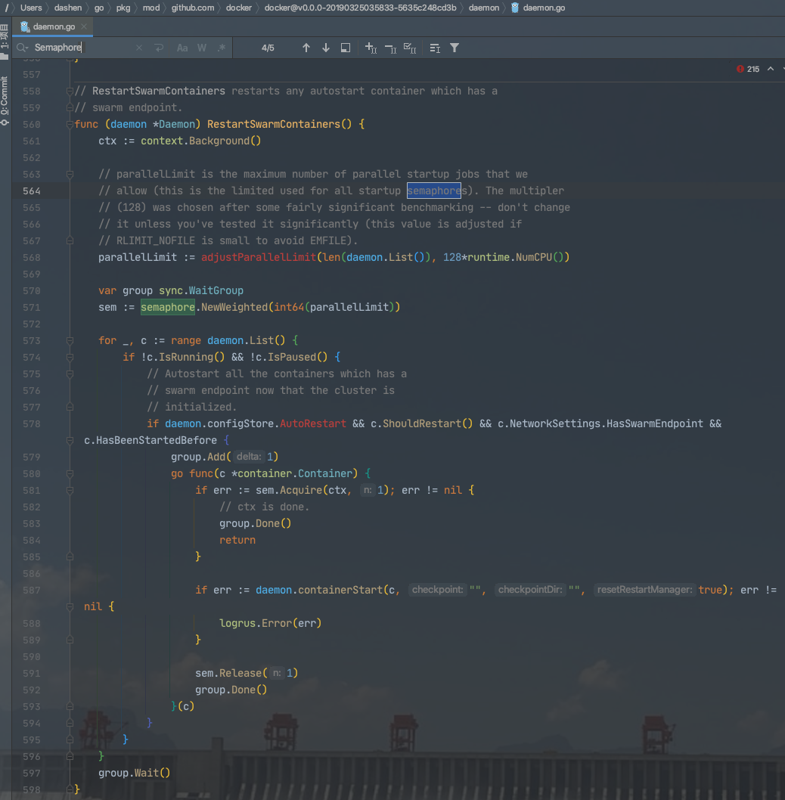
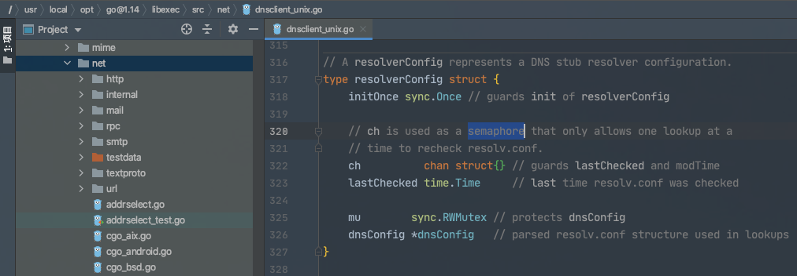
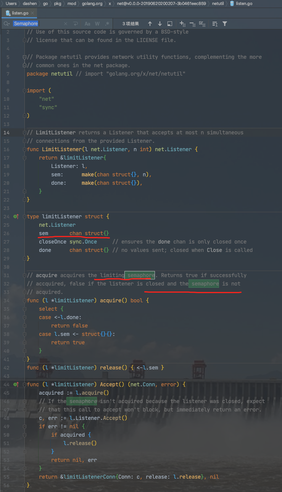
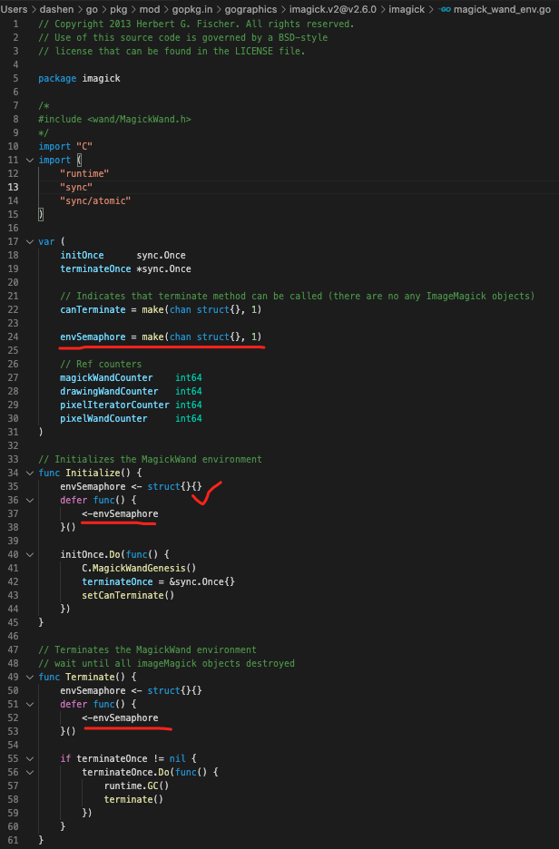

### <font color="#CD853F">初入门径</font>


<br>

[Java中有*Semaphore*类](https://mp.weixin.qq.com/s/tuPdicQwDxmliKxdsC6NgQ),用来限制访问特定资源的并发线程的数量.相对于内置锁*synchronized*和重入锁*ReentrantLock*的互斥性来说,**Semaphore**可以允许多个线程同时访问共享资源


参考自 [Go 并发编程-信号量的使用方法和其实现原理](https://mp.weixin.qq.com/s/Pc9iWLvW7kfP-19QnaYYVA)


> 信号量的概念由 [Dijkstra](https://dashen.tech/2020/05/07/%E5%A4%A9%E7%A5%9E%E8%8D%9F%E8%90%83/#Dijkstra) 提出,广泛应用在不同的操作系统中。系统会给每一个进程一个信号量,代表每个进程当前的状态,未得到控制权的进程,会在特定的地方被迫停下来,等待可以继续进行的信号到来。

[PV操作](https://dashen.tech/2018/09/01/PV%E6%93%8D%E4%BD%9C/)


> 一般用信号量来保护一组资源, 如数据库连接池、一组客户端的连接等等。每次获取资源时,都会将信号量中的计数器减去对应的数值,在释放资源时重新加回来。当遇到信号量资源不够时,尝试获取的线程就会进入休眠,等待其他线程释放归还信号量。如果信号量是只有0和1的二进位信号量,那么其 `P/V` 就和互斥锁的 `Lock/Unlock` 一样了。


<br>

Go 内部使用信号量来控制goroutine的阻塞和唤醒,如互斥锁`sync.Mutex`结构体的第二个字段,就是一个信号量:

```go
type Mutex struct {
    state int32
    sema  uint32
}
```

<br>

信号量的PV操作在Go内部是通过下面这几个底层函数实现的. 这几个函数都仅供Go语言内部调用,不能在编程时直接使用。


```go
func runtime_Semacquire(s *uint32)
func runtime_SemacquireMutex(s *uint32, lifo bool, skipframes int)
func runtime_Semrelease(s *uint32, handoff bool, skipframes int)
```

更多可参考 [sync包-Mutex](https://dashen.tech/2019/05/08/sync%E5%8C%85-Mutex/)


不过Go的 扩展并发原语包 中提供了带权重的信号量 `semaphore.Weighted`

<br>


### <font color="#CD853F">使用场景</font>

<br>


在实际开发中,当需要**控制访问资源的线程数量**时,就会需要信号量.

假设有一组要抓取的网站, 资源有限,最多允许同时执行三个抓取任务. 当同时有三个抓取任务在执行时,在执行完一个抓取任务后才能执行下一个排队等待的任务. 

这个问题用Channel也能解决,在此使用Go提供的信号量原语来解决该问题：

```go
package main

import (
	"context"
	"fmt"
	"sync"
	"time"

	"golang.org/x/sync/semaphore"
)

func doSomething(u string) { // 模拟抓取任务的执行
	fmt.Printf("开始抓取%s网站\n", u)
	time.Sleep(5 * time.Second)
}

const (
	Limit  = 3 // 同時并行运行的goroutine上限
	Weight = 1 // 每个goroutine获取信号量资源的权重
)

func main() {
	urls := []string{
		"http://www.apple.com",
		"http://www.baidu.net",
		"http://www.c.com",
		"http://www.d.com",
		"http://www.ebay.com",
	}
	s := semaphore.NewWeighted(Limit)
	var w sync.WaitGroup

	for _, u := range urls {

        //for的速度远远快过起协程,所以到这里并往下执行时,可能是5个字符串元素时间差不多
		w.Add(1)
		
		go func(u string) {
			s.Acquire(context.Background(), Weight)
			doSomething(u)
			s.Release(Weight)
			w.Done()
		}(u)
		
	}
	w.Wait()

	fmt.Println("All Done")
}
```

输出为:

```go
开始抓取http://www.ebay.com网站
开始抓取http://www.c.com网站
开始抓取http://www.apple.com网站

(等待5s后)
开始抓取http://www.baidu.net网站
开始抓取http://www.d.com网站
All Done
```

<br>


---


<br>


### <font color="#CD853F">源码实现</font>

<br>

源码行数不多,加上注释一共136行.

<br>

<details>

<summary>点击查看 golang.org/x/sync/semaphore/semaphore.go源码:</summary>

```go
// Copyright 2017 The Go Authors. All rights reserved.
// Use of this source code is governed by a BSD-style
// license that can be found in the LICENSE file.

// Package semaphore provides a weighted semaphore implementation.
package semaphore // import "golang.org/x/sync/semaphore"

import (
	"container/list"
	"context"
	"sync"
)


// 如果调用者请求不到信号量的资源就会被加入等待者列表里
type waiter struct {
	n     int64  // 调用者请求的资源数

    // ready通道会在调用者可以被重新唤醒的时候被close掉,从而起到通知正在阻塞读取ready通道的等待者的作用
	ready chan<- struct{} // Closed when semaphore acquired. // 当调用者可以获取到信号量资源时, close这个chan
}

// NewWeighted creates a new weighted semaphore with the given
// maximum combined weight for concurrent access.
func NewWeighted(n int64) *Weighted {
	w := &Weighted{size: n}
	return w
}

// Weighted provides a way to bound concurrent access to a resource.
// The callers can request access with a given weight.
type Weighted struct {
	size    int64  // 字段用来记录信号量拥有的最大资源数
	cur     int64  // 标识当前已被使用的资源数
	mu      sync.Mutex  // 互斥锁,用来提供对其他字段的临界区保护
	waiters list.List  // 表示申请资源时由于可使用资源不够而陷入阻塞等待的调用者列表
}

// Acquire acquires the semaphore with a weight of n, blocking until resources
// are available or ctx is done. On success, returns nil. On failure, returns
// ctx.Err() and leaves the semaphore unchanged.
//
// If ctx is already done, Acquire may still succeed without blocking.

// Acquire方法会监控资源是否可用,且还会检测传递进来的context.Context对象是否发送了超时过期或者取消的信号
func (s *Weighted) Acquire(ctx context.Context, n int64) error {
	s.mu.Lock()

    // 如果恰好有足够的资源,也没有排队等待获取资源的goroutine,则将cur加上n后直接返回
	if s.size-s.cur >= n && s.waiters.Len() == 0 {
		s.cur += n
		s.mu.Unlock()
		return nil
	}

    // 请求的资源数 > 能提供的最大资源数, 则该任务处理不了,走错误处理逻辑
	if n > s.size {
		// Don't make other Acquire calls block on one that's doomed to fail.
		s.mu.Unlock()
        // 依赖ctx的状态返回,否则一直等待
		<-ctx.Done()
		return ctx.Err()
	}

    // 现存资源不够, 需要把调用者加入到等待队列中
    // 创建了一个ready chan,以便被通知唤醒
	ready := make(chan struct{})
    //如果调用者请求不到信号量的资源就会被加入等待者列表里
	w := waiter{n: n, ready: ready}
	elem := s.waiters.PushBack(w)
	s.mu.Unlock()


     // 等待
	select {
	case <-ctx.Done():  // context的Done被关闭
		err := ctx.Err()
		s.mu.Lock()
		select {
		case <-ready: // 如果被唤醒了,则忽略ctx的状态
			// Acquired the semaphore after we were canceled.  Rather than trying to
			// fix up the queue, just pretend we didn't notice the cancelation.
			err = nil
		default: // 通知waiter
			isFront := s.waiters.Front() == elem
			s.waiters.Remove(elem)
			// If we're at the front and there're extra tokens left, notify other waiters.
            // 通知其它的waiters,检查是否有足够的资源
			if isFront && s.size > s.cur {
				s.notifyWaiters()
			}
		}
		s.mu.Unlock()
		return err

	case <-ready: // 等待者被唤醒
		return nil
	}
}

// TryAcquire acquires the semaphore with a weight of n without blocking.
// On success, returns true. On failure, returns false and leaves the semaphore unchanged.
func (s *Weighted) TryAcquire(n int64) bool {
	s.mu.Lock()
	success := s.size-s.cur >= n && s.waiters.Len() == 0
	if success {
		s.cur += n
	}
	s.mu.Unlock()
	return success
}


// Release releases the semaphore with a weight of n.
//Release方法很简单, 它将当前计数值减去释放的资源数 n, 并调用notifyWaiters方法,尝试唤醒等待队列中的调用者,看是否有足够的资源被获取
func (s *Weighted) Release(n int64) {
	s.mu.Lock()
	s.cur -= n
	if s.cur < 0 {
		s.mu.Unlock()
		panic("semaphore: released more than held")
	}
	s.notifyWaiters()
	s.mu.Unlock()
}


// notifyWaiters方法 会逐个检查队列里等待的调用者,如果现存资源 够等待者请求的数量n,或者是没有等待者了,就返回
func (s *Weighted) notifyWaiters() {
	for {
		next := s.waiters.Front()
		if next == nil {
			break // No more waiters blocked. // 没有等待者了,直接返回
		}

		w := next.Value.(waiter)
		if s.size-s.cur < w.n {
            // 如果现有资源不够队列头调用者请求的资源数,就退出所有等待者会继续等待
            // 这里还是按照先入先出的方式处理是为了避免饥饿

			// Not enough tokens for the next waiter.  We could keep going (to try to
			// find a waiter with a smaller request), but under load that could cause
			// starvation for large requests; instead, we leave all remaining waiters
			// blocked.
			//
			// Consider a semaphore used as a read-write lock, with N tokens, N
			// readers, and one writer.  Each reader can Acquire(1) to obtain a read
			// lock.  The writer can Acquire(N) to obtain a write lock, excluding all
			// of the readers.  If we allow the readers to jump ahead in the queue,
			// the writer will starve — there is always one token available for every
			// reader.
			break
		}

		s.cur += w.n
		s.waiters.Remove(next)
		close(w.ready)
	}
}
// notifyWaiters方法 是按照先入先出的方式唤醒调用者。当释放 100 个资源时，如果第一个等待者需要 101 个资源，那么，队列中的所有等待者都会继续等待，即使队列后面有的等待者只需要 1 个资源。这样做的目的是避免饥饿，否则的话，资源可能总是被那些请求资源数小的调用者获取，这样一来，请求资源数巨大的调用者，就没有机会获得资源了。


```

</details>


<br>


---

<br>


###  <font color="#CD853F">注意事项</font>

<br>

Go语言中使用到信号量的场景,一般会被**channel**所取代，因为一个`buffered chan`(带缓冲的channel)也可以代表 n 个资源.`semaphore.Weight`其实实际使用得不多,但如果用到需要注意:


- `Acquire`和 `TryAcquire`方法都可以用于获取资源,前者会**阻塞**的获取信号量,后者会**非阻塞**的获取信号量,如果获取不到就返回false

- `Release`归还信号量后,会以**先进先出**的顺序唤醒等待队列中的调用者.如果现有资源不够处于等待队列前面的调用者请求的资源数,所有等待者会继续等待。

- 如果一个goroutine申请较多的资源,由于上面说的归还后唤醒等待者的策略,它可能会等待比较长的时间。


<br>

---

<br>


### <font color="#CD853F">官方库或知名项目中的使用</font>

<br>


在[docker项目](https://github.com/moby/moby/blob/master/daemon/daemon.go)中有使用:




<br>


而在大多数项目中,都用**channel**来替代**semaphore.Weight**作为信号量,

如Go的官方库`net`:




<br>

如`golang.org/x/net/netutil/listen.go`:



<br>

如[go/pkg/mod/gopkg.in/gographics/imagick.v2@v2.6.0/imagick/magick_wand_env.go](https://github.com/gographics/imagick/tree/v2.6.0):





<br>

[这里](https://github.com/siddontang/go/blob/master/sync2/semaphore.go)有另一种实现