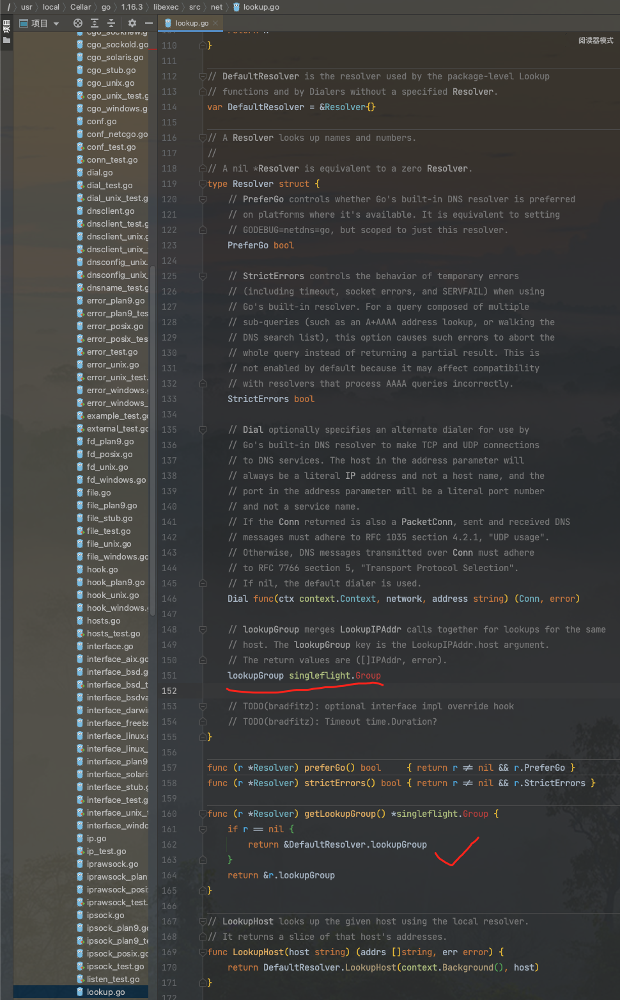
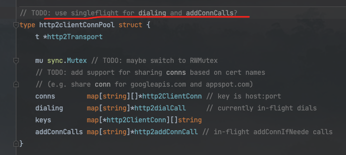
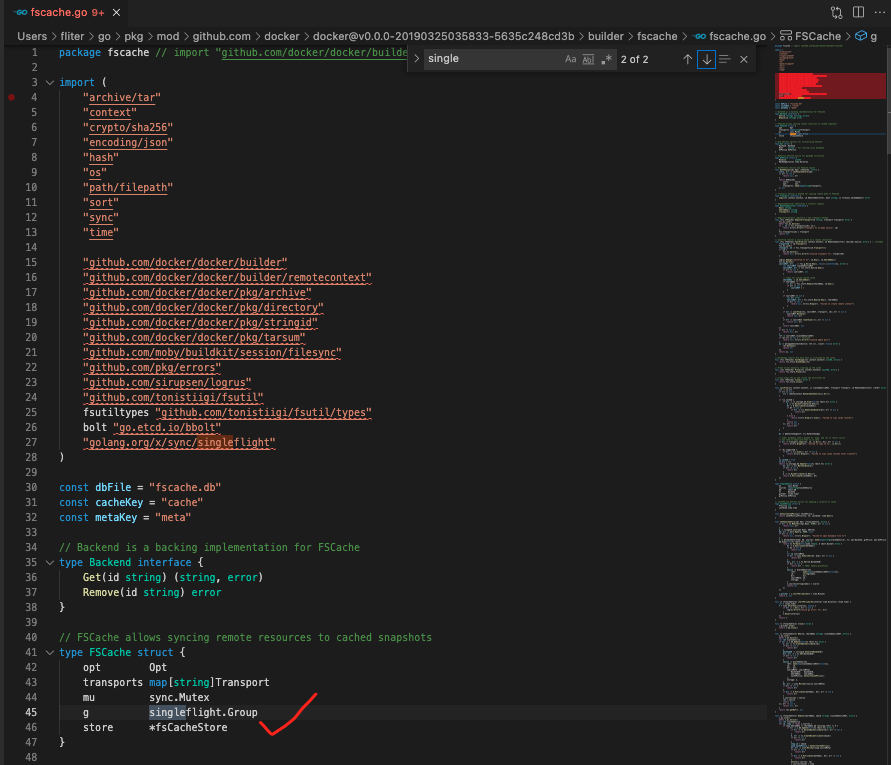

### <font color="#CD853F">初入门径</font>


<br>

`Package singleflight provides a duplicate function call suppression mechanism.`

<font size=1>singleflight包提供了一种抑制重复函数调用的机制</font>


<br>


在处理多个goroutine同时调用同一函数时,*SingleFlight*可以只让一个goroutine去实际调用该函数,等到这个goroutine返回结果时,再将结果返回给其他几个同时调用该函数的goroutine.

这样可以减少并发调用的数量,减少对下游服务的并发重复请求,比较常见的使用场景是用来防止[缓存击穿](https://blog.csdn.net/kongtiao5/article/details/82771694)


<br>

---


<br>


### <font color="#CD853F">使用场景</font>

<br>

**缓存击穿**

<br>

如在双11时,维护有一个全局的活动是否结束的key,由运营配置,5分钟过期,重新从数据库里取.

当这个 Key 正好过期失效时, 大量请求会打到数据库上(即缓存击穿).


而用 **SingleFlight** 来解决**缓存击穿**问题再合适不过. 只需要只允许这些对同一个 Key 的并发请求中的一个能到数据库中查询,而后这些并发的请求可以共享该结果.

<br>


```go
package main

import (
	"errors"
	"fmt"
	"golang.org/x/sync/singleflight"
	"log"
	"sync"
)

var errorNotExist = errors.New("not exist")

func main() {
	var wg sync.WaitGroup
	wg.Add(10)

	//模拟10个并发
	for i := 0; i < 10; i++ {
		go func() {
			defer wg.Done()
			data, err := getData("key")
			if err != nil {
				fmt.Print(err)
				return
			}
			fmt.Println(data)
			fmt.Println("---------")
		}()
	}
	wg.Wait()
}

var g singleflight.Group

//获取数据
func getData(key string) (string, error) {
	data, err := getDataFromCache(key)
	if err == errorNotExist {
		//模拟从db中获取数据
		data, err = getDataFromDB(key)
		if err != nil {
			log.Println(err)
			return "", err
		}

		//TOOD: set cache
	} else if err != nil {
		return "", err
	}
	return data, nil
}

//模拟从cache中获取值，cache中无该值
func getDataFromCache(key string) (string, error) {
	return "", errorNotExist
}

//模拟从数据库中获取值
func getDataFromDB(key string) (string, error) {
	fmt.Printf("get %s from database\n", key)
	return "数据库中的数据", nil
}

```


执行结果为:

```go
get key from database
数据库中的数据
get key from database
get key from database
数据库中的数据
---------
get key from database
get key from database
数据库中的数据
---------
---------
数据库中的数据
get key from database
数据库中的数据
---------
get key from database
get key from database
数据库中的数据
---------
---------
数据库中的数据
---------
get key from database
数据库中的数据
---------
数据库中的数据
---------
get key from database
数据库中的数据
---------
```

<br>


可以看得到10个请求都走了db. 用singlefligth 包优化一下 *getData*：


```go
//获取数据
func getData(key string) (string, error) {
	data, err := getDataFromCache(key)
	if err == errorNotExist {
		//模拟从db中获取数据
		v, err, _ := g.Do(key, func() (interface{}, error) {
			return getDataFromDB(key)
			//set cache
		})
		if err != nil {
			log.Println(err)
			return "", err
		}

		//TOOD: set cache
		data = v.(string)
	} else if err != nil {
		return "", err
	}
	return data, nil
}
```

执行结果为:

```go
get key from database
数据库中的数据
---------
数据库中的数据
---------
数据库中的数据
---------
数据库中的数据
---------
数据库中的数据
---------
数据库中的数据
---------
数据库中的数据
---------
数据库中的数据
---------
数据库中的数据
---------
数据库中的数据
---------
```

<br>


可以看得到只有一个请求走到了db,且其他请求也返回了正确的值. 从而可以大大降低DB的压力

<br>


---


<br>


### <font color="#CD853F">源码实现</font>

<br>


源码行数不多,加上注释一共212行.

<br>

<details>

<summary>点击查看 golang.org/x/sync/semaphore/semaphore.go源码:</summary>

```go
// Copyright 2013 The Go Authors. All rights reserved.
// Use of this source code is governed by a BSD-style
// license that can be found in the LICENSE file.

// Package singleflight provides a duplicate function call suppression
// mechanism.
package singleflight // import "golang.org/x/sync/singleflight"

import (
	"bytes"
	"errors"
	"fmt"
	"runtime"
	"runtime/debug"
	"sync"
)

// errGoexit indicates the runtime.Goexit was called in
// the user given function.
var errGoexit = errors.New("runtime.Goexit was called")

// A panicError is an arbitrary value recovered from a panic
// with the stack trace during the execution of given function.
type panicError struct {
	value interface{}
	stack []byte
}

// Error implements error interface.
func (p *panicError) Error() string {
	return fmt.Sprintf("%v\n\n%s", p.value, p.stack)
}

func newPanicError(v interface{}) error {
	stack := debug.Stack()

	// The first line of the stack trace is of the form "goroutine N [status]:"
	// but by the time the panic reaches Do the goroutine may no longer exist
	// and its status will have changed. Trim out the misleading line.
	if line := bytes.IndexByte(stack[:], '\n'); line >= 0 {
		stack = stack[line+1:]
	}
	return &panicError{value: v, stack: stack}
}

// call is an in-flight or completed singleflight.Do call
type call struct {
	wg sync.WaitGroup

	// These fields are written once before the WaitGroup is done
	// and are only read after the WaitGroup is done.
	// 函数的返回值，在 wg 返回前只会写入一次
	val interface{}
	err error

	// forgotten indicates whether Forget was called with this call's key
	// while the call was still in flight.
	// 使用调用了 Forgot 方法
	forgotten bool

	// These fields are read and written with the singleflight
	// mutex held before the WaitGroup is done, and are read but
	// not written after the WaitGroup is done.
	// 统计调用次数以及返回的 channel
	dups  int
	chans []chan<- Result
}

// Group represents a class of work and forms a namespace in
// which units of work can be executed with duplicate suppression.
type Group struct {
	mu sync.Mutex       // protects m
	m  map[string]*call // lazily initialized
}

// Result holds the results of Do, so they can be passed
// on a channel.
type Result struct {
	Val    interface{}
	Err    error
	Shared bool
}

// Do executes and returns the results of the given function, making
// sure that only one execution is in-flight for a given key at a
// time. If a duplicate comes in, the duplicate caller waits for the
// original to complete and receives the same results.
// The return value shared indicates whether v was given to multiple callers.
func (g *Group) Do(key string, fn func() (interface{}, error)) (v interface{}, err error, shared bool) {
	g.mu.Lock()

	// 前面提到的懒加载
	if g.m == nil {
		g.m = make(map[string]*call)
	}

	// 会先去看 key 是否已经存在
	if c, ok := g.m[key]; ok {
		// 如果存在就会解锁
		c.dups++ // 存在相同的key, 增加计数
		g.mu.Unlock()
		// 然后等待 WaitGroup 执行完毕，只要一执行完，所有的 wait 都会被唤醒
		c.wg.Wait() //等待这个key对应的fn调用完成
		// 这里区分 panic 错误和 runtime 的错误，避免出现死锁，后面可以看到为什么这么做
		if e, ok := c.err.(*panicError); ok {
			panic(e)
		} else if c.err == errGoexit {
			runtime.Goexit()
		}
		return c.val, c.err, true // 返回fn调用的结果
	}

	// 如果没有找到这个 key 就 new call
	c := new(call)  // 不存在key, 是第一个请求, 创建一个call结构体

	// 然后调用 waitgroup 这里只有第一次调用会 add 1，其他的都会调用 wait 阻塞掉
	// 所以这要这次调用返回，所有阻塞的调用都会被唤醒
	c.wg.Add(1)
	g.m[key] = c //加入到映射表中
	g.mu.Unlock()

	// 然后调用 doCall 去执行
	g.doCall(c, key, fn) // 调用方法
	return c.val, c.err, c.dups > 0
}

// DoChan is like Do but returns a channel that will receive the
// results when they are ready.
//
// The returned channel will not be closed.
// Do chan 和 Do 类似，其实就是一个是同步等待，一个是异步返回，主要实现上:
// 如果调用 DoChan 会给 call.chans 添加一个 channel 这样等第一次调用执行完毕之后就会循环向这些 channel 写入数据
func (g *Group) DoChan(key string, fn func() (interface{}, error)) <-chan Result {
	ch := make(chan Result, 1)
	g.mu.Lock()
	if g.m == nil {
		g.m = make(map[string]*call)
	}
	if c, ok := g.m[key]; ok {
		c.dups++
		c.chans = append(c.chans, ch)
		g.mu.Unlock()
		return ch
	}
	c := &call{chans: []chan<- Result{ch}}
	c.wg.Add(1)
	g.m[key] = c
	g.mu.Unlock()

	go g.doCall(c, key, fn)

	return ch
}

// doCall handles the single call for a key.
// 这个方法的实现有意思，使用了两个 defer 巧妙的将 runtime 的错误
// 和我们传入 function 的 panic 区别开来
// 避免了由于传入的 function panic 导致的死锁
func (g *Group) doCall(c *call, key string, fn func() (interface{}, error)) {
	normalReturn := false
	recovered := false

	// use double-defer to distinguish panic from runtime.Goexit,
	// more details see https://golang.org/cl/134395
	// 第一个 defer 检查 runtime 错误
	defer func() {
		// the given function invoked runtime.Goexit
		// 如果既没有正常执行完毕，又没有 recover 那就说明需要直接退出了
		if !normalReturn && !recovered {
			c.err = errGoexit
		}

		c.wg.Done()
		g.mu.Lock()
		defer g.mu.Unlock()

		// 如果已经 forgot 过了，就不要重复删除这个 key 了
		if !c.forgotten {
			delete(g.m, key)
		}

		if e, ok := c.err.(*panicError); ok {
			// In order to prevent the waiting channels from being blocked forever,
			// needs to ensure that this panic cannot be recovered.
			// 如果返回的是 panic 错误，为了避免 channel 死锁，我们需要确保这个 panic 无法被恢复
			if len(c.chans) > 0 {
				go panic(e)
				select {} // Keep this goroutine around so that it will appear in the crash dump.
			} else {
				panic(e)
			}
		} else if c.err == errGoexit {
			// Already in the process of goexit, no need to call again
			// 已经准备退出了，也就不用做其他操作了
		} else {
			// Normal return
			// 正常情况下向 channel 写入数据
			for _, ch := range c.chans {
				ch <- Result{c.val, c.err, c.dups > 0}
			}
		}
	}()


	// 使用一个匿名函数来执行
	func() {
		defer func() {
			if !normalReturn {
				// Ideally, we would wait to take a stack trace until we've determined
				// whether this is a panic or a runtime.Goexit.
				//
				// Unfortunately, the only way we can distinguish the two is to see
				// whether the recover stopped the goroutine from terminating, and by
				// the time we know that, the part of the stack trace relevant to the
				// panic has been discarded.
				// 如果 panic 了我们就 recover 掉，然后 new 一个 panic 的错误
				// 后面在上层重新 panic
				if r := recover(); r != nil {
					c.err = newPanicError(r)
				}
			}
		}()

		// 如果 fn 没有 panic 就会执行到这一步，如果 panic 了就不会执行到这一步
		// 所以可以通过这个变量来判断是否 panic 了
		c.val, c.err = fn()
		normalReturn = true
	}()

	if !normalReturn {
		recovered = true
	}
}

// Forget tells the singleflight to forget about a key.  Future calls
// to Do for this key will call the function rather than waiting for
// an earlier call to complete.
// 用于手动释放某个 key 下次调用就不会阻塞等待了
func (g *Group) Forget(key string) {
	g.mu.Lock()
	if c, ok := g.m[key]; ok {
		c.forgotten = true
	}
	delete(g.m, key)
	g.mu.Unlock()
}

```

</details>


<br>

#### <font color="#4682B4">Do方法: </font>

<br>

> 接收一个字符串Key和一个待调用的函数,会返回调用函数的结果和错误. 使用Do方法时,会根据提供的Key判断是否去真正调用fn函数.同一个 key,在同一时间只有第一次调用Do方法时才会去执行fn函数,其他并发的请求会等待调用的执行结果.

Do方法的执行逻辑是每次调用Do方法都会先去获取互斥锁，随后判断在映射表里是否已经有Key对应的fn函数调用信息的call结构体。

当不存在时，证明是这个Key的第一次请求，那么会初始化一个call结构体指针，增加SingleFlight内部持有的sync.WaitGroup计数器到1。释放互斥锁，然后阻塞的等待doCall方法执行fn函数的返回结果
当存在时，增加call结构体内代表fn重复调用次数的计数器dups，释放互斥锁，然后使用WaitGroup等待fn函数执行完成。

<br>


call结构体的val 和 err 两个字段只会在 doCall方法中执行fn有返回结果后才赋值，所以当 doCall方法 和 WaitGroup.Wait返回时，函数调用的结果和错误会返回给Do方法的所有调用者。

doCall方法会去实际调用fn函数，因为call结构体初始化后forgotten字段的默认值是false，fn调用有返回后，会把对应的Key删掉。这样这轮请求都返回后，下一轮使用同一的Key的请求会重新调用执行一次fn函数。

<br>


#### <font color="#4682B4">DoChan方法：</font>

<br>

> 类似Do方法,只不过是异步调用.它会返回一个通道,等fn函数执行完,产生了结果后,就能从这个 chan 中接收这个结果.

它的执行逻辑和Do方法类似，唯一不同的是调用者不用阻塞等待调用的返回， DoChan方法会创建一个chan Result通道返回给调用者，调用者通过这个通道就能接受到fn函数的结果。这个chan Result通道，在返回给调用者前会先放到call结构体的维护的通知队列里，待fn函数返回结果后DoChan方法会把结果发送给通知队列中的每个通道。

<br>

#### <font color="#4682B4">Forget方法：</font>

<br>

在SingleFlight中删除一个Key. 这样一来,之后这个Key的Do方法调用会执行fn函数,而不是等待前一个未完成的fn 函数的结果.


<br>


---

<br>


###  <font color="#CD853F">注意事项</font>

<br>


- **一个阻塞，全员等待**

- **一个出错，全部出错**

<br>

即 "一荣俱荣,一损俱损"


<br>


[Go并发编程(十二) Singleflight](https://mp.weixin.qq.com/s/kMop33olY7ogs9b1he3jNw)

[Go Singleflight导致死锁问题分析](https://mp.weixin.qq.com/s/DrJKUzswOSPqFltIxHFO3A)


<br>

---

<br>


### <font color="#CD853F">官方库或知名项目中的使用</font>

<br>


项目中有大量使用,场景基本都是用于防止缓存击穿.

<br>

另外,

[net标准库里使用的lookupGroup结构](https://github.com/golang/go/blob/master/src/net/lookup.go#L151),将对相同域名的DNS记录查询合并成一个查询.

net库提供的DNS记录查询方法LookupIp, 使用lookupGroup这个SingleFlight进行合并查询的相关操作(使用的是异步查询的方法DoChan)



<br>


net库的 h2_hundle.go ,以及[golang.org/x/net/http2/client_conn_pool.go],都试图用**SingleFlight**来优化现有代码




<br>


Docker之前的某个版本,/docker/builder/fscache/fscache.go中有使用到**SingleFlight**





<br>


---

<br>

参考自:

[并发编程--用SingleFlight合并重复请求](https://mp.weixin.qq.com/s/bbxLCA6pK9TGMY4H1hGUrA)


[不到100行代码做并发控制：防缓存击穿的 singleflight 使用及原理](https://mp.weixin.qq.com/s/Fp9ueMRo-y8gTyxifJ84CQ)


[Golang中的SingleFlight与CyclicBarrier](https://mp.weixin.qq.com/s/HIVQE2fgJPw8dSoBEFsVVg)

