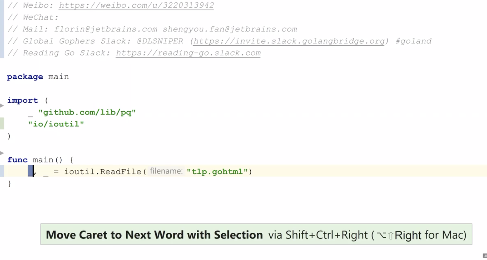

<br>


#### 1. control+tab

<br>

快速切换/选择文件

command+E,快速选择最近编辑的文件

<br>

---

#### 2.插件

<br>

插件 `Presentation Assistant`

可以显示每个快捷键操作.  如果用Win,在使用某快捷键时,可以显示在Mac上对应的快捷键; 反之亦然.


<br>

---


#### 3.F1

<br>


输入一段字符串, 当出现多个各种package里的函数, 出现好多种选择时,可以使用F1查看具体内容,会新开一个小窗口.


<br>

---


#### 4.有用更多可视空间

<br>

- 左下角的按钮,可以收起侧边栏和底边栏的各种工具

- 按两次`command+1`,收起左侧项目文件区域

- 演示模式:会全屏且使字体非常大

- 免打扰模式:会只剩下代码


<br>

---


#### 5.智能的补齐推荐

<br>

补齐推荐是按照光标所在的位置,而不是当前打出的字符

<br>

---


#### 6.`error.nn`快速打出判断是否为nil的区块

<br>

在一个error类型的变量后用
`.nn`,可以快速打出如下判别块.

```go
if error != nil {
		
    }
```

输入error.panic,会自动变为panic(err)

<br>

---


#### 7.command+R 

<br>




<br>

---


#### 8.show intention action

快捷键为`Enter`


<br>

---


#### 9.查找帮助

<br>

或者按两下 `shift`,进行(万能)搜索


<br>


---


#### 10.快速重构


<br>


选中某段代码,`control+T`,选method,会新生成一个方法,并把选中的代码移动过去..

之后修改某些变量,选择第二项,也非常有用

<br>


---


#### 11.y


<br>


选中某段代码,`control+T`,选method,会新生成一个方法,并把选中的代码移动过去..

之后修改某些变量,选择第二项,也非常有用