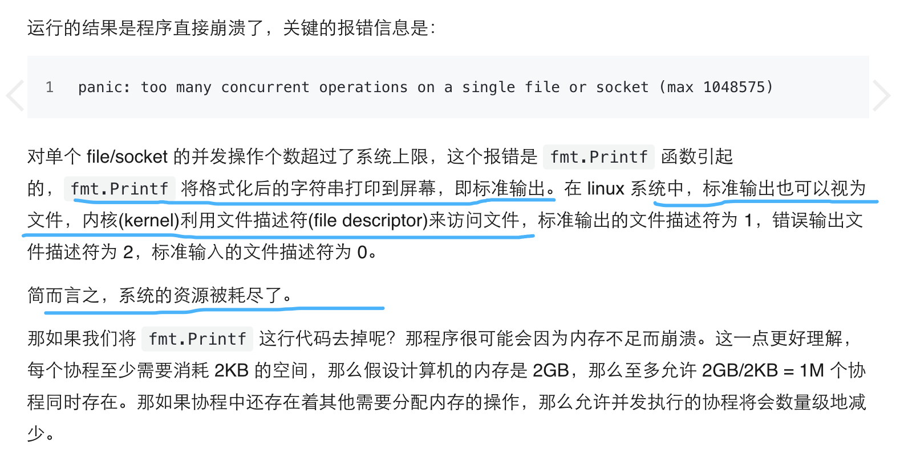

### 1.

<br>

```go
package main

import (
	"fmt"
	"golang.org/x/sync/errgroup"
)

func main() {

	var midList []int64

	for i := 0; i < 100000000; i++ {

		midList = append(midList, int64(i))
	}

	var g errgroup.Group

	i := 0
	for _, v := range midList {
		mid := v
		g.Go(func() error {

			var err error
			errG := err
			fmt.Println("mid为:", mid)
			if errG != nil {
				return errG
			}
			return nil

		})
		i++
	}

	//println("i 为:", i)

}

```

会报错 `panic: too many concurrent operations on a single file or socket (max 1048575)`

而将fmt.Println换作println,则不会有这个错误


<br>


```go
package main

import (
	"golang.org/x/sync/errgroup"
)

func main() {

	var midList []int64

	for i := 0; i < 100000000; i++ {

		midList = append(midList, int64(i))
	}

	var g errgroup.Group

	i := 0
	for _, v := range midList {
		mid := v
		g.Go(func() error {

			var err error
			errG := err
			println("mid为:", mid)
			if errG != nil {
				return errG
			}
			return nil

		})
		i++
	}

	//println("i 为:", i)

}


```





<br>


[控制协程(goroutine)的并发数量](https://geektutu.com/post/hpg-concurrency-control.html)


<br>


### 2.

<br>

使用` go build  -gcflags=-m 文件名.go`,

对于fmt.Println,因为其入参是interface,所以会发生逃逸


```go
# command-line-arguments
./文件名.go:26:15: inlining call to fmt.Println
./文件名.go:17:6: moved to heap: g
./文件名.go:22:8: func literal escapes to heap
./文件名.go:26:16: "mid为:" escapes to heap
./文件名.go:26:16: mid escapes to heap
./文件名.go:26:15: []interface {}{...} does not escape
<autogenerated>:1: .this does not escape

```


对于println,其入参是字符串,不会发生逃逸

```go
# command-line-arguments
./文件名.go:21:8: can inline main.func1
./文件名.go:16:6: moved to heap: g
./文件名.go:21:8: func literal escapes to heap

```


<br>


[golang变量逃逸分析小探](http://reusee.github.io/post/escape_analysis/)


<br>


---


<br>


### 3.

```go
package main

import (
	"fmt"
)

func main() {

	print([]byte("a"))

	fmt.Println()

	fmt.Println([]byte("a"))

}

```

输出为：

···go
[1/1]0xc00006af67
[97]
···