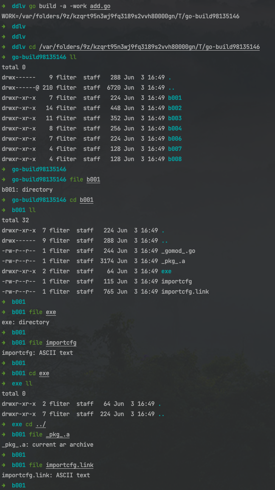

### 初入门径:

<br>

> go build [-o 输出名] [-i] [编译标记] [包名]

- `-o` output, 指定编译输出的名称,代替默认的包名
- `-i` install 安装作为目标的依赖关系的包(用于增量编译提速)
- `通用的编译标记参数`, 在`go  clean, get, install, list, run, test`命令中也可以使用
- `包名`, 可以是一个 *.go*文件. 本质上需要的是一个路径,让编译器可以找到那些需要编译的go文件.而有了packages这个参数后, `go build`就可以知道有哪些需要编译的go文件了


<br>


 

<br>


这几个都是可选参数,可以只执行`go build`


<br>

对于:

```go
 ll
total 32
drwxr-xr-x   6 fliter  staff  192 Jun  3 10:20 .
drwxr-xr-x  15 fliter  staff  480 Jun  2 21:22 ..
-rw-r--r--   1 fliter  staff  115 Jun  3 09:31 add.go
-rw-r--r--   1 fliter  staff   18 Jun  3 09:25 go.mod
-rw-r--r--   1 fliter  staff  110 Jun  3 08:52 m.go
-rw-r--r--   1 fliter  staff  166 Jun  3 08:52 sli.go
```


`go build`和`go build .`等效,都是使用当前目录编译


(如果有多个 *main*方法,则会抛错):


 


<font size=1 color="orange">

Go语言任何一个package中,都可以有唯一一个带有main方法的go文件. 也就是说,一个package下,只能有一个main方法,不管是在哪个文件中,但是只能有一个.


</font>


<br>

(将sli.go和m.go中的main方法改掉)

编译同目录的多个源码文件时,
执行`go build`,和在 `go build` 后提供多个文件名,效果一致:

 


<br>


---

<br>


### 通用的编译标记参数(即 编译时的附加参数)

<br>


附加参数      | 备注 |  
-|-|
-v | 编译时显示包名 | 
-p n| 开启并发编译，默认情况下该值为 CPU 逻辑核数 | 
-a | 强制重新构建, 强行对所有涉及到的代码包（包含标准库中的代码包）进行重新构建,即使它们已是最新的 | 
-n | 打印编译时会用到的所有命令，但不真正执行 | 
-x | 打印编译时会用到的所有命令 | 
-race | 开启竞态检测 | 
-work | 打印出编译时生成的临时工作目录的路径,并在编译结束时保留它;在默认情况下,编译结束时会删除该目录 | 


<br>


对**add.go**:

```go
package main

import "fmt"

func add(x int, y int) int {
	return x + y
}
func main() {
	fmt.Println(add(42, 13))
}
```

执行 `go build -a -v add.go` :

 


<br>

明明只用到了fmt包,为什么会多编译了这么多的代码包?

这是因为`fmt`包用到了其他基础包,且每段Go程序都要用到`runtime`包


从代码包编译的角度来说,如果代码包A依赖代码包B,则称代码包B是代码包A的依赖代码包（以下简称依赖包）,代码包A是代码包B的触发代码包（以下简称触发包）

`go build`命令在执行时, 编译器会先查找目标代码包的所有依赖包,以及这些依赖包的依赖包,直至找到最深层的依赖包为止.  在此过程中,如发现有**循环依赖**的情况,编译器就会输出错误信息并立即退出.

此过程完成后,所有依赖关系也就形成了一棵含有重复元素的依赖树. 对于依赖树中的一个节点（代码包）来说,它的直接分支节点（前者的依赖包）,是按照代码包导入路径的字典序从左到右排列的. 最左边的分支节点会最先被编译, 编译器会依此设定每个代码包的编译优先级

<br>

去掉`fmt`代码,如下:

```go
package main


func add(x int, y int) int {
	return x + y
}
func main() {
}

```
 


即便一个包也不引用,程序依然在底层用到了上面这几个包.


<br>


使用`- work`参数,打印出编译时生成的临时工作目录的路径,并在编译结束时保留它:


 


<br>


执行`go build`命令的计算机如果拥有多个逻辑CPU核心,那么编译代码包的顺序可能会存在一些不确定性. 但一定会满足这样的约束条件：依赖代码包 -> 当前代码包 -> 触发代码包

标记`-p n`可以限制编译过程中任务执行的并发数,n默认为当前计算机的CPU逻辑核数. 如果在执行`go build`命令时加入标记`-p 1`, 那么就可以保证代码包编译顺序严格按照预先设定好的优先级进行

将如上代码中的`fmt`加回,再执行`go build -a -v -p 1 add.go`


 


可以认为上图显示的代码包的顺序,就是add直接或间接依赖的代码包按照优先级从高到低排列后的排序

另外,如果在命令中加入标记`-n`,那么编译器只会输出所用到的命令而不会真正运行,在这种情况下,编译过程不会使用并发模式(即 `-p 1`)


<br>


---


<br>


### 进阶编译标记参数:

<br>

#### -asmflags

> 此标记可以后跟另外一些标记，如-D、-I、-S等。这些后跟的标记用于控制Go语言编译器编译汇编语言文件时的行为。


<br>


#### -buildmode

> 此标记用于指定编译模式，使用方式如-buildmode=default（这等同于默认情况下的设置）。此标记支持的编译模式目前有6种。借此，我们可以控制编译器在编译完成后生成静态链接库（即.a文件，也就是我们之前说的归档文件）、动态链接库（即.so文件）或/和可执行文件（在Windows下是.exe文件）。

<br>

#### -compiler

>此标记用于指定当前使用的编译器的名称。其值可以为gc或gccgo。其中，gc编译器即为Go语言自带的编辑器，而gccgo编译器则为GCC提供的Go语言编译器。而GCC则是GNU项目出品的编译器套件。GNU是一个众所周知的自由软件项目。在开源软件界不应该有人不知道它。好吧，如果你确实不知道它，赶紧去google吧。

<br>

#### -gccgoflags

> 此标记用于指定需要传递给gccgo编译器或链接器的标记的列表。


<br>


#### <font color="orange">-gcflags</font>

> **此标记用于指定需要传递给go tool compile命令的标记的列表。**


-gcflags="all=-N -l"

- -N 取消优化
- -l 取消内联
- -m 逃逸分析，打印逃逸信息

- go build -gcflags=-S fmt 仅打印fmt包的反汇编信息

- go build -gcflags=all=-S fmt' 打印fmt以及其依赖包的反汇编信息


[得到Go程序的汇编代码的方法](https://colobu.com/2018/12/29/get-assembly-output-for-go-programs/)


<br>


####  -installsuffix

>为了使当前的输出目录与默认的编译输出目录分离，可以使用这个标记。此标记的值会作为结果文件的父目录名称的后缀。其实，如果使用了-race标记，这个标记会被自动追加且其值会为race。如果我们同时使用了-race标记和-installsuffix，那么在-installsuffix标记的值的后面会再被追加_race，并以此来作为实际使用的后缀。


<br>


####  -ldflags

> 此标记用于指定需要传递给go tool link命令的标记的列表。


<br>


####  -linkshared

> 此标记用于与-buildmode=shared一同使用。后者会使作为编译目标的非main代码包都被合并到一个动态链接库文件中，而前者则会在此之上进行链接操作。


<br>


####  -pkgdir

> 使用此标记可以指定一个目录。编译器会只从该目录中加载代码包的归档文件，并会把编译可能会生成的代码包归档文件放置在该目录下。


<br>


####  -tags

> 此标记用于指定在实际编译期间需要受理的编译标签（也可被称为编译约束）的列表。这些编译标签一般会作为源码文件开始处的注释的一部分，例如，在$GOROOT/src/os/file_posix.go开始处的注释为：

```go
// Copyright 2009 The Go Authors. All rights reserved.
// Use of this source code is governed by a BSD-style
// license that can be found in the LICENSE file.

// +build darwin dragonfly freebsd linux nacl netbsd openbsd solaris windows
```

最后一行注释即包含了与编译标签有关的内容。可以查看代码包`go/build`的文档已获得更多的关于编译标签的信息。

<br>

#### -toolexec


> 此标记可以让我们去自定义在编译期间使用一些Go语言自带工具（如vet、asm等）的方式。


<br>


---

<br>

参考:

[go build](https://wiki.jikexueyuan.com/project/go-command-tutorial/0.1.html)

[go build命令详解](https://www.lsdcloud.com/go/middleware/go-build.html#_1-%E4%BD%BF%E7%94%A8)
