 

接触一个新项目, 阅读官方库或第三方package,经常使用自带的`go list`命令或用[depth](https://github.com/KyleBanks/depth)包来查看其依赖了哪写包,如:

### go list

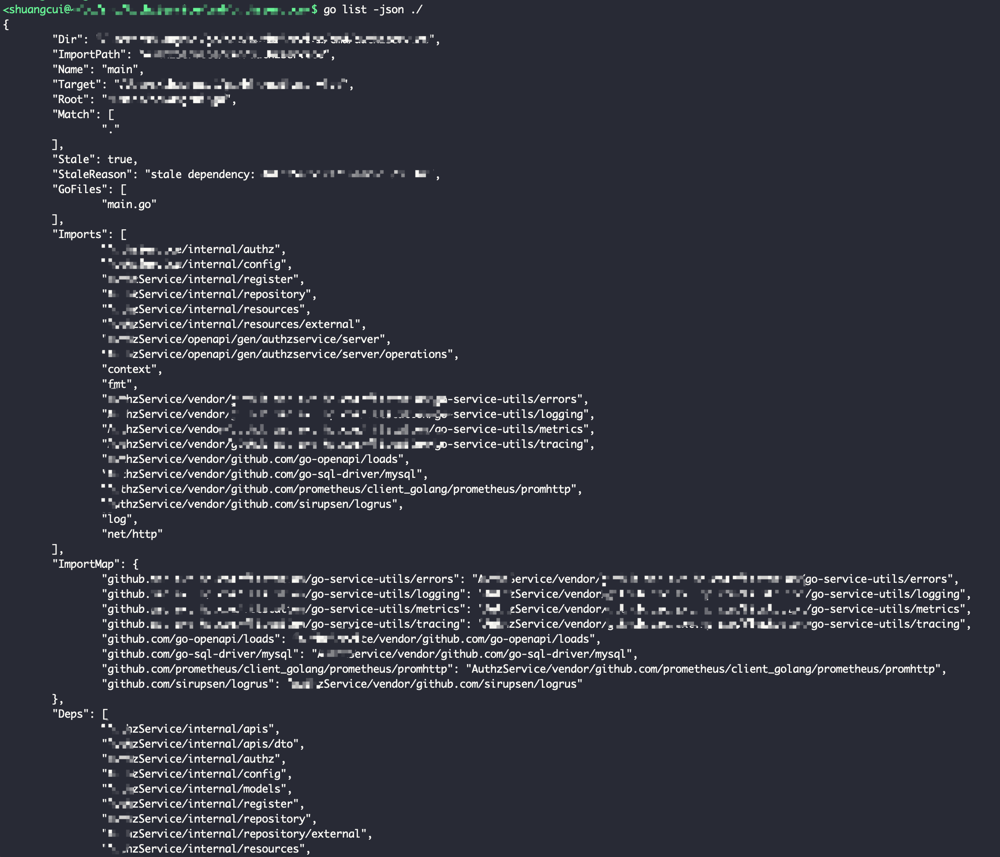

 

该命令后面的参数`./`下,必须包含`.go`文件. `./`将列出当前目录下所有.go文件的依赖,也可以指定具体某个`.go`文件,如 
`go list -json xxx.go`

该参数既可以是指定的本地路径,也可以是本地`go/src`路径下安装的某个第三方package,也可以是官方库,如:

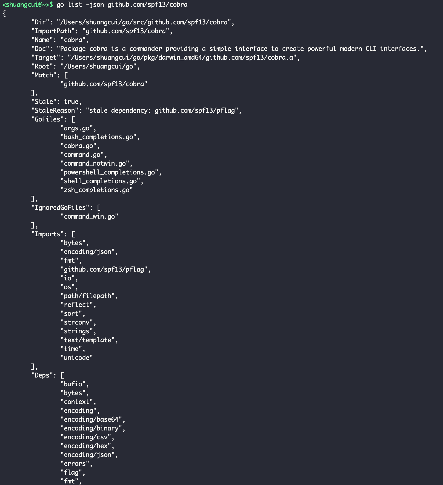

 

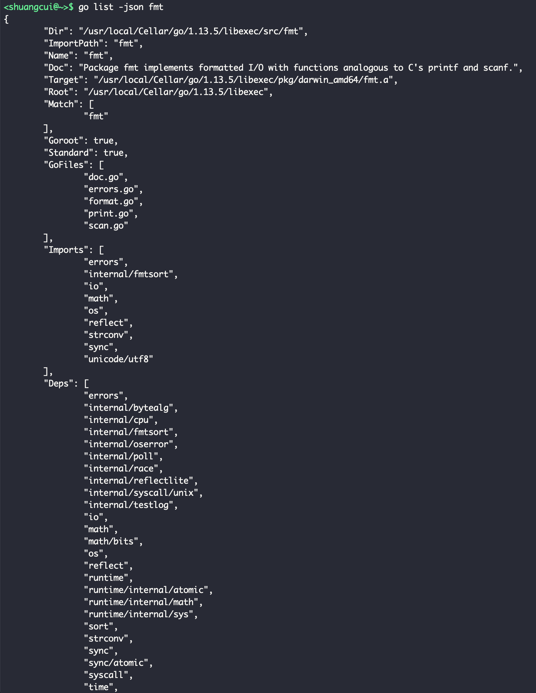

该命令无法列出github公开可访问,但本地没有的package的依赖,如:

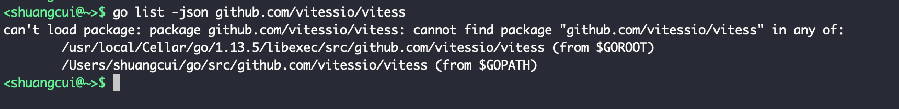

 

返回值部分字段的解释:

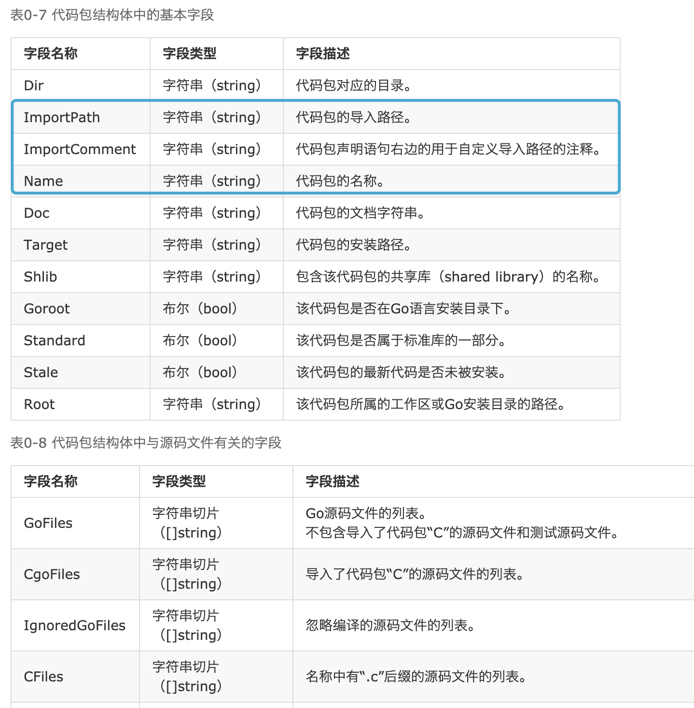

 

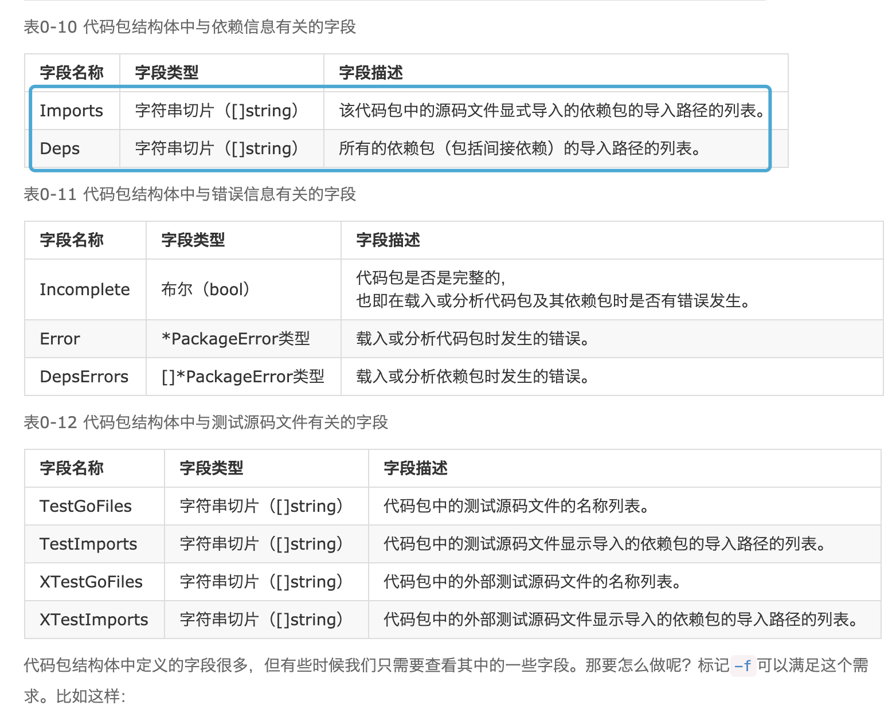

`Imports`	字符串切片（[]string）:	该代码包中的源码文件显式导入的依赖包的导入路径的列表。

`Deps`	字符串切片（[]string）:	所有的依赖包（包括间接依赖）的导入路径的列表。

只查看某个字段,可以加`-f 双花括号 .字段名 双花括号`命令 (需去掉-json参数),如:

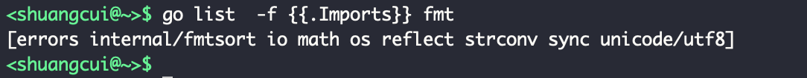

[更多参考](https://wiki.jikexueyuan.com/project/go-command-tutorial/0.8.html)

---

### depth

 
[文档及安装](https://github.com/KyleBanks/depth)

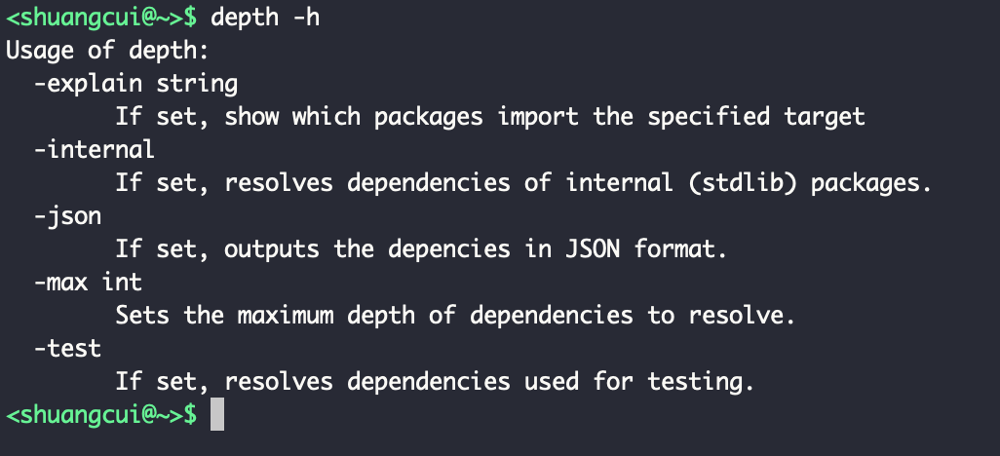

 

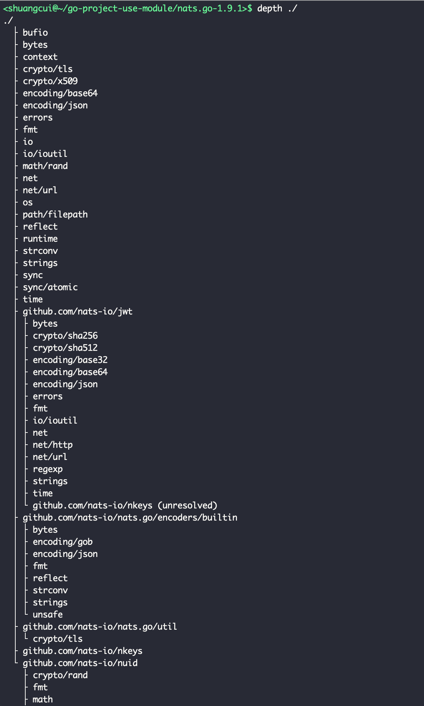

 

同样也可以查看go官方库的依赖:
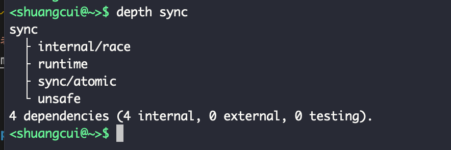

查看本地go/src路径下已有的包:

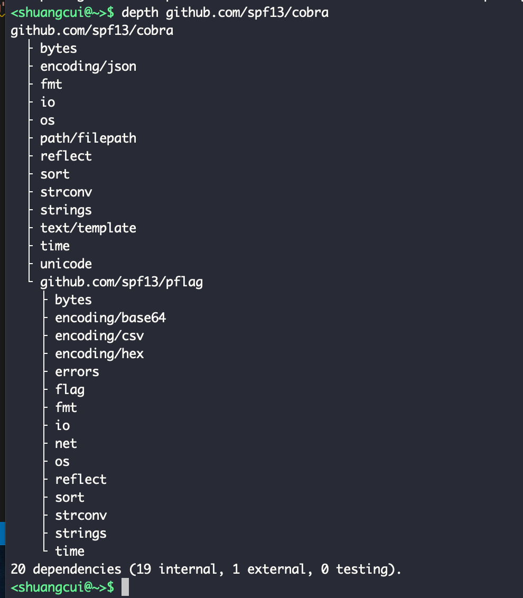

可配合其`-internal`,`-max`,`-explain target-package`,`-json`等可选参数使用.

---

 

### go-callvis

以上两个工具,都只能在命令行输出项目的依赖关系,希望能有更直观地图像方式. [go-callvis](https://github.com/TrueFurby/go-callvis)这个包,完美解决了该需求~

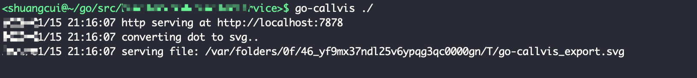

调用关系如下:

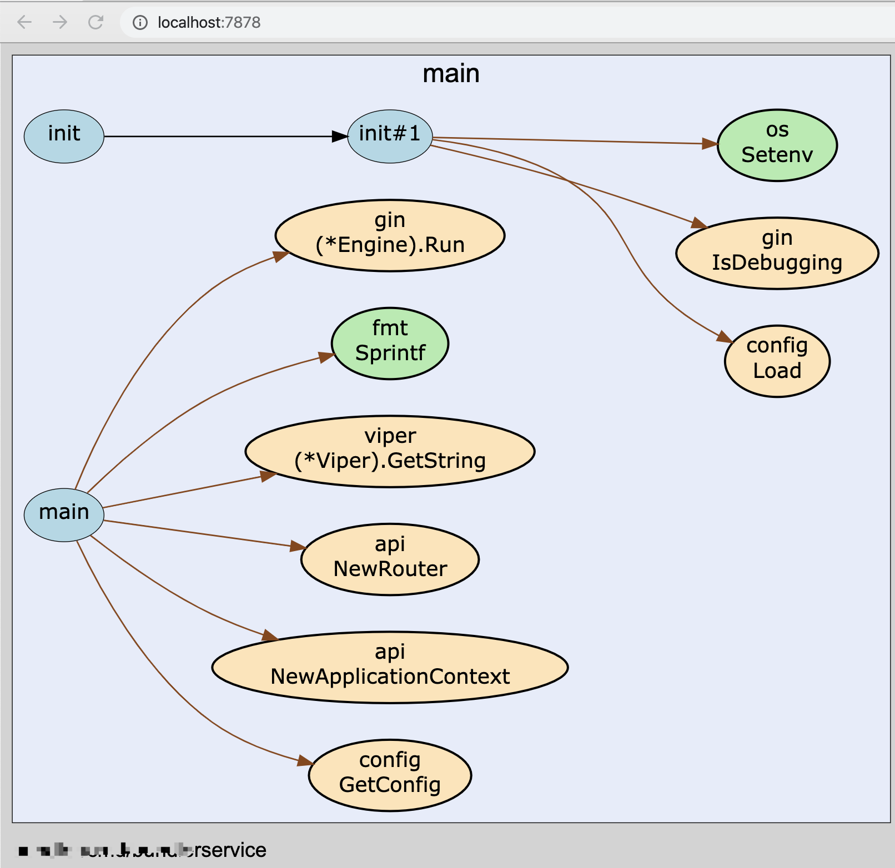

- 绿色是官方package
- 黄色是第三方package

 

美中不足是该工具要求指定目录下必须有`main.go`文件,

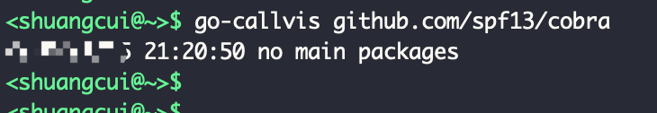

默认输出格式为svg,可以通过`-format=png`指定为需要的格式

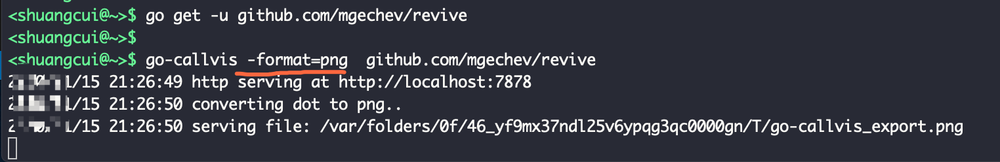

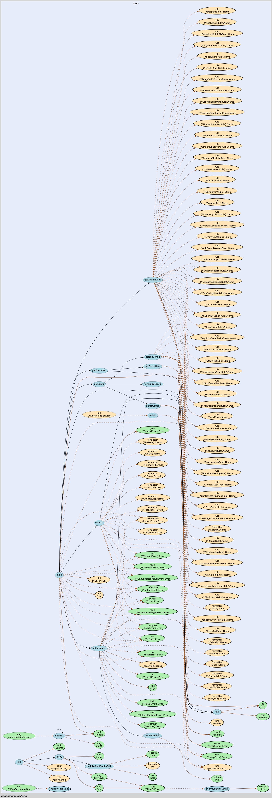