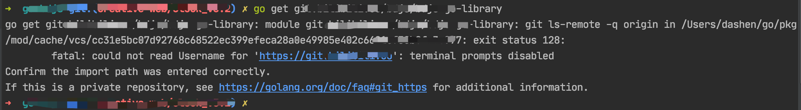
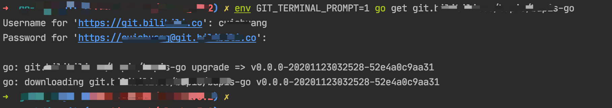

go get下载/更新 私有代码库的时, 产生以下错误,而`go get 公有代码库` 没有影响

 

`fatal: could not read Username for 'https://git.xxxxx.co': terminal prompts disabled`

 

可以执行`env GIT_TERMINAL_PROMPT=1 go get 私有仓库地址`,而后输入username和password,就可以成功获取

---

 

参考:

[go get results in 'terminal prompts disabled' error for github private repo](https://stackoverflow.com/questions/32232655/go-get-results-in-terminal-prompts-disabled-error-for-github-private-repo)
