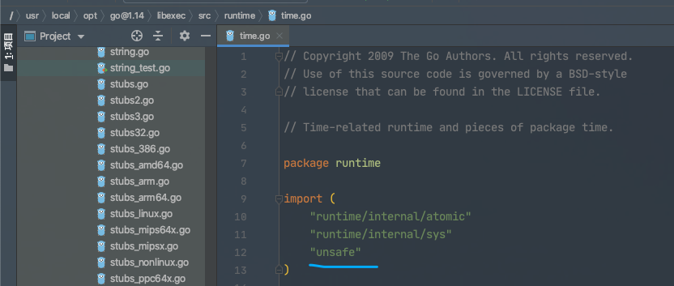
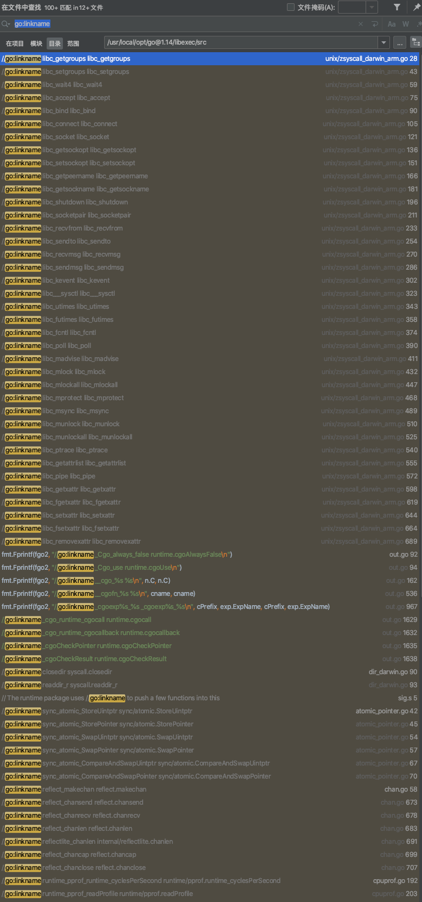

### <font color="#CD853F">初入门径</font>

<br>


查看一些官方库的源码时,经常发现找不到其具体的实现,以常用的[time.Sleep()](https://github.com/golang/go/blob/master/src/time/sleep.go)为例:

<br>

```go
// Sleep至少在持续时间d内暂停当前goroutine,
// 持续时间为负数或零会导致Sleep立即返回
// Sleep pauses the current goroutine for at least the duration d.
// A negative or zero duration causes Sleep to return immediately.
func Sleep(d Duration)
```

但该方法的实现在哪里? 寻遍**time包**,也不见*Sleep*的实现. 

其实其实现在 [runtime/time.go](https://github.com/golang/go/blob/master/src/runtime/time.go):


<br>


```go
// timeSleep puts the current goroutine to sleep for at least ns nanoseconds.
// timeSleep使当前的goroutine睡眠至少ns纳秒。
//go:linkname timeSleep time.Sleep
func timeSleep(ns int64) {
	if ns <= 0 {
		return
	}

	gp := getg()
	t := gp.timer
	if t == nil {
		t = new(timer)
		gp.timer = t
	}
	t.f = goroutineReady
	t.arg = gp
	t.nextwhen = nanotime() + ns
	gopark(resetForSleep, unsafe.Pointer(t), waitReasonSleep, traceEvGoSleep, 1)
}
```


`go:linkname`是源码中最常用的[Go指令](https://golang.org/cmd/compile/),其官方定义如下:

```go
//go:linkname localname [importpath.name]

This special directive does not apply to the Go code that follows it. Instead, the //go:linkname directive instructs the compiler to use “importpath.name” as the object file symbol name for the variable or function declared as “localname” in the source code. If the “importpath.name” argument is omitted, the directive uses the symbol's default object file symbol name and only has the effect of making the symbol accessible to other packages. Because this directive can subvert the type system and package modularity, it is only enabled in files that have imported "unsafe".
```

<br>


这个指令告诉编译器 为当前源文件中的<font color="#8B658B">私有函数或者变量</font>在编译时链接到指定的方法或变量。

因为这个指令破坏了类型系统和包的模块化,因此在使用时必须导入`unsafe`包. 

可以看到[runtime/time.go文件](https://github.com/golang/go/blob/master/src/runtime/time.go)是有导入`unsafe`包的




<br>


对于`//go:linkname localname [importpath.name]`, 这里*localname*对应`timeSleep`, *importpath.name* 对应`time.Sleep`

但为什么要这么做？


这是因为`timeSleep`在`runtime`包里,是不可导出的. 使用**go:linkname**的目的,就是让`time`包,可以调用`runtime`包中原本不可导出的方法

<br>

---

<br>

### <font color="#CD853F">Demo实验</font>

<br>


新建demo文件夹,结构如下:

```go
➜  tree

.
├── linkname
│   └── a.go
├── main.go
└── outer
    └── world.go

2 directories, 3 files
```

<br>

**a.go**:

```go
package linkname

import _ "unsafe"

//go:linkname hello demo/outer.World
func hello() {
	println("hello,world!")
}
```
<br>


**world.go**:
```go
package outer

import _"demo/linkname"

func World()
```
<br>

**main.go**:

```go
package main

import "demo/outer"

func main() {

	outer.World()
}
```

<br>


执行 `go run main.go`,会出现报错:

```go
main.go:3:8: package note/demo/outer is not in GOROOT (/usr/local/opt/go@1.14/libexec/src/note/demo/outer)
```

参考[报错package xxx is not in GOROOT](https://blog.csdn.net/weixin_44676081/article/details/107279746),
将demo文件夹放到`GOPATH`下:


```go
➜  src echo $GOPATH

/Users/dashen/go

// 将demo文件夹移动到GOPATH下

➜  pwd
/Users/dashen/go/src/demo

```

<br>


执行 *go run main.go*:

报错如下:

```go
# demo/outer
outer/world.go:5:6: missing function body
```
这是因为`go build`默认加会加上`-complete`参数,这个参数检查到**World()**没有方法,从而抛出如上错误

可以在**outer文件夹**中增加一个空的`.s`文件即可绕过这个限制(也可以选择用单独的compile命令进行编译):

```go
➜  demo tree
.
├── linkname
│   └── a.go
├── main.go
└── outer
    ├── i.s
    └── world.go

2 directories, 4 files
```

<br>


执行 *go run main.go*:

`hello,world!`


<br>


---


<br>

### <font color="#CD853F">总结&注意事项</font>


<br>





<br>

`linkname`注解非常广泛地应用于Go的源码中, 其指令的格式如下：

`//go:linkname hello(具体的实现) demo/outer.World(导出用到哪个地方)`

- //后面不能有空格

- //go:linkname xxx xxxxx 必须在具体实现的正上方,之间不能有空行


`go:linkname`引导编译器将当前(私有)方法或者变量在编译时链接到指定的位置的方法或者变量,第一个参数表示当前方法或变量,第二个参数表示目标方法或变量,因为这关指令会破坏系统和包的模块化,因此在使用时必须导入`unsafe`

该指令不经常用(最好在业务开发中也不要用),但了解这个指令可以帮助理解核心包的很多代码. 在标准库中,为了可以使用另一个包的*unexported*的方法或者变量,正常情况这些*unexported*资源是不可包外访问的,但是运行时用这个命令hack一下,就变得可以访问


<br>


---


<br>

参考:

[探究golang的linkname用法](https://studygolang.com/articles/15842)

[注释竟然还有特殊用途？一文解惑 //go:linkname 指令](https://mp.weixin.qq.com/s/4OlbpQwchWwxnQmSOL6xYA)


<br>


更多Go指令,可参考

[简单围观一下有趣的 //go: 指令](https://mp.weixin.qq.com/s/YG9aaeb0JJd-A7ZunTxUpQ)

[go系列-注释里的黑魔法](https://mp.weixin.qq.com/s/bXDpOSeyUnivtPLruav7ig)


