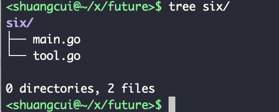
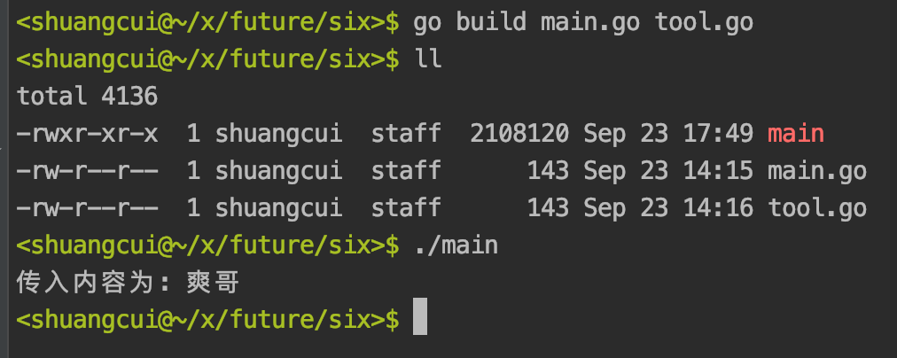
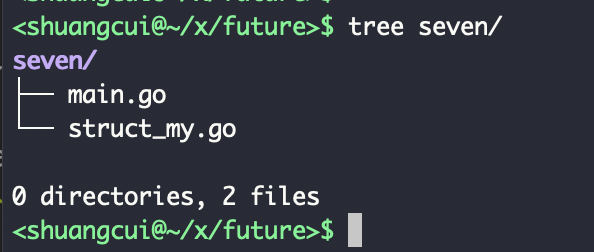
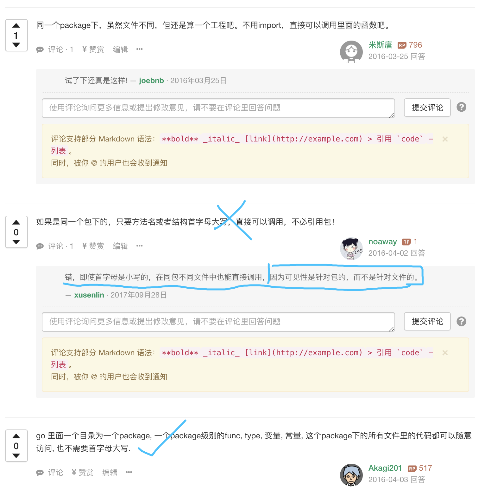
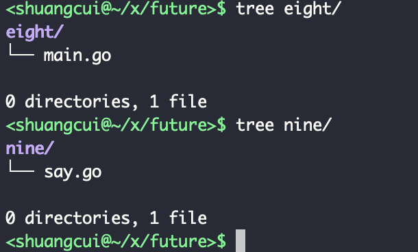

golang中,

### 1.同一个文件夹(package)下,一个文件如何引用另一个文件里的内容?

即 同一个包下 不同文件如何互相调用?

`Go 一个目录为一个包(package), 包里面的函数、结构体、 变量、常量, 这个包中所有文件里的代码都可以随意访问, 也不需要首字母大写`





main.go

```go
package main

func main(){
	printSth("爽哥")
}
```


tool.go

```go
package main

import "fmt"

func printSth(str string) string {
	fmt.Println("传入内容为:",str)
	return "返回内容是:" + str
}
```

执行 go run main.go或go build main.go,报错如下:

```
# command-line-arguments
./main.go:xx行:x行: undefined: printSth

```

???


这是因为只选择了main.go来进行构建，而其他文件没有构建进工程，自然也无法调用..

不能认为你去跑main，然后IDE会将你需要的所有文件都编译，所以这个时候我们需要动手改下命令行来运行,

`go build main.go tool.go`或`go run main.go tool.go`





---


对于同一package下不同文件里的结构体,也可以直接引用,而不用关注结构体字段首字母的大小写:



main.go:

```go
package main

import "fmt"

func main() {

	var cs transaction

	cs.amount = 13579
	cs.from = "first-block"
	cs.to = "next-block"

	fmt.Println(cs)
}
```

strcut_my.go:

```go
package main

type transaction struct {
	amount    uint64
	from      string
	to        string
	hash      []byte
	signature string
}

```

执行go run main.go,<br>


```
# command-line-arguments
./main.go:7:9: undefined: transaction
```


执行 go run main.go struct_my.go,<br>

```
{13579 first-block next-block [] }
```




<br>


---


### 2.不同文件夹(package)下,一个文件如何引用另一个文件里的内容?



eight/main.go:

```go
package main

import (
	"../nine"
	"fmt"
)

func main() {
	fmt.Println(utils.Speak("太后"))

	//引用其他包里的结构体,需被引用的结构体首字母大写,且该首字母为大写的结构体中大写的字段才可以被调用到
	var my utils.Role

	my.Name = "江湖郎中汤元元"

	fmt.Println(my)

}

```
<br>

nine/say.go

```go
package utils

func Speak(str string) string {

	return str + "吉祥"
}

type Role struct {
	Name   string
	gender string
	age    int
}

```

执行go run eight/main.go,<br>

```
太后吉祥
{江湖郎中汤元元  0}
```

`文件名(say.go)/包名(utils)可以不一致,大小写都可以.但被调用的包里的方法,必须要首字符大写,才能被其他包调用.`

`引用其他包里的结构体,需被引用的结构体首字母大写,且该首字母为大写的结构体中大写的字段才可以被调用到`


[可参考](https://www.cnblogs.com/liangjf/p/9584879.html)


