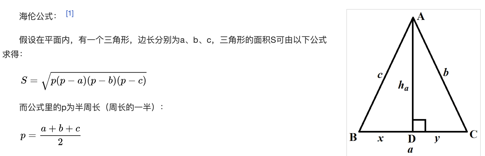

<br>


系列文章：


[golang实现多态](https://dashen.tech/2014/03/01/golang%E5%AE%9E%E7%8E%B0%E5%A4%9A%E6%80%81/)

[golang利用组合实现继承,和php或java面向对象的继承有何不同](https://dashen.tech/2014/03/01/golang%E5%88%A9%E7%94%A8%E7%BB%84%E5%90%88%E5%AE%9E%E7%8E%B0%E7%BB%A7%E6%89%BF-%E5%92%8Cphp%E6%88%96java%E9%9D%A2%E5%90%91%E5%AF%B9%E8%B1%A1%E7%9A%84%E7%BB%A7%E6%89%BF%E6%9C%89%E4%BD%95%E4%B8%8D%E5%90%8C/)


[Golang类型断言](https://dashen.tech/2017/07/26/Golang%E7%B1%BB%E5%9E%8B%E6%96%AD%E8%A8%80/)


[golang之interface入门](https://dashen.tech/2010/03/02/golang%E4%B9%8Binterface%E5%85%A5%E9%97%A8/)


[interface,鸭子类型与泛型](https://dashen.tech/2020/09/05/interface-%E9%B8%AD%E5%AD%90%E7%B1%BB%E5%9E%8B%E4%B8%8E%E6%B3%9B%E5%9E%8B/)


<br>


本篇是对「Go语言底层原理剖析」的学习与记录

<br>

### 1. 入门

<br>

> Go语言没有任何形式的基于类型的继承，取而代之的是使用接口来实现扁平化、面向组合的设计模式。


在Go语言中，interface是 **其他类型可以实现的方法签名的集合**。

有两种类型，实现原理有很大不同：一种是带方法签名的接口(一般称为`接口`)，一种是空接口(一般称为`空接口`)


<br>


一般最佳实践(官方库&知名项目)：

- 接口又嵌入接口，保持深度在0或1为最佳。
- 接口中直接定义的方法数量10个之内最佳。

[理解Go接口的实际应用](https://colobu.com/2020/03/15/understanding-Real-World-interface-design-in-go/)


<br>


<font size=1 color="#00BFFF">

(下面把自定义的接口成为一级接口，其包含的接口成为二级接口，以此类推)

嵌入的接口的数量： 标准库中接口绝大多数都不会再嵌套接口，少数会再嵌套一层接口，最多嵌套的数量为4，是[mime/multipart.File]()中的File接口：

```go
type File interface {
	io.Reader
	io.ReaderAt
	io.Seeker
	io.Closer
}
```


131个接口为0，27个为1，8个为2，3个为3，1个为4


<br>

嵌入的接口深度： 接口嵌入接口，嵌入的接口再嵌入接口..较深的接口降低了代码的可读性，提高了代码复杂度。

标准库中不使用太深的嵌入方式，少量接口有一层嵌入

131个接口没有嵌入，29个接口嵌入了一层 (和上面相对应)

<br>

接口中直接定义的方法的数量： (一级接口)直接定义的方法的数量，不包括嵌入接口引入的方法。

标准库中接口定义的直接方法的数量都很少，不会设置很多方法，接口都比较精巧干练。 比较特殊的是[reflect/Type]()接口，定义了31个直接方法


<br>

接口中总的方法的数量：把（一级接口）直接定义的方法和嵌入接口引入的方法加和


标准库中接口的总方法数量基本都在8个以下，最多的当然还是[reflect/Type]()接口，31个(直接)方法


</font>


<br>


### 2. 接口实现

<br>

> 和其他需要显式声明接口实现类 的语言不同，Go语言接口实现是隐式的，不用明确地指出某一个类型实现了某一个接口，只有在某一类型的方法中实现了接口中 全部的方法签名，就意味着此类型实现了这一接口。


<br>

如 定义一个图形接口Shape，此接口包含求周长的perimeter方法和求面积的area方法：

```go
type Shape interface {

    perimeter() float64

    area() float64
}
```

任何自定义类型要实现Shape接口都很简单，只需实现Shape内部所有的方法签名即可。


<br>


现在创建一个自定义类型Rectangle来标识一个矩形，a，b分别代表长和宽：


```go
type Rectangle struct {
    a, b float64
}
```

接着为该类型实现perimeter和area方法：

```go
func (r Rectangle) perimeter() float64 {
	return (r.a + r.b) * 2 //矩形周长公式：(长+宽)*2
}

func (r Rectangle) area() float64 {
	return r.a * r.b //矩形面积公式：长*宽
}

```

<br>

再创建一个自定义类型Rectangle来标识一个三角形，a，b，c分别代表三条边：


```go

type Triangle struct {
	a, b, c float64
}

```


也为该类型实现perimeter和area方法：

```go
func (t Triangle) perimeter() float64 {
	return t.a + t.b + t.c
}

func (t Triangle) area() float64 {
	//海伦公式
	p := (t.a + t.b + t.c) / 2
	return math.Sqrt(p*(p-t.a) + p*(p-t.b) + p*(p-t.c))
}
```




<br>


实例化一个矩形和三角形，计算其周长和面积：

```go
package main

import (
	"fmt"
	"math"
)

func main() {
	cacl()
}

// Shape 图形
type Shape interface {
	perimeter() float64
	area() float64
}

type Rectangle struct {
	a, b float64
}

func (r Rectangle) perimeter() float64 {
	return (r.a + r.b) * 2 //矩形周长公式：(长+宽)*2
}

func (r Rectangle) area() float64 {
	return r.a * r.b //矩形面积公式：长*宽
}

func cacl() {

	var juxing = Rectangle{
		3, 4,
	}

	var sanjiaoxing = Triangle{
		3, 4, 5,
	}

	fmt.Printf("矩形周长为%f,面积为%f\n", juxing.perimeter(), juxing.area())
	fmt.Printf("三角形周长为%f,面积为%f\n", sanjiaoxing.perimeter(), sanjiaoxing.area())

}

type Triangle struct {
	a, b, c float64
}

func (t Triangle) perimeter() float64 {
	return t.a + t.b + t.c
}

func (t Triangle) area() float64 {
	//海伦公式
	p := (t.a + t.b + t.c) / 2
	return math.Sqrt(p*(p-t.a) + p*(p-t.b) + p*(p-t.c))
}

```

执行：

```go
矩形周长为14.000000,面积为12.000000
三角形周长为12.000000,面积为6.000000
```


<br>


### 3. 接口动态类型

<br>

一个接口类型的变量，能够接收任何实现了此接口的 (开发人员)自定义的类型。


**一般把存储在接口中的类型(如Rectangle，Triangle，即隐式实现Shape中所有方法的结构体) 称为接口的动态类型，而将接口本身的类型称为接口的静态类型(如Shape)**


```go
    var s Shape
	s = Rectangle{3, 4}
	s = Triangle{3, 4, 5}
```


<br>

---

<br>


### 4. 接口的动态调用

<br>


当接口变量(如Shape)中存储了具体的动态类型时，可以调用接口中所有的方法:


```go
    var s Shape
	s = Rectangle{3, 4}
	s.perimeter()
	s.area()
```

<br>


接口动态调用的过程实质上是 调用当前接口动态类型中具体方法的过程。如下，接口动态调用表现出不同动态类型的行为:

```go
    var s Shape
	s = Rectangle{3, 4}
	fmt.Printf("矩形周长为%v,面积为%v\n", s.perimeter(), s.area())
	s = Triangle{3, 4, 5}
	fmt.Printf("三角形周长为%f,面积为%f\n", s.perimeter(), s.area())
```

<br>


输出为：

```go
矩形周长为14,面积为12
三角形周长为12.000000,面积为6.000000
```

<br>


在对接口变量进行动态调用时，调用的方法只能是接口中具有的方法。如Rectangle类型还有另外的方法getHeight，接口变量在调用时，编译不会通过:


```go
	var s Shape
	s = Rectangle{3, 4}
	area := s.area()
	hight := s.getHeight()

	fmt.Println(area,hight)
```

```go
s.getHeight undefined (type Shape has no field or method getHeight)
```


<br>

---

<br>


### 5. 多接口

<br>


一个类型可以同时实现多个接口，如标准库中[src/os/types.go]()中的


```go
// File represents an open file descriptor.
type File struct {
	*file // os specific
}
```

其实现了[src/io/io.go]()中的Reader接口和Writer接口

<br>


---

<br>


### 6. 接口的组合

<br>

定义的接口可以是其他接口的组合，如[理解Go接口的实际应用](https://colobu.com/2020/03/15/understanding-Real-World-interface-design-in-go/)中提到的标准库[src/io/io.go]()中的`ReadWriter`,`ReadCloser`,`WriteCloser`等几个接口。

以`ReadWriter`为例,其组合了Reader接口和Writer接口。 当类型实现了ReadWriter时，意味着次类型既可读又可写。

```go
// ReadWriter is the interface that groups the basic Read and Write methods.
type ReadWriter interface {
	Reader
	Writer
}

...

// Implementations must not retain p.
type Reader interface {
	Read(p []byte) (n int, err error)
}

...

// Implementations must not retain p.
type Writer interface {
	Write(p []byte) (n int, err error)
}

```

<br>

<font color="orange">一个方法包含越多的方法，其抽象性就越低，表达的行为就越具体</font>


<br>

---

<br>


### 7. 接口类型断言

<br>


更多参考 [Golang类型断言](https://dashen.tech/2017/07/26/Golang%E7%B1%BB%E5%9E%8B%E6%96%AD%E8%A8%80/)


<br>


---

<br>


### 8. 空接口

<br>


如果接口中没有任何方法签名，则这是Go中另一类特殊接口,即*空接口*


空接口可以存储结构体,字符串,整型等任何数据类型,是很多函数的入参,如fmt.Println：

```go
// Println formats using the default formats for its operands and writes to standard output.
// Spaces are always added between operands and a newline is appended.
// It returns the number of bytes written and any write error encountered.
func Println(a ...interface{}) (n int, err error) {
	return Fprintln(os.Stdout, a...)
}
```

使用 `i.(type)`获取空接口中的动态类型

i代表接口变量，type是固定关键字，和带方法接口的类型断言不是一回事。

这个语法仅在switch语句中有效，如Println源码中：

```go
	// Some types can be done without reflection.
	switch f := arg.(type) {
	case bool:
		p.fmtBool(f, verb)
	case float32:
		p.fmtFloat(float64(f), 32, verb)
	case float64:
		p.fmtFloat(f, 64, verb)
	case complex64:
		p.fmtComplex(complex128(f), 64, verb)
	case complex128:
		p.fmtComplex(f, 128, verb)
	case int:
		p.fmtInteger(uint64(f), signed, verb)
	case int8:
		p.fmtInteger(uint64(f), signed, verb)
	case int16:
		p.fmtInteger(uint64(f), signed, verb)
	case int32:
		p.fmtInteger(uint64(f), signed, verb)
	case int64:
		p.fmtInteger(uint64(f), signed, verb)
	case uint:
		p.fmtInteger(uint64(f), unsigned, verb)
	case uint8:
		p.fmtInteger(uint64(f), unsigned, verb)
	case uint16:
		p.fmtInteger(uint64(f), unsigned, verb)
	case uint32:
		p.fmtInteger(uint64(f), unsigned, verb)
	case uint64:
		p.fmtInteger(f, unsigned, verb)
	case uintptr:
		p.fmtInteger(uint64(f), unsigned, verb)
	case string:
		p.fmtString(f, verb)
	case []byte:
		p.fmtBytes(f, verb, "[]byte")
	case reflect.Value:
		// Handle extractable values with special methods
		// since printValue does not handle them at depth 0.
		if f.IsValid() && f.CanInterface() {
			p.arg = f.Interface()
			if p.handleMethods(verb) {
				return
			}
		}
		p.printValue(f, verb, 0)
	default:
		// If the type is not simple, it might have methods.
		if !p.handleMethods(verb) {
			// Need to use reflection, since the type had no
			// interface methods that could be used for formatting.
			p.printValue(reflect.ValueOf(f), verb, 0)
		}
	}
```
即 使用switch语句嵌套i.(type)语法，获取空接口中的动态类型，并根据动态类型不同进行不同的格式化输出。


<br>


---

<br>


### 9. 接口的比较性

<br>


两个接口之间可以通过 `==` 或 `!=`来比较，规则为：

- 动态值为nil的接口变量相等

- 如果只有一个接口为nil，则比较结果为false

- 两个接口不为nil，且接口变量具有相同的动态类型和动态类型值，则两接口相同

- 如果接口存储的动态类型值是不可比较的，则运行时会报错
