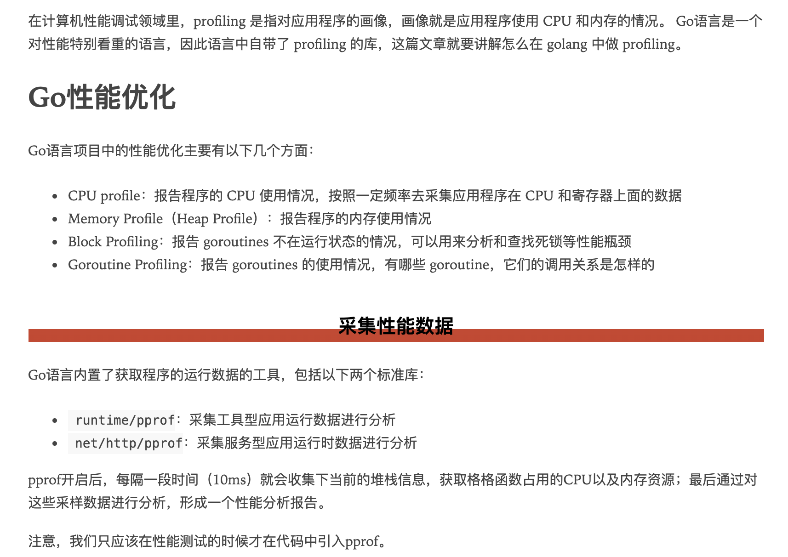

 

很早之前写过一篇[递归的缺点--以斐波那契数列为例](http://www.dashen.tech/2017/07/11/%E9%80%92%E5%BD%92%E7%9A%84%E7%BC%BA%E7%82%B9-%E4%BB%A5%E6%96%90%E6%B3%A2%E9%82%A3%E5%A5%91%E6%95%B0%E5%88%97%E4%B8%BA%E4%BE%8B/), 只进行了程序的时间消耗对比,对于内存/CPU资源的占用,没有进行比照. 再以此为例,继续分析.

 

参考:

---

 

