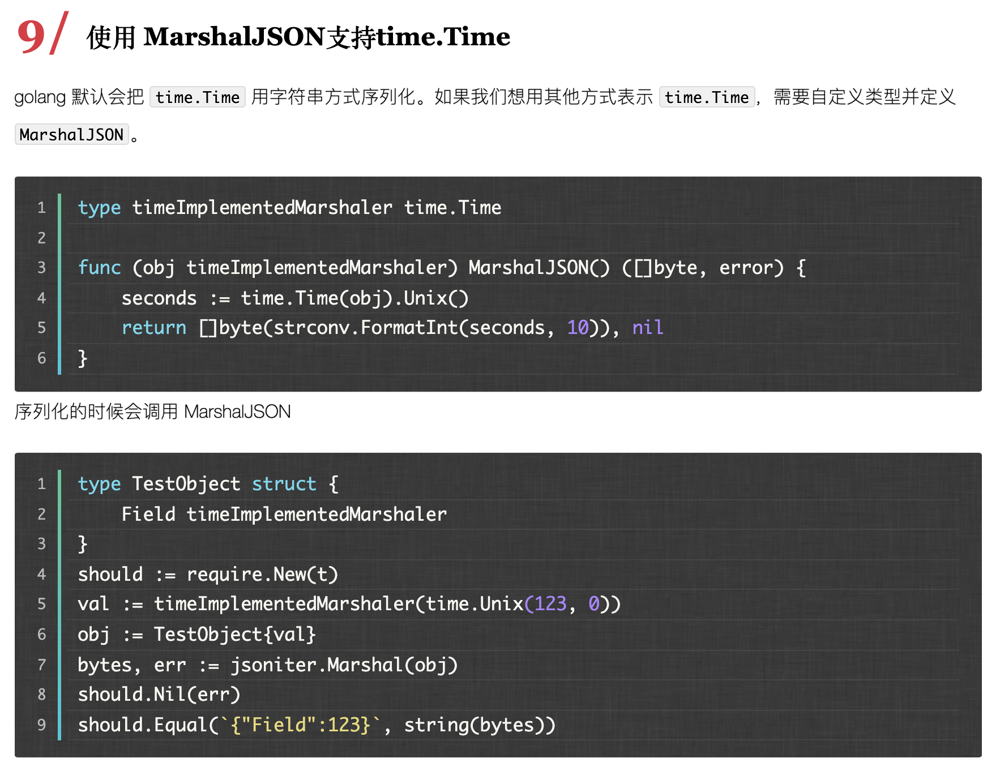
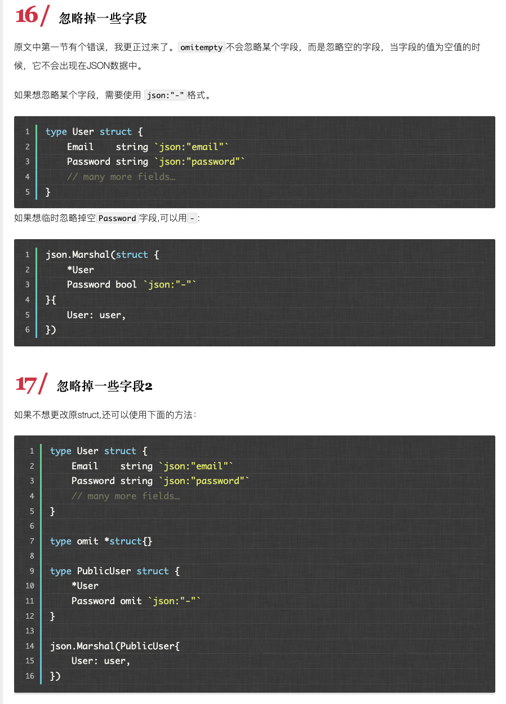
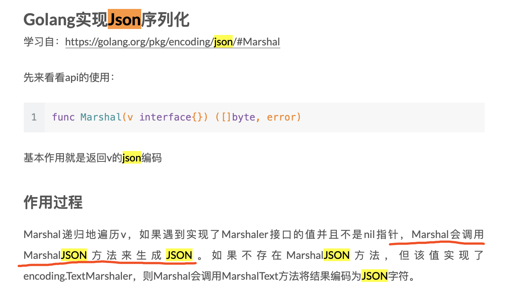

```go
package main

import (
	"time"
	"fmt"
	"reflect"
	"encoding/json"
)

type BillInfo struct {
	Name       string    `json:"name"`
	Gender     string    `json:"gender"`
	BirthPlace string    `json:"birthplace"`
	BirthDay   time.Time `json:"birthday"`
}

func main() {

	var bill BillInfo

	bill.Name = "Bill Gates"
	bill.Gender = "male"
	bill.BirthPlace = "Seattle"

	bill.BirthDay = time.Date(1955, 10, 28, 0, 0, 0, 0, time.Local)

	fmt.Println(bill.BirthDay)
	fmt.Println(reflect.TypeOf(bill.BirthDay))

	rs, err := json.Marshal(bill)
	if err != nil {
		fmt.Println(err)
	}

	fmt.Println(string(rs))

}
```

输出为:

```
1955-10-28 00:00:00 +0800 CST
time.Time
{"name":"Bill Gates","gender":"male","birthplace":"Seattle","birthday":"1955-10-28T00:00:00+08:00"}
```

显然,我们更希望的是得到一个`Y:m:d H:i:s`格式的结果;

**可以通过定义一个time.Time类型的别名，然后为这个别名类型实现MarshalJSON方法。**


<font color="red">图1</font>




<font color="green">代码做修改如下:</font>

```go
package main

import (
	"time"
	"fmt"
	"reflect"
	"encoding/json"
)

type BillInfo struct {
	Name       string     `json:"name"`
	Gender     string     `json:"gender"`
	BirthPlace string     `json:"birthplace"`
	BirthDay   formatTime `json:"birthday"`
}

type formatTime time.Time

func (cs formatTime) MarshalJSON() ([]byte, error) {
	var stamp = fmt.Sprintf("\"%s\"", time.Time(cs).Format("2006-01-02 15:04:05"))
	return []byte(stamp), nil
}

func main() {

	var bill BillInfo

	bill.Name = "Bill Gates"
	bill.Name = "male"
	bill.BirthPlace = "Seattle"

	bill.BirthDay = formatTime(time.Date(1955, 10, 28, 0, 0, 0, 0, time.Local))

	fmt.Println(bill.BirthDay)
	fmt.Println(reflect.TypeOf(bill.BirthDay))

	rs, err := json.Marshal(bill)
	if err != nil {
		fmt.Println(err)
	}

	fmt.Println(string(rs))

}

```

参考:

[golang的json的时间格式化解决方案](https://www.ctolib.com/topics-85899.html)

[使用自定义MarshalJSON更改struct中的JSON标记](使用自定义MarshalJSON更改struct中的JSON标记)

结果为:

```
{0 61688102400 0x11abdc0}
main.formatTime
{"name":"Bill Gates","gender":"male","birthplace":"Seattle","birthday":"1955-10-28 00:00:00"}

```

---


<font color="red">图2</font>




上面这种方式虽能实现,但侵入了原结构体,将原来的`time.Time`类型改为了我自定义的`formatTime`类型 ,参考如下两种方式

[参考1](https://www.jianshu.com/p/03003d5cbdbc)

[参考2](https://studygolang.com/articles/11685)

继续深究此问题,可参见本地note/for目录下的4.go文件




强烈推荐[Golang 中使用 JSON 的小技巧](https://colobu.com/2017/06/21/json-tricks-in-Go/)


还可以思考下这个问题
[如何使用自定义MarshalJSON更改struct中的JSON标记](https://cloud.tencent.com/developer/ask/199561)

---

简单总结:可以通过为time.Time定义一个别名,对该别名实现MarshalJSON()方法,在该方法里就行时间格式的转换;

但该方法的不足是需要修改和侵入原结构体;

还有一种方法是为整个结构体实现MarshalJSON()方法,但该方法的不足是需要将原结构体中time.Time类型字段的json标签改为"-",也侵入了原结构体;

实际上,通过上面的链接,是可以有不侵入原结构体即实现效果的方法,但比较繁琐;一般情况下,第一种依然是权衡之下的首选...