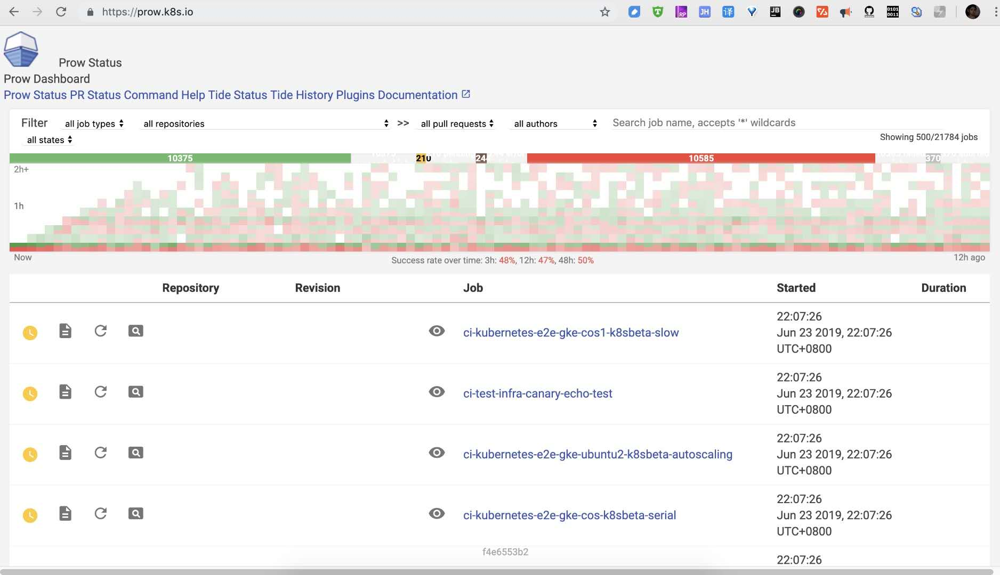
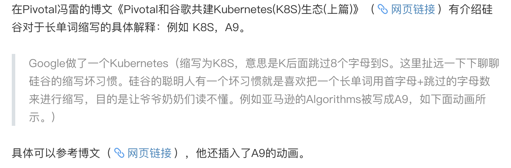
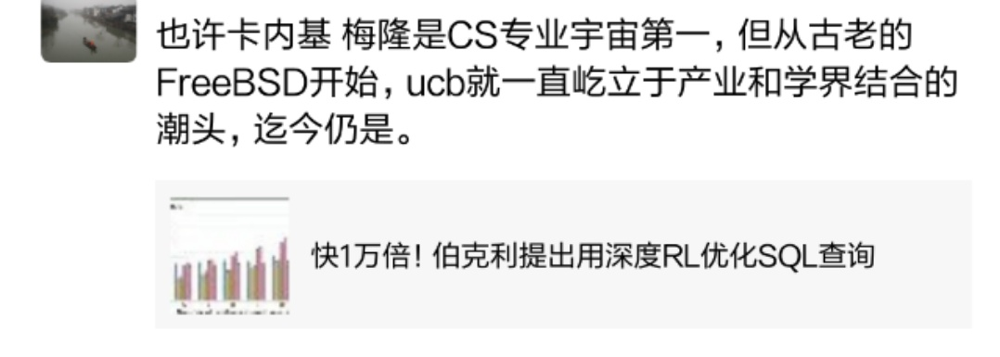

小伙伴赴云原生大会前夕，一起探讨畅聊了k8s相关内容。在听到其所说的某相关项目官网为`prow.k8s.io`，当即提出质疑。

我理解许多名词中的“数字谐音”，如“b2c”，“p2p”中的“two”代“to”，许多人邮箱如box4bob@gmail.com中的“four”代“for”。但kubernetes简写为k8s，我推测应该只是中国有此叫法，毕竟在英文中“8”是“eight”发不出“ba”这个音。

我这位运维小伙伴在此领域钻研精深，当即问我可知道“国际化”的简称“I18N”，作为一名开发，这自是难不倒我。i18n为取internationalization的首尾字母，18为首尾字母中间的字符数。同样的还有“本地化”L10N即localization。

但这个一般用于单词较长的名词，疑惑难道k8s也缘由此？那这样确实k8s是kubernetes在全世界范围内简称而非只局限于国内。

动用搜索，证明他说的完全正确。

技术名词命名，大抵有三种方式:一是“昨夜西风凋碧树”，直接以物命名，如java，shell，ruby;二则当是几个单词组合一起，取其首字母缀连，如php(原称Personal Home Page，现改名Hypertext Preprocessor)，BSD(Berkeley Software Distribution伯克利软件套件)，这种方式组成的单词大多无甚实际含义，而最精巧别致可遇难求的，是组合出的词恰有意思且极贴切，这点又要提到那个在搭建DNS服务器常用到的bind(Berkeley Internet Name Domain，又又又出自ucb)。三则如前所述i18n，l10n，k8s，这种多见于单个较长单词。

 
 

 
 

其实还有非常小众的第四种，即类似“3M”这样的命名法，如著名的Amazon S3 即Amazon Simple Storage Service。其几家国内竞品的命名多为第二种，如oss(Object Storage Service)，ecs(Elastic Compute Service)，cvm(Cloud Virtual Machine)。而S3总给我一种是S2升级款的错觉

 
 

 
 

 
 

