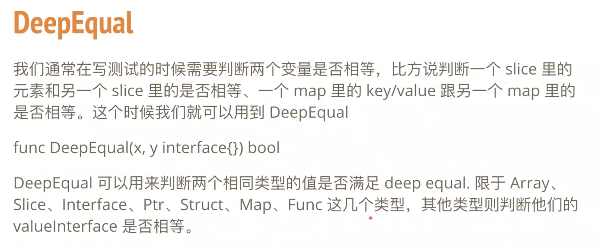

<br>


姊妹篇:

[反射](https://dashen.tech/2020/06/27/%E5%8F%8D%E5%B0%84/)

[Golang类型断言](https://dashen.tech/2017/07/26/Golang%E7%B1%BB%E5%9E%8B%E6%96%AD%E8%A8%80/)

<br>

### 1.reflect.TypeOf(argument).Kind() == reflect.String

有一个interface{}类型的切片,输出其中所有string类型的值及其索引

```go
sli := []interface{}{"1213", 3456, 7867, "hao", "city"}
for argNum, arg := range sli {
		if reflect.TypeOf(arg).Kind() == reflect.String {
			fmt.Printf("第%d个元素%s为string类型\n",argNum,arg)
        }
}
```

输出为:

```r
第0个元素1213为string类型
第3个元素hao为string类型
第4个元素city为string类型
```

如果直接`reflect.TypeOf(arg).Kind() == "string"`,则会报错

```r
mismatched type Kind and string
```

这么直接粗暴地写是不行滴~


<br>


---


<br>

参考:

[深入Go语言 - 13](https://colobu.com/2016/07/09/dive-into-go-13/)

[Go Reflect 性能](https://colobu.com/2019/01/29/go-reflect-performance/)


<br>


---

<br>


### 源码剖析

<br>

[Golang 反射应用及源码分析](https://www.bilibili.com/video/BV1My4y117gQ)

<br>


[example_test.go]()中的几个测试用例:


- ExampleKind: 实现简单的类型判断

- ExampleMakeFunc: 传入任意类型的两个参数,实现这两个参数之间的交换

- ExampleStructTag:读取结构体定义的tag信息

- ExampleStructTag_Lookup:tag的查找

- ExampleTypeOf: 判断一个结构体是否实现了某个接口

- ExampleStructOf:


<br>


两个slice(或map/struct)直接比较是不被允许的, 使用DeepEqual可以比较,如果元素一一对应,则为true





<br>


函数调用


https://github.com/KippaZou/learn-reflection/blob/main/function_call.go


<br>


### 一些用到反射的包

<br>


[proto reflect](https://pkg.go.dev/google.golang.org/protobuf/reflect/protoreflect)


[sqlx scanAll](https://github.com/jmoiron/sqlx/blob/0794cb1f47ee444eda9624f952ab8a370bec22de/sqlx.go#L899)


[testify](https://github.com/stretchr/testify)


<br>


### 反射三大定律

<br>


[The Laws of Reflection ](https://blog.golang.org/laws-of-reflection)


- Reflection goes from interface value to reflection object.
- Reflection goes from reflection object to interface value.
- To modify a reflection object, the value must be settable.


[whimsical](https://whimsical.com/reflect-type-go-SAsCyuS9NEFqjfZ24Zm4cx)


<br>


### benchmark


<br>


[reflect benchmark](https://github.com/KippaZou/learn-reflection/tree/main/benchmark)


<br>


[reflect 阅读材料](https://www.notion.so/reflect-7426c7d1fb0a49c68d9b4c45d1499076)


[反射](https://draveness.me/golang/docs/part2-foundation/ch04-basic/golang-reflect/)