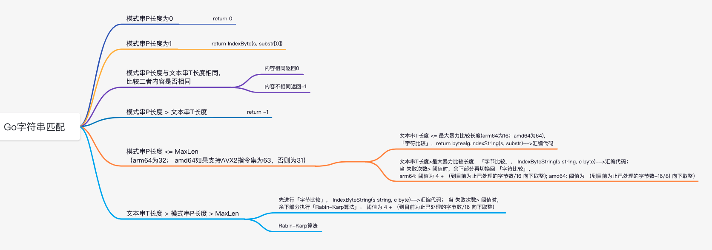
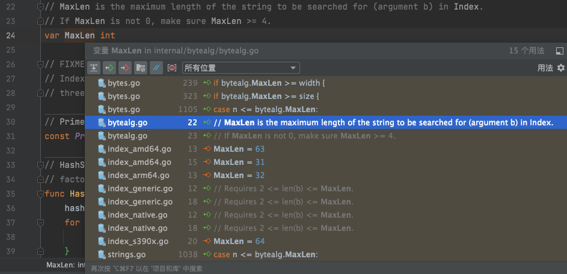

<font size=2 color="33ccff">

该篇内容去[Go夜读](https://github.com/talkgo)做了分享,配合[视频](https://www.bilibili.com/video/BV1Hb4y117vu)食用更佳


可能是因为头一次，也可能是准备不算绝对充分，远没有信手即拈来，更激动也忧心此后要被许多同行——包括新手和大牛，数次学习或检验从而压力山大，有些微紧张。几次口齿不清，数度大脑间歇空白，更有片段未顾及听众观感语速不自觉飞快


总之也勇敢迈出了这一步，继续加油，继续Explore。

感谢[杨文](https://github.com/yangwenmai)大佬的组织，折腾起这样一个社区，个人要付出得太多。 自18年学习go以来便从中[获益良多](https://github.com/talkgo/night/blob/6345a0111457cb3713a435f34298912f2eac566d/content/discuss/2019-01-10-anlayze-range.md)，也希望以后再能返馈涓埃


视频中有期期艾艾片段多多包涵，有讲解不清之处欢迎联系 交流探讨

2021.09.30补记.</font>


<br>


<iframe width="560" height="315" src="https://www.youtube.com/embed/30rufX6Azew" frameborder="0" allowfullscreen></iframe>


<br>

---

<br>

```go
package main

import (
	"strings"
)

func main() {

	subStr := "asdadas"

	longStr := "sadsferwasdaasdasaeqasdadasrdgasdaddsaas"

	print(strings.Contains(longStr, subStr))

}

```

[src/strings/strings.go#L61](https://gitee.com/cuishuang/go/blob/master/src/strings/strings.go#L61)
```go
// Contains reports whether substr is within s.
func Contains(s, substr string) bool {
	return Index(s, substr) >= 0
}

```

`strings.Contains()`底层调的是`strings.Index()`,前者是判断某个文本串T中是否存在匹配的子串P，后者是返回某个文本串T中匹配的子串P首次出现的位置，若没有则返回-1


<br>




[原图点此](https://www.processon.com/view/link/6149cb9b1e085315dc4e73d9)


<br>


```go
package main

import (
	"fmt"
	"strings"
)

func main() {

	str := "hello world"
	substr := "o"

	//str = "hello world"
	//substr = "or"
	//
	//str = "hello worldhhhhhhhhhhhhhhhhhhhhhhhhhhhhhhhhhhhhhhhhhhhhhhhhhhhhhhhhhhhhhhhhhhhhhhhhhhhhhhhhhhhhhhhhh" //100
	//substr = "orldhhh"                                                                                           //7
	//
	//str = "ooooooooohello worldhhhhhhhhhhhhhhhhhhhhhhhhhhhhhhhhhhhhhhhhhhhhhhhhhhhhhhhhhhhhhhhhhhhhhhhhhhhhhhhh" //100
	//substr = "orldhhh"                                                                                           //7
	//
	//str = "hello worldhhhhhhhhhhhhhhhhhhhhhhhhhhhhhhhhhhhhhhhhhhhhhhhhhhhhhhhhhhhhhhhhhhhhhhhhhhhhhhhhhhhhhhhhh" //100
	//substr = "orldhhhxxxxxxxxxxxxxxxxxxxxxxxxxxxxxxxxxxyyyyyyyyyyyyyyyyyyyyyyyyyyyyy"                            //70
	//
	//str = "ooooooooohello worldhhhhhhhhhhhhhhhhhhhhhhhhhhhhhhhhhhhhhhhhhhhhhhhhhhhhhhhhhhhhhhhhhhhhhhhhhhhhhhhh" //100
	//substr = "orldhhhxxxxxxxxxxxxxxxxxxxxxxxxxxxxxxxxxxyyyyyyyyyyyyyyyyyyyyyyyyyyyyy"                            //70

	rs := strings.Index(str, substr)

	fmt.Println(rs)

}

```


[src/strings/strings.go#L61](https://gitee.com/cuishuang/go/blob/master/src/strings/strings.go#L1024)
```go

// Index returns the index of the first instance of substr in s, or -1 if substr is not present in s.
func Index(s, substr string) int {
	n := len(substr)
	switch {
	case n == 0:
		return 0
	case n == 1:
		return IndexByte(s, substr[0])
	case n == len(s):
		if substr == s {
			return 0
		}
		return -1
	case n > len(s):
		return -1
	case n <= bytealg.MaxLen:
		// Use brute force when s and substr both are small
		if len(s) <= bytealg.MaxBruteForce {
			return bytealg.IndexString(s, substr)
		}
		c0 := substr[0]
		c1 := substr[1]
		i := 0
		t := len(s) - n + 1 // 滑动窗口，如s长度为100，substr长度为7，那完成整个比较过程，最多仅需要滑动 100-7+1=94 次（此处并不是每次+1比较，所以需要的次数实际会更少）
		fails := 0
		for i < t {
			if s[i] != c0 {
				// IndexByte is faster than bytealg.IndexString, so use it as long as
				// we're not getting lots of false positives.

				// IndexByte 比 bytealg.IndexString 快，所以只要我们没有收到很多误报，就尽可能去使用IndexByte
				o := IndexByte(s[i+1:t], c0)
				if o < 0 {
					return -1
				}
				i += o + 1
			}
			if s[i+1] == c1 && s[i:i+n] == substr {
				return i
			}
			fails++
			i++
			// Switch to bytealg.IndexString when IndexByte produces too many false positives.
			// 当IndexByte有太多误报时，切回到bytealg.IndexString
			// 失败次数> 阈值时，余下部分再切换回 「字符比较」; 对于arm64: 阈值为 4 + （到目前为止已处理的元素数/16 向下取整); 对于amd64: 阈值为 （到目前为止已处理的元素数+16/8) 向下取整)
			if fails > bytealg.Cutover(i) {
				r := bytealg.IndexString(s[i:], substr)
				if r >= 0 {
					return r + i
				}
				return -1
			}
		}
		return -1
	}
	c0 := substr[0]
	c1 := substr[1]
	i := 0
	t := len(s) - n + 1
	fails := 0
	for i < t {
		if s[i] != c0 {
			o := IndexByte(s[i+1:t], c0)
			if o < 0 {
				return -1
			}
			i += o + 1
		}
		if s[i+1] == c1 && s[i:i+n] == substr {
			return i
		}
		i++
		fails++

		// 当 失败次数> 阈值时，余下部分执行「Rabin-Karp算法」； 对于arm64和amd64，阈值均为 4 + （到目前为止已处理的元素数/16 向下取整)
		// 好奇：为何和上面bytealg.Cutover(i)的阈值逻辑不一样？
		if fails >= 4+i>>4 && i < t {
			// See comment in ../bytes/bytes.go.
			j := bytealg.IndexRabinKarp(s[i:], substr)
			if j < 0 {
				return -1
			}
			return i + j
		}
	}
	return -1
}


// IndexByte returns the index of the first instance of c in s, or -1 if c is not present in s.
// IndexByte 返回 s 中 c 的第一个实例的索引，如果 c 不存在于 s 中，则返回 -1。
// 即给一个字符串和单个”字符“，返回这个字符在字符串中第一次出现的位置。汇编代码，暴力比较
func IndexByte(s string, c byte) int {
	return bytealg.IndexByteString(s, c)
}


```

<br>


[src/internal/bytealg/indexbyte_native.go](https://gitee.com/cuishuang/go/blob/master/src/internal/bytealg/indexbyte_native.go#L14)

```go
// +build 386 amd64 s390x arm arm64 ppc64 ppc64le mips mipsle mips64 mips64le riscv64 wasm


//go:noescape
func IndexByteString(s string, c byte) int
```

<br>

[src/internal/bytealg/indexbyte_arm64.s](https://gitee.com/cuishuang/go/blob/master/src/internal/bytealg/indexbyte_arm64.s#L14)

```go
TEXT ·IndexByteString(SB),NOSPLIT,$0-32
	MOVD	s_base+0(FP), R0
	MOVD	s_len+8(FP), R2
	MOVBU	c+16(FP), R1
	MOVD	$ret+24(FP), R8
	B	indexbytebody<>(SB)

```

<br>


[src/internal/bytealg/index_native.go](https://gitee.com/cuishuang/go/blob/master/src/internal/bytealg/index_native.go#L21)
```go
// IndexString returns the index of the first instance of b in a, or -1 if b is not present in a.
// Requires 2 <= len(b) <= MaxLen.
//IndexString 返回 a 中 b 的第一个实例的索引，如果 b 不存在于 a 中，则返回 -1。 需要 2 <= len(b) <= MaxLen。
// 即给两个字符串a和b，返回字符串b在字符串a中第一次出现的位置。汇编代码，暴力比较
func IndexString(a, b string) int
```


<br>

[src/internal/bytealg/index_arm64.go](https://gitee.com/cuishuang/go/blob/master/src/internal/bytealg/bytealg.go#L130)

```go
// Copyright 2018 The Go Authors. All rights reserved.
// Use of this source code is governed by a BSD-style
// license that can be found in the LICENSE file.

package bytealg

// Empirical data shows that using Index can get better
// performance when len(s) <= 16.
const MaxBruteForce = 16

func init() {
	// Optimize cases where the length of the substring is less than 32 bytes
	MaxLen = 32
}

// Cutover reports the number of failures of IndexByte we should tolerate
// before switching over to Index.
// n is the number of bytes processed so far.
// See the bytes.Index implementation for details.

//Cutover 报告在切换到 Index 之前我们应该容忍的 IndexByte 的失败次数。
//n 是到目前为止处理的字节数。
//有关详细信息，请参阅 bytes.Index 实现。
func Cutover(n int) int { // cutover 切换；转换，和switch一个意思
	// 1 error per 16 characters, plus a few slop to start.
	//每 16 个字符有 1 个错误，加上开始时的一些错误。
	// 即 n/16向下取整，再+4
	return 4 + n>>4
}
```

<br>


**MaxLen：**

- arm64架构： 32

- s390x: 64

- amd64: 如果支持HasAVX2指令集，为63；否则为32




<br>

**MaxBruteForce:**

- arm64: 16

- amd64: 64


<br>


[src/internal/bytealg/bytealg.go](https://gitee.com/cuishuang/go/blob/master/src/internal/bytealg/bytealg.go#L130)

```go

// MaxLen is the maximum length of the string to be searched for (argument b) in Index.
// If MaxLen is not 0, make sure MaxLen >= 4.
var MaxLen int

// PrimeRK is the prime base used in Rabin-Karp algorithm.
// primeRK相当于进制 (直译为 素数基)
const PrimeRK = 16777619


// IndexRabinKarp uses the Rabin-Karp search algorithm to return the index of the
// first occurrence of substr in s, or -1 if not present.
// IndexRabinKarp 使用 Rabin-Karp 搜索算法返回 substr 在 s 中第一次出现的索引，如果不存在则返回 -1。
func IndexRabinKarp(s, substr string) int {
	// Rabin-Karp search
	// 返回待匹配字符串(模式串)的哈希值(即P串)，以及pow (为PrimeRK的n-1次方，n为模式串的长度)
	hashss, pow := HashStr(substr)
	n := len(substr)
	var h uint32
	for i := 0; i < n; i++ {
		h = h*PrimeRK + uint32(s[i])
	}
	if h == hashss && s[:n] == substr {
		return 0
	}
	for i := n; i < len(s); {
		h *= PrimeRK
		h += uint32(s[i])
		h -= pow * uint32(s[i-n])
		i++
		if h == hashss && s[i-n:i] == substr {
			return i - n
		}
	}
	return -1
}

// HashStr returns the hash and the appropriate multiplicative
// factor for use in Rabin-Karp algorithm.
//HashStr的两个返回值，hashss即9图中P模式串的哈希值，pow为PrimeRK的n-1次方(n为模式串P的长度)
func HashStr(sep string) (uint32, uint32) {
	hash := uint32(0)
	for i := 0; i < len(sep); i++ {
		// 当某个运算后发生溢出，将结果对uint32的上限即(1<<32 - 1，也就是4294967295)取模；而后再进行后面的运算
		// 类似于一个时钟表盘，从现在开始3小时和27小时后，指针都在相同位置
		hash = hash*PrimeRK + uint32(sep[i])
	}
	var pow, sq uint32 = 1, PrimeRK
	for i := len(sep); i > 0; i >>= 1 {  // i >>= 1 即 i = i >> 1
		if i&1 != 0 {
			pow *= sq
		}
		sq *= sq
	}
	return hash, pow
}

```


pow即(n-1)个PrimeRK相乘，其中n=len(sep)；

等价于如下

```go
for i := 0; i < len(sep); i++ {
	pow *= PrimeRK
}
```


上面这步for循环算P串hash的操作，之所以不累加，应该是为了防止发生加法溢出(根据同余定理，乘法导致的溢出应该没问题)。这样得到的效果与累加一致，如上面计算


Rabin–Karp算法部分的详细内容，可移步 [字符串匹配的Rabin–Karp算法](https://dashen.tech/2021/08/11/%E5%AD%97%E7%AC%A6%E4%B8%B2%E5%8C%B9%E9%85%8D%E7%9A%84Rabin%E2%80%93Karp%E7%AE%97%E6%B3%95/)查看


<br>


---


<br>


另：

<font size=1>


[src/internal/bytealg/index_native.go](https://gitee.com/cuishuang/go/blob/master/src/internal/bytealg/index_native.go#L21)中的`func IndexString(a, b string) int` 


为何只有方法名，而没有实现。 并且也没有发现`//go:linkname指令`及unsafe包? 


函数只有签名，没有函数体一般有两种情况,其一便是[go:linkname](https://dashen.tech/2021/05/23/go-linkname/)这种方式，另一种则是函数签名使用Go,然后通过该包中的汇编文件来实现它，这两种都广泛存在于Go源码中 （更多参见 [为什么 Go 标准库中有些函数只有签名，没有函数体？](https://blog.csdn.net/weixin_30815427/article/details/101099987)
）


故而`func IndexString(a, b string) int` 实际执行了下面这段汇编代码

```go
TEXT ·IndexString(SB),NOSPLIT,$0-40
	MOVD	a_base+0(FP), R0
	MOVD	a_len+8(FP), R1
	MOVD	b_base+16(FP), R2
	MOVD	b_len+24(FP), R3
	MOVD	$ret+32(FP), R9
	B	indexbody<>(SB)
```


[Go语言高级编程（柴树杉，曹春晖）](https://www.bookstack.cn/read/advanced-go-programming-book/ch3-asm-ch3-04-func.md)

NOSPLIT不会生成或包含栈分裂代码，这一般用于没有任何其它函数调用的叶子函数，这样可以适当提高性能

</font>