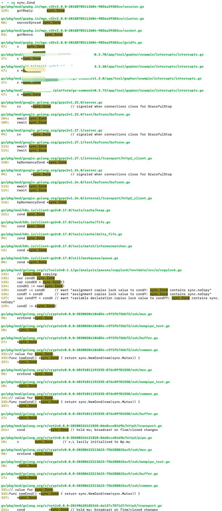

### <font color="#CD853F">初入门径</font>

<br>

cond是sync包下面的一种数据类型，相当于线程间通信的条件变量方式。


参考自 [这一次，彻底搞懂 Go Cond](https://mp.weixin.qq.com/s/2NsAl5yEPxwbpyATpuEa3Q)

<br>

sync.Cond 是sync包中, 用的最少的控制并发的手段, 因为其在大部分场景下都被 Channel 代替了.


如以下两段代码等效


```go
package main

import (
 "fmt"
 "time"
)

func main() {
 done := make(chan int, 1)

 go func() {
  time.Sleep(5 * time.Second)
  done <- 1
 }()

 fmt.Println("waiting")
 <-done
 fmt.Println("done")
}
```


```go
package main

import (
 "fmt"
 "sync"
 "time"
)

func main() {
 cond := sync.NewCond(&sync.Mutex{})
 var flag bool
 go func() {
  time.Sleep(time.Second * 5)
  cond.L.Lock()
  flag = true
  cond.Signal()
  cond.L.Unlock()
 }()

 fmt.Println("waiting")
 cond.L.Lock()
 for !flag {
  cond.Wait()
 }
 cond.L.Unlock()
 fmt.Println("done")
}
```


<br>


参考自 [Go中多协程协作之sync.Cond](https://segmentfault.com/a/1190000040037805)

大部分场景下使用 *channel* 比 *sync.Cond* 要方便. 不过 *sync.Cond* 提供了 **Broadcast** 方法, 可以通知所有的等待者. 而想利用 *channel* 实现这个功能还是不容易的, 这应该是 *sync.Cond* 唯一有用武之地的地方


<br>

---

<br>


协程间通信方式，官方推荐使用channel，channel在一对一的协程之间进行数据交换与通信十分便捷。但是，一对多的**广播场景**中，则显得有点无力，此时就需要sync.Cond来辅助。

编程中的广播可以理解为：多个操作流程依赖于一个操作流程完成后才能进行某种动作，这个被依赖的操作流程在唤醒所有依赖者时使用的一种通知方式。

在Go语言中，则可以使用sync.Cond来实现多个协程之间的广播通知功能。

<br>

```go
package main

import (
	"fmt"
	"sync"
	"time"
)

var locker sync.Mutex
var cond = sync.NewCond(&locker)

// NewCond(l Locker)里面定义的是一个接口,拥有lock和unlock方法。
// 看到sync.Mutex的方法,func (m *Mutex) Lock(),可以看到是指针有这两个方法,所以应该传递的是指针
func main() {
	// 启动多个协程
	for i := 0; i < 10; i++ {
		go func(x int) {
			cond.L.Lock()         // 获取锁
			defer cond.L.Unlock() // 释放锁

			cond.Wait() // 等待通知，阻塞当前 goroutine

			// 通知到来的时候, cond.Wait()就会结束阻塞, do something. 这里仅打印
			fmt.Println(x)
		}(i)
	}

	time.Sleep(time.Second * 1) // 睡眠 1 秒，等待所有 goroutine 进入 Wait 阻塞状态
	fmt.Println("Signal...")
	cond.Signal() // 1 秒后下发一个通知给已经获取锁的 goroutine

	time.Sleep(time.Second * 1)
	fmt.Println("Signal...")
	cond.Signal() // 1 秒后下发下一个通知给已经获取锁的 goroutine

	time.Sleep(time.Second * 1)
	cond.Broadcast() // 1 秒后下发广播给所有等待的goroutine
	fmt.Println("Broadcast...")
	time.Sleep(time.Second * 1) // 等待所有 goroutine 执行完毕
}
```


<br>

输出为:


```go
Signal...
0
Signal...
4
Broadcast...
6
2
3
5
8
7
9
1
```

<br>


在go中协程间通信的方式有多种，最常用的是channel。如果牵扯多个协程的通知，可以使用sync.Cond。

<br>


---


<br>


### <font color="#CD853F">源码实现</font>


<br>


查看channel、sync.Cond源码会发现，它们有相似之处：

1. 阻塞协程统一被封装在 sudog 结构里面
2. channel 阻塞读/写时，用双向链表存储被阻塞导致等待唤醒的协程
3. sync.Cond 使用带有头尾指针的单向链表存储被阻塞导致等待唤醒的协程
4. 阻塞时都是使用gopark()进行协程的挂起操作


虽说有相似之处，但却有本质区别：

1. channel 可用来在协程间传递数据
2. sync.Cond 不可用来在协程间传递数据，主要用来进行协程的阻塞唤醒操作。如需要传递数据，则需要使用全局变量进行传递

<br>


---

<br>


### <font color="#CD853F">官方库或知名项目中的使用</font>

<br>





sync.Cond日常开发中用的不对,但以上这些项目,包括k8s,都有使用到

```go
/*
Copyright 2019 The Kubernetes Authors.

Licensed under the Apache License, Version 2.0 (the "License");
you may not use this file except in compliance with the License.
You may obtain a copy of the License at

    http://www.apache.org/licenses/LICENSE-2.0

Unless required by applicable law or agreed to in writing, software
distributed under the License is distributed on an "AS IS" BASIS,
WITHOUT WARRANTIES OR CONDITIONS OF ANY KIND, either express or implied.
See the License for the specific language governing permissions and
limitations under the License.
*/

// Package interrupts exposes helpers for graceful handling of interrupt signals
package interrupts

import (
	"context"
	"net/http"
	"os"
	"os/signal"
	"sync"
	"syscall"
	"time"

	"github.com/sirupsen/logrus"
)

// only one instance of the manager ever exists
var single *manager

func init() {
	m := sync.Mutex{}
	single = &manager{
		c:  sync.NewCond(&m),
		wg: sync.WaitGroup{},
	}
	go handleInterrupt()
}

type manager struct {
	// only one signal handler should be installed, so we use a cond to
	// broadcast to workers that an interrupt has occurred
	c *sync.Cond
	// we record whether we've broadcast in the past
	seenSignal bool
	// we want to ensure that all registered servers and workers get a
	// change to gracefully shut down
	wg sync.WaitGroup
}

// handleInterrupt turns an interrupt into a broadcast for our condition.
// This must be called _first_ before any work is registered with the
// manager, or there will be a deadlock.
func handleInterrupt() {
	signalsLock.Lock()
	sigChan := signals()
	signalsLock.Unlock()
	s := <-sigChan
	logrus.WithField("signal", s).Info("Received signal.")
	single.c.L.Lock()
	single.seenSignal = true
	single.c.Broadcast()
	single.c.L.Unlock()
}

// test initialization will set the signals channel in another goroutine
// so we need to synchronize that in order to not trigger the race detector
// even though we know that init() calls will be serial and the test init()
// will fire first
var signalsLock = sync.Mutex{}

// signals allows for injection of mock signals in testing
var signals = func() <-chan os.Signal {
	sig := make(chan os.Signal, 1)
	signal.Notify(sig, os.Interrupt, syscall.SIGTERM, syscall.SIGABRT)
	return sig
}

// wait executes the cancel when an interrupt is seen or if one has already
// been handled
func wait(cancel func()) {
	single.c.L.Lock()
	if !single.seenSignal {
		single.c.Wait()
	}
	single.c.L.Unlock()
	cancel()
}

var gracePeriod = 1 * time.Minute

// WaitForGracefulShutdown waits until all registered servers and workers
// have had time to gracefully shut down, or times out. This function is
// blocking.
func WaitForGracefulShutdown() {
	wait(func() {
		logrus.Info("Interrupt received.")
	})
	finished := make(chan struct{})
	go func() {
		single.wg.Wait()
		close(finished)
	}()
	select {
	case <-finished:
		logrus.Info("All workers gracefully terminated, exiting.")
	case <-time.After(gracePeriod):
		logrus.Warn("Timed out waiting for workers to gracefully terminate, exiting.")
	}
}

// Context returns a context that stays is cancelled when an interrupt hits.
// Using this context is a weak guarantee that your work will finish before
// process exit as callers cannot signal that they are finished. Prefer to use
// Run().
func Context() context.Context {
	ctx, cancel := context.WithCancel(context.Background())
	single.wg.Add(1)
	go wait(func() {
		cancel()
		single.wg.Done()
	})

	return ctx
}

// Run will do work until an interrupt is received, then signal the
// worker. This function is not blocking. Callers are expected to exit
// only after WaitForGracefulShutdown returns to ensure all workers have
// had time to shut down. This is preferable to getting the raw Context
// as we can ensure that the work is finished before releasing our share
// of the wait group on shutdown.
func Run(work func(ctx context.Context)) {
	ctx, cancel := context.WithCancel(context.Background())
	single.wg.Add(1)
	go func() {
		defer single.wg.Done()
		work(ctx)
	}()

	go wait(cancel)
}

// ListenAndServe runs the HTTP server and handles shutting it down
// gracefully on interrupts. This function is not blocking. Callers
// are expected to exit only after WaitForGracefulShutdown returns to
// ensure all servers have had time to shut down.
func ListenAndServe(server *http.Server, gracePeriod time.Duration) {
	single.wg.Add(1)
	go func() {
		defer single.wg.Done()
		logrus.WithError(server.ListenAndServe()).Info("Server exited.")
	}()

	go wait(shutdown(server, gracePeriod))
}

// ListenAndServe runs the HTTP server and handles shutting it down
// gracefully on interrupts. This function is not blocking. Callers
// are expected to exit only after WaitForGracefulShutdown returns to
// ensure all servers have had time to shut down.
func ListenAndServeTLS(server *http.Server, certFile, keyFile string, gracePeriod time.Duration) {
	single.wg.Add(1)
	go func() {
		defer single.wg.Done()
		logrus.WithError(server.ListenAndServeTLS(certFile, keyFile)).Info("Server exited.")
	}()

	go wait(shutdown(server, gracePeriod))
}

// shutdown will shut down the server
func shutdown(server *http.Server, gracePeriod time.Duration) func() {
	return func() {
		logrus.Info("Server shutting down...")
		ctx, cancel := context.WithTimeout(context.Background(), gracePeriod)
		if err := server.Shutdown(ctx); err != nil {
			logrus.WithError(err).Info("Error shutting down server...")
		}
		cancel()
	}
}

// Tick will do work on a dynamically determined interval until an
// interrupt is received. This function is not blocking. Callers are
// expected to exit only after WaitForGracefulShutdown returns to
// ensure all workers have had time to shut down.
func Tick(work func(), interval func() time.Duration) {
	before := time.Time{} // we want to do work right away
	sig := make(chan int, 1)
	single.wg.Add(1)
	go func() {
		defer single.wg.Done()
		for {
			nextInterval := interval()
			nextTick := before.Add(nextInterval)
			sleep := time.Until(nextTick)
			logrus.WithFields(logrus.Fields{
				"before":   before,
				"interval": nextInterval,
				"sleep":    sleep,
			}).Debug("Resolved next tick interval.")
			select {
			case <-time.After(sleep):
				before = time.Now()
				work()
			case <-sig:
				logrus.Info("Worker shutting down...")
				return
			}
		}
	}()

	go wait(func() {
		sig <- 1
	})
}

// TickLiteral runs Tick with an unchanging interval.
func TickLiteral(work func(), interval time.Duration) {
	Tick(work, func() time.Duration {
		return interval
	})
}

// OnInterrupt ensures that work is done when an interrupt is fired
// and that we wait for the work to be finished before we consider
// the process cleaned up. This function is not blocking.
func OnInterrupt(work func()) {
	single.wg.Add(1)
	go wait(func() {
		work()
		single.wg.Done()
	})
}

```


<br>


参考自 [源码剖析sync.cond(条件变量的实现机制）](https://segmentfault.com/a/1190000040037985)

**Cond** 是condition的缩写,即条件.  在[Java中有Condition类](https://blog.csdn.net/a1439775520/article/details/98471610),实现线程间的协作.  (Java的Condition类用来更安全和高效的实现 `等待/通知(wait/notify)机制`.  在Go语言使用Cond也可达到同样的效果, 可利用等待/通知机制实现阻塞或者唤醒)


<br>

**sync.Cond**原语, 为等待/通知场景下的并发问题提供支持。Cond可以让一组Goroutine都在满足特定条件(这个等待条件有很多,可以是某个时间点或者某个变量或一组变量达到了某个阈值, 也可以是某个对象的状态满足了特定条件)时被唤醒, Cond和某个条件相关,这个条件需要一组goroutine协作共同完成,在条件还没有满足的时候,所有等待这个条件的goroutine都会被阻塞住,只有这一组goroutine通过协作达到了这个条件,等待的goroutine才可以继续进行下去。

<br>


**signal和Broadcast:**

signal和Broadcast都会唤醒等待队列，不过signal是唤醒链表最前面的Goroutine，Boradcast会唤醒队列中全部的Goroutine。

<br>

---

<br>

###  <font color="#CD853F">注意事项</font>

<br>


- 调用wait方法的时候一定要加锁，否则会导致程序发生panic.
- wait调用时需要检查等待条件是否满足，也就说goroutine被唤醒了不等于等待条件被满足，等待者被唤醒，只是得到了一次检查的机会而已，推荐写法如下：

    ```go
    c.L.Lock()
    for !condition() {
        c.Wait()`
    }`
    ... make use of condition ...
    c.L.Unlock()

    ```

- Signal 和 Boardcast 两个唤醒操作不需要加锁


<br>


---

<br>


更多参考:

[手摸手Go 深入理解sync.Cond](https://segmentfault.com/a/1190000040038153)