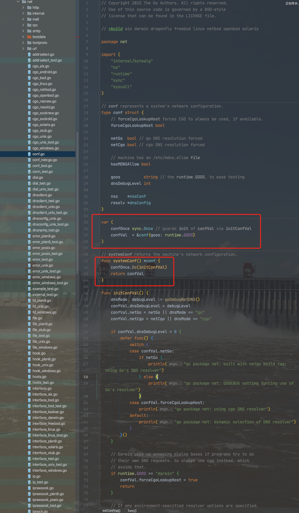

### <font color="#CD853F">初入门径</font>

<br>

sync.Once提供了保证某个操作只被执行一次的功能,其最常应用于单例模式之下,例如初始化系统配置、保持数据库唯一连接,以及并发访问只需要初始化一次的共享资源。


```go
package main

import (
	"fmt"
	"sync"
)

func main() {
	var once sync.Once
	fun1 := func() {
		fmt.Println("一只老虎")
	}
	once.Do(fun1)

	fun2 := func() {
		fmt.Println("两只老虎")
	}

	once.Do(fun2)
}

```

输出为:

```go
一只老虎
```

<br>


**并发调用 Do()**

```go
package main

import (
	"fmt"
	"sync"
	"time"
)

func main() {
	var once sync.Once
	for i := 0; i < 5; i++ {
		go func(i int) {
			fun1 := func() {
				fmt.Printf("i:=%d\n", i)
			}
			once.Do(fun1)
		}(i)
	}

	// 为防止主goroutine直接运行完，什么都看不到
	time.Sleep(50 * time.Millisecond)
}
```


在上面这段代码里,开启了5个并发的 goroutine ，不管执行多少次, 始终只打印一次.  至于 i 是多少,就看先执行的是哪个 g 了。

Once 保证只有第一次调用 Do() 方法时, 传递的 f (无参数无返回值的函数) 才会执行,并且之后不管调用的参数是否改变了,也不管f执行时是否发生了panic,之后都不再执行。


<br>

这段是官方Demo:

```go
 package main

 import (
     "fmt"
    "sync"
 )
 
 func main() {
     var once sync.Once
    onceBody := func() {
        fmt.Println("Only once")
    }
    done := make(chan bool)
    for i := 0; i < 10; i++ {
        go func() {
            once.Do(onceBody)
            done <- true
        }()
    }
    for i := 0; i < 10; i++ {
        <-done
    }
}
// 结果只打印一次：only once
```


<br>


---


<br>


### <font color="#CD853F">源码实现</font>

<br>

其代码实现很简洁, 从头到尾加注释不超过 70 行. 对外暴露了一个唯一接口 `Do(f func())`, 使用起来也很简单,可以多次调用,但是只有第一次调用Do方法时f参数才会执行,这里的f是一个无参数无返回值的函数。


<br>


<details>
<summary>点击查看 sync.Once源码:</summary>

```go
// Copyright 2009 The Go Authors. All rights reserved.
// Use of this source code is governed by a BSD-style
// license that can be found in the LICENSE file.

package sync

import (
	"sync/atomic"
)

// Once is an object that will perform exactly one action.
type Once struct {
	// done indicates whether the action has been performed.
	// It is first in the struct because it is used in the hot path.
	// The hot path is inlined at every call site.
	// Placing done first allows more compact instructions on some architectures (amd64/x86),
	// and fewer instructions (to calculate offset) on other architectures.

    // done用来表示当前的操作是否已经被执行, 0表示还没有执行过, 1表示已经执行
    // done属性放在结构体的第一位,是因为它在hot path中使用
    // hot path在每个调用点会被内联
    // 将done放在结构体首位,像amd64/386等架构上可以允许更多的压缩指令,且在其他架构上更少的指令去计算偏移量
	done uint32
	m    Mutex
}

// Do calls the function f if and only if Do is being called for the
// first time for this instance of Once. In other words, given
// 	var once Once
// if once.Do(f) is called multiple times, only the first call will invoke f,
// even if f has a different value in each invocation. A new instance of
// Once is required for each function to execute.
//
// Do is intended for initialization that must be run exactly once. Since f
// is niladic, it may be necessary to use a function literal to capture the
// arguments to a function to be invoked by Do:
// 	config.once.Do(func() { config.init(filename) })
//
// Because no call to Do returns until the one call to f returns, if f causes
// Do to be called, it will deadlock.
//
// If f panics, Do considers it to have returned; future calls of Do return
// without calling f.
//

// Do的作用主要是针对初始化且有且只能执行一次的场景。因为Do直到f返回才返回，`
// 所以如果f内再调用Do则会导致死锁
// 如果f执行过程中panic了 那么Do任务f已经执行完毕 未来再次调用不会再执行f

func (o *Once) Do(f func()) {
	// Note: Here is an incorrect implementation of Do:
	//
	//	if atomic.CompareAndSwapUint32(&o.done, 0, 1) {
	//		f()
	//	}
	//
	// Do guarantees that when it returns, f has finished.
	// This implementation would not implement that guarantee:
	// given two simultaneous calls, the winner of the cas would
	// call f, and the second would return immediately, without
	// waiting for the first's call to f to complete.
	// This is why the slow path falls back to a mutex, and why
	// the atomic.StoreUint32 must be delayed until after f returns.

	if atomic.LoadUint32(&o.done) == 0 {
		// Outlined slow-path to allow inlining of the fast-path.
        // 原子获取 done 的值，判断 done 值是否为 0，如果为 0 就调用 doSlow 方法，进行二次检查。
        // 可能会存在并发 进入slow-path
		o.doSlow(f)
	}
}

func (o *Once) doSlow(f func()) {
    // 二次检查时，持有互斥锁，保证只有一个 goroutine 执行。
	o.m.Lock()
	defer o.m.Unlock()
	if o.done == 0 { //二次判断f是否已经被执行
         // 二次检查，如果 done 的值仍为 0，则认为是第一次执行，执行参数 f，并将 done 的值设置为 1。

         //即使此时有多个 goroutine 同时进入了 doSlow 方法,因为双检查的机制,后续的 goroutine 会看到 o.done 的值为 1,也不会再次执行 f
		defer atomic.StoreUint32(&o.done, 1)
		f()
	}
}
```

</details>


Once 结构体中包含两个字段, 分别是 uint32 类型的 done 和 Mutex 类型的 m. 

Once 实现了两个方法, 分别是 **Do** 和 **doSlow**。其中 doSlow 是一个非可导出方法,只能在内部被 Do 方法调用.


Done 方法先原子获取 done 的值,如果 done 的值为 0,则调用 doSlow 方法进行二次检查,二次检查时,持有互斥锁,保证只有一个 goroutine 执行操作.如果二次检查的结果为 0,则认为是第一次执行,程序执行函数类型的参数 f,然后将 done 的值设置为 1.


<br>


---

<br>


###  <font color="#CD853F">注意事项</font>

<br>

```go
package main

import (
	"fmt"
	"sync"
)

func main() {

	panicDo()

	//nestedDo()
	nestedDo2()

}

func panicDo() {
	once := &sync.Once{}
	defer func() {
		if err := recover(); err != nil {
			once.Do(func() {
				fmt.Println("run in recover")
			})
		}
	}()
	once.Do(func() {
		panic("panic i=0")
	})
}

func nestedDo() {
	once := &sync.Once{}
	once.Do(func() {
		once.Do(func() {
			fmt.Println("test nestedDo")
		})
	})
}

func nestedDo2() {
	once1 := &sync.Once{}
	once2 := &sync.Once{}
	once1.Do(func() {
		once2.Do(func() {
			fmt.Println("test nestedDo")
		})
	})
}
```

[详解并发编程之sync.Once的实现(附上三道面试题)](https://segmentfault.com/a/1190000040038329)


(1). sync.Once()方法中传入的函数发生了panic，重复传入还会执行吗？

> 执行panicDo方法,不会打印任何东西. sync.Once.Do 方法中传入的函数只会被执行一次,哪怕函数中发生了 panic；

<br>

(2). sync.Once()方法传入的函数中再次调用sync.Once()方法会有什么问题吗？

> 会发生死锁! 执行nestedDo方法,会报 fatal error: all goroutines are asleep - deadlock!  根据源码实现,可知在第二个do方法会一直等doshow()中锁的释放导致发生了死锁;

<br>

(3). 执行nestedDo2,会输出什么?

> 会打印出 test nestedDo. once1，once2是两个对象,互不影响. 所以sync.Once是使方法只执行一次对象的实现。


<br>

---

<br>


### 官方库或知名项目中的使用

<br>


*net*包 *系统的网络配置* 就是存放在一个变量里,用`sync.Once`控制读写




<br>

<font size=1 color="orange">

当且仅当第一次读某个变量时，进行初始化（写操作）

变量被初始化过程中，所有读都被阻塞（读操作；当变量初始化完成后，读操作继续进行

变量仅初始化一次，初始化完成后驻留在内存里

</font>


[Golang package sync 剖析(一)： sync.Once](https://segmentfault.com/a/1190000040044135)


<br>

---


<br>


参考:

[你真的了解 sync.Once 吗](https://segmentfault.com/a/1190000040042235)

[深入源码分析golang之sync.Once](https://segmentfault.com/a/1190000040043353)


