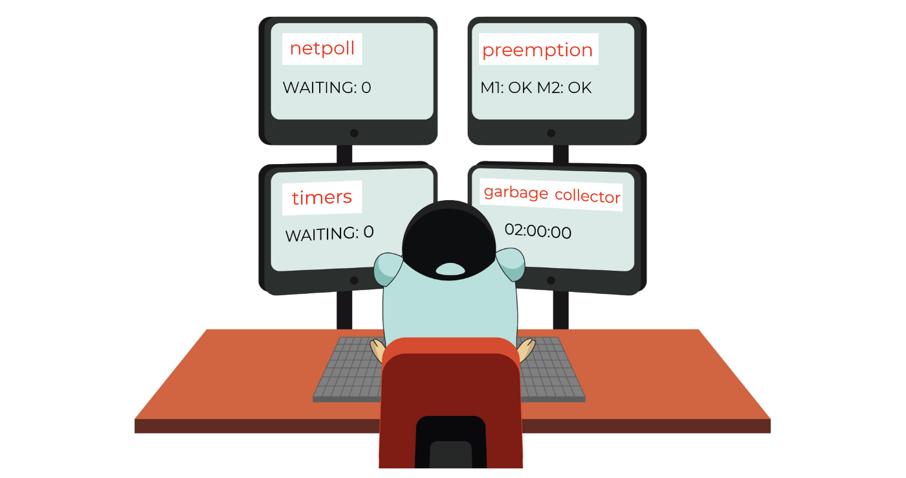
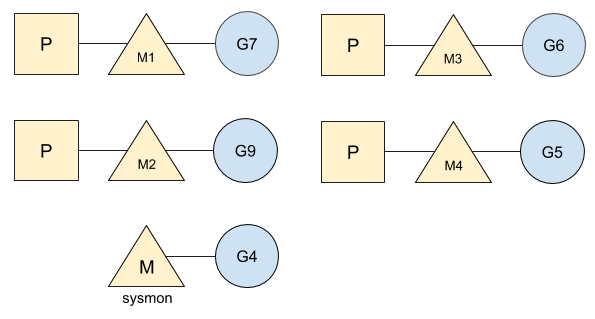
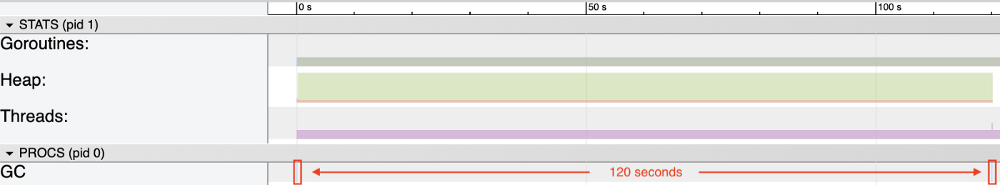
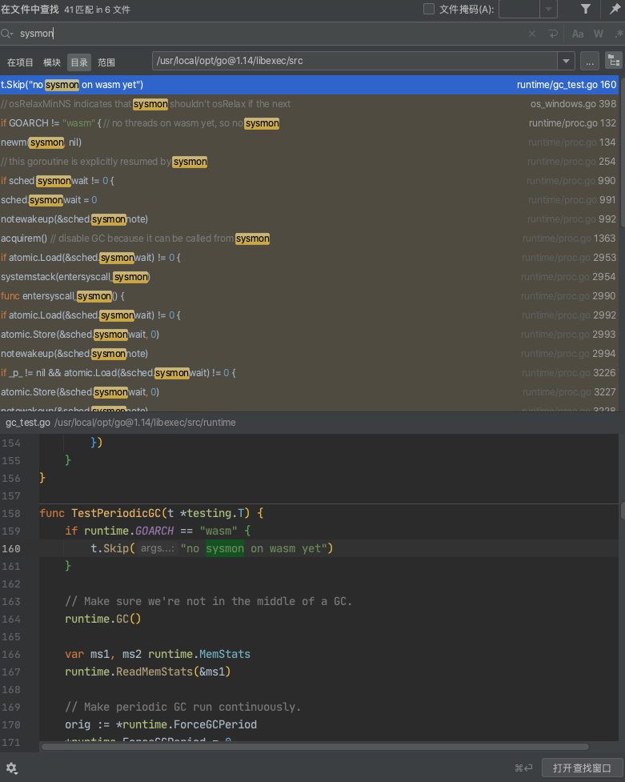

关于Sysmon，可先参考这篇 [Go Sysmon](https://godeamon.com/post/go-sysmon/)

或 [该地址](https://dashen.feishu.cn/docs/doccnDVPOqJpbiihrW7W5fqC6cg#JwwHOd)

原文作者*Vincent Blanchon*, 地址[Go: sysmon, Runtime Monitoring](https://medium.com/@blanchon.vincent/go-sysmon-runtime-monitoring-cff9395060b5),仅作翻译及注解

该篇博文被[GoCN](https://mp.weixin.qq.com/s/_upMCvpV3o7eqU56ZAfVXQ)收录

插图来自`A Journey With Go`,由 *Renee French*方面提供

这篇文章基于`Go 1.14`

 

Go的标准库提供了一种监测应用程序的线程,并帮你(找寻)程序可能遇到的瓶颈. 该线程称为`sysmon`，即系统监视器(system monitor).在**GMP模型**中,这个(特殊)线程未链接任何的P, 这意味着调度器(scheduler)没有将其考虑在内, 因此始终处于运行状态. 

如下是带有此特殊线程的图:

更多关于`GMP模型`的内容,推荐阅读作者的另一篇文章 [协程,系统线程及CPU管理](https://medium.com/a-journey-with-go/go-goroutine-os-thread-and-cpu-management-2f5a5eaf518a)

同样, 通过*Go tool trace*无法追踪到此线程.

( 译者注:Go并发的最小逻辑单位叫做goroutine, 是Go为实现并发提供的`用户态线程`，这种用户态线程运行在`内核态线程(OS线程)之上`,也称为协程. 协程是一种用户态的轻量级线程, 其调度完全由用户控制. 从技术角度说，“协程就是你可以暂停执行的函数”. 协程拥有自己的寄存器上下文和栈. 协程调度切换时, 将寄存器上下文和栈保存到其他地方, 在切回来时，恢复先前保存的寄存器上下文和栈. 直接操作栈则基本没有内核切换的开销, 可以不加锁的访问全局变量,所以上下文的切换非常快.

Go中的协程有三种：一种是主(轻量级)线程，一种是用来跑 sysmon 的(轻量级)线程，一种是普通的(轻量级)线程,

Q: 在调度过程中,如果一个goroutine一直占有CPU又不会有阻塞或则主动让出CPU的调度，scheduler怎么做抢占式调度让出CPU？

A: 有一个特殊的sysmon线程做抢占式调度, 当一个goroutine占用CPU超过**10毫秒**之后,调度器会根据实际情况提供不保证的协程切换

参考:

[Golang-Scheduler原理解析](https://blog.csdn.net/u010853261/article/details/84790392)

[协程与线程的区别](https://blog.csdn.net/fadbgfnbxb/article/details/88787361)
) 

 

---

### Scope

 

`sysmon`线程的作用很广, 主要涉及以下方面:

- 由应用程序创建的计时器(timers). `sysmon`线程查看应该在运行却仍在等待*执行时间*的计时器. 在这种情况下, Go将查看空闲的M和P列表, 以便尽可能快地运行它们.

- 网络轮询器和系统调用. 它将运行在网络操作中被阻塞的goroutine.

- 垃圾回收器（如果已经很长时间没有运行）. 如果垃圾回收器已经两分钟没有运行,则sysmon将强制执行一轮垃圾回收(GC).  如下是用*Go tool trace*工具生成的追踪示例:

- 长时间运行的goroutine的抢占. 任何运行时间超过**10毫秒**的goroutine都会被抢占, 将运行时间(running time)留给其他goroutine.

有关*异步抢占*的更多信息,推荐阅读作者 [Go：异步抢占](https://medium.com/a-journey-with-go/go-asynchronous-preemption-b5194227371c)

 

---

### Pace

 

`sysmon`足够聪明, 在无事可做时不会消耗资源. 其周期(循环时间)是动态的,取决于正在运行的程序的当前活动.

初始速度(执行频次)设置为**20纳秒**,这意味着`sysmon`线程一直在寻求(哪里需要)帮助.  然后，经过几个周期, 如果`sysmon`线程没有执行任何操作, 则两个周期之间的休眠将加倍, 直至达到**10毫秒**. 如果应用程序没有很多*系统调用*或 *长时间运行的goroutine*, 则该线程将在大多数情形下,回退变为**10毫秒**的延迟(执行频次),从而给应用程序带来非常小的开销.

`sysmon`线程还能够检测其何时不应运行, 如以下两种情况:

- 垃圾回收器即将要运行. (`sysmon`线程将在垃圾回收结束时恢复)
- 所有线程都处于空闲状态,没有任何一个在运行中

在这两种情况下, `sysmon`都会休眠，从而不会有任何不必要的资源消耗.

---

 

`sysmon`有关的源码, 主要在`runtime/proc.go`和`runtime/runtime2.go`中

