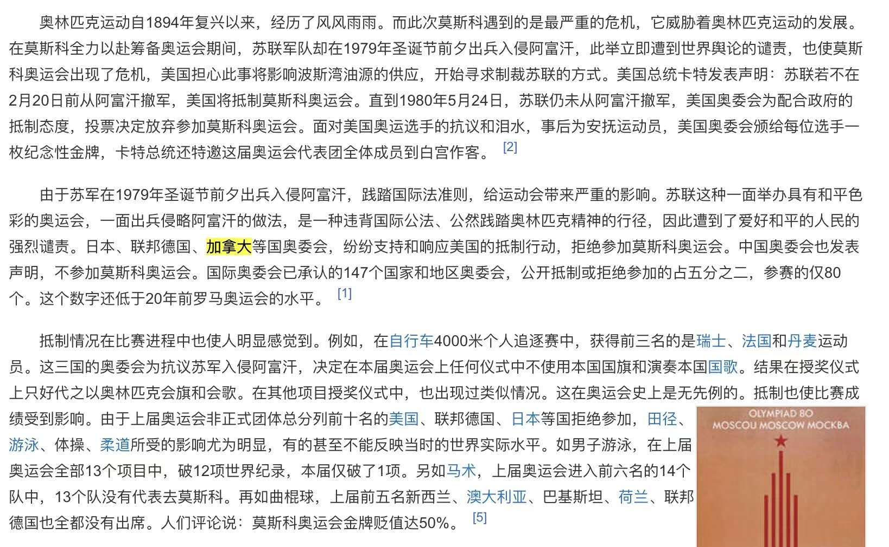
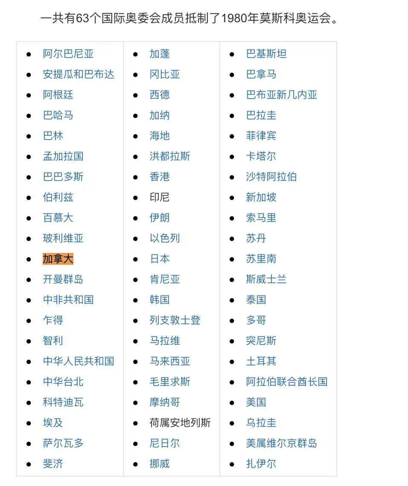
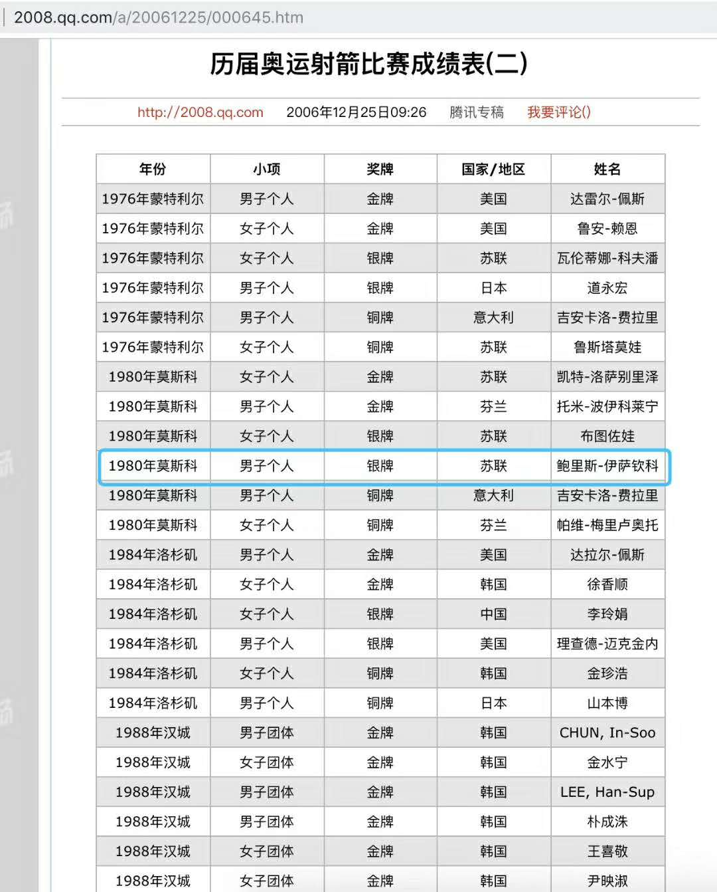
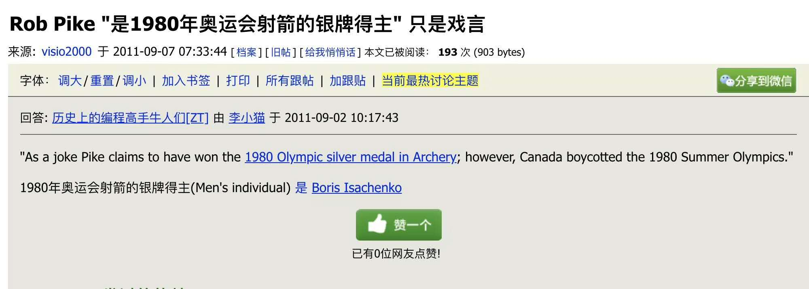

 

从一链接来到了“Go语言”三巨头之一，同时也是utf-8设计人和Unix重要开发者之一的[Rob Pike](https://en.wikipedia.org/wiki/Rob_Pike)词条下。

粗粗一扫，如同其他登峰造极可堪“之父”级的人一样，这位大神并不只在代码领域造诣精深，兴趣爱好广泛且均有不俗成绩。

但扫到还是“1980年奥运会射箭银牌得主”，敏锐生出疑问:1980年莫斯科奥运会不是遭到了我国和欧美多国的联合抵制，这位Rob Pike，难道和Google的[Sergey Brin](https://en.wikipedia.org/wiki/Sergey_Brin)一样，是后来从俄罗斯移民到美国？

但我又分明模糊地感知，除去Ruby和Lua出自日本人和巴西人之手，其他为我广泛接触并使用的语言或系统，“其父”多为西欧/北欧/北美人。

C语言之父出生于美国（同时也是Unix之父，在乔布斯逝世一周后离开人世，却鲜有人祭奠），C++之父出生于丹麦，Java之父出生于加拿大，PHP之父出生于加拿大，Python之父出生于荷兰，Linux之父生于芬兰 ...

我搜索了Rob Pike的国籍，生于加拿大。而加拿大作为西方阵营，妥妥没有参与1980年莫斯科奥运会（且因为1976年为蒙特利尔奥运会，二者交接十分冷清）。

继而又查阅了那届奥运会射箭项目银牌得主，确信非此大牛。

而输入关键词，中文互联网充斥着这一虚假介绍。然后谷歌，得到了也许是整个中文网站唯一一条辟谣的消息。…

那我就纳闷了，这一谣传是是怎样差之毫厘，最后谬以千里以成丁公凿井的..