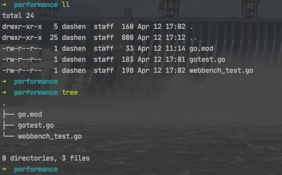
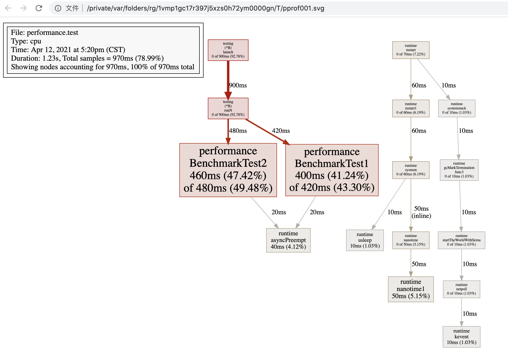

<br>


> 达到相同目的,可以有多种写法,每种写法有性能、可读性方面的区别,本文旨在探讨不同写法之间的性能差异


如何写*单元测试*及*基准测试*(即*性能测试*),可参考 :

[go test test & benchmark](http://t.zoukankan.com/diegodu-p-5464802.html)

[go test常用介绍](https://blog.csdn.net/qq_28119741/article/details/85219164)

[Go测试](https://dashen.tech/2016/04/12/Go%E6%B5%8B%E8%AF%95/)


<br>

---


<br>


## <font color="#1E90FF"> len(str)  vs  str == "" </font>

<br>


本部分参考自:

[问个 Go 问题，字符串 len == 0 和 字符串== "" ，有啥区别？](https://segmentfault.com/a/1190000039745763)

<br>




<br>

`gotest.go:`

```go
package gotest

func Test1() bool {
	var v string
	if v == "" {
		return true
	}
	return false
}

func Test2() bool {
	var v string
	if len(v) == 0 {
		return true
	}
	return false
}
```

<br>


`webbench_test.go:`

```go
package gotest

import (
	"testing"
)

func BenchmarkTest1(b *testing.B) {
	for i := 0; i < b.N; i++ {
		Test1()
	}
}

func BenchmarkTest2(b *testing.B) {
	for i := 0; i < b.N; i++ {
		Test2()
	}
}
```

<br>

执行 `go test -test.bench=".*"`


```go
goos: darwin
goarch: amd64
pkg: note/performance
BenchmarkTest1-8        1000000000               0.467 ns/op
BenchmarkTest2-8        1000000000               0.464 ns/op
PASS
ok      note/performance        1.290s
```

第4行显示了BenchmarkTest1执行了1000000000次，每次的执行平均时间是0.467纳秒，

第5行显示了BenchmarkTest2也执行了1000000000次，每次的平均执行时间是0.464 纳秒。

最后一行显示总共的执行时间为 1.290s


<br>


可使用`-count`来指定执行多少次 `go test -test.bench=".*" -count=5`:

```go
goos: darwin
goarch: amd64
pkg: note/performance
BenchmarkTest1-8        1000000000               0.485 ns/op
BenchmarkTest1-8        1000000000               0.484 ns/op
BenchmarkTest1-8        1000000000               0.464 ns/op
BenchmarkTest1-8        1000000000               0.497 ns/op
BenchmarkTest1-8        1000000000               0.479 ns/op
BenchmarkTest2-8        1000000000               0.490 ns/op
BenchmarkTest2-8        1000000000               0.476 ns/op
BenchmarkTest2-8        1000000000               0.482 ns/op
BenchmarkTest2-8        1000000000               0.469 ns/op
BenchmarkTest2-8        1000000000               0.474 ns/op
PASS
ok      note/performance        5.791s
```


<br>

`go test --bench=. -benchmem`


(添加 `-benchmem` 参数,可以提供每次操作分配内存的次数，以及每次操作分配的字节数。参考 [go benchmark 性能测试](https://blog.csdn.net/weixin_34232617/article/details/91854391))

```go
goos: darwin
goarch: amd64
pkg: note/performance
BenchmarkTest1-8        1000000000               0.471 ns/op           0 B/op          0 allocs/op
BenchmarkTest2-8        1000000000               0.462 ns/op           0 B/op          0 allocs/op
PASS
ok      note/performance        1.457s
```


<br>

经过多次测试,可知:

<1>. 性能几乎没有差别

<2>. 均不涉及内存申请和操作，均为 0 allocs/op。(也说明变量并不是声明了,就有初始化动作. Go 编译器有做优化)


<br>

进一步看两者的汇编代码，以细究具体区别在哪里：

` go tool compile -S gotest.go:`

```go
"".Test1 STEXT nosplit size=6 args=0x8 locals=0x0
        0x0000 00000 (gotest.go:3)      TEXT    "".Test1(SB), NOSPLIT|ABIInternal, $0-8
        0x0000 00000 (gotest.go:3)      PCDATA  $0, $-2
        0x0000 00000 (gotest.go:3)      PCDATA  $1, $-2
        0x0000 00000 (gotest.go:3)      FUNCDATA        $0, gclocals·33cdeccccebe80329f1fdbee7f5874cb(SB)
        0x0000 00000 (gotest.go:3)      FUNCDATA        $1, gclocals·33cdeccccebe80329f1fdbee7f5874cb(SB)
        0x0000 00000 (gotest.go:3)      FUNCDATA        $2, gclocals·33cdeccccebe80329f1fdbee7f5874cb(SB)
        0x0000 00000 (gotest.go:6)      PCDATA  $0, $0
        0x0000 00000 (gotest.go:6)      PCDATA  $1, $0
        0x0000 00000 (gotest.go:6)      MOVB    $1, "".~r0+8(SP)
        0x0005 00005 (gotest.go:6)      RET
        0x0000 c6 44 24 08 01 c3                                .D$...
"".Test2 STEXT nosplit size=6 args=0x8 locals=0x0
        0x0000 00000 (gotest.go:11)     TEXT    "".Test2(SB), NOSPLIT|ABIInternal, $0-8
        0x0000 00000 (gotest.go:11)     PCDATA  $0, $-2
        0x0000 00000 (gotest.go:11)     PCDATA  $1, $-2
        0x0000 00000 (gotest.go:11)     FUNCDATA        $0, gclocals·33cdeccccebe80329f1fdbee7f5874cb(SB)
        0x0000 00000 (gotest.go:11)     FUNCDATA        $1, gclocals·33cdeccccebe80329f1fdbee7f5874cb(SB)
        0x0000 00000 (gotest.go:11)     FUNCDATA        $2, gclocals·33cdeccccebe80329f1fdbee7f5874cb(SB)
        0x0000 00000 (gotest.go:14)     PCDATA  $0, $0
        0x0000 00000 (gotest.go:14)     PCDATA  $1, $0
        0x0000 00000 (gotest.go:14)     MOVB    $1, "".~r0+8(SP)
        0x0005 00005 (gotest.go:14)     RET
        0x0000 c6 44 24 08 01 c3                                .D$...


go.cuinfo.packagename. SDWARFINFO dupok size=0
        0x0000 67 6f 74 65 73 74                                gotest
go.loc."".Test1 SDWARFLOC size=0
go.info."".Test1 SDWARFINFO size=46
        0x0000 03 22 22 2e 54 65 73 74 31 00 00 00 00 00 00 00  ."".Test1.......
        0x0010 00 00 00 00 00 00 00 00 00 00 01 9c 00 00 00 00  ................
        0x0020 01 0f 7e 72 30 00 01 03 00 00 00 00 00 00        ..~r0.........
        rel 0+0 t=24 type.bool+0
        rel 10+8 t=1 "".Test1+0
        rel 18+8 t=1 "".Test1+6
        rel 28+4 t=30 gofile../Users/dashen/go/src/note/performance/gotest.go+0
        rel 40+4 t=29 go.info.bool+0
go.range."".Test1 SDWARFRANGE size=0
go.debuglines."".Test1 SDWARFMISC size=11
        0x0000 04 02 14 06 41 04 01 03 7b 06 01                 ....A...{..
go.loc."".Test2 SDWARFLOC size=0
go.info."".Test2 SDWARFINFO size=46
        0x0000 03 22 22 2e 54 65 73 74 32 00 00 00 00 00 00 00  ."".Test2.......
        0x0010 00 00 00 00 00 00 00 00 00 00 01 9c 00 00 00 00  ................
        0x0020 01 0f 7e 72 30 00 01 0b 00 00 00 00 00 00        ..~r0.........
        rel 0+0 t=24 type.bool+0
        rel 10+8 t=1 "".Test2+0
        rel 18+8 t=1 "".Test2+6
        rel 28+4 t=30 gofile../Users/dashen/go/src/note/performance/gotest.go+0
        rel 40+4 t=29 go.info.bool+0
go.range."".Test2 SDWARFRANGE size=0
go.debuglines."".Test2 SDWARFMISC size=13
        0x0000 04 02 03 08 14 06 41 04 01 03 73 06 01           ......A...s..
gclocals·33cdeccccebe80329f1fdbee7f5874cb SRODATA dupok size=8
        0x0000 01 00 00 00 00 00 00 00                          ........

```

编译出来的汇编代码是完全一致的,可以明确 Go 编译器对此做了优化（应该是直接比对了）


<br>

> ----- EOF选看: -----


生成pprof:


`go test -bench=".*" -cpuprofile=cpu.profile ../xxx文件夹 `


此时会在文件夹下,生成一个 **xxx.test**


`go tool pprof xxx.test cpu.profile `:

```go
File: performance.test
Type: cpu
Time: Apr 12, 2021 at 5:20pm (CST)
Duration: 1.23s, Total samples = 970ms (78.99%)
Entering interactive mode (type "help" for commands, "o" for options)
(pprof) 
(pprof) o
  call_tree                 = false                
  compact_labels            = true                 
  cumulative                = flat                 //: [cum | flat]
  divide_by                 = 1                    
  drop_negative             = false                
  edgefraction              = 0.001                
  focus                     = ""                   
  granularity               = filefunctions        //: [addresses | filefunctions | files | functions | lines]
  hide                      = ""                   
  ignore                    = ""                   
  mean                      = false                
  nodecount                 = -1                   //: default
  nodefraction              = 0.005                
  noinlines                 = false                
  normalize                 = false                
  output                    = ""                   
  prune_from                = ""                   
  relative_percentages      = false                
  sample_index              = cpu                  //: [samples | cpu]
  show                      = ""                   
  show_from                 = ""                   
  tagfocus                  = ""                   
  taghide                   = ""                   
  tagignore                 = ""                   
  tagshow                   = ""                   
  trim                      = true                 
  trim_path                 = ""                   
  unit                      = minimum 
  ```

<br>


执行 `go tool pprof  -web xxx.test cpu.profile`



<br>

> ----- EOF -----


<br>


---

<br>


## <font color="#1E90FF"> 几种 *int转string* 方法的性能差异</font>


<br>

```go
package shuang

import (
	"fmt"
	"strconv"
	"testing"
)

func BenchmarkSprintf(b *testing.B) {
	n := 10
	b.ResetTimer()
	for i := 0; i < b.N; i++ {
		fmt.Sprintf("%d", n)
	}
}

func BenchmarkItoa(b *testing.B) {
	n := 10
	b.ResetTimer()
	for i := 0; i < b.N; i++ {
		strconv.Itoa(n)
	}
}

func BenchmarkFormatInt(b *testing.B) {
	n := int64(10)
	b.ResetTimer()
	for i := 0; i < b.N; i++ {
		strconv.FormatInt(n, 10)
	}
}

```


执行 `go test -test.bench=".*" -benchmem`


```go
goos: darwin
goarch: amd64
pkg: dashen
BenchmarkSprintf-8      14417409                75.9 ns/op            16 B/op          2 allocs/op
BenchmarkItoa-8         452276205                2.64 ns/op            0 B/op          0 allocs/op
BenchmarkFormatInt-8    492620018                2.42 ns/op            0 B/op          0 allocs/op
PASS
ok      dashen  4.518s

```

<br>

第4行显示了BenchmarkSprintf-8 执行了14417409次，每次的执行平均时间是75.9纳秒, *每次操作有两次内存分配,每次分配了16Byte大小的内存空间*

第5行显示了BenchmarkItoa-8 执行了452276205次，每次的平均执行时间是2.64 纳秒, *无内存分配* 

第6行显示了BenchmarkFormatInt-8 执行了492620018次，每次的平均执行时间是2.42 纳秒, *无内存分配* 。

最后一行显示总共的执行时间为 4.518s

<br>


可见, `strconv.FormatInt(n, 10)` 和 `strconv.Itoa(n)` 性能差不多, `fmt.Sprintf()` 性能最差


[Golang 中整数转字符串](https://blog.cyeam.com/golang/2018/06/20/go-itoa)

<br>

---

<br>


## <font color="#1E90FF">几种 *字符串拼接* 写法的性能差异</font>


<br>


将两个字符串 "hello"和"world",拼接为"hello,world"

<br>

```go
package shuang

import (
	"bytes"
	"fmt"
	"strings"
	"testing"
)

func BenchmarkAddStringWithOperator(b *testing.B) {
	hello := "hello"
	world := "world"
	for i := 0; i < b.N; i++ {
		_ = hello + "," + world
	}
}

func BenchmarkAddStringWithSprintf(b *testing.B) {
	hello := "hello"
	world := "world"
	for i := 0; i < b.N; i++ {
		_ = fmt.Sprintf("%s,%s", hello, world)
	}
}

func BenchmarkAddStringWithJoin(b *testing.B) {
	hello := "hello"
	world := "world"
	for i := 0; i < b.N; i++ {
		_ = strings.Join([]string{hello, world}, ",")
	}
}

func BenchmarkAddStringWithBuffer(b *testing.B) {
	hello := "hello"
	world := "world"
	for i := 0; i < 1000; i++ {
		var buffer bytes.Buffer
		buffer.WriteString(hello)
		buffer.WriteString(",")
		buffer.WriteString(world)
		_ = buffer.String()
	}
}

```

<br>

执行 `go test -test.bench=".*" -benchmem`


```go
goos: darwin
goarch: amd64
pkg: dashen
BenchmarkAddStringWithOperator-8        52448029                21.4 ns/op             0 B/op          0 allocs/op
BenchmarkAddStringWithSprintf-8          8755447               136 ns/op              48 B/op          3 allocs/op
BenchmarkAddStringWithJoin-8            31878931                37.0 ns/op            16 B/op          1 allocs/op
BenchmarkAddStringWithBuffer-8          1000000000               0.000104 ns/op        0 B/op          0 allocs/op
PASS
ok      dashen  4.420s


```

第4行显示了BenchmarkAddStringWithOperator-8  执行了52448029次，每次的执行平均时间是 21.4纳秒, *无内存分配*

第5行显示了BenchmarkAddStringWithSprintf-8  执行了8755447次，每次的平均执行时间是 136纳秒, *每次操作有3次内存分配,每次分配了48Byte大小的内存空间*

第6行显示了BenchmarkAddStringWithJoin-8  执行了31878931次，每次的平均执行时间是 37.0纳秒, *每次操作有1次内存分配,每次分配了16Byte大小的内存空间*

第7行显示了BenchmarkAddStringWithBuffer-8  执行了1000000000次，每次的平均执行时间是 0.000104纳秒, *无内存分配*

最后一行显示总共的执行时间为 4.420s

<br>


可见, `fmt.Sprintf()`和`strings.Join()`均有内存分配,`buffer.WriteString()`性能最好


<br>


通过 `go tool compile -S gotest.go:` 看四种方法的汇编代码:


```go
"".BenchmarkAddStringWithOperator STEXT size=164 args=0x8 locals=0x78
        0x0000 00000 (join_test.go:10)  TEXT    "".BenchmarkAddStringWithOperator(SB), ABIInternal, $120-8
        0x0000 00000 (join_test.go:10)  MOVQ    (TLS), CX
        0x0009 00009 (join_test.go:10)  CMPQ    SP, 16(CX)
        0x000d 00013 (join_test.go:10)  PCDATA  $0, $-2
        0x000d 00013 (join_test.go:10)  JLS     154
        0x0013 00019 (join_test.go:10)  PCDATA  $0, $-1
        0x0013 00019 (join_test.go:10)  SUBQ    $120, SP
        0x0017 00023 (join_test.go:10)  MOVQ    BP, 112(SP)
        0x001c 00028 (join_test.go:10)  LEAQ    112(SP), BP
        0x0021 00033 (join_test.go:10)  PCDATA  $0, $-2
        0x0021 00033 (join_test.go:10)  PCDATA  $1, $-2
        0x0021 00033 (join_test.go:10)  FUNCDATA        $0, gclocals·a36216b97439c93dafebe03e7f0808b5(SB)
        0x0021 00033 (join_test.go:10)  FUNCDATA        $1, gclocals·33cdeccccebe80329f1fdbee7f5874cb(SB)
        0x0021 00033 (join_test.go:10)  FUNCDATA        $2, gclocals·96839595c383af6ae8227769d90a999e(SB)
        0x0021 00033 (join_test.go:10)  PCDATA  $0, $0
        0x0021 00033 (join_test.go:10)  PCDATA  $1, $0
        0x0021 00033 (join_test.go:10)  XORL    AX, AX
        0x0023 00035 (join_test.go:13)  JMP     127
        0x0025 00037 (join_test.go:13)  MOVQ    AX, "".i+72(SP)
        0x002a 00042 (join_test.go:14)  PCDATA  $0, $1
        0x002a 00042 (join_test.go:14)  LEAQ    ""..autotmp_4+80(SP), AX
        0x002f 00047 (join_test.go:14)  PCDATA  $0, $0
        0x002f 00047 (join_test.go:14)  MOVQ    AX, (SP)
        0x0033 00051 (join_test.go:14)  PCDATA  $0, $1
        0x0033 00051 (join_test.go:14)  LEAQ    go.string."hello"(SB), AX
        0x003a 00058 (join_test.go:14)  PCDATA  $0, $0
        0x003a 00058 (join_test.go:14)  MOVQ    AX, 8(SP)
        0x003f 00063 (join_test.go:14)  MOVQ    $5, 16(SP)
        0x0048 00072 (join_test.go:14)  PCDATA  $0, $2
        0x0048 00072 (join_test.go:14)  LEAQ    go.string.","(SB), CX
        0x004f 00079 (join_test.go:14)  PCDATA  $0, $0
        0x004f 00079 (join_test.go:14)  MOVQ    CX, 24(SP)
        0x0054 00084 (join_test.go:14)  MOVQ    $1, 32(SP)
        0x005d 00093 (join_test.go:14)  PCDATA  $0, $3
        0x005d 00093 (join_test.go:14)  LEAQ    go.string."world"(SB), DX
        0x0064 00100 (join_test.go:14)  PCDATA  $0, $0
        0x0064 00100 (join_test.go:14)  MOVQ    DX, 40(SP)
        0x0069 00105 (join_test.go:14)  MOVQ    $5, 48(SP)
        0x0072 00114 (join_test.go:14)  CALL    runtime.concatstring3(SB)
        0x0077 00119 (join_test.go:13)  MOVQ    "".i+72(SP), AX
        0x007c 00124 (join_test.go:13)  INCQ    AX
        0x007f 00127 (join_test.go:13)  PCDATA  $0, $2
        0x007f 00127 (join_test.go:13)  MOVQ    "".b+128(SP), CX
        0x0087 00135 (join_test.go:13)  PCDATA  $0, $0
        0x0087 00135 (join_test.go:13)  CMPQ    272(CX), AX
        0x008e 00142 (join_test.go:13)  JGT     37
        0x0090 00144 (join_test.go:13)  PCDATA  $0, $-1
        0x0090 00144 (join_test.go:13)  PCDATA  $1, $-1
        0x0090 00144 (join_test.go:13)  MOVQ    112(SP), BP
        0x0095 00149 (join_test.go:13)  ADDQ    $120, SP
        0x0099 00153 (join_test.go:13)  RET
        0x009a 00154 (join_test.go:13)  NOP
        0x009a 00154 (join_test.go:10)  PCDATA  $1, $-1
        0x009a 00154 (join_test.go:10)  PCDATA  $0, $-2
        0x009a 00154 (join_test.go:10)  CALL    runtime.morestack_noctxt(SB)
        0x009f 00159 (join_test.go:10)  PCDATA  $0, $-1
        0x009f 00159 (join_test.go:10)  JMP     0
        0x0000 65 48 8b 0c 25 00 00 00 00 48 3b 61 10 0f 86 87  eH..%....H;a....
        0x0010 00 00 00 48 83 ec 78 48 89 6c 24 70 48 8d 6c 24  ...H..xH.l$pH.l$
        0x0020 70 31 c0 eb 5a 48 89 44 24 48 48 8d 44 24 50 48  p1..ZH.D$HH.D$PH
        0x0030 89 04 24 48 8d 05 00 00 00 00 48 89 44 24 08 48  ..$H......H.D$.H
        0x0040 c7 44 24 10 05 00 00 00 48 8d 0d 00 00 00 00 48  .D$.....H......H
        0x0050 89 4c 24 18 48 c7 44 24 20 01 00 00 00 48 8d 15  .L$.H.D$ ....H..
        0x0060 00 00 00 00 48 89 54 24 28 48 c7 44 24 30 05 00  ....H.T$(H.D$0..
        0x0070 00 00 e8 00 00 00 00 48 8b 44 24 48 48 ff c0 48  .......H.D$HH..H
        0x0080 8b 8c 24 80 00 00 00 48 39 81 10 01 00 00 7f 95  ..$....H9.......
        0x0090 48 8b 6c 24 70 48 83 c4 78 c3 e8 00 00 00 00 e9  H.l$pH..x.......
        0x00a0 5c ff ff ff                                      \...
        rel 5+4 t=17 TLS+0
        rel 54+4 t=16 go.string."hello"+0
        rel 75+4 t=16 go.string.","+0
        rel 96+4 t=16 go.string."world"+0
        rel 115+4 t=8 runtime.concatstring3+0
        rel 155+4 t=8 runtime.morestack_noctxt+0


"".BenchmarkAddStringWithSprintf STEXT size=254 args=0x8 locals=0x70
        0x0000 00000 (join_test.go:18)  TEXT    "".BenchmarkAddStringWithSprintf(SB), ABIInternal, $112-8
        0x0000 00000 (join_test.go:18)  MOVQ    (TLS), CX
        0x0009 00009 (join_test.go:18)  CMPQ    SP, 16(CX)
        0x000d 00013 (join_test.go:18)  PCDATA  $0, $-2
        0x000d 00013 (join_test.go:18)  JLS     244
        0x0013 00019 (join_test.go:18)  PCDATA  $0, $-1
        0x0013 00019 (join_test.go:18)  SUBQ    $112, SP
        0x0017 00023 (join_test.go:18)  MOVQ    BP, 104(SP)
        0x001c 00028 (join_test.go:18)  LEAQ    104(SP), BP
        0x0021 00033 (join_test.go:18)  PCDATA  $0, $-2
        0x0021 00033 (join_test.go:18)  PCDATA  $1, $-2
        0x0021 00033 (join_test.go:18)  FUNCDATA        $0, gclocals·69a9291448fa273f79569cb593f615b2(SB)
        0x0021 00033 (join_test.go:18)  FUNCDATA        $1, gclocals·306ea4dc593c4841cf74b8270a1a332d(SB)
        0x0021 00033 (join_test.go:18)  FUNCDATA        $2, gclocals·a5a3f3e663b1ae9c2739369df7a1eae5(SB)
        0x0021 00033 (join_test.go:18)  FUNCDATA        $3, "".BenchmarkAddStringWithSprintf.stkobj(SB)
        0x0021 00033 (join_test.go:18)  PCDATA  $0, $0
        0x0021 00033 (join_test.go:18)  PCDATA  $1, $0
        0x0021 00033 (join_test.go:18)  XORL    AX, AX
        0x0023 00035 (join_test.go:21)  JMP     216
        0x0028 00040 (join_test.go:21)  MOVQ    AX, "".i+56(SP)
        0x002d 00045 (join_test.go:22)  PCDATA  $0, $1
        0x002d 00045 (join_test.go:22)  LEAQ    go.string."hello"(SB), AX
        0x0034 00052 (join_test.go:22)  PCDATA  $0, $0
        0x0034 00052 (join_test.go:22)  MOVQ    AX, (SP)
        0x0038 00056 (join_test.go:22)  MOVQ    $5, 8(SP)
        0x0041 00065 (join_test.go:22)  CALL    runtime.convTstring(SB)
        0x0046 00070 (join_test.go:22)  PCDATA  $0, $1
        0x0046 00070 (join_test.go:22)  MOVQ    16(SP), AX
        0x004b 00075 (join_test.go:22)  PCDATA  $0, $0
        0x004b 00075 (join_test.go:22)  PCDATA  $1, $1
        0x004b 00075 (join_test.go:22)  MOVQ    AX, ""..autotmp_13+64(SP)
        0x0050 00080 (join_test.go:22)  PCDATA  $0, $2
        0x0050 00080 (join_test.go:22)  LEAQ    go.string."world"(SB), CX
        0x0057 00087 (join_test.go:22)  PCDATA  $0, $0
        0x0057 00087 (join_test.go:22)  MOVQ    CX, (SP)
        0x005b 00091 (join_test.go:22)  MOVQ    $5, 8(SP)
        0x0064 00100 (join_test.go:22)  CALL    runtime.convTstring(SB)
        0x0069 00105 (join_test.go:22)  PCDATA  $0, $1
        0x0069 00105 (join_test.go:22)  MOVQ    16(SP), AX
        0x006e 00110 (join_test.go:22)  PCDATA  $1, $2
        0x006e 00110 (join_test.go:22)  XORPS   X0, X0
        0x0071 00113 (join_test.go:22)  MOVUPS  X0, ""..autotmp_4+72(SP)
        0x0076 00118 (join_test.go:22)  MOVUPS  X0, ""..autotmp_4+88(SP)
        0x007b 00123 (join_test.go:22)  PCDATA  $0, $3
        0x007b 00123 (join_test.go:22)  LEAQ    type.string(SB), CX
        0x0082 00130 (join_test.go:22)  MOVQ    CX, ""..autotmp_4+72(SP)
        0x0087 00135 (join_test.go:22)  PCDATA  $0, $4
        0x0087 00135 (join_test.go:22)  PCDATA  $1, $3
        0x0087 00135 (join_test.go:22)  MOVQ    ""..autotmp_13+64(SP), DX
        0x008c 00140 (join_test.go:22)  PCDATA  $0, $3
        0x008c 00140 (join_test.go:22)  MOVQ    DX, ""..autotmp_4+80(SP)
        0x0091 00145 (join_test.go:22)  PCDATA  $0, $1
        0x0091 00145 (join_test.go:22)  MOVQ    CX, ""..autotmp_4+88(SP)
        0x0096 00150 (join_test.go:22)  PCDATA  $0, $0
        0x0096 00150 (join_test.go:22)  MOVQ    AX, ""..autotmp_4+96(SP)
        0x009b 00155 (join_test.go:22)  PCDATA  $0, $1
        0x009b 00155 (join_test.go:22)  LEAQ    go.string."%s,%s"(SB), AX
        0x00a2 00162 (join_test.go:22)  PCDATA  $0, $0
        0x00a2 00162 (join_test.go:22)  MOVQ    AX, (SP)
        0x00a6 00166 (join_test.go:22)  MOVQ    $5, 8(SP)
        0x00af 00175 (join_test.go:22)  PCDATA  $0, $5
        0x00af 00175 (join_test.go:22)  PCDATA  $1, $0
        0x00af 00175 (join_test.go:22)  LEAQ    ""..autotmp_4+72(SP), DX
        0x00b4 00180 (join_test.go:22)  PCDATA  $0, $0
        0x00b4 00180 (join_test.go:22)  MOVQ    DX, 16(SP)
        0x00b9 00185 (join_test.go:22)  MOVQ    $2, 24(SP)
        0x00c2 00194 (join_test.go:22)  MOVQ    $2, 32(SP)
        0x00cb 00203 (join_test.go:22)  CALL    fmt.Sprintf(SB)
        0x00d0 00208 (join_test.go:21)  MOVQ    "".i+56(SP), AX
        0x00d5 00213 (join_test.go:21)  INCQ    AX
        0x00d8 00216 (join_test.go:21)  PCDATA  $0, $2
        0x00d8 00216 (join_test.go:21)  MOVQ    "".b+120(SP), CX
        0x00dd 00221 (join_test.go:21)  PCDATA  $0, $0
        0x00dd 00221 (join_test.go:21)  CMPQ    272(CX), AX
        0x00e4 00228 (join_test.go:21)  JGT     40
        0x00ea 00234 (join_test.go:21)  PCDATA  $0, $-1
        0x00ea 00234 (join_test.go:21)  PCDATA  $1, $-1
        0x00ea 00234 (join_test.go:21)  MOVQ    104(SP), BP
        0x00ef 00239 (join_test.go:21)  ADDQ    $112, SP
        0x00f3 00243 (join_test.go:21)  RET
        0x00f4 00244 (join_test.go:21)  NOP
        0x00f4 00244 (join_test.go:18)  PCDATA  $1, $-1
        0x00f4 00244 (join_test.go:18)  PCDATA  $0, $-2
        0x00f4 00244 (join_test.go:18)  CALL    runtime.morestack_noctxt(SB)
        0x00f9 00249 (join_test.go:18)  PCDATA  $0, $-1
        0x00f9 00249 (join_test.go:18)  JMP     0
        0x0000 65 48 8b 0c 25 00 00 00 00 48 3b 61 10 0f 86 e1  eH..%....H;a....
        0x0010 00 00 00 48 83 ec 70 48 89 6c 24 68 48 8d 6c 24  ...H..pH.l$hH.l$
        0x0020 68 31 c0 e9 b0 00 00 00 48 89 44 24 38 48 8d 05  h1......H.D$8H..
        0x0030 00 00 00 00 48 89 04 24 48 c7 44 24 08 05 00 00  ....H..$H.D$....
        0x0040 00 e8 00 00 00 00 48 8b 44 24 10 48 89 44 24 40  ......H.D$.H.D$@
        0x0050 48 8d 0d 00 00 00 00 48 89 0c 24 48 c7 44 24 08  H......H..$H.D$.
        0x0060 05 00 00 00 e8 00 00 00 00 48 8b 44 24 10 0f 57  .........H.D$..W
        0x0070 c0 0f 11 44 24 48 0f 11 44 24 58 48 8d 0d 00 00  ...D$H..D$XH....
        0x0080 00 00 48 89 4c 24 48 48 8b 54 24 40 48 89 54 24  ..H.L$HH.T$@H.T$
        0x0090 50 48 89 4c 24 58 48 89 44 24 60 48 8d 05 00 00  PH.L$XH.D$`H....
        0x00a0 00 00 48 89 04 24 48 c7 44 24 08 05 00 00 00 48  ..H..$H.D$.....H
        0x00b0 8d 54 24 48 48 89 54 24 10 48 c7 44 24 18 02 00  .T$HH.T$.H.D$...
        0x00c0 00 00 48 c7 44 24 20 02 00 00 00 e8 00 00 00 00  ..H.D$ .........
        0x00d0 48 8b 44 24 38 48 ff c0 48 8b 4c 24 78 48 39 81  H.D$8H..H.L$xH9.
        0x00e0 10 01 00 00 0f 8f 3e ff ff ff 48 8b 6c 24 68 48  ......>...H.l$hH
        0x00f0 83 c4 70 c3 e8 00 00 00 00 e9 02 ff ff ff        ..p...........
        rel 5+4 t=17 TLS+0
        rel 48+4 t=16 go.string."hello"+0
        rel 66+4 t=8 runtime.convTstring+0
        rel 83+4 t=16 go.string."world"+0
        rel 101+4 t=8 runtime.convTstring+0
        rel 126+4 t=16 type.string+0
        rel 158+4 t=16 go.string."%s,%s"+0
        rel 204+4 t=8 fmt.Sprintf+0
        rel 245+4 t=8 runtime.morestack_noctxt+0
type..eq.[2]interface {} STEXT dupok size=179 args=0x18 locals=0x30
        0x0000 00000 (<autogenerated>:1)        TEXT    type..eq.[2]interface {}(SB), DUPOK|ABIInternal, $48-24
        0x0000 00000 (<autogenerated>:1)        MOVQ    (TLS), CX
        0x0009 00009 (<autogenerated>:1)        CMPQ    SP, 16(CX)
        0x000d 00013 (<autogenerated>:1)        PCDATA  $0, $-2
        0x000d 00013 (<autogenerated>:1)        JLS     169
        0x0013 00019 (<autogenerated>:1)        PCDATA  $0, $-1
        0x0013 00019 (<autogenerated>:1)        SUBQ    $48, SP
        0x0017 00023 (<autogenerated>:1)        MOVQ    BP, 40(SP)
        0x001c 00028 (<autogenerated>:1)        LEAQ    40(SP), BP
        0x0021 00033 (<autogenerated>:1)        PCDATA  $0, $-2
        0x0021 00033 (<autogenerated>:1)        PCDATA  $1, $-2
        0x0021 00033 (<autogenerated>:1)        FUNCDATA        $0, gclocals·dc9b0298814590ca3ffc3a889546fc8b(SB)
        0x0021 00033 (<autogenerated>:1)        FUNCDATA        $1, gclocals·69c1753bd5f81501d95132d08af04464(SB)
        0x0021 00033 (<autogenerated>:1)        FUNCDATA        $2, gclocals·313a5bdbfadc4f007c002a3a3588596d(SB)
        0x0021 00033 (<autogenerated>:1)        PCDATA  $0, $1
        0x0021 00033 (<autogenerated>:1)        PCDATA  $1, $0
        0x0021 00033 (<autogenerated>:1)        MOVQ    "".p+56(SP), AX
        0x0026 00038 (<autogenerated>:1)        PCDATA  $0, $2
        0x0026 00038 (<autogenerated>:1)        MOVQ    "".q+64(SP), CX
        0x002b 00043 (<autogenerated>:1)        XORL    DX, DX
        0x002d 00045 (<autogenerated>:1)        JMP     72
        0x002f 00047 (<autogenerated>:1)        PCDATA  $0, $0
        0x002f 00047 (<autogenerated>:1)        MOVQ    ""..autotmp_8+32(SP), BX
        0x0034 00052 (<autogenerated>:1)        LEAQ    1(BX), DX
        0x0038 00056 (<autogenerated>:1)        PCDATA  $0, $3
        0x0038 00056 (<autogenerated>:1)        MOVQ    "".p+56(SP), BX
        0x003d 00061 (<autogenerated>:1)        PCDATA  $0, $4
        0x003d 00061 (<autogenerated>:1)        MOVQ    "".q+64(SP), SI
        0x0042 00066 (<autogenerated>:1)        PCDATA  $0, $5
        0x0042 00066 (<autogenerated>:1)        MOVQ    BX, AX
        0x0045 00069 (<autogenerated>:1)        PCDATA  $0, $2
        0x0045 00069 (<autogenerated>:1)        MOVQ    SI, CX
        0x0048 00072 (<autogenerated>:1)        CMPQ    DX, $2
        0x004c 00076 (<autogenerated>:1)        JGE     154
        0x004e 00078 (<autogenerated>:1)        MOVQ    DX, BX
        0x0051 00081 (<autogenerated>:1)        SHLQ    $4, DX
        0x0055 00085 (<autogenerated>:1)        PCDATA  $0, $6
        0x0055 00085 (<autogenerated>:1)        MOVQ    8(DX)(AX*1), SI
        0x005a 00090 (<autogenerated>:1)        PCDATA  $0, $7
        0x005a 00090 (<autogenerated>:1)        MOVQ    (DX)(AX*1), DI
        0x005e 00094 (<autogenerated>:1)        MOVQ    (DX)(CX*1), R8
        0x0062 00098 (<autogenerated>:1)        PCDATA  $0, $8
        0x0062 00098 (<autogenerated>:1)        MOVQ    8(DX)(CX*1), DX
        0x0067 00103 (<autogenerated>:1)        CMPQ    DI, R8
        0x006a 00106 (<autogenerated>:1)        JNE     139
        0x006c 00108 (<autogenerated>:1)        MOVQ    BX, ""..autotmp_8+32(SP)
        0x0071 00113 (<autogenerated>:1)        MOVQ    DI, (SP)
        0x0075 00117 (<autogenerated>:1)        PCDATA  $0, $9
        0x0075 00117 (<autogenerated>:1)        MOVQ    SI, 8(SP)
        0x007a 00122 (<autogenerated>:1)        PCDATA  $0, $0
        0x007a 00122 (<autogenerated>:1)        MOVQ    DX, 16(SP)
        0x007f 00127 (<autogenerated>:1)        CALL    runtime.efaceeq(SB)
        0x0084 00132 (<autogenerated>:1)        CMPB    24(SP), $0
        0x0089 00137 (<autogenerated>:1)        JNE     47
        0x008b 00139 (<autogenerated>:1)        PCDATA  $1, $1
        0x008b 00139 (<autogenerated>:1)        MOVB    $0, "".~r2+72(SP)
        0x0090 00144 (<autogenerated>:1)        MOVQ    40(SP), BP
        0x0095 00149 (<autogenerated>:1)        ADDQ    $48, SP
        0x0099 00153 (<autogenerated>:1)        RET
        0x009a 00154 (<autogenerated>:1)        MOVB    $1, "".~r2+72(SP)
        0x009f 00159 (<autogenerated>:1)        MOVQ    40(SP), BP
        0x00a4 00164 (<autogenerated>:1)        ADDQ    $48, SP
        0x00a8 00168 (<autogenerated>:1)        RET
        0x00a9 00169 (<autogenerated>:1)        NOP
        0x00a9 00169 (<autogenerated>:1)        PCDATA  $1, $-1
        0x00a9 00169 (<autogenerated>:1)        PCDATA  $0, $-2
        0x00a9 00169 (<autogenerated>:1)        CALL    runtime.morestack_noctxt(SB)
        0x00ae 00174 (<autogenerated>:1)        PCDATA  $0, $-1
        0x00ae 00174 (<autogenerated>:1)        JMP     0
        0x0000 65 48 8b 0c 25 00 00 00 00 48 3b 61 10 0f 86 96  eH..%....H;a....
        0x0010 00 00 00 48 83 ec 30 48 89 6c 24 28 48 8d 6c 24  ...H..0H.l$(H.l$
        0x0020 28 48 8b 44 24 38 48 8b 4c 24 40 31 d2 eb 19 48  (H.D$8H.L$@1...H
        0x0030 8b 5c 24 20 48 8d 53 01 48 8b 5c 24 38 48 8b 74  .\$ H.S.H.\$8H.t
        0x0040 24 40 48 89 d8 48 89 f1 48 83 fa 02 7d 4c 48 89  $@H..H..H...}LH.
        0x0050 d3 48 c1 e2 04 48 8b 74 02 08 48 8b 3c 02 4c 8b  .H...H.t..H.<.L.
        0x0060 04 0a 48 8b 54 0a 08 4c 39 c7 75 1f 48 89 5c 24  ..H.T..L9.u.H.\$
        0x0070 20 48 89 3c 24 48 89 74 24 08 48 89 54 24 10 e8   H.<$H.t$.H.T$..
        0x0080 00 00 00 00 80 7c 24 18 00 75 a4 c6 44 24 48 00  .....|$..u..D$H.
        0x0090 48 8b 6c 24 28 48 83 c4 30 c3 c6 44 24 48 01 48  H.l$(H..0..D$H.H
        0x00a0 8b 6c 24 28 48 83 c4 30 c3 e8 00 00 00 00 e9 4d  .l$(H..0.......M
        0x00b0 ff ff ff                                         ...
        rel 5+4 t=17 TLS+0
        rel 128+4 t=8 runtime.efaceeq+0
        rel 170+4 t=8 runtime.morestack_noctxt+0


"".BenchmarkAddStringWithJoin STEXT size=196 args=0x8 locals=0x68
        0x0000 00000 (join_test.go:26)  TEXT    "".BenchmarkAddStringWithJoin(SB), ABIInternal, $104-8
        0x0000 00000 (join_test.go:26)  MOVQ    (TLS), CX
        0x0009 00009 (join_test.go:26)  CMPQ    SP, 16(CX)
        0x000d 00013 (join_test.go:26)  PCDATA  $0, $-2
        0x000d 00013 (join_test.go:26)  JLS     186
        0x0013 00019 (join_test.go:26)  PCDATA  $0, $-1
        0x0013 00019 (join_test.go:26)  SUBQ    $104, SP
        0x0017 00023 (join_test.go:26)  MOVQ    BP, 96(SP)
        0x001c 00028 (join_test.go:26)  LEAQ    96(SP), BP
        0x0021 00033 (join_test.go:26)  PCDATA  $0, $-2
        0x0021 00033 (join_test.go:26)  PCDATA  $1, $-2
        0x0021 00033 (join_test.go:26)  FUNCDATA        $0, gclocals·09b80ec389a9e6ac09cfa1cd3c45263d(SB)
        0x0021 00033 (join_test.go:26)  FUNCDATA        $1, gclocals·fb107d7ecaf558140670273b9a8c1e62(SB)
        0x0021 00033 (join_test.go:26)  FUNCDATA        $2, gclocals·96839595c383af6ae8227769d90a999e(SB)
        0x0021 00033 (join_test.go:26)  FUNCDATA        $3, "".BenchmarkAddStringWithJoin.stkobj(SB)
        0x0021 00033 (join_test.go:26)  PCDATA  $0, $0
        0x0021 00033 (join_test.go:26)  PCDATA  $1, $0
        0x0021 00033 (join_test.go:26)  XORL    AX, AX
        0x0023 00035 (join_test.go:29)  JMP     158
        0x0025 00037 (join_test.go:29)  MOVQ    AX, "".i+56(SP)
        0x002a 00042 (join_test.go:30)  PCDATA  $1, $1
        0x002a 00042 (join_test.go:30)  XORPS   X0, X0
        0x002d 00045 (join_test.go:30)  MOVUPS  X0, ""..autotmp_4+64(SP)
        0x0032 00050 (join_test.go:30)  MOVUPS  X0, ""..autotmp_4+80(SP)
        0x0037 00055 (join_test.go:30)  PCDATA  $0, $1
        0x0037 00055 (join_test.go:30)  LEAQ    go.string."hello"(SB), AX
        0x003e 00062 (join_test.go:30)  PCDATA  $0, $0
        0x003e 00062 (join_test.go:30)  MOVQ    AX, ""..autotmp_4+64(SP)
        0x0043 00067 (join_test.go:30)  MOVQ    $5, ""..autotmp_4+72(SP)
        0x004c 00076 (join_test.go:30)  PCDATA  $0, $2
        0x004c 00076 (join_test.go:30)  LEAQ    go.string."world"(SB), CX
        0x0053 00083 (join_test.go:30)  PCDATA  $0, $0
        0x0053 00083 (join_test.go:30)  MOVQ    CX, ""..autotmp_4+80(SP)
        0x0058 00088 (join_test.go:30)  MOVQ    $5, ""..autotmp_4+88(SP)
        0x0061 00097 (join_test.go:30)  PCDATA  $0, $3
        0x0061 00097 (join_test.go:30)  PCDATA  $1, $0
        0x0061 00097 (join_test.go:30)  LEAQ    ""..autotmp_4+64(SP), DX
        0x0066 00102 (join_test.go:30)  PCDATA  $0, $0
        0x0066 00102 (join_test.go:30)  MOVQ    DX, (SP)
        0x006a 00106 (join_test.go:30)  MOVQ    $2, 8(SP)
        0x0073 00115 (join_test.go:30)  MOVQ    $2, 16(SP)
        0x007c 00124 (join_test.go:30)  PCDATA  $0, $3
        0x007c 00124 (join_test.go:30)  LEAQ    go.string.","(SB), DX
        0x0083 00131 (join_test.go:30)  PCDATA  $0, $0
        0x0083 00131 (join_test.go:30)  MOVQ    DX, 24(SP)
        0x0088 00136 (join_test.go:30)  MOVQ    $1, 32(SP)
        0x0091 00145 (join_test.go:30)  CALL    strings.Join(SB)
        0x0096 00150 (join_test.go:29)  MOVQ    "".i+56(SP), AX
        0x009b 00155 (join_test.go:29)  INCQ    AX
        0x009e 00158 (join_test.go:29)  PCDATA  $0, $2
        0x009e 00158 (join_test.go:29)  MOVQ    "".b+112(SP), CX
        0x00a3 00163 (join_test.go:29)  PCDATA  $0, $0
        0x00a3 00163 (join_test.go:29)  CMPQ    272(CX), AX
        0x00aa 00170 (join_test.go:29)  JGT     37
        0x00b0 00176 (join_test.go:29)  PCDATA  $0, $-1
        0x00b0 00176 (join_test.go:29)  PCDATA  $1, $-1
        0x00b0 00176 (join_test.go:29)  MOVQ    96(SP), BP
        0x00b5 00181 (join_test.go:29)  ADDQ    $104, SP
        0x00b9 00185 (join_test.go:29)  RET
        0x00ba 00186 (join_test.go:29)  NOP
        0x00ba 00186 (join_test.go:26)  PCDATA  $1, $-1
        0x00ba 00186 (join_test.go:26)  PCDATA  $0, $-2
        0x00ba 00186 (join_test.go:26)  CALL    runtime.morestack_noctxt(SB)
        0x00bf 00191 (join_test.go:26)  PCDATA  $0, $-1
        0x00bf 00191 (join_test.go:26)  JMP     0
        0x0000 65 48 8b 0c 25 00 00 00 00 48 3b 61 10 0f 86 a7  eH..%....H;a....
        0x0010 00 00 00 48 83 ec 68 48 89 6c 24 60 48 8d 6c 24  ...H..hH.l$`H.l$
        0x0020 60 31 c0 eb 79 48 89 44 24 38 0f 57 c0 0f 11 44  `1..yH.D$8.W...D
        0x0030 24 40 0f 11 44 24 50 48 8d 05 00 00 00 00 48 89  $@..D$PH......H.
        0x0040 44 24 40 48 c7 44 24 48 05 00 00 00 48 8d 0d 00  D$@H.D$H....H...
        0x0050 00 00 00 48 89 4c 24 50 48 c7 44 24 58 05 00 00  ...H.L$PH.D$X...
        0x0060 00 48 8d 54 24 40 48 89 14 24 48 c7 44 24 08 02  .H.T$@H..$H.D$..
        0x0070 00 00 00 48 c7 44 24 10 02 00 00 00 48 8d 15 00  ...H.D$.....H...
        0x0080 00 00 00 48 89 54 24 18 48 c7 44 24 20 01 00 00  ...H.T$.H.D$ ...
        0x0090 00 e8 00 00 00 00 48 8b 44 24 38 48 ff c0 48 8b  ......H.D$8H..H.
        0x00a0 4c 24 70 48 39 81 10 01 00 00 0f 8f 75 ff ff ff  L$pH9.......u...
        0x00b0 48 8b 6c 24 60 48 83 c4 68 c3 e8 00 00 00 00 e9  H.l$`H..h.......
        0x00c0 3c ff ff ff                                      <...
        rel 5+4 t=17 TLS+0
        rel 58+4 t=16 go.string."hello"+0
        rel 79+4 t=16 go.string."world"+0
        rel 127+4 t=16 go.string.","+0
        rel 146+4 t=8 strings.Join+0
        rel 187+4 t=8 runtime.morestack_noctxt+0
type..eq.[2]string STEXT dupok size=178 args=0x18 locals=0x30
        0x0000 00000 (<autogenerated>:1)        TEXT    type..eq.[2]string(SB), DUPOK|ABIInternal, $48-24
        0x0000 00000 (<autogenerated>:1)        MOVQ    (TLS), CX
        0x0009 00009 (<autogenerated>:1)        CMPQ    SP, 16(CX)
        0x000d 00013 (<autogenerated>:1)        PCDATA  $0, $-2
        0x000d 00013 (<autogenerated>:1)        JLS     168
        0x0013 00019 (<autogenerated>:1)        PCDATA  $0, $-1
        0x0013 00019 (<autogenerated>:1)        SUBQ    $48, SP
        0x0017 00023 (<autogenerated>:1)        MOVQ    BP, 40(SP)
        0x001c 00028 (<autogenerated>:1)        LEAQ    40(SP), BP
        0x0021 00033 (<autogenerated>:1)        PCDATA  $0, $-2
        0x0021 00033 (<autogenerated>:1)        PCDATA  $1, $-2
        0x0021 00033 (<autogenerated>:1)        FUNCDATA        $0, gclocals·dc9b0298814590ca3ffc3a889546fc8b(SB)
        0x0021 00033 (<autogenerated>:1)        FUNCDATA        $1, gclocals·69c1753bd5f81501d95132d08af04464(SB)
        0x0021 00033 (<autogenerated>:1)        FUNCDATA        $2, gclocals·8a866e72a2964e4d3575e01f98e6fe5f(SB)
        0x0021 00033 (<autogenerated>:1)        PCDATA  $0, $1
        0x0021 00033 (<autogenerated>:1)        PCDATA  $1, $0
        0x0021 00033 (<autogenerated>:1)        MOVQ    "".p+56(SP), AX
        0x0026 00038 (<autogenerated>:1)        PCDATA  $0, $2
        0x0026 00038 (<autogenerated>:1)        MOVQ    "".q+64(SP), CX
        0x002b 00043 (<autogenerated>:1)        XORL    DX, DX
        0x002d 00045 (<autogenerated>:1)        JMP     72
        0x002f 00047 (<autogenerated>:1)        PCDATA  $0, $0
        0x002f 00047 (<autogenerated>:1)        MOVQ    ""..autotmp_8+32(SP), BX
        0x0034 00052 (<autogenerated>:1)        LEAQ    1(BX), DX
        0x0038 00056 (<autogenerated>:1)        PCDATA  $0, $3
        0x0038 00056 (<autogenerated>:1)        MOVQ    "".p+56(SP), BX
        0x003d 00061 (<autogenerated>:1)        PCDATA  $0, $4
        0x003d 00061 (<autogenerated>:1)        MOVQ    "".q+64(SP), SI
        0x0042 00066 (<autogenerated>:1)        PCDATA  $0, $5
        0x0042 00066 (<autogenerated>:1)        MOVQ    BX, AX
        0x0045 00069 (<autogenerated>:1)        PCDATA  $0, $2
        0x0045 00069 (<autogenerated>:1)        MOVQ    SI, CX
        0x0048 00072 (<autogenerated>:1)        CMPQ    DX, $2
        0x004c 00076 (<autogenerated>:1)        JGE     153
        0x004e 00078 (<autogenerated>:1)        MOVQ    DX, BX
        0x0051 00081 (<autogenerated>:1)        SHLQ    $4, DX
        0x0055 00085 (<autogenerated>:1)        MOVQ    8(AX)(DX*1), SI
        0x005a 00090 (<autogenerated>:1)        PCDATA  $0, $6
        0x005a 00090 (<autogenerated>:1)        MOVQ    (DX)(CX*1), DI
        0x005e 00094 (<autogenerated>:1)        PCDATA  $0, $7
        0x005e 00094 (<autogenerated>:1)        MOVQ    (DX)(AX*1), R8
        0x0062 00098 (<autogenerated>:1)        PCDATA  $0, $8
        0x0062 00098 (<autogenerated>:1)        ADDQ    CX, DX
        0x0065 00101 (<autogenerated>:1)        PCDATA  $0, $9
        0x0065 00101 (<autogenerated>:1)        CMPQ    8(DX), SI
        0x0069 00105 (<autogenerated>:1)        JNE     138
        0x006b 00107 (<autogenerated>:1)        MOVQ    BX, ""..autotmp_8+32(SP)
        0x0070 00112 (<autogenerated>:1)        PCDATA  $0, $10
        0x0070 00112 (<autogenerated>:1)        MOVQ    R8, (SP)
        0x0074 00116 (<autogenerated>:1)        PCDATA  $0, $0
        0x0074 00116 (<autogenerated>:1)        MOVQ    DI, 8(SP)
        0x0079 00121 (<autogenerated>:1)        MOVQ    SI, 16(SP)
        0x007e 00126 (<autogenerated>:1)        CALL    runtime.memequal(SB)
        0x0083 00131 (<autogenerated>:1)        CMPB    24(SP), $0
        0x0088 00136 (<autogenerated>:1)        JNE     47
        0x008a 00138 (<autogenerated>:1)        PCDATA  $1, $1
        0x008a 00138 (<autogenerated>:1)        MOVB    $0, "".~r2+72(SP)
        0x008f 00143 (<autogenerated>:1)        MOVQ    40(SP), BP
        0x0094 00148 (<autogenerated>:1)        ADDQ    $48, SP
        0x0098 00152 (<autogenerated>:1)        RET
        0x0099 00153 (<autogenerated>:1)        MOVB    $1, "".~r2+72(SP)
        0x009e 00158 (<autogenerated>:1)        MOVQ    40(SP), BP
        0x00a3 00163 (<autogenerated>:1)        ADDQ    $48, SP
        0x00a7 00167 (<autogenerated>:1)        RET
        0x00a8 00168 (<autogenerated>:1)        NOP
        0x00a8 00168 (<autogenerated>:1)        PCDATA  $1, $-1
        0x00a8 00168 (<autogenerated>:1)        PCDATA  $0, $-2
        0x00a8 00168 (<autogenerated>:1)        CALL    runtime.morestack_noctxt(SB)
        0x00ad 00173 (<autogenerated>:1)        PCDATA  $0, $-1
        0x00ad 00173 (<autogenerated>:1)        JMP     0
        0x0000 65 48 8b 0c 25 00 00 00 00 48 3b 61 10 0f 86 95  eH..%....H;a....
        0x0010 00 00 00 48 83 ec 30 48 89 6c 24 28 48 8d 6c 24  ...H..0H.l$(H.l$
        0x0020 28 48 8b 44 24 38 48 8b 4c 24 40 31 d2 eb 19 48  (H.D$8H.L$@1...H
        0x0030 8b 5c 24 20 48 8d 53 01 48 8b 5c 24 38 48 8b 74  .\$ H.S.H.\$8H.t
        0x0040 24 40 48 89 d8 48 89 f1 48 83 fa 02 7d 4b 48 89  $@H..H..H...}KH.
        0x0050 d3 48 c1 e2 04 48 8b 74 10 08 48 8b 3c 0a 4c 8b  .H...H.t..H.<.L.
        0x0060 04 02 48 01 ca 48 39 72 08 75 1f 48 89 5c 24 20  ..H..H9r.u.H.\$ 
        0x0070 4c 89 04 24 48 89 7c 24 08 48 89 74 24 10 e8 00  L..$H.|$.H.t$...
        0x0080 00 00 00 80 7c 24 18 00 75 a5 c6 44 24 48 00 48  ....|$..u..D$H.H
        0x0090 8b 6c 24 28 48 83 c4 30 c3 c6 44 24 48 01 48 8b  .l$(H..0..D$H.H.
        0x00a0 6c 24 28 48 83 c4 30 c3 e8 00 00 00 00 e9 4e ff  l$(H..0.......N.
        0x00b0 ff ff                                            ..
        rel 5+4 t=17 TLS+0
        rel 127+4 t=8 runtime.memequal+0
        rel 169+4 t=8 runtime.morestack_noctxt+0


"".BenchmarkAddStringWithBuffer STEXT size=321 args=0x8 locals=0x88
        0x0000 00000 (join_test.go:34)  TEXT    "".BenchmarkAddStringWithBuffer(SB), ABIInternal, $136-8
        0x0000 00000 (join_test.go:34)  MOVQ    (TLS), CX
        0x0009 00009 (join_test.go:34)  LEAQ    -8(SP), AX
        0x000e 00014 (join_test.go:34)  CMPQ    AX, 16(CX)
        0x0012 00018 (join_test.go:34)  PCDATA  $0, $-2
        0x0012 00018 (join_test.go:34)  JLS     311
        0x0018 00024 (join_test.go:34)  PCDATA  $0, $-1
        0x0018 00024 (join_test.go:34)  SUBQ    $136, SP
        0x001f 00031 (join_test.go:34)  MOVQ    BP, 128(SP)
        0x0027 00039 (join_test.go:34)  LEAQ    128(SP), BP
        0x002f 00047 (join_test.go:34)  PCDATA  $0, $-2
        0x002f 00047 (join_test.go:34)  PCDATA  $1, $-2
        0x002f 00047 (join_test.go:34)  FUNCDATA        $0, gclocals·263043c8f03e3241528dfae4e2812ef4(SB)
        0x002f 00047 (join_test.go:34)  FUNCDATA        $1, gclocals·d527b79a98f329c2ba624a68e7df03d6(SB)
        0x002f 00047 (join_test.go:34)  FUNCDATA        $2, gclocals·477643caa859a1fb5c2b872c45af6067(SB)
        0x002f 00047 (join_test.go:34)  FUNCDATA        $3, "".BenchmarkAddStringWithBuffer.stkobj(SB)
        0x002f 00047 (join_test.go:34)  PCDATA  $0, $0
        0x002f 00047 (join_test.go:34)  PCDATA  $1, $0
        0x002f 00047 (join_test.go:34)  XORL    AX, AX
        0x0031 00049 (join_test.go:37)  JMP     110
        0x0033 00051 ($GOROOT/src/bytes/buffer.go:65)   PCDATA  $0, $1
        0x0033 00051 ($GOROOT/src/bytes/buffer.go:65)   LEAQ    ""..autotmp_10+56(SP), SI
        0x0038 00056 ($GOROOT/src/bytes/buffer.go:65)   PCDATA  $0, $2
        0x0038 00056 ($GOROOT/src/bytes/buffer.go:65)   MOVQ    SI, (SP)
        0x003c 00060 ($GOROOT/src/bytes/buffer.go:65)   SUBQ    BX, DX
        0x003f 00063 ($GOROOT/src/bytes/buffer.go:65)   MOVQ    DX, SI
        0x0042 00066 ($GOROOT/src/bytes/buffer.go:65)   NEGQ    DX
        0x0045 00069 ($GOROOT/src/bytes/buffer.go:65)   SARQ    $63, DX
        0x0049 00073 ($GOROOT/src/bytes/buffer.go:65)   ANDQ    BX, DX
        0x004c 00076 ($GOROOT/src/bytes/buffer.go:65)   ADDQ    DX, AX
        0x004f 00079 ($GOROOT/src/bytes/buffer.go:65)   PCDATA  $0, $0
        0x004f 00079 ($GOROOT/src/bytes/buffer.go:65)   MOVQ    AX, 8(SP)
        0x0054 00084 ($GOROOT/src/bytes/buffer.go:65)   SUBQ    BX, CX
        0x0057 00087 ($GOROOT/src/bytes/buffer.go:65)   MOVQ    CX, 16(SP)
        0x005c 00092 ($GOROOT/src/bytes/buffer.go:65)   MOVQ    SI, 24(SP)
        0x0061 00097 ($GOROOT/src/bytes/buffer.go:65)   CALL    runtime.slicebytetostring(SB)
        0x0066 00102 (join_test.go:37)  MOVQ    "".i+48(SP), AX
        0x006b 00107 (join_test.go:37)  INCQ    AX
        0x006e 00110 (join_test.go:37)  CMPQ    AX, $1000
        0x0074 00116 (join_test.go:37)  JGE     286
        0x007a 00122 (join_test.go:37)  MOVQ    AX, "".i+48(SP)
        0x007f 00127 (join_test.go:38)  PCDATA  $1, $1
        0x007f 00127 (join_test.go:38)  MOVQ    $0, "".buffer+88(SP)
        0x0088 00136 (join_test.go:38)  XORPS   X0, X0
        0x008b 00139 (join_test.go:38)  MOVUPS  X0, "".buffer+96(SP)
        0x0090 00144 (join_test.go:38)  MOVUPS  X0, "".buffer+112(SP)
        0x0095 00149 (join_test.go:39)  PCDATA  $0, $2
        0x0095 00149 (join_test.go:39)  LEAQ    "".buffer+88(SP), AX
        0x009a 00154 (join_test.go:39)  PCDATA  $0, $0
        0x009a 00154 (join_test.go:39)  MOVQ    AX, (SP)
        0x009e 00158 (join_test.go:39)  PCDATA  $0, $3
        0x009e 00158 (join_test.go:39)  LEAQ    go.string."hello"(SB), CX
        0x00a5 00165 (join_test.go:39)  PCDATA  $0, $0
        0x00a5 00165 (join_test.go:39)  MOVQ    CX, 8(SP)
        0x00aa 00170 (join_test.go:39)  MOVQ    $5, 16(SP)
        0x00b3 00179 (join_test.go:39)  CALL    bytes.(*Buffer).WriteString(SB)
        0x00b8 00184 (join_test.go:40)  PCDATA  $0, $2
        0x00b8 00184 (join_test.go:40)  LEAQ    "".buffer+88(SP), AX
        0x00bd 00189 (join_test.go:40)  PCDATA  $0, $0
        0x00bd 00189 (join_test.go:40)  MOVQ    AX, (SP)
        0x00c1 00193 (join_test.go:40)  PCDATA  $0, $3
        0x00c1 00193 (join_test.go:40)  LEAQ    go.string.","(SB), CX
        0x00c8 00200 (join_test.go:40)  PCDATA  $0, $0
        0x00c8 00200 (join_test.go:40)  MOVQ    CX, 8(SP)
        0x00cd 00205 (join_test.go:40)  MOVQ    $1, 16(SP)
        0x00d6 00214 (join_test.go:40)  CALL    bytes.(*Buffer).WriteString(SB)
        0x00db 00219 (join_test.go:41)  PCDATA  $0, $2
        0x00db 00219 (join_test.go:41)  LEAQ    "".buffer+88(SP), AX
        0x00e0 00224 (join_test.go:41)  PCDATA  $0, $0
        0x00e0 00224 (join_test.go:41)  MOVQ    AX, (SP)
        0x00e4 00228 (join_test.go:41)  PCDATA  $0, $2
        0x00e4 00228 (join_test.go:41)  LEAQ    go.string."world"(SB), AX
        0x00eb 00235 (join_test.go:41)  PCDATA  $0, $0
        0x00eb 00235 (join_test.go:41)  MOVQ    AX, 8(SP)
        0x00f0 00240 (join_test.go:41)  MOVQ    $5, 16(SP)
        0x00f9 00249 (join_test.go:41)  CALL    bytes.(*Buffer).WriteString(SB)
        0x00fe 00254 (join_test.go:42)  XCHGL   AX, AX
        0x00ff 00255 ($GOROOT/src/bytes/buffer.go:65)   PCDATA  $0, $2
        0x00ff 00255 ($GOROOT/src/bytes/buffer.go:65)   MOVQ    "".buffer+88(SP), AX
        0x0104 00260 ($GOROOT/src/bytes/buffer.go:65)   MOVQ    "".buffer+96(SP), CX
        0x0109 00265 ($GOROOT/src/bytes/buffer.go:65)   MOVQ    "".buffer+104(SP), DX
        0x010e 00270 ($GOROOT/src/bytes/buffer.go:65)   PCDATA  $1, $0
        0x010e 00270 ($GOROOT/src/bytes/buffer.go:65)   MOVQ    "".buffer+112(SP), BX
        0x0113 00275 ($GOROOT/src/bytes/buffer.go:65)   CMPQ    BX, CX
        0x0116 00278 ($GOROOT/src/bytes/buffer.go:65)   JLS     51
        0x011c 00284 ($GOROOT/src/bytes/buffer.go:65)   JMP     302
        0x011e 00286 (join_test.go:37)  PCDATA  $0, $-1
        0x011e 00286 (join_test.go:37)  PCDATA  $1, $-1
        0x011e 00286 (join_test.go:37)  MOVQ    128(SP), BP
        0x0126 00294 (join_test.go:37)  ADDQ    $136, SP
        0x012d 00301 (join_test.go:37)  RET
        0x012e 00302 ($GOROOT/src/bytes/buffer.go:65)   PCDATA  $0, $0
        0x012e 00302 ($GOROOT/src/bytes/buffer.go:65)   PCDATA  $1, $0
        0x012e 00302 ($GOROOT/src/bytes/buffer.go:65)   MOVQ    BX, AX
        0x0131 00305 ($GOROOT/src/bytes/buffer.go:65)   CALL    runtime.panicSliceB(SB)
        0x0136 00310 ($GOROOT/src/bytes/buffer.go:65)   XCHGL   AX, AX
        0x0137 00311 ($GOROOT/src/bytes/buffer.go:65)   NOP
        0x0137 00311 (join_test.go:34)  PCDATA  $1, $-1
        0x0137 00311 (join_test.go:34)  PCDATA  $0, $-2
        0x0137 00311 (join_test.go:34)  CALL    runtime.morestack_noctxt(SB)
        0x013c 00316 (join_test.go:34)  PCDATA  $0, $-1
        0x013c 00316 (join_test.go:34)  JMP     0
        0x0000 65 48 8b 0c 25 00 00 00 00 48 8d 44 24 f8 48 3b  eH..%....H.D$.H;
        0x0010 41 10 0f 86 1f 01 00 00 48 81 ec 88 00 00 00 48  A.......H......H
        0x0020 89 ac 24 80 00 00 00 48 8d ac 24 80 00 00 00 31  ..$....H..$....1
        0x0030 c0 eb 3b 48 8d 74 24 38 48 89 34 24 48 29 da 48  ..;H.t$8H.4$H).H
        0x0040 89 d6 48 f7 da 48 c1 fa 3f 48 21 da 48 01 d0 48  ..H..H..?H!.H..H
        0x0050 89 44 24 08 48 29 d9 48 89 4c 24 10 48 89 74 24  .D$.H).H.L$.H.t$
        0x0060 18 e8 00 00 00 00 48 8b 44 24 30 48 ff c0 48 3d  ......H.D$0H..H=
        0x0070 e8 03 00 00 0f 8d a4 00 00 00 48 89 44 24 30 48  ..........H.D$0H
        0x0080 c7 44 24 58 00 00 00 00 0f 57 c0 0f 11 44 24 60  .D$X.....W...D$`
        0x0090 0f 11 44 24 70 48 8d 44 24 58 48 89 04 24 48 8d  ..D$pH.D$XH..$H.
        0x00a0 0d 00 00 00 00 48 89 4c 24 08 48 c7 44 24 10 05  .....H.L$.H.D$..
        0x00b0 00 00 00 e8 00 00 00 00 48 8d 44 24 58 48 89 04  ........H.D$XH..
        0x00c0 24 48 8d 0d 00 00 00 00 48 89 4c 24 08 48 c7 44  $H......H.L$.H.D
        0x00d0 24 10 01 00 00 00 e8 00 00 00 00 48 8d 44 24 58  $..........H.D$X
        0x00e0 48 89 04 24 48 8d 05 00 00 00 00 48 89 44 24 08  H..$H......H.D$.
        0x00f0 48 c7 44 24 10 05 00 00 00 e8 00 00 00 00 90 48  H.D$...........H
        0x0100 8b 44 24 58 48 8b 4c 24 60 48 8b 54 24 68 48 8b  .D$XH.L$`H.T$hH.
        0x0110 5c 24 70 48 39 cb 0f 86 17 ff ff ff eb 10 48 8b  \$pH9.........H.
        0x0120 ac 24 80 00 00 00 48 81 c4 88 00 00 00 c3 48 89  .$....H.......H.
        0x0130 d8 e8 00 00 00 00 90 e8 00 00 00 00 e9 bf fe ff  ................
        0x0140 ff                                               .
        rel 5+4 t=17 TLS+0
        rel 98+4 t=8 runtime.slicebytetostring+0
        rel 161+4 t=16 go.string."hello"+0
        rel 180+4 t=8 bytes.(*Buffer).WriteString+0
        rel 196+4 t=16 go.string.","+0
        rel 215+4 t=8 bytes.(*Buffer).WriteString+0
        rel 231+4 t=16 go.string."world"+0
        rel 250+4 t=8 bytes.(*Buffer).WriteString+0
        rel 306+4 t=8 runtime.panicSliceB+0
        rel 312+4 t=8 runtime.morestack_noctxt+0
go.cuinfo.packagename. SDWARFINFO dupok size=0
        0x0000 73 68 75 61 6e 67                                shuang
go.info.bytes.(*Buffer).String$abstract SDWARFINFO dupok size=35
        0x0000 04 62 79 74 65 73 2e 28 2a 42 75 66 66 65 72 29  .bytes.(*Buffer)
        0x0010 2e 53 74 72 69 6e 67 00 01 01 11 62 00 00 00 00  .String....b....
        0x0020 00 00 00                                         ...
        rel 0+0 t=24 type.*bytes.Buffer+0
        rel 30+4 t=29 go.info.*bytes.Buffer+0
go.string."hello" SRODATA dupok size=5
        0x0000 68 65 6c 6c 6f                                   hello
go.string."world" SRODATA dupok size=5
        0x0000 77 6f 72 6c 64                                   world
go.string."," SRODATA dupok size=1
        0x0000 2c                                               ,
go.loc."".BenchmarkAddStringWithOperator SDWARFLOC size=90
        0x0000 00 00 00 00 00 00 00 00 00 00 00 00 00 00 00 00  ................
        0x0010 01 00 9c 00 00 00 00 00 00 00 00 00 00 00 00 00  ................
        0x0020 00 00 00 00 00 00 00 00 00 00 00 00 00 00 00 00  ................
        0x0030 00 00 00 02 00 91 48 00 00 00 00 00 00 00 00 00  ......H.........
        0x0040 00 00 00 00 00 00 00 01 00 50 00 00 00 00 00 00  .........P......
        0x0050 00 00 00 00 00 00 00 00 00 00                    ..........
        rel 0+8 t=53 "".BenchmarkAddStringWithOperator+0
        rel 8+8 t=53 "".BenchmarkAddStringWithOperator+164
        rel 35+8 t=53 "".BenchmarkAddStringWithOperator+42
        rel 43+8 t=53 "".BenchmarkAddStringWithOperator+127
        rel 55+8 t=53 "".BenchmarkAddStringWithOperator+127
        rel 63+8 t=53 "".BenchmarkAddStringWithOperator+164
go.info."".BenchmarkAddStringWithOperator SDWARFINFO size=128
        0x0000 03 22 22 2e 42 65 6e 63 68 6d 61 72 6b 41 64 64  ."".BenchmarkAdd
        0x0010 53 74 72 69 6e 67 57 69 74 68 4f 70 65 72 61 74  StringWithOperat
        0x0020 6f 72 00 00 00 00 00 00 00 00 00 00 00 00 00 00  or..............
        0x0030 00 00 00 01 9c 00 00 00 00 01 0a 68 65 6c 6c 6f  ...........hello
        0x0040 00 0b 00 00 00 00 00 0a 77 6f 72 6c 64 00 0c 00  ........world...
        0x0050 00 00 00 00 10 62 00 00 0a 00 00 00 00 00 00 00  .....b..........
        0x0060 00 15 00 00 00 00 00 00 00 00 00 00 00 00 00 00  ................
        0x0070 00 00 0b 69 00 0d 00 00 00 00 00 00 00 00 00 00  ...i............
        rel 0+0 t=24 type.*testing.B+0
        rel 0+0 t=24 type.[32]uint8+0
        rel 0+0 t=24 type.int+0
        rel 35+8 t=1 "".BenchmarkAddStringWithOperator+0
        rel 43+8 t=1 "".BenchmarkAddStringWithOperator+164
        rel 53+4 t=30 gofile../Users/dashen/go/src/note/blog/join_test.go+0
        rel 66+4 t=29 go.info.string+0
        rel 79+4 t=29 go.info.string+0
        rel 89+4 t=29 go.info.*testing.B+0
        rel 93+4 t=29 go.loc."".BenchmarkAddStringWithOperator+0
        rel 98+8 t=1 "".BenchmarkAddStringWithOperator+35
        rel 106+8 t=1 "".BenchmarkAddStringWithOperator+154
        rel 118+4 t=29 go.info.int+0
        rel 122+4 t=29 go.loc."".BenchmarkAddStringWithOperator+35
go.range."".BenchmarkAddStringWithOperator SDWARFRANGE size=0
go.debuglines."".BenchmarkAddStringWithOperator SDWARFMISC size=36
        0x0000 04 02 03 04 14 0a cd 06 9b 06 26 06 23 06 42 06  ..........&.#.B.
        0x0010 41 06 02 2b ff 40 06 41 06 2d 06 5f 06 69 70 04  A..+.@.A.-._.ip.
        0x0020 01 03 77 01                                      ..w.
go.string."%s,%s" SRODATA dupok size=5
        0x0000 25 73 2c 25 73                                   %s,%s
go.loc."".BenchmarkAddStringWithSprintf SDWARFLOC size=90
        0x0000 00 00 00 00 00 00 00 00 00 00 00 00 00 00 00 00  ................
        0x0010 01 00 9c 00 00 00 00 00 00 00 00 00 00 00 00 00  ................
        0x0020 00 00 00 00 00 00 00 00 00 00 00 00 00 00 00 00  ................
        0x0030 00 00 00 02 00 91 40 00 00 00 00 00 00 00 00 00  ......@.........
        0x0040 00 00 00 00 00 00 00 01 00 50 00 00 00 00 00 00  .........P......
        0x0050 00 00 00 00 00 00 00 00 00 00                    ..........
        rel 0+8 t=53 "".BenchmarkAddStringWithSprintf+0
        rel 8+8 t=53 "".BenchmarkAddStringWithSprintf+254
        rel 35+8 t=53 "".BenchmarkAddStringWithSprintf+45
        rel 43+8 t=53 "".BenchmarkAddStringWithSprintf+216
        rel 55+8 t=53 "".BenchmarkAddStringWithSprintf+216
        rel 63+8 t=53 "".BenchmarkAddStringWithSprintf+254
go.info."".BenchmarkAddStringWithSprintf SDWARFINFO size=127
        0x0000 03 22 22 2e 42 65 6e 63 68 6d 61 72 6b 41 64 64  ."".BenchmarkAdd
        0x0010 53 74 72 69 6e 67 57 69 74 68 53 70 72 69 6e 74  StringWithSprint
        0x0020 66 00 00 00 00 00 00 00 00 00 00 00 00 00 00 00  f...............
        0x0030 00 00 01 9c 00 00 00 00 01 0a 68 65 6c 6c 6f 00  ..........hello.
        0x0040 13 00 00 00 00 00 0a 77 6f 72 6c 64 00 14 00 00  .......world....
        0x0050 00 00 00 10 62 00 00 12 00 00 00 00 00 00 00 00  ....b...........
        0x0060 15 00 00 00 00 00 00 00 00 00 00 00 00 00 00 00  ................
        0x0070 00 0b 69 00 15 00 00 00 00 00 00 00 00 00 00     ..i............
        rel 0+0 t=24 type.*testing.B+0
        rel 0+0 t=24 type.[2]interface {}+0
        rel 0+0 t=24 type.int+0
        rel 0+0 t=24 type.unsafe.Pointer+0
        rel 34+8 t=1 "".BenchmarkAddStringWithSprintf+0
        rel 42+8 t=1 "".BenchmarkAddStringWithSprintf+254
        rel 52+4 t=30 gofile../Users/dashen/go/src/note/blog/join_test.go+0
        rel 65+4 t=29 go.info.string+0
        rel 78+4 t=29 go.info.string+0
        rel 88+4 t=29 go.info.*testing.B+0
        rel 92+4 t=29 go.loc."".BenchmarkAddStringWithSprintf+0
        rel 97+8 t=1 "".BenchmarkAddStringWithSprintf+35
        rel 105+8 t=1 "".BenchmarkAddStringWithSprintf+244
        rel 117+4 t=29 go.info.int+0
        rel 121+4 t=29 go.loc."".BenchmarkAddStringWithSprintf+35
go.range."".BenchmarkAddStringWithSprintf SDWARFRANGE size=0
go.debuglines."".BenchmarkAddStringWithSprintf SDWARFMISC size=39
        0x0000 04 02 03 0c 14 0a cd 06 9b 06 26 06 41 06 42 06  ..........&.A.B.
        0x0010 55 06 91 06 41 06 02 72 fe 06 41 06 2d 06 41 06  U...A..r..A.-.A.
        0x0020 91 70 04 01 03 6f 01                             .p...o.
runtime.nilinterequal·f SRODATA dupok size=8
        0x0000 00 00 00 00 00 00 00 00                          ........
        rel 0+8 t=1 runtime.nilinterequal+0
runtime.memequal64·f SRODATA dupok size=8
        0x0000 00 00 00 00 00 00 00 00                          ........
        rel 0+8 t=1 runtime.memequal64+0
runtime.gcbits.01 SRODATA dupok size=1
        0x0000 01                                               .
type..namedata.*interface {}- SRODATA dupok size=16
        0x0000 00 00 0d 2a 69 6e 74 65 72 66 61 63 65 20 7b 7d  ...*interface {}
type.*interface {} SRODATA dupok size=56
        0x0000 08 00 00 00 00 00 00 00 08 00 00 00 00 00 00 00  ................
        0x0010 4f 0f 96 9d 08 08 08 36 00 00 00 00 00 00 00 00  O......6........
        0x0020 00 00 00 00 00 00 00 00 00 00 00 00 00 00 00 00  ................
        0x0030 00 00 00 00 00 00 00 00                          ........
        rel 24+8 t=1 runtime.memequal64·f+0
        rel 32+8 t=1 runtime.gcbits.01+0
        rel 40+4 t=5 type..namedata.*interface {}-+0
        rel 48+8 t=1 type.interface {}+0
runtime.gcbits.02 SRODATA dupok size=1
        0x0000 02                                               .
type.interface {} SRODATA dupok size=80
        0x0000 10 00 00 00 00 00 00 00 10 00 00 00 00 00 00 00  ................
        0x0010 e7 57 a0 18 02 08 08 14 00 00 00 00 00 00 00 00  .W..............
        0x0020 00 00 00 00 00 00 00 00 00 00 00 00 00 00 00 00  ................
        0x0030 00 00 00 00 00 00 00 00 00 00 00 00 00 00 00 00  ................
        0x0040 00 00 00 00 00 00 00 00 00 00 00 00 00 00 00 00  ................
        rel 24+8 t=1 runtime.nilinterequal·f+0
        rel 32+8 t=1 runtime.gcbits.02+0
        rel 40+4 t=5 type..namedata.*interface {}-+0
        rel 44+4 t=6 type.*interface {}+0
        rel 56+8 t=1 type.interface {}+80
type..namedata.*[]interface {}- SRODATA dupok size=18
        0x0000 00 00 0f 2a 5b 5d 69 6e 74 65 72 66 61 63 65 20  ...*[]interface 
        0x0010 7b 7d                                            {}
type.*[]interface {} SRODATA dupok size=56
        0x0000 08 00 00 00 00 00 00 00 08 00 00 00 00 00 00 00  ................
        0x0010 f3 04 9a e7 08 08 08 36 00 00 00 00 00 00 00 00  .......6........
        0x0020 00 00 00 00 00 00 00 00 00 00 00 00 00 00 00 00  ................
        0x0030 00 00 00 00 00 00 00 00                          ........
        rel 24+8 t=1 runtime.memequal64·f+0
        rel 32+8 t=1 runtime.gcbits.01+0
        rel 40+4 t=5 type..namedata.*[]interface {}-+0
        rel 48+8 t=1 type.[]interface {}+0
type.[]interface {} SRODATA dupok size=56
        0x0000 18 00 00 00 00 00 00 00 08 00 00 00 00 00 00 00  ................
        0x0010 70 93 ea 2f 02 08 08 17 00 00 00 00 00 00 00 00  p../............
        0x0020 00 00 00 00 00 00 00 00 00 00 00 00 00 00 00 00  ................
        0x0030 00 00 00 00 00 00 00 00                          ........
        rel 32+8 t=1 runtime.gcbits.01+0
        rel 40+4 t=5 type..namedata.*[]interface {}-+0
        rel 44+4 t=6 type.*[]interface {}+0
        rel 48+8 t=1 type.interface {}+0
go.loc.type..eq.[2]interface {} SDWARFLOC dupok size=106
        0x0000 00 00 00 00 00 00 00 00 00 00 00 00 00 00 00 00  ................
        0x0010 01 00 51 00 00 00 00 00 00 00 00 00 00 00 00 00  ..Q.............
        0x0020 00 00 00 00 00 00 00 00 00 00 00 00 00 00 00 00  ................
        0x0030 00 00 00 01 00 9c 00 00 00 00 00 00 00 00 00 00  ................
        0x0040 00 00 00 00 00 00 00 00 00 00 00 00 00 00 00 00  ................
        0x0050 00 00 00 00 00 00 02 00 91 08 00 00 00 00 00 00  ................
        0x0060 00 00 00 00 00 00 00 00 00 00                    ..........
        rel 0+8 t=53 type..eq.[2]interface {}+72
        rel 8+8 t=53 type..eq.[2]interface {}+85
        rel 35+8 t=53 type..eq.[2]interface {}+0
        rel 43+8 t=53 type..eq.[2]interface {}+179
        rel 70+8 t=53 type..eq.[2]interface {}+0
        rel 78+8 t=53 type..eq.[2]interface {}+179
go.info.type..eq.[2]interface {} SDWARFINFO dupok size=100
        0x0000 03 74 79 70 65 2e 2e 65 71 2e 5b 32 5d 69 6e 74  .type..eq.[2]int
        0x0010 65 72 66 61 63 65 20 7b 7d 00 00 00 00 00 00 00  erface {}.......
        0x0020 00 00 00 00 00 00 00 00 00 00 01 9c 00 00 00 00  ................
        0x0030 01 0b 69 00 01 00 00 00 00 00 00 00 00 10 70 00  ..i...........p.
        0x0040 00 01 00 00 00 00 00 00 00 00 10 71 00 00 01 00  ...........q....
        0x0050 00 00 00 00 00 00 00 0f 7e 72 32 00 01 01 00 00  ........~r2.....
        0x0060 00 00 00 00                                      ....
        rel 0+0 t=24 type.*[2]interface {}+0
        rel 0+0 t=24 type.bool+0
        rel 0+0 t=24 type.int+0
        rel 26+8 t=1 type..eq.[2]interface {}+0
        rel 34+8 t=1 type..eq.[2]interface {}+179
        rel 44+4 t=30 gofile..<autogenerated>+0
        rel 53+4 t=29 go.info.int+0
        rel 57+4 t=29 go.loc.type..eq.[2]interface {}+0
        rel 66+4 t=29 go.info.*[2]interface {}+0
        rel 70+4 t=29 go.loc.type..eq.[2]interface {}+35
        rel 79+4 t=29 go.info.*[2]interface {}+0
        rel 83+4 t=29 go.loc.type..eq.[2]interface {}+70
        rel 94+4 t=29 go.info.bool+0
go.range.type..eq.[2]interface {} SDWARFRANGE dupok size=0
go.debuglines.type..eq.[2]interface {} SDWARFMISC dupok size=29
        0x0000 04 01 0f 0a cd 06 cd 06 08 73 06 37 06 02 27 ff  .........s.7..'.
        0x0010 06 41 06 73 06 41 06 73 04 01 03 00 01           .A.s.A.s.....
type..eqfunc.[2]interface {} SRODATA dupok size=8
        0x0000 00 00 00 00 00 00 00 00                          ........
        rel 0+8 t=1 type..eq.[2]interface {}+0
type..namedata.*[2]interface {}- SRODATA dupok size=19
        0x0000 00 00 10 2a 5b 32 5d 69 6e 74 65 72 66 61 63 65  ...*[2]interface
        0x0010 20 7b 7d                                          {}
type.*[2]interface {} SRODATA dupok size=56
        0x0000 08 00 00 00 00 00 00 00 08 00 00 00 00 00 00 00  ................
        0x0010 be 73 2d 71 08 08 08 36 00 00 00 00 00 00 00 00  .s-q...6........
        0x0020 00 00 00 00 00 00 00 00 00 00 00 00 00 00 00 00  ................
        0x0030 00 00 00 00 00 00 00 00                          ........
        rel 24+8 t=1 runtime.memequal64·f+0
        rel 32+8 t=1 runtime.gcbits.01+0
        rel 40+4 t=5 type..namedata.*[2]interface {}-+0
        rel 48+8 t=1 type.[2]interface {}+0
runtime.gcbits.0a SRODATA dupok size=1
        0x0000 0a                                               .
type.[2]interface {} SRODATA dupok size=72
        0x0000 20 00 00 00 00 00 00 00 20 00 00 00 00 00 00 00   ....... .......
        0x0010 2c 59 a4 f1 02 08 08 11 00 00 00 00 00 00 00 00  ,Y..............
        0x0020 00 00 00 00 00 00 00 00 00 00 00 00 00 00 00 00  ................
        0x0030 00 00 00 00 00 00 00 00 00 00 00 00 00 00 00 00  ................
        0x0040 02 00 00 00 00 00 00 00                          ........
        rel 24+8 t=1 type..eqfunc.[2]interface {}+0
        rel 32+8 t=1 runtime.gcbits.0a+0
        rel 40+4 t=5 type..namedata.*[2]interface {}-+0
        rel 44+4 t=6 type.*[2]interface {}+0
        rel 48+8 t=1 type.interface {}+0
        rel 56+8 t=1 type.[]interface {}+0
go.loc."".BenchmarkAddStringWithJoin SDWARFLOC size=90
        0x0000 00 00 00 00 00 00 00 00 00 00 00 00 00 00 00 00  ................
        0x0010 01 00 9c 00 00 00 00 00 00 00 00 00 00 00 00 00  ................
        0x0020 00 00 00 00 00 00 00 00 00 00 00 00 00 00 00 00  ................
        0x0030 00 00 00 02 00 91 48 00 00 00 00 00 00 00 00 00  ......H.........
        0x0040 00 00 00 00 00 00 00 01 00 50 00 00 00 00 00 00  .........P......
        0x0050 00 00 00 00 00 00 00 00 00 00                    ..........
        rel 0+8 t=53 "".BenchmarkAddStringWithJoin+0
        rel 8+8 t=53 "".BenchmarkAddStringWithJoin+196
        rel 35+8 t=53 "".BenchmarkAddStringWithJoin+42
        rel 43+8 t=53 "".BenchmarkAddStringWithJoin+158
        rel 55+8 t=53 "".BenchmarkAddStringWithJoin+158
        rel 63+8 t=53 "".BenchmarkAddStringWithJoin+196
go.info."".BenchmarkAddStringWithJoin SDWARFINFO size=124
        0x0000 03 22 22 2e 42 65 6e 63 68 6d 61 72 6b 41 64 64  ."".BenchmarkAdd
        0x0010 53 74 72 69 6e 67 57 69 74 68 4a 6f 69 6e 00 00  StringWithJoin..
        0x0020 00 00 00 00 00 00 00 00 00 00 00 00 00 00 00 01  ................
        0x0030 9c 00 00 00 00 01 0a 68 65 6c 6c 6f 00 1b 00 00  .......hello....
        0x0040 00 00 00 0a 77 6f 72 6c 64 00 1c 00 00 00 00 00  ....world.......
        0x0050 10 62 00 00 1a 00 00 00 00 00 00 00 00 15 00 00  .b..............
        0x0060 00 00 00 00 00 00 00 00 00 00 00 00 00 00 0b 69  ...............i
        0x0070 00 1d 00 00 00 00 00 00 00 00 00 00              ............
        rel 0+0 t=24 type.*testing.B+0
        rel 0+0 t=24 type.[2]string+0
        rel 0+0 t=24 type.int+0
        rel 31+8 t=1 "".BenchmarkAddStringWithJoin+0
        rel 39+8 t=1 "".BenchmarkAddStringWithJoin+196
        rel 49+4 t=30 gofile../Users/dashen/go/src/note/blog/join_test.go+0
        rel 62+4 t=29 go.info.string+0
        rel 75+4 t=29 go.info.string+0
        rel 85+4 t=29 go.info.*testing.B+0
        rel 89+4 t=29 go.loc."".BenchmarkAddStringWithJoin+0
        rel 94+8 t=1 "".BenchmarkAddStringWithJoin+35
        rel 102+8 t=1 "".BenchmarkAddStringWithJoin+186
        rel 114+4 t=29 go.info.int+0
        rel 118+4 t=29 go.loc."".BenchmarkAddStringWithJoin+35
go.range."".BenchmarkAddStringWithJoin SDWARFRANGE size=0
go.debuglines."".BenchmarkAddStringWithJoin SDWARFMISC size=35
        0x0000 04 02 03 14 14 0a cd 06 9b 06 26 06 23 06 42 06  ..........&.#.B.
        0x0010 2d 06 02 51 fe 06 41 06 2d 06 41 06 91 70 04 01  -..Q..A.-.A..p..
        0x0020 03 67 01                                         .g.
type..namedata.*[]string- SRODATA dupok size=12
        0x0000 00 00 09 2a 5b 5d 73 74 72 69 6e 67              ...*[]string
type.*[]string SRODATA dupok size=56
        0x0000 08 00 00 00 00 00 00 00 08 00 00 00 00 00 00 00  ................
        0x0010 92 22 76 84 08 08 08 36 00 00 00 00 00 00 00 00  ."v....6........
        0x0020 00 00 00 00 00 00 00 00 00 00 00 00 00 00 00 00  ................
        0x0030 00 00 00 00 00 00 00 00                          ........
        rel 24+8 t=1 runtime.memequal64·f+0
        rel 32+8 t=1 runtime.gcbits.01+0
        rel 40+4 t=5 type..namedata.*[]string-+0
        rel 48+8 t=1 type.[]string+0
type.[]string SRODATA dupok size=56
        0x0000 18 00 00 00 00 00 00 00 08 00 00 00 00 00 00 00  ................
        0x0010 d3 a8 f3 0a 02 08 08 17 00 00 00 00 00 00 00 00  ................
        0x0020 00 00 00 00 00 00 00 00 00 00 00 00 00 00 00 00  ................
        0x0030 00 00 00 00 00 00 00 00                          ........
        rel 32+8 t=1 runtime.gcbits.01+0
        rel 40+4 t=5 type..namedata.*[]string-+0
        rel 44+4 t=6 type.*[]string+0
        rel 48+8 t=1 type.string+0
go.loc.type..eq.[2]string SDWARFLOC dupok size=106
        0x0000 00 00 00 00 00 00 00 00 00 00 00 00 00 00 00 00  ................
        0x0010 01 00 51 00 00 00 00 00 00 00 00 00 00 00 00 00  ..Q.............
        0x0020 00 00 00 00 00 00 00 00 00 00 00 00 00 00 00 00  ................
        0x0030 00 00 00 01 00 9c 00 00 00 00 00 00 00 00 00 00  ................
        0x0040 00 00 00 00 00 00 00 00 00 00 00 00 00 00 00 00  ................
        0x0050 00 00 00 00 00 00 02 00 91 08 00 00 00 00 00 00  ................
        0x0060 00 00 00 00 00 00 00 00 00 00                    ..........
        rel 0+8 t=53 type..eq.[2]string+72
        rel 8+8 t=53 type..eq.[2]string+85
        rel 35+8 t=53 type..eq.[2]string+0
        rel 43+8 t=53 type..eq.[2]string+178
        rel 70+8 t=53 type..eq.[2]string+0
        rel 78+8 t=53 type..eq.[2]string+178
go.info.type..eq.[2]string SDWARFINFO dupok size=94
        0x0000 03 74 79 70 65 2e 2e 65 71 2e 5b 32 5d 73 74 72  .type..eq.[2]str
        0x0010 69 6e 67 00 00 00 00 00 00 00 00 00 00 00 00 00  ing.............
        0x0020 00 00 00 00 01 9c 00 00 00 00 01 0b 69 00 01 00  ............i...
        0x0030 00 00 00 00 00 00 00 10 70 00 00 01 00 00 00 00  ........p.......
        0x0040 00 00 00 00 10 71 00 00 01 00 00 00 00 00 00 00  .....q..........
        0x0050 00 0f 7e 72 32 00 01 01 00 00 00 00 00 00        ..~r2.........
        rel 0+0 t=24 type.*[2]string+0
        rel 0+0 t=24 type.bool+0
        rel 0+0 t=24 type.int+0
        rel 20+8 t=1 type..eq.[2]string+0
        rel 28+8 t=1 type..eq.[2]string+178
        rel 38+4 t=30 gofile..<autogenerated>+0
        rel 47+4 t=29 go.info.int+0
        rel 51+4 t=29 go.loc.type..eq.[2]string+0
        rel 60+4 t=29 go.info.*[2]string+0
        rel 64+4 t=29 go.loc.type..eq.[2]string+35
        rel 73+4 t=29 go.info.*[2]string+0
        rel 77+4 t=29 go.loc.type..eq.[2]string+70
        rel 88+4 t=29 go.info.bool+0
go.range.type..eq.[2]string SDWARFRANGE dupok size=0
go.debuglines.type..eq.[2]string SDWARFMISC dupok size=29
        0x0000 04 01 0f 0a cd 06 cd 06 08 73 06 37 06 02 26 ff  .........s.7..&.
        0x0010 06 41 06 73 06 41 06 73 04 01 03 00 01           .A.s.A.s.....
type..eqfunc.[2]string SRODATA dupok size=8
        0x0000 00 00 00 00 00 00 00 00                          ........
        rel 0+8 t=1 type..eq.[2]string+0
type..namedata.*[2]string- SRODATA dupok size=13
        0x0000 00 00 0a 2a 5b 32 5d 73 74 72 69 6e 67           ...*[2]string
type.*[2]string SRODATA dupok size=56
        0x0000 08 00 00 00 00 00 00 00 08 00 00 00 00 00 00 00  ................
        0x0010 0c 66 1f 3c 08 08 08 36 00 00 00 00 00 00 00 00  .f.<...6........
        0x0020 00 00 00 00 00 00 00 00 00 00 00 00 00 00 00 00  ................
        0x0030 00 00 00 00 00 00 00 00                          ........
        rel 24+8 t=1 runtime.memequal64·f+0
        rel 32+8 t=1 runtime.gcbits.01+0
        rel 40+4 t=5 type..namedata.*[2]string-+0
        rel 48+8 t=1 type.[2]string+0
runtime.gcbits.05 SRODATA dupok size=1
        0x0000 05                                               .
type.[2]string SRODATA dupok size=72
        0x0000 20 00 00 00 00 00 00 00 18 00 00 00 00 00 00 00   ...............
        0x0010 50 58 e5 e9 02 08 08 11 00 00 00 00 00 00 00 00  PX..............
        0x0020 00 00 00 00 00 00 00 00 00 00 00 00 00 00 00 00  ................
        0x0030 00 00 00 00 00 00 00 00 00 00 00 00 00 00 00 00  ................
        0x0040 02 00 00 00 00 00 00 00                          ........
        rel 24+8 t=1 type..eqfunc.[2]string+0
        rel 32+8 t=1 runtime.gcbits.05+0
        rel 40+4 t=5 type..namedata.*[2]string-+0
        rel 44+4 t=6 type.*[2]string+0
        rel 48+8 t=1 type.string+0
        rel 56+8 t=1 type.[]string+0
go.string."<nil>" SRODATA dupok size=5
        0x0000 3c 6e 69 6c 3e                                   <nil>
go.loc."".BenchmarkAddStringWithBuffer SDWARFLOC size=173
        0x0000 00 00 00 00 00 00 00 00 00 00 00 00 00 00 00 00  ................
        0x0010 03 00 91 a0 7f 00 00 00 00 00 00 00 00 00 00 00  ................
        0x0020 00 00 00 00 00 01 00 50 00 00 00 00 00 00 00 00  .......P........
        0x0030 00 00 00 00 00 00 00 00 03 00 91 a0 7f 00 00 00  ................
        0x0040 00 00 00 00 00 00 00 00 00 00 00 00 00 01 00 50  ...............P
        0x0050 00 00 00 00 00 00 00 00 00 00 00 00 00 00 00 00  ................
        0x0060 03 00 91 a0 7f 00 00 00 00 00 00 00 00 00 00 00  ................
        0x0070 00 00 00 00 00 00 00 00 00 00 00 00 00 00 00 00  ................
        0x0080 00 00 00 00 00 02 00 91 48 00 00 00 00 00 00 00  ........H.......
        0x0090 00 00 00 00 00 00 00 00 00 02 00 91 48 00 00 00  ............H...
        0x00a0 00 00 00 00 00 00 00 00 00 00 00 00 00           .............
        rel 0+8 t=53 "".BenchmarkAddStringWithBuffer+107
        rel 8+8 t=53 "".BenchmarkAddStringWithBuffer+110
        rel 21+8 t=53 "".BenchmarkAddStringWithBuffer+110
        rel 29+8 t=53 "".BenchmarkAddStringWithBuffer+154
        rel 40+8 t=53 "".BenchmarkAddStringWithBuffer+154
        rel 48+8 t=53 "".BenchmarkAddStringWithBuffer+286
        rel 61+8 t=53 "".BenchmarkAddStringWithBuffer+286
        rel 69+8 t=53 "".BenchmarkAddStringWithBuffer+302
        rel 80+8 t=53 "".BenchmarkAddStringWithBuffer+302
        rel 88+8 t=53 "".BenchmarkAddStringWithBuffer+321
        rel 117+8 t=53 "".BenchmarkAddStringWithBuffer+107
        rel 125+8 t=53 "".BenchmarkAddStringWithBuffer+286
        rel 137+8 t=53 "".BenchmarkAddStringWithBuffer+302
        rel 145+8 t=53 "".BenchmarkAddStringWithBuffer+321
go.info."".BenchmarkAddStringWithBuffer SDWARFINFO size=164
        0x0000 03 22 22 2e 42 65 6e 63 68 6d 61 72 6b 41 64 64  ."".BenchmarkAdd
        0x0010 53 74 72 69 6e 67 57 69 74 68 42 75 66 66 65 72  StringWithBuffer
        0x0020 00 00 00 00 00 00 00 00 00 00 00 00 00 00 00 00  ................
        0x0030 00 01 9c 00 00 00 00 01 0a 68 65 6c 6c 6f 00 23  .........hello.#
        0x0040 00 00 00 00 00 0a 77 6f 72 6c 64 00 24 00 00 00  ......world.$...
        0x0050 00 00 0f 62 00 00 22 00 00 00 00 00 14 00 00 00  ...b..".........
        0x0060 00 0b 69 00 25 00 00 00 00 00 00 00 00 15 00 00  ..i.%...........
        0x0070 00 00 00 00 00 00 00 00 00 00 00 00 00 00 0b 62  ...............b
        0x0080 75 66 66 65 72 00 26 00 00 00 00 00 00 00 00 00  uffer.&.........
        0x0090 00 07 00 00 00 00 00 00 00 00 00 00 00 00 2a 00  ..............*.
        0x00a0 00 00 00 00                                      ....
        rel 0+0 t=24 type.*testing.B+0
        rel 0+0 t=24 type.[32]uint8+0
        rel 0+0 t=24 type.bytes.Buffer+0
        rel 0+0 t=24 type.int+0
        rel 33+8 t=1 "".BenchmarkAddStringWithBuffer+0
        rel 41+8 t=1 "".BenchmarkAddStringWithBuffer+321
        rel 51+4 t=30 gofile../Users/dashen/go/src/note/blog/join_test.go+0
        rel 64+4 t=29 go.info.string+0
        rel 77+4 t=29 go.info.string+0
        rel 87+4 t=29 go.info.*testing.B+0
        rel 93+4 t=29 go.range."".BenchmarkAddStringWithBuffer+0
        rel 101+4 t=29 go.info.int+0
        rel 105+4 t=29 go.loc."".BenchmarkAddStringWithBuffer+0
        rel 110+8 t=1 "".BenchmarkAddStringWithBuffer+127
        rel 118+8 t=1 "".BenchmarkAddStringWithBuffer+255
        rel 135+4 t=29 go.info.bytes.Buffer+0
        rel 139+4 t=29 go.loc."".BenchmarkAddStringWithBuffer+117
        rel 146+4 t=29 go.info.bytes.(*Buffer).String$abstract+0
        rel 150+4 t=29 go.range."".BenchmarkAddStringWithBuffer+64
        rel 154+4 t=30 gofile../Users/dashen/go/src/note/blog/join_test.go+0
go.range."".BenchmarkAddStringWithBuffer SDWARFRANGE size=128
        0x0000 00 00 00 00 00 00 00 00 00 00 00 00 00 00 00 00  ................
        0x0010 00 00 00 00 00 00 00 00 00 00 00 00 00 00 00 00  ................
        0x0020 00 00 00 00 00 00 00 00 00 00 00 00 00 00 00 00  ................
        0x0030 00 00 00 00 00 00 00 00 00 00 00 00 00 00 00 00  ................
        0x0040 00 00 00 00 00 00 00 00 00 00 00 00 00 00 00 00  ................
        0x0050 00 00 00 00 00 00 00 00 00 00 00 00 00 00 00 00  ................
        0x0060 00 00 00 00 00 00 00 00 00 00 00 00 00 00 00 00  ................
        0x0070 00 00 00 00 00 00 00 00 00 00 00 00 00 00 00 00  ................
        rel 0+8 t=53 "".BenchmarkAddStringWithBuffer+49
        rel 8+8 t=53 "".BenchmarkAddStringWithBuffer+51
        rel 16+8 t=53 "".BenchmarkAddStringWithBuffer+102
        rel 24+8 t=53 "".BenchmarkAddStringWithBuffer+255
        rel 32+8 t=53 "".BenchmarkAddStringWithBuffer+286
        rel 40+8 t=53 "".BenchmarkAddStringWithBuffer+302
        rel 64+8 t=53 "".BenchmarkAddStringWithBuffer+51
        rel 72+8 t=53 "".BenchmarkAddStringWithBuffer+102
        rel 80+8 t=53 "".BenchmarkAddStringWithBuffer+255
        rel 88+8 t=53 "".BenchmarkAddStringWithBuffer+286
        rel 96+8 t=53 "".BenchmarkAddStringWithBuffer+302
        rel 104+8 t=53 "".BenchmarkAddStringWithBuffer+311
go.debuglines."".BenchmarkAddStringWithBuffer SDWARFMISC size=85
        0x0000 04 02 03 1c 14 0a ff 06 f5 26 04 14 03 17 28 04  .........&....(.
        0x0010 02 06 02 1b 03 68 fb 06 41 06 2d 06 4b 06 7e 06  .....h..A.-.K.~.
        0x0020 69 06 92 06 41 06 08 19 42 06 41 06 08 19 42 06  i...A...B.A...B.
        0x0030 41 06 08 19 42 04 14 03 12 1e 06 41 04 02 06 08  A...B......A....
        0x0040 03 68 1f 04 14 06 03 17 b4 06 5f 04 02 03 65 15  .h........_...e.
        0x0050 04 01 03 5f 01                                   ..._.
""..inittask SNOPTRDATA size=56
        0x0000 00 00 00 00 00 00 00 00 04 00 00 00 00 00 00 00  ................
        0x0010 00 00 00 00 00 00 00 00 00 00 00 00 00 00 00 00  ................
        0x0020 00 00 00 00 00 00 00 00 00 00 00 00 00 00 00 00  ................
        0x0030 00 00 00 00 00 00 00 00                          ........
        rel 24+8 t=1 bytes..inittask+0
        rel 32+8 t=1 fmt..inittask+0
        rel 40+8 t=1 strings..inittask+0
        rel 48+8 t=1 testing..inittask+0
type..namedata.*[]uint8- SRODATA dupok size=11
        0x0000 00 00 08 2a 5b 5d 75 69 6e 74 38                 ...*[]uint8
type.*[]uint8 SRODATA dupok size=56
        0x0000 08 00 00 00 00 00 00 00 08 00 00 00 00 00 00 00  ................
        0x0010 a5 8e d0 69 08 08 08 36 00 00 00 00 00 00 00 00  ...i...6........
        0x0020 00 00 00 00 00 00 00 00 00 00 00 00 00 00 00 00  ................
        0x0030 00 00 00 00 00 00 00 00                          ........
        rel 24+8 t=1 runtime.memequal64·f+0
        rel 32+8 t=1 runtime.gcbits.01+0
        rel 40+4 t=5 type..namedata.*[]uint8-+0
        rel 48+8 t=1 type.[]uint8+0
type.[]uint8 SRODATA dupok size=56
        0x0000 18 00 00 00 00 00 00 00 08 00 00 00 00 00 00 00  ................
        0x0010 df 7e 2e 38 02 08 08 17 00 00 00 00 00 00 00 00  .~.8............
        0x0020 00 00 00 00 00 00 00 00 00 00 00 00 00 00 00 00  ................
        0x0030 00 00 00 00 00 00 00 00                          ........
        rel 32+8 t=1 runtime.gcbits.01+0
        rel 40+4 t=5 type..namedata.*[]uint8-+0
        rel 44+4 t=6 type.*[]uint8+0
        rel 48+8 t=1 type.uint8+0
type..eqfunc32 SRODATA dupok size=16
        0x0000 00 00 00 00 00 00 00 00 20 00 00 00 00 00 00 00  ........ .......
        rel 0+8 t=1 runtime.memequal_varlen+0
type..namedata.*[32]uint8- SRODATA dupok size=13
        0x0000 00 00 0a 2a 5b 33 32 5d 75 69 6e 74 38           ...*[32]uint8
type.*[32]uint8 SRODATA dupok size=56
        0x0000 08 00 00 00 00 00 00 00 08 00 00 00 00 00 00 00  ................
        0x0010 f4 c7 79 15 08 08 08 36 00 00 00 00 00 00 00 00  ..y....6........
        0x0020 00 00 00 00 00 00 00 00 00 00 00 00 00 00 00 00  ................
        0x0030 00 00 00 00 00 00 00 00                          ........
        rel 24+8 t=1 runtime.memequal64·f+0
        rel 32+8 t=1 runtime.gcbits.01+0
        rel 40+4 t=5 type..namedata.*[32]uint8-+0
        rel 48+8 t=1 type.[32]uint8+0
runtime.gcbits. SRODATA dupok size=0
type.[32]uint8 SRODATA dupok size=72
        0x0000 20 00 00 00 00 00 00 00 00 00 00 00 00 00 00 00   ...............
        0x0010 9c 59 ff a8 0a 01 01 11 00 00 00 00 00 00 00 00  .Y..............
        0x0020 00 00 00 00 00 00 00 00 00 00 00 00 00 00 00 00  ................
        0x0030 00 00 00 00 00 00 00 00 00 00 00 00 00 00 00 00  ................
        0x0040 20 00 00 00 00 00 00 00                           .......
        rel 24+8 t=1 type..eqfunc32+0
        rel 32+8 t=1 runtime.gcbits.+0
        rel 40+4 t=5 type..namedata.*[32]uint8-+0
        rel 44+4 t=6 type.*[32]uint8+0
        rel 48+8 t=1 type.uint8+0
        rel 56+8 t=1 type.[]uint8+0
type..importpath.bytes. SRODATA dupok size=8
        0x0000 00 00 05 62 79 74 65 73                          ...bytes
type..importpath.fmt. SRODATA dupok size=6
        0x0000 00 00 03 66 6d 74                                ...fmt
type..importpath.strings. SRODATA dupok size=10
        0x0000 00 00 07 73 74 72 69 6e 67 73                    ...strings
type..importpath.testing. SRODATA dupok size=10
        0x0000 00 00 07 74 65 73 74 69 6e 67                    ...testing
gclocals·a36216b97439c93dafebe03e7f0808b5 SRODATA dupok size=9
        0x0000 01 00 00 00 01 00 00 00 01                       .........
gclocals·33cdeccccebe80329f1fdbee7f5874cb SRODATA dupok size=8
        0x0000 01 00 00 00 00 00 00 00                          ........
gclocals·96839595c383af6ae8227769d90a999e SRODATA dupok size=12
        0x0000 04 00 00 00 03 00 00 00 00 01 02 04              ............
gclocals·69a9291448fa273f79569cb593f615b2 SRODATA dupok size=12
        0x0000 04 00 00 00 01 00 00 00 01 01 01 01              ............
gclocals·306ea4dc593c4841cf74b8270a1a332d SRODATA dupok size=12
        0x0000 04 00 00 00 05 00 00 00 00 01 15 14              ............
gclocals·a5a3f3e663b1ae9c2739369df7a1eae5 SRODATA dupok size=14
        0x0000 06 00 00 00 03 00 00 00 00 01 02 03 07 04        ..............
"".BenchmarkAddStringWithSprintf.stkobj SRODATA size=24
        0x0000 01 00 00 00 00 00 00 00 e0 ff ff ff ff ff ff ff  ................
        0x0010 00 00 00 00 00 00 00 00                          ........
        rel 16+8 t=1 type.[2]interface {}+0
gclocals·dc9b0298814590ca3ffc3a889546fc8b SRODATA dupok size=10
        0x0000 02 00 00 00 02 00 00 00 03 00                    ..........
gclocals·69c1753bd5f81501d95132d08af04464 SRODATA dupok size=8
        0x0000 02 00 00 00 00 00 00 00                          ........
gclocals·313a5bdbfadc4f007c002a3a3588596d SRODATA dupok size=18
        0x0000 0a 00 00 00 06 00 00 00 00 01 03 08 28 21 23 22  ............(!#"
        0x0010 24 04                                            $.
gclocals·09b80ec389a9e6ac09cfa1cd3c45263d SRODATA dupok size=10
        0x0000 02 00 00 00 01 00 00 00 01 01                    ..........
gclocals·fb107d7ecaf558140670273b9a8c1e62 SRODATA dupok size=10
        0x0000 02 00 00 00 04 00 00 00 00 05                    ..........
"".BenchmarkAddStringWithJoin.stkobj SRODATA size=24
        0x0000 01 00 00 00 00 00 00 00 e0 ff ff ff ff ff ff ff  ................
        0x0010 00 00 00 00 00 00 00 00                          ........
        rel 16+8 t=1 type.[2]string+0
gclocals·8a866e72a2964e4d3575e01f98e6fe5f SRODATA dupok size=19
        0x0000 0b 00 00 00 08 00 00 00 00 01 03 08 28 21 43 c2  ............(!C.
        0x0010 c4 c0 40                                         ..@
gclocals·263043c8f03e3241528dfae4e2812ef4 SRODATA dupok size=10
        0x0000 02 00 00 00 01 00 00 00 00 00                    ..........
gclocals·d527b79a98f329c2ba624a68e7df03d6 SRODATA dupok size=10
        0x0000 02 00 00 00 05 00 00 00 00 01                    ..........
gclocals·477643caa859a1fb5c2b872c45af6067 SRODATA dupok size=12
        0x0000 04 00 00 00 06 00 00 00 00 21 01 02              .........!..
"".BenchmarkAddStringWithBuffer.stkobj SRODATA size=24
        0x0000 01 00 00 00 00 00 00 00 d8 ff ff ff ff ff ff ff  ................
        0x0010 00 00 00 00 00 00 00 00                          ........
        rel 16+8 t=1 type.bytes.Buffer+0


```


<br>

更多参考:

[golang 几种字符串的拼接方式](https://blog.csdn.net/iamlihongwei/article/details/79551259)


<br>

---

<br>


## <font color="#1E90FF">位运算</font>


<br>
