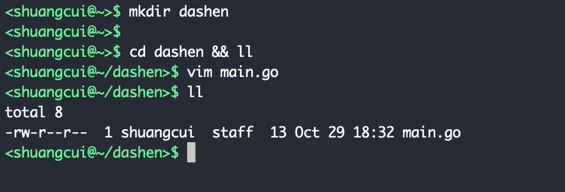
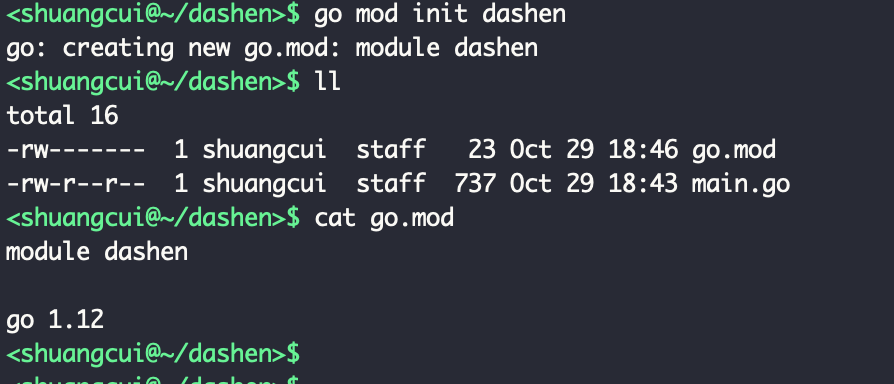
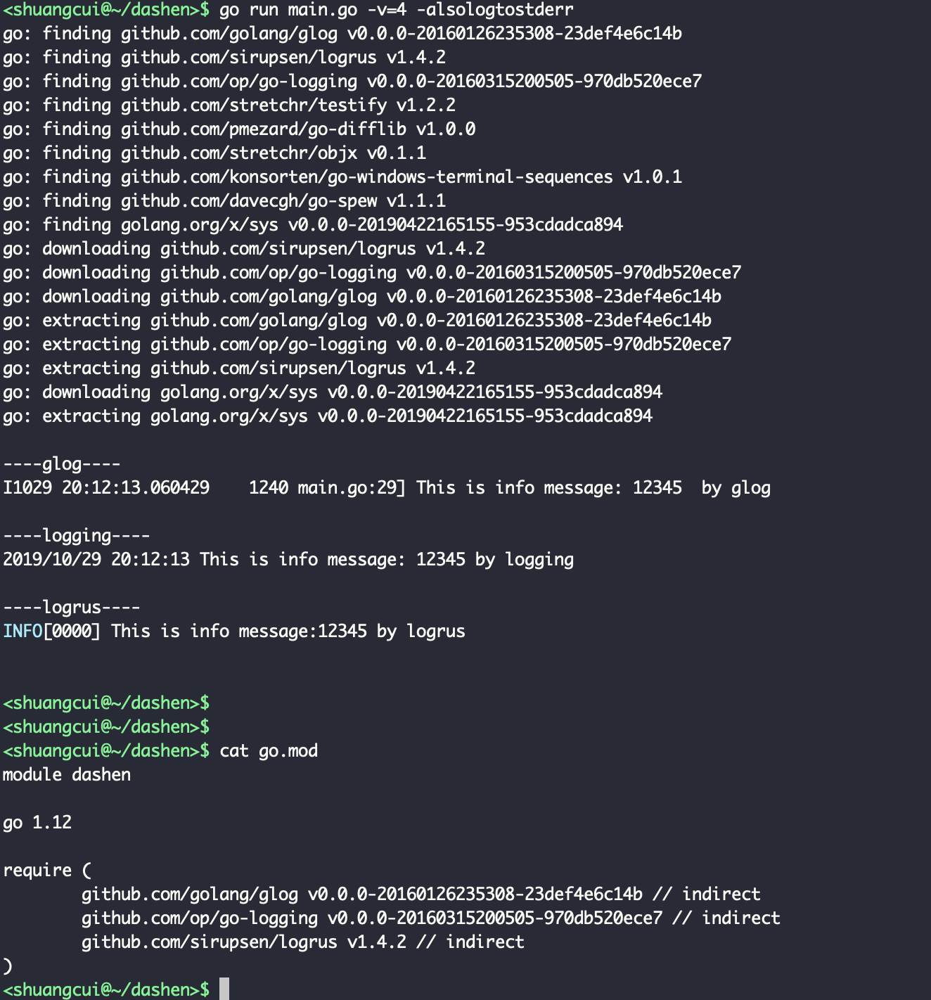
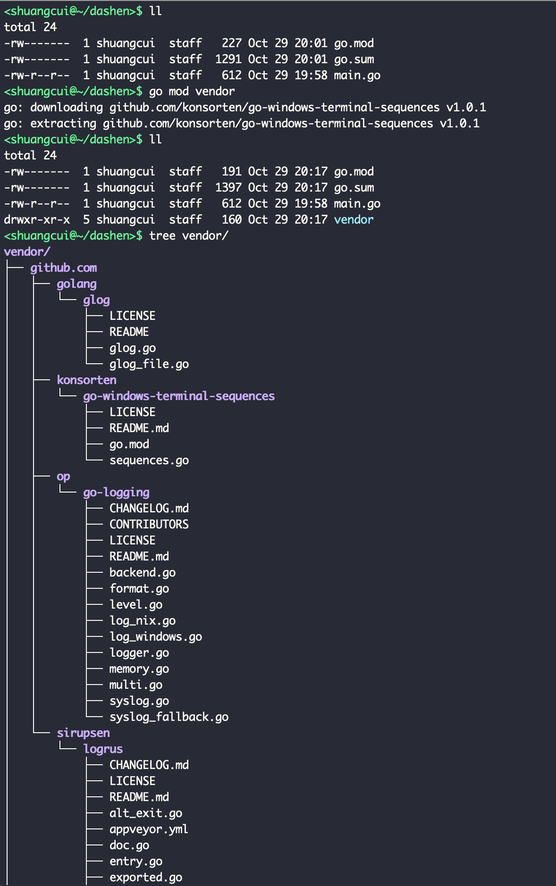
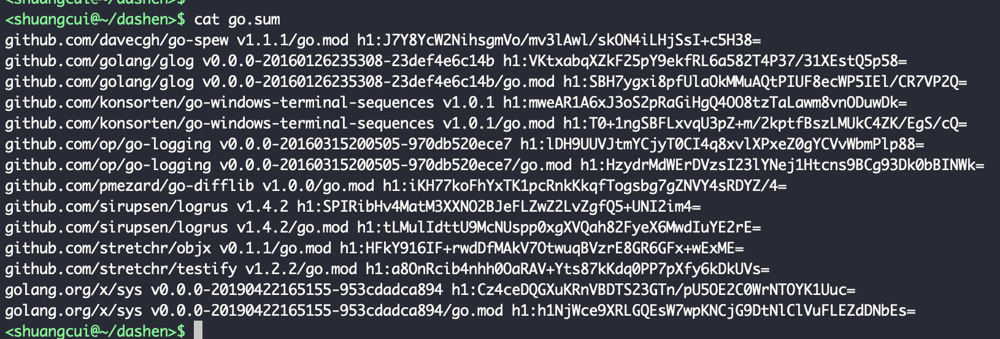
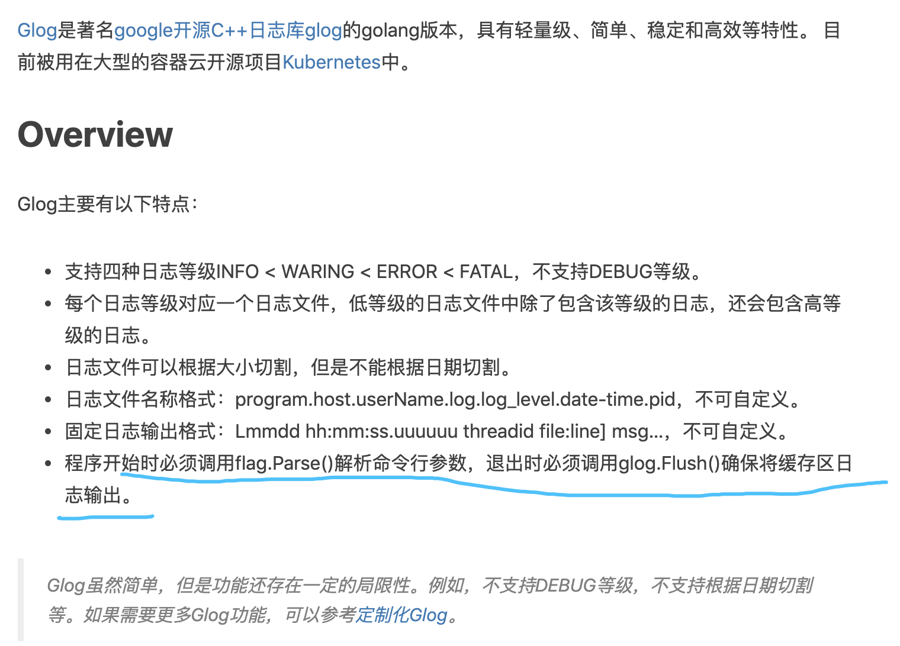
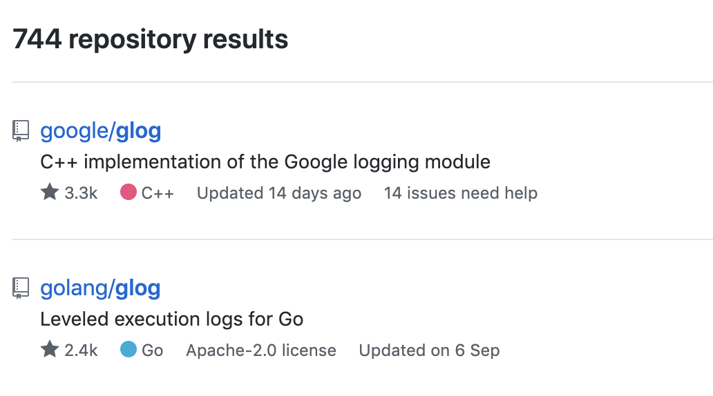
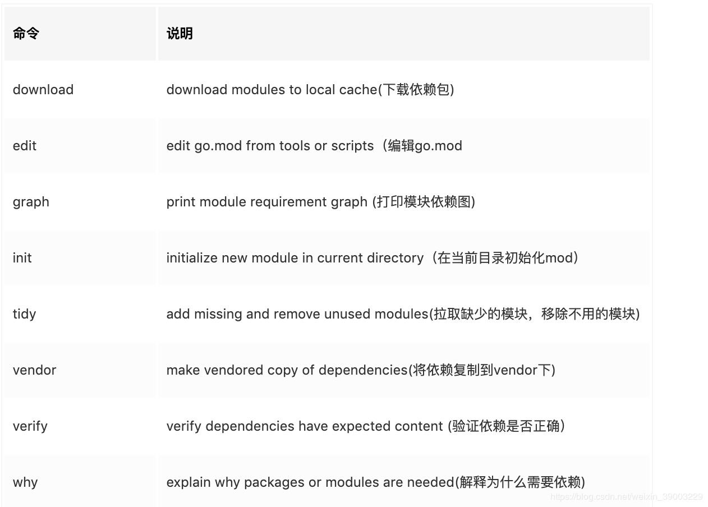
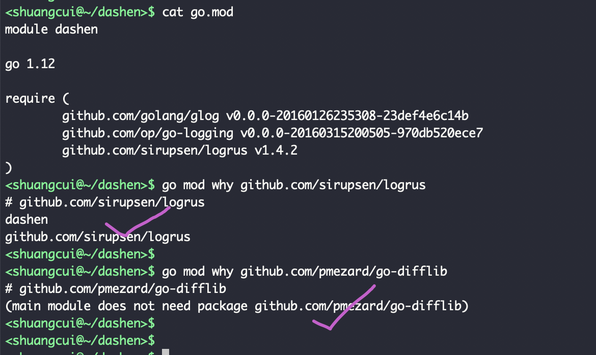
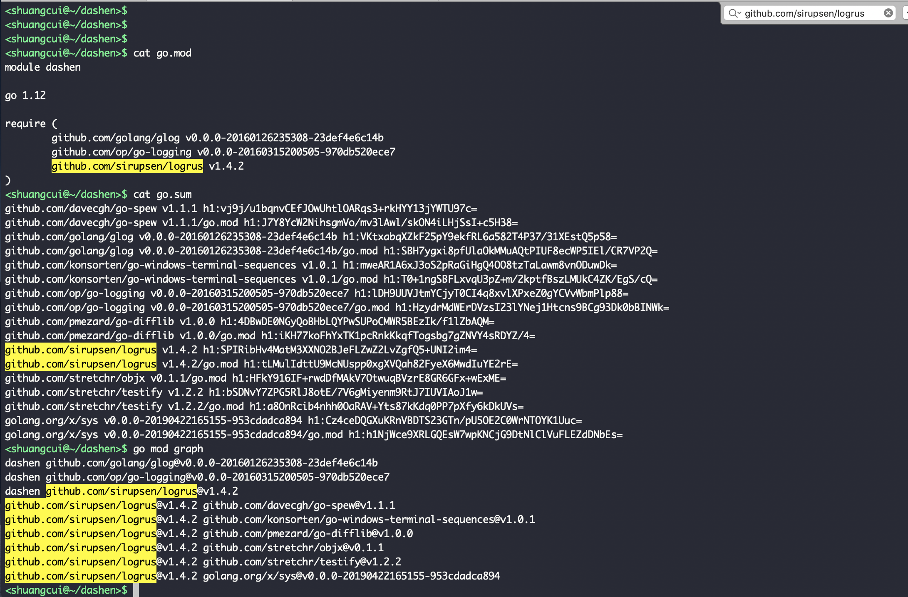

#### Go Module的基本使用
<br>

自新版本引入`Go Module`,改变了以往所有项目及依赖全部堆砌在`$GOPATH/src`下,时间一长项目一多变得臃肿混乱的局面,同时也解决了依赖包的版本控制问题. 现在我们可以在任意位置十分方便地新建项目.




执行 `go mod init dashen`,可以发现项目多了一个go.mod文件.

(可以切换到文件夹后就执行`go mod init xxx`,也可在编码过程中再执行)




以最近调研和使用的几个log包为例,main.go代码如下:

```go

package main

import (
	"flag"
	"fmt"
	"github.com/golang/glog"
	"github.com/op/go-logging"
	"github.com/sirupsen/logrus"
)

func main() {

	fmt.Println("\n----glog----")
	logFunc1()

	fmt.Println("\n----logging----")
	logFunc2()

	fmt.Println("\n----logrus----")
	logFunc3()

	fmt.Println("\n")

}

func logFunc1() {
	flag.Parse()
	defer glog.Flush()
	glog.Infof("This is info message: %v  by glog", 12345)
}

func logFunc2() {
	var log = logging.MustGetLogger("example")
	log.Debugf("This is info message: %d by logging", 12345)
}

func logFunc3() {
	logrus.Infof("This is info message:%d by logrus", 12345)
}


```

执行`go run main.go -v=4 -alsologtostderr`, 如下图:



注:

可以手动执行`go mod download`或`go mod tidy`,也可以直接go run,这时会寻找需要的包自动进行下载并引用.

下载的包存放在`$GOPATH/pkg/mod`路径下,如果想更直观查看该项目用到的依赖包,可在项目目录下执行`go mod vendor`,之后项目目录下就会多一个`vendor`文件夹,且会将`$GOPATH/pkg/mod`下该项目用到的依赖copy到`vendor`中..(经亲测,两份依赖包完全独立,修改其中一处不会影响另外一处,那问题来了: 这样设计是否合理?再执行时实际引用的是哪一份?)



---

另:

(除go.mod外,go命令还维护一个名为go.sum的文件,其中包含特定模块版本内容的预期加密哈希值,以确保项目所依赖的模块不会出现意外更改.
go.mod和go.sum都应检入版本控制,但go.sum不需要手工维护,所以可以不用太关注)



<br>

关于几个日志包的一点解释:
1. `go run main.go `后面的`-v=4 -alsologtostderr`为`glog`包需要的参数;

2. 关于这三种常用的日至包---glog,go-logging和logrus,简而言之,glog为k8s采用的日志方案,代码量较少,但貌似不支持多色,及可定制化较低;go-logging和logrus都可支持彩色输出.

在此不做更多记述.更多高阶用法及参考:

- glog

[glog 使用及实现分析](https://zhengyinyong.com/post/glog-internal/)






---
- go-logging

[github地址](https://github.com/op/go-logging)

[go-logging的使用](https://studygolang.com/articles/10845)

---
- logrus

[github地址](https://github.com/sirupsen/logrus)

[Logrus的使用](https://www.jianshu.com/p/5fac8bed4505)

---

#### 几个生僻小命令
<br>

go mod 常用命令见下:




- go mod why

go mod why + [go.mod文件里某一个包名,如A],会告诉你在哪里使用了A这个包


但如果是A这个包还使用了B,那如果go mod why B,则会提示:



- go mod graph

go graph命令后面不能带参数,

会显示出go.mod里需要的每个包,都依赖了哪些包.

对go.mod里的任何一个包,和go mod graph的结果都是一个一对多的关系.



go.sum中不仅有项目需依赖的包的相关信息(如版本),还有这些依赖包所依赖的package的版本等信息,以及保证版本等信息无误的相关校验..这些都是go自己完成,开发者无需关心.

---


[私有链接1](https://note.youdao.com/web/#/file/WEB603059375acfaaa12fe59e9e690fb757/note/WEB6d137bb35fb34ad9bdba7996fed62c11/)

[私有链接2](https://note.youdao.com/web/#/file/WEB603059375acfaaa12fe59e9e690fb757/note/WEB91777d01abefa85a85681a15992d2ea8/)
