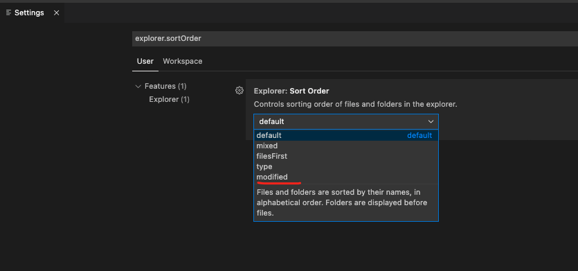

Mac毫无征兆出了问题,最初没有意识到严重性,直到送修后检测告知,数据很可能丢失..

所幸大多数资料都追了回来,但之前的机器没法用了. 需要快速搭建顺手的新Mac

有选择性参照这几篇

[配置一台符合使用习惯的新Mac](https://dashen.tech/2020/08/24/%E9%85%8D%E7%BD%AE%E4%B8%80%E5%8F%B0%E7%AC%A6%E5%90%88%E4%BD%BF%E7%94%A8%E4%B9%A0%E6%83%AF%E7%9A%84%E6%96%B0Mac/)

[配置一台符合使用习惯的新Mac之brew篇](https://dashen.tech/2020/08/27/%E9%85%8D%E7%BD%AE%E4%B8%80%E5%8F%B0%E7%AC%A6%E5%90%88%E4%BD%BF%E7%94%A8%E4%B9%A0%E6%83%AF%E7%9A%84%E6%96%B0Mac%E4%B9%8Bbrew%E7%AF%87/)

~~[两台Mac之间的资料互传](https://dashen.tech/2020/08/28/%E4%B8%A4%E5%8F%B0Mac%E4%B9%8B%E9%97%B4%E7%9A%84%E8%B5%84%E6%96%99%E4%BA%92%E4%BC%A0/)~~

[更换机器后,Hexo博客的迁移](https://dashen.tech/2020/08/28/%E6%9B%B4%E6%8D%A2%E6%9C%BA%E5%99%A8%E5%90%8E-Hexo%E5%8D%9A%E5%AE%A2%E7%9A%84%E8%BF%81%E7%A7%BB/)

<br>

先安装brew,有gitee的脚本,可以非常快速,一行命令搞定(可以搜索“brew gitee”)

接着用`brew install git`,以及其他实用工具

`ssh-keygen -t rsa -C"xxx@xxx.com"`生成公钥/私钥,将公钥配置到github/gitlab/gitee上

<br>


配置xx软件,下载Chrome,登陆账号后,可以有选择性安装之前的插件


[下载Goland](https://www.jetbrains.com/go/download/#section=mac)按照这篇[点睛之笔--JetBrains系列软件中那些好用的插件](https://dashen.tech/2020/09/03/%E7%82%B9%E7%9D%9B%E4%B9%8B%E7%AC%94-JetBrains%E7%B3%BB%E5%88%97%E8%BD%AF%E4%BB%B6%E4%B8%AD%E9%82%A3%E4%BA%9B%E5%A5%BD%E7%94%A8%E7%9A%84%E6%8F%92%E4%BB%B6/)进行简单配置


使用brew cask安装postman,登陆之前的账号,历史记录和收藏都会同步过来


下载navicat,登陆账号后,cloud里的连接都会同步过来,但密码需要重新输入.

[更多可参考](https://note.youdao.com/web/#/file/WEB318807e86939ecd981055e30ca4cf6ec/note/WEB85235e471c9d3d04e7d0b5c27098fac9/)


<br>

下载vscode, `command+shift+p`, 输入shell 选第一项

这样就设置 code为在命令行使用vscode打开文件/文件夹的快捷键


在设置中搜索*explorer.sortOrder*,将排序方式选为按修改时间

 


<br>


安装[oh-my-zsh](https://www.jianshu.com/p/0d265d9f914b),用一些内容覆盖.zshrc


```sh
`ZSH_DISABLE_COMPFIX=true

# If you come from bash you might have to change your $PATH.
# export PATH=$HOME/bin:/usr/local/bin:$PATH

# Path to your oh-my-zsh installation.
export ZSH="/Users/fliter/.oh-my-zsh"

# Set name of the theme to load --- if set to "random", it will
# load a random theme each time oh-my-zsh is loaded, in which case,
# to know which specific one was loaded, run: echo $RANDOM_THEME
# See https://github.com/ohmyzsh/ohmyzsh/wiki/Themes

#ZSH_THEME="agnoster"
#ZSH_THEME="ys"
ZSH_THEME="robbyrussell"
##ZSH_THEME="robbyrussell"

# Set list of themes to pick from when loading at random
# Setting this variable when ZSH_THEME=random will cause zsh to load
# a theme from this variable instead of looking in $ZSH/themes/
# If set to an empty array, this variable will have no effect.
# ZSH_THEME_RANDOM_CANDIDATES=( "robbyrussell" "agnoster" )

# Uncomment the following line to use case-sensitive completion.
# CASE_SENSITIVE="true"

# Uncomment the following line to use hyphen-insensitive completion.
# Case-sensitive completion must be off. _ and - will be interchangeable.
# HYPHEN_INSENSITIVE="true"

# Uncomment the following line to disable bi-weekly auto-update checks.
# DISABLE_AUTO_UPDATE="true"

# Uncomment the following line to automatically update without prompting.
# DISABLE_UPDATE_PROMPT="true"

# Uncomment the following line to change how often to auto-update (in days).
# export UPDATE_ZSH_DAYS=13

# Uncomment the following line if pasting URLs and other text is messed up.
# DISABLE_MAGIC_FUNCTIONS="true"

# Uncomment the following line to disable colors in ls.
# DISABLE_LS_COLORS="true"

# Uncomment the following line to disable auto-setting terminal title.
# DISABLE_AUTO_TITLE="true"

# Uncomment the following line to enable command auto-correction.
# ENABLE_CORRECTION="true"

# Uncomment the following line to display red dots whilst waiting for completion.
# COMPLETION_WAITING_DOTS="true"

# Uncomment the following line if you want to disable marking untracked files
# under VCS as dirty. This makes repository status check for large repositories
# much, much faster.
# DISABLE_UNTRACKED_FILES_DIRTY="true"

# Uncomment the following line if you want to change the command execution time
# stamp shown in the history command output.
# You can set one of the optional three formats:
# "mm/dd/yyyy"|"dd.mm.yyyy"|"yyyy-mm-dd"
# or set a custom format using the strftime function format specifications,
# see 'man strftime' for details.
# HIST_STAMPS="mm/dd/yyyy"

# Would you like to use another custom folder than $ZSH/custom?
# ZSH_CUSTOM=/path/to/new-custom-folder

# Which plugins would you like to load?
# Standard plugins can be found in $ZSH/plugins/
# Custom plugins may be added to $ZSH_CUSTOM/plugins/
# Example format: plugins=(rails git textmate ruby lighthouse)
# Add wisely, as too many plugins slow down shell startup.

#plugins=(git)
plugins=(
    git
    zsh-autosuggestions
    autojump
    zsh-syntax-highlighting  
)

# autojump
[[ -s $(brew --prefix)/etc/profile.d/autojump.sh ]] && . $(brew --prefix)/etc/profile.d/autojump.sh
source $ZSH/oh-my-zsh.sh


source $ZSH/oh-my-zsh.sh

# User configuration

# export MANPATH="/usr/local/man:$MANPATH"

# You may need to manually set your language environment
# export LANG=en_US.UTF-8

# Preferred editor for local and remote sessions
# if [[ -n $SSH_CONNECTION ]]; then
#   export EDITOR='vim'
# else
#   export EDITOR='mvim'
# fi

# Compilation flags
# export ARCHFLAGS="-arch x86_64"

# Set personal aliases, overriding those provided by oh-my-zsh libs,
# plugins, and themes. Aliases can be placed here, though oh-my-zsh
# users are encouraged to define aliases within the ZSH_CUSTOM folder.
# For a full list of active aliases, run `alias`.
#
# Example aliases
# alias zshconfig="mate ~/.zshrc"
# alias ohmyzsh="mate ~/.oh-my-zsh"


###  爽哥个人配置


export HOMEBREW_BOTTLE_DOMAIN=https://mirrors.ustc.edu.cn/homebrew-bottles


# golang相关配置
# GOROOT
#export GOROOT=/usr/local/opt/go\@1.16
export GOROOT=/usr/local/opt/go\@1.16/libexec
# GOPATH
export GOPATH=/Users/fliter/go
export GOBIN=$GOPATH/bin
#export PATH="/Users/dashen/go/bin:$PATH"
export PATH=$PATH:$GOROOT/bin
export PATH=$PATH:$GOPATH/bin


# 为chroimum能登陆账号而加
export GOOGLE_API_KEY=AIzaSyAJ7Q7oAUumYJ0-xxxxxx
export GOOGLE_DEFAULT_CLIENT_ID=xxxxxx.apps.googleusercontent.com
export GOOGLE_DEFAULT_CLIENT_SECRET=vxxxxxxxxxxxxxxx


alias r='go run *.go'
alias gr='go run'
alias gb='go build'

export PATH=${PATH}:/usr/local/MongoDB/bin
alias mongostart='mongod --dbpath "/Users/xxxx/mongo-data/db"'
alias run-rs='run-rs -v 4.0.0 --shell'


export PATH=${PATH}:/usr/local/Cellar/ffmpeg/4.3.1/bin

# for mysql by 爽哥

#用alias mysql='/usr/local/Cellar/mysql@5.7/5.7.28/bin/mysql'这种方式,5.7.28/bin目录下的mysql.server还是显示为command not find,把这个路径直接加进PATH,而不是用别名alias方式肯定更好~
PATH="/usr/local/Cellar/mysql@5.7/5.7.28/bin:${PATH}"
export PATH


# rust 2021.03.04
export PATH=${PATH}:/Users/fliter/.cargo/bin


#关闭brew每次执行命令时的自动更新
export HOMEBREW_NO_AUTO_UPDATE=true

# 超级实用
alias sn="git shortlog -sn"
alias big="du -d 1 -h"
alias ll='ls -al'
alias c='clear'


alias d='docker'
alias p='python'
alias p3='python3'

#alias aws='ssh -i ~/aws/aws_ec2_cuishuang.pem ubuntu@ec2-3-112-xx-xxx.ap-northeast-1.compute.amazonaws.com'
alias aws='ssh ubuntu@3.112.xx.xxx'

alias cvm='ssh ubuntu@118.126.xx.xx'

alias proxy='export GOPROXY=https://goproxy.cn'


# git快捷键

alias gt="git status"
alias ga="git add -A"
alias gm="git commit -m"
alias gp="git push"
alias gba="git branch -a"
alias gf="git fetch"
alias gc='git clone'


alias etcd="/usr/local/Cellar/etcd/3.4.3/bin/etcd"
alias etcdctl="/usr/local/Cellar/etcd/3.4.3/bin/etcdctl"
alias up="echo go get -insecure -u -v git.xxxxxx.com/xxx_xxx/xxx@develop"


alias k6='sudo fuser -k 80/tcp'


alias hao='open http://man.linuxde.net/'
alias linux='open http://man.linuxde.net/'
alias ss='open http://www.dashen.tech/'
alias ym='open https://dnspod.cloud.tencent.com/'


alias pqstart='pg_ctl -D /usr/local/var/postgres -l /usr/local/var/postgres/server.log start '


# 配置sublime命令行启动
alias subl=\''/Applications/Sublime Text.app/Contents/SharedSupport/bin/subl'\'


alias u='ubuntu@118.126.xx.xx:/home/ubuntu/public'

alias e='ETCDCTL_API=3 /usr/local/Cellar/etcd/3.3.10/bin/etcdctl'


alias k1='kubectl get namespaces'

alias sed='gsed'

alias nosleep='caffeinate -disu'

alias  mysql='mysql.server start'

alias gut='git'


## 工具
eval $(thefuck --alias)

alias kk='ll'

alias bs='brew search'
alias bi='brew install'
alias bci='brew cask install'


alias nginx='sudo /usr/local/Cellar/openresty/1.17.8.2_1/nginx/sbin/nginx'
alias cellar='/usr/local/Cellar'


alias diff='git icdiff'

# bilibili
export DEPLOY_ENV=uat
export HOSTNAME=creative-dev
export APP_ID=main.archive.creative-web

alias mid='echo xxxxxxx'


# https://juejin.im/post/6844903939121348616
# asciinema拍终端大片
alias video='asciinema rec first-rec.cast'

export NVM_DIR="/Users/fliter/.nvm"
[ -s "$NVM_DIR/nvm.sh" ] && . "$NVM_DIR/nvm.sh"  # This loads nvm


#clear


DEPLOY_ENV=uat

# Created by mirror-config-china
export IOJS_ORG_MIRROR=https://npm.taobao.org/mirrors/iojs
export NODIST_IOJS_MIRROR=https://npm.taobao.org/mirrors/iojs
export NVM_IOJS_ORG_MIRROR=https://npm.taobao.org/mirrors/iojs
export NVMW_IOJS_ORG_MIRROR=https://npm.taobao.org/mirrors/iojs
export NODEJS_ORG_MIRROR=https://npm.taobao.org/mirrors/node
export NODIST_NODE_MIRROR=https://npm.taobao.org/mirrors/node
export NVM_NODEJS_ORG_MIRROR=https://npm.taobao.org/mirrors/node
export NVMW_NODEJS_ORG_MIRROR=https://npm.taobao.org/mirrors/node
export NVMW_NPM_MIRROR=https://npm.taobao.org/mirrors/npm
# End of mirror-config-china[ -s "$NVM_DIR/bash_completion" ] && \. "$NVM_DIR/bash_completion"  # This loads nvm bash_completion

```

<br>

会报xx插件缺失,按照报错提示,进行相应安装即可~

<br>


big,sn,nosleep几个alias超级好用~


<br>


配置一下[Mac安装配置rz、sz]()


[通过我的常用资源库](http://box.dashen.tech/),下载安装实用工具. [备用地址](https://gitee.com/cuishuang/box/tree/master/software)


<br>

参考[逆向工程](),下载Charles