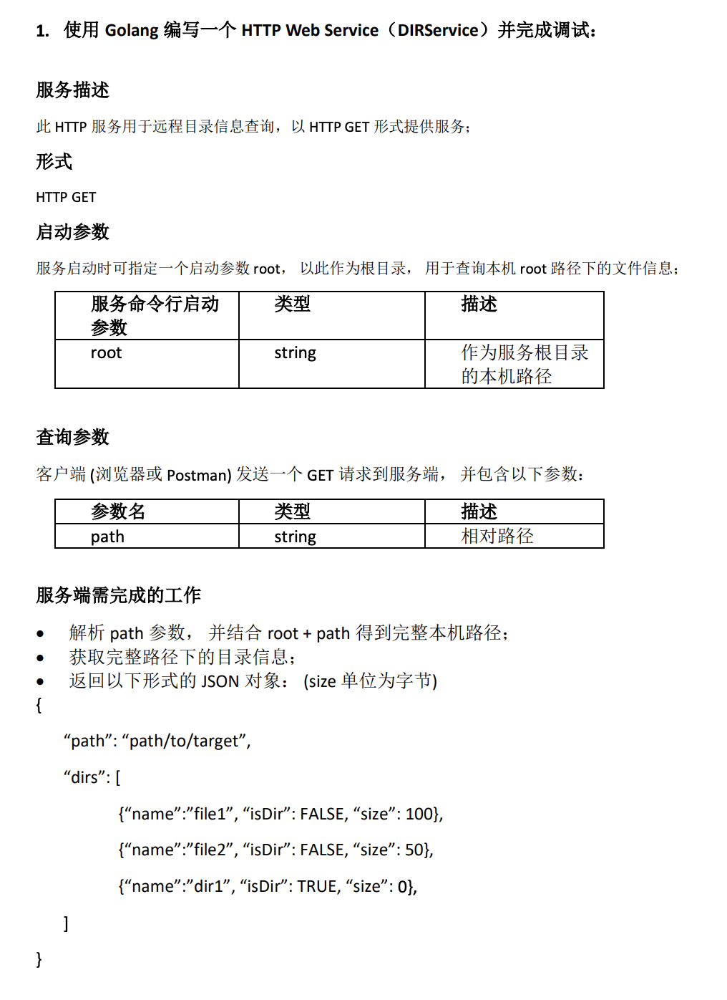
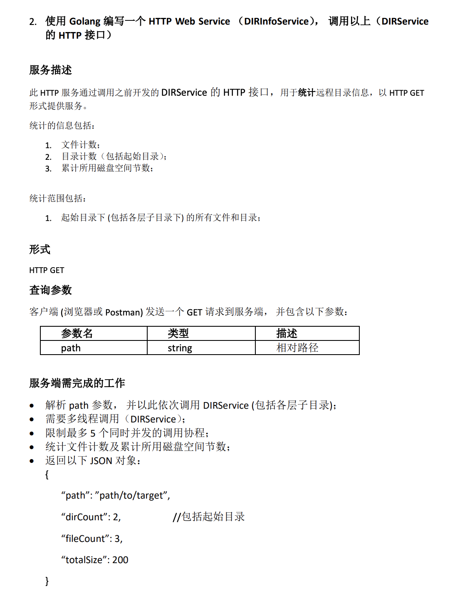

<br>




<br>


```go
package main

import (
	"encoding/json"
	"fmt"
	"io/ioutil"
	"log"
	"net/http"
	"os"
	"strings"
)

func main() {


	http.HandleFunc("/", printPwd) //设置访问的路由

	err := http.ListenAndServe(":80", nil) //设置监听的端口
	if err != nil {
		log.Fatal("ListenAndServe: ", err)
	}


}

func printPwd(w http.ResponseWriter, r *http.Request) {

	argsAll := os.Args

	log.Println("argsAll: ", argsAll)
	argsUseful := os.Args[1:]
	log.Println("argsUseful: ", argsUseful)

	path := ""

	if len(argsUseful) > 0 && ( argsUseful[0] == "-root" ||  argsUseful[0] == "root") {
		path = "/"

	} else {

		err := r.ParseForm() //解析参数，默认是不会解析的
		if err != nil {
			panic(err)
		}

		fmt.Println(r.Form) //这些信息是输出到服务器端的打印信息
		fmt.Println("路径值为:", r.URL.Path)
		allPath := r.URL.Path
		//fmt.Println("scheme", r.URL.Scheme)
		//fmt.Println(r.Form["url_long"])
		//for k, v := range r.Form {
		//	fmt.Println("key:", k)
		//	fmt.Println("val:", strings.Join(v, ""))
		//}

		pathSli := strings.Split(allPath, "path=")
		pathSli = strings.Split(pathSli[1], "&")
		path = pathSli[0]

	}


	fmt.Println("值为:", path)

	//fmt.Fprintf(w, "Hello Wrold!") //这个写入到w的是输出到客户端的

	dirList, err := ioutil.ReadDir(path)
	if err != nil {
		fmt.Fprintf(w, "读取目录出错") //这个写入到w的是输出到客户端的
		return
	}

	var fileInfos []FileInfo
	var item FileInfo

	//fmt.Println(dirList)
	for _, v := range dirList {
		item.Name = v.Name()
		item.IsDir = v.IsDir()
		item.Size = v.Size()
		fileInfos = append(fileInfos, item)
	}

	var rs Data

	rs.Path = path
	rs.Dirs = fileInfos

	rsJson, _ := json.Marshal(rs)

	fmt.Println( string(rsJson)) //这个写入到w的是输出到客户端的
	fmt.Fprintf(w, string(rsJson)) //这个写入到w的是输出到客户端的

}

type Data struct {
	Path string     `json:"path"`
	Dirs []FileInfo `json:"dirs"`
}

type FileInfo struct {
	Name  string `json:"name"`   // base name of the file
	IsDir bool   `json:"is_dir"` // abbreviation for Mode().IsDir()
	Size  int64  `json:"size"`   // length in bytes for regular files; system-dependent for others
}

```

<br>

---

<br>





```go
package main

import (
	"encoding/json"
	"fmt"
	"io/ioutil"
	"log"
	"net/http"
	"strings"
)

func main() {

	http.HandleFunc("/", getDirInfo) //设置访问的路由

	err := http.ListenAndServe(":8001", nil) //设置监听的端口
	if err != nil {
		log.Fatal("ListenAndServe: ", err)
	}

}

func getDirInfo(w http.ResponseWriter, r *http.Request) {

	fmt.Println("路径值为:", r.URL.Path)
	allPath := r.URL.Path

	pathSli := strings.Split(allPath, "path=")
	pathSli = strings.Split(pathSli[1], "&")
	path := pathSli[0]

	fmt.Println("值为:", path)

	path = "/usr/local/openresty&page=1"

	//生成要访问的url
	url := "http://127.0.0.1:80/path=" + path

	fmt.Println("url为:",url)


	//提交请求
	response,_ := http.Get(url)
	if response.StatusCode != 200 {
		fmt.Fprintf(w,"请求接口出错")
		return
	}

	defer response.Body.Close()

	body,_ := ioutil.ReadAll(response.Body)
	//rs := string(body)

	s := Data2{}

	err := json.Unmarshal(body,&s)
	if err != nil {
		fmt.Fprintf(w,"json转换失败")
		return
	}

	fmt.Println(s)


	var rs RsData

	rs.Path = path


	ch := make(chan int,5)

	for __,val := range s.Dirs {

		rs.TotalSize = rs.TotalSize + val.Size


		if val.IsDir == true {
			rs.DirCount = rs.DirCount + 1

			go func(channel chan int ,dirName string,path string) {
				path = path + "/" +dirName
				url := "http://127.0.0.1:80/path=" + path
				response,_ := http.Get(url)
				if response.StatusCode != 200 {
					fmt.Fprintf(w,"请求接口出错")
					return
				}

				defer response.Body.Close()

				body,_ := ioutil.ReadAll(response.Body)
				err := json.Unmarshal(body,&s)
				if err != nil {
					fmt.Fprintf(w,"json转换失败")
					return
				}

				for _, item := range s.Dirs {

					if item.IsDir {
						ch <- 1
					}else{
						ch <- 2
					}
				}
			}(ch,val.Name,path)


			result := <-ch

			if result == 1  {
				rs.DirCount++
			} else {
				rs.FileCount++
			}

		} else {
			rs.FileCount++
		}
	}


	rsJson, _ := json.Marshal(rs)

	fmt.Fprintf(w, string(rsJson)) //这个写入到w的是输出到客户端的

}

type Data2 struct {
	Path string     `json:"path"`
	Dirs []FileInfo2 `json:"dirs"`
}

type FileInfo2 struct {
	Name  string `json:"name"`   // base name of the file
	IsDir bool   `json:"is_dir"` // abbreviation for Mode().IsDir()
	Size  int64  `json:"size"`   // length in bytes for regular files; system-dependent for others
}

type RsData struct {
	Path      string `json:"path"`
	DirCount  int64  `json:"dirCount"`
	FileCount int64  `json:"fileCount"`
	TotalSize int64  `json:"totalSize"`
}

```

感觉问题2的解法存有问题,可以fix以及promote


麻雀虽小,却涉及到:

- golang实现简单的http web服务
- 接受并解析命令行参数
- 字符串处理
- 结构体转json并返回
- 获取某路径下的文件信息(包含文件夹等,Linux一切皆文件)

以及:

- 发送http请求
- 将请求其他接口获得的json转为结构体
- 使用有缓存的channel进行并发控制
- 递归调用


