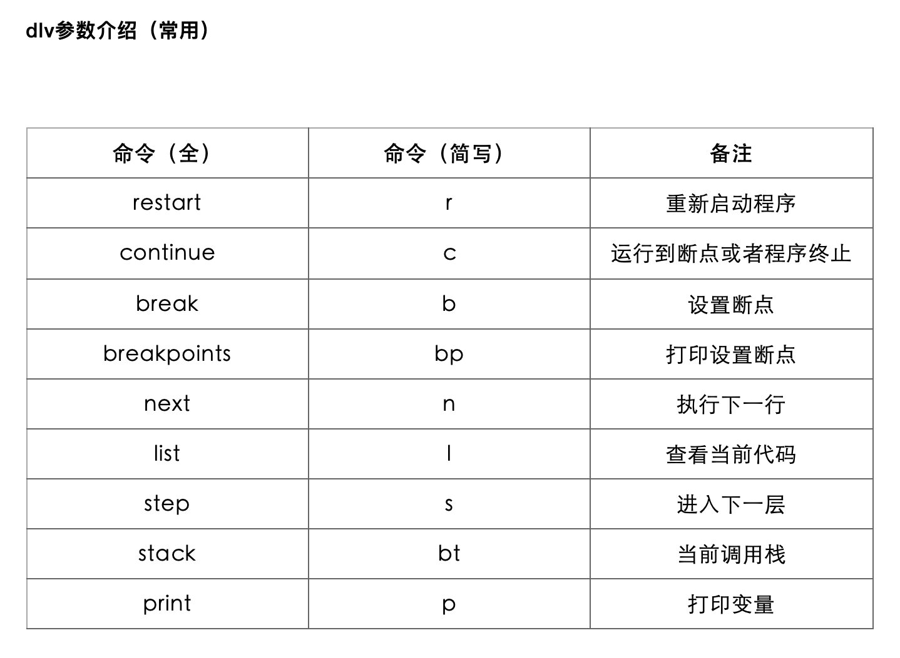
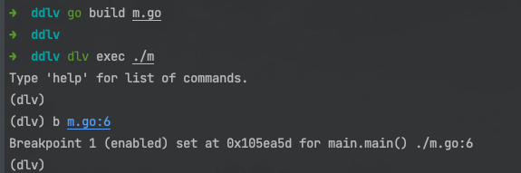
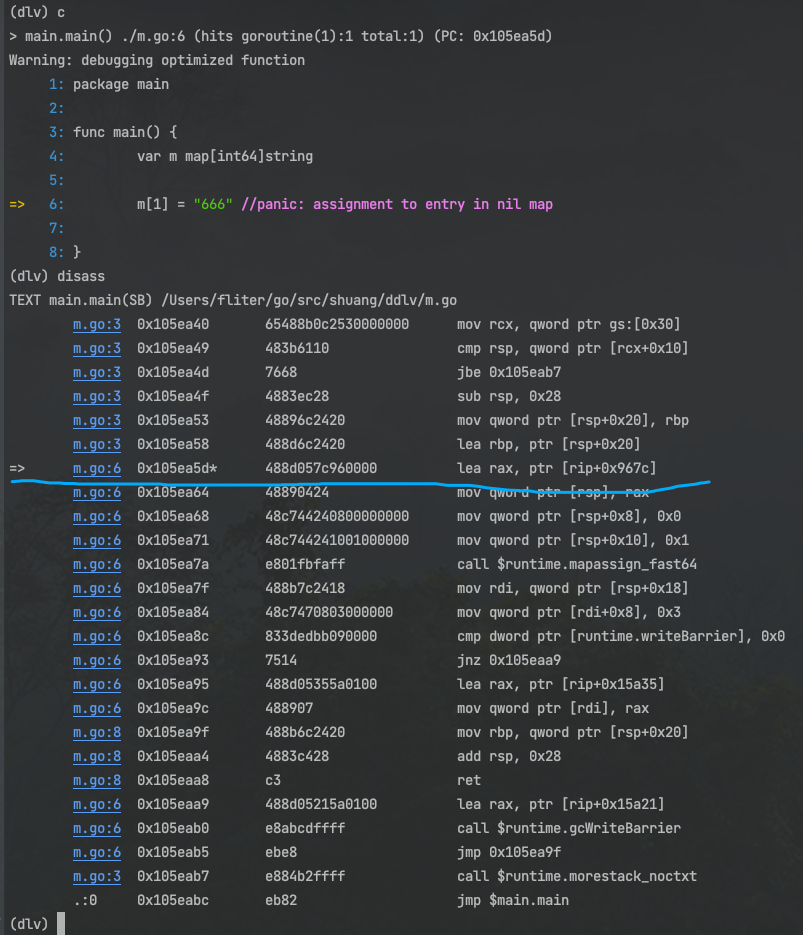
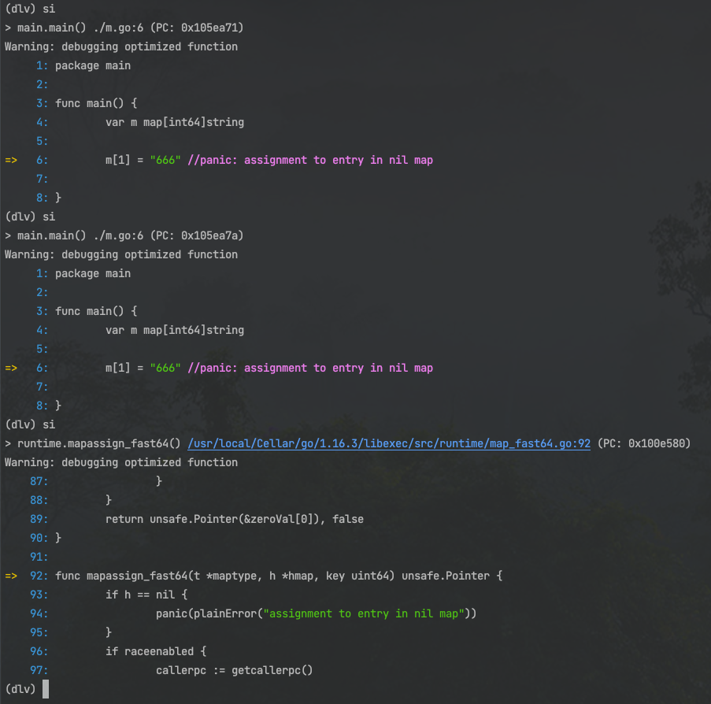
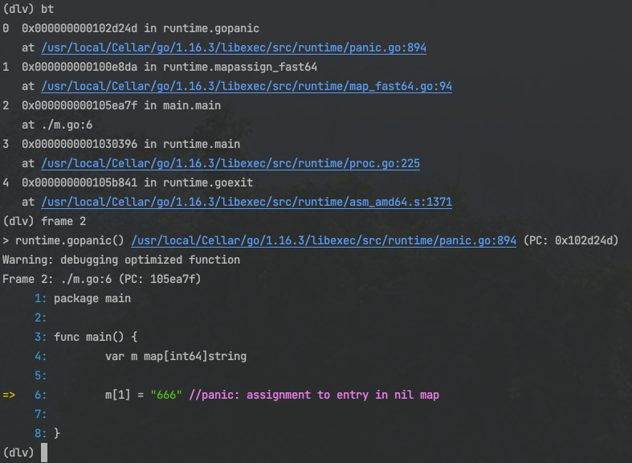
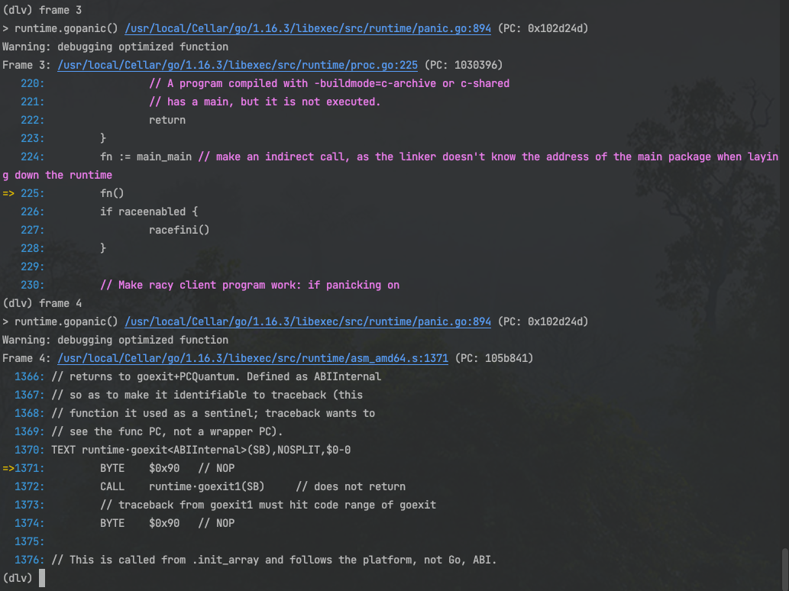
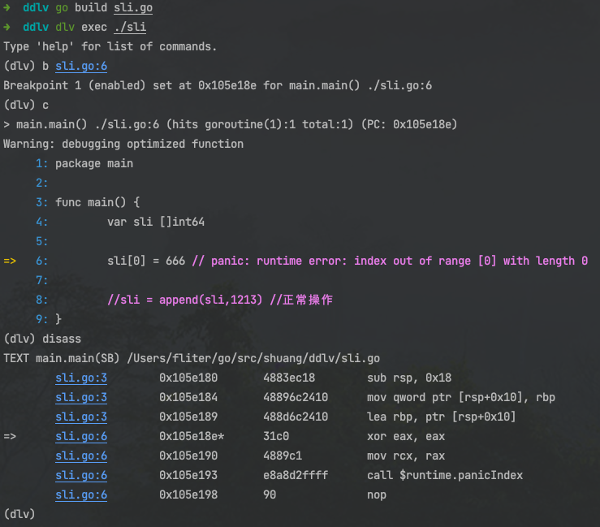
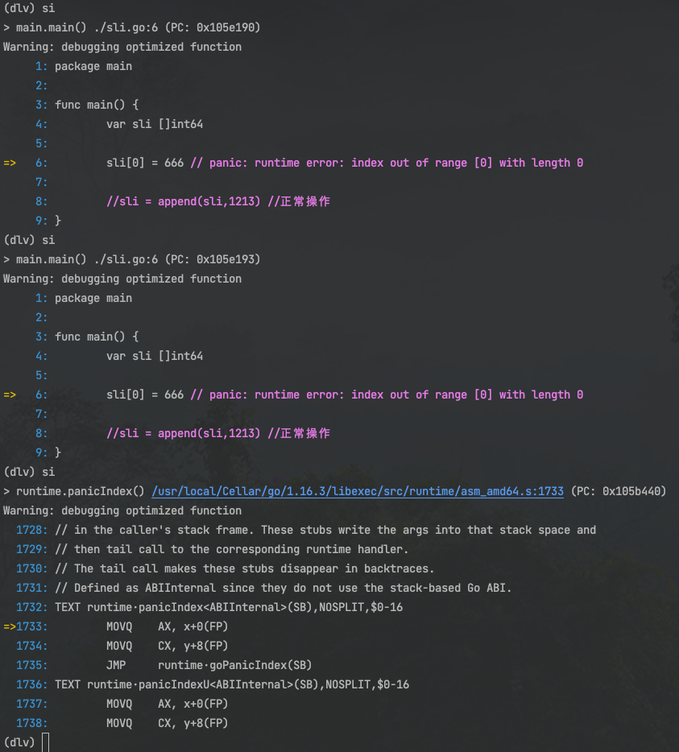
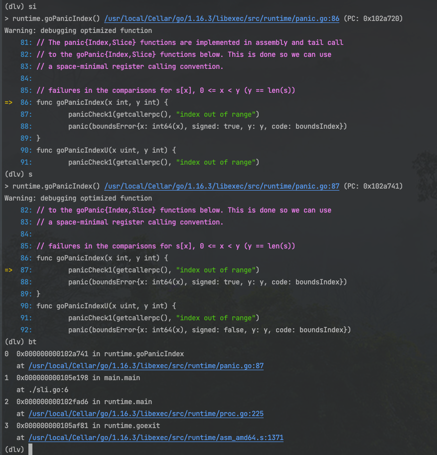

<br>

### 有关dlv

<font size=1 color="grey">
vi. 钻研；探究；挖
vt. 钻研；探究；挖
n. 穴；洞
n. (Delve)人名；(英)德尔夫

delve: 钻研
delve into: 深入研究
The study delve into: 探讨钻研
</font>


<br>


之前用过的[gdb/lldb](https://www6.dashen.tech/2019/10/30/%E7%A5%9E%E5%99%A8gdb/),是通用的代码调试器,而delve,则是专门用来调试 Go 程序的工具. 

delve一般简称为dlv,它和gdb都可以用来调试Go程序,但dlv相比gdb在调试goroutine方面支持更好

<br>

安装步骤见[github.com/go-delve/delve](https://github.com/go-delve/delve)

<br>

---

<br>


### 使用

<br>


以下为dlv的几个常用调试命令:

- 1、dlv debug main.go #debug一个main.go程序
- 2、break（b）main.main #在main包里的main函数入口打断点

        使用 b 这个命令打断点，有三种方法：

        b + 地址
        b + 代码行数
        b + 函数名

- 3、continue（c） #继续运行，直到断点处停止
- 4、next（n） #单步运行
- 5、locals #打印local variables
- 6、print（p） #打印一个变量或者表达式
- 7、restart（r） #Restart Process


<br>

 


<br>

#### 探究给为nil的map赋值出现的panic:

<br>

对于**m.go**

```go
package main

func main() {
	var m map[int64]string

	m[1] = "666" //panic: assignment to entry in nil map

}
```

<br>

编译生成可执行文件, 使用 dlv 进入调试状态:

```go
go build m.go

dlv exec ./m
```

<br>

在map赋值的地方,即第6行设置断点:

 


<br>

执行 c 命令,可直接运行到断点处

执行 disass 命令,可以看到汇编指令


 


<br>


使用 si 命令,执行单条指令

多次执行 si,就会执行到 map 赋值函数 `mapassign_fast64`:

 


<br>

此时再用单步命令 s, 就会进入判断 h 的值为 nil 的分支, 然后执行到 panic 函数:

 


此时就找到了panic的runtime源码位置,便可以进一步探究

<br>


另外,可以使用 `bt` 命令看到调用栈,

使用 `frame x`,可以跳转到相应位置. 如`frame 2`对应图中的 m.go:6, 也即前面打断点的地方


 

<br>

还可以看下`frame 3` 和 `frame 4`:

(在帧之间跳转)

 


<br>


<br>

#### 探究给为nil的sli赋值出现的panic:


<br>

对于**sli.go**:

```go
package main

func main() {
	var sli []int64

	sli[0] = 666 // panic: runtime error: index out of range [0] with length 0

	//sli = append(sli,1213) //正常操作
}
```

 

 


 


<br>


---

<br>


### 命令手册:

<br>

#### 全部:

<br>


##### <font color="#00FFFF">程序运行</font>

<br>


```go
call ：call 函数（注意了，这个会导致整个程序运行的）

continue ：往下运行

next ：单步调试

restart ：重启

step ：单步调试，某个函数

step-instruction ：单步调试某个汇编指令

stepout ：从当前函数跳出

```


<br>


##### <font color="#00FFFF">断点相关</font>

<br>


```go
break (alias: b) ：设置断点

breakpoints (alias: bp)  ：打印所有的断点信息

clear ：清理断点

clearall ：清理所有的断点

condition (alias: cond)  ：设置条件断点

on ：设置一段命令，当断点命中的时候

trace (alias: t) ：设置一个跟踪点，这个跟踪点也是一个断点，只不过运行到的时候不会断住程序，只是打印一行信息，这个命令在某些场景是很有用的，比如你断住程序就会影响逻辑（业务有超时），而你仅仅是想打印某个变量而已，那么用这种类型的断点就行
```


<br>


##### <font color="#00FFFF">信息打印</font>

<br>

```go
args : 打印程序的传参

examinemem (alias: x)  ：这个是神器，解析内存用的，和 gdb 的 x 命令一样；

locals ：打印本地变量 

print (alias: p) ：打印一个表达式，或者变量 

regs ：打印寄存器的信息 

set ：set 赋值 

vars ：打印全局变量（包变量） 

whatis ：打印类型信息

```


<br>


##### <font color="#00FFFF">协程相关</font>

<br>

```go
goroutine (alias: gr) ：打印某个特定协程的信息 

goroutines (alias: grs)  ：列举所有的协程 

thread (alias: tr) ：切换到某个线程 

threads ：打印所有的线程信息

```


<br>


##### <font color="#00FFFF">栈相关</font>

<br>

```go
deferred ：在 defer 函数上下文里执行命令 

down ：上堆栈 

frame ：跳到某个具体的堆栈 

stack (alias: bt)  ：打印堆栈信息 

up ：下堆栈
```


<br>


##### <font color="#00FFFF">其他命令</font>

<br>

```go
config ：配置变更 

disassemble (alias: disass) ：反汇编 

edit (alias: ed) ：略 

exit (alias: quit | q) ：略 

funcs ：打印所有函数符号 

libraries ：打印所有加载的动态库 

list (alias: ls | l) ：显示源码 

source ：加载命令 

sources ：打印源码 

types ：打印所有类型信息
```

<br>


---


<br>

#### example:

<br>


##### <font color="#00FFFF">打印全局变量:</font>

<br>

`(dlv) vars`


##### <font color="#00FFFF">设置断点</font>

<br>


b = break

bp = breakpoint

<br>

break（b）main.main #在main包里的main函数入口打断点

        使用 b 这个命令打断点，有三种方法：

        b + 地址
        b + 文件名:行号
        b + 函数名

<br>

条件断点

```go

# 先断点
(dlv) b 

# 查看断点信息
(dlv) bp

# 然后定制条件
(dlv) condition 2 i==2 && j==7 && z==32
```


<br>

##### <font color="#00FFFF">程序继续执行</font>

<br>

c = continue

`next`命令来逐行执行程序


`step` 命令从 main 函数进入 被调用的函数


<br>

##### <font color="#00FFFF">查看当前的栈信息 & 在帧之间跳转</font>

<br>

用 `stack` 命令查看当前栈的内容


用 `frame` 命令实现帧之间的跳转


<br>


```go
# 展示所有堆栈
(dlv) goroutines
# 所有堆栈展开
(dlv) goroutines -t

```


<br>

##### <font color="#00FFFF">解析内存</font>

<br>

`(dlv) x -fmt hex -len 20 0xc00008af38`


<br>

##### <font color="#00FFFF">打印函数参数</font>

<br>


`args` 命令能打印出命令行传给函数的参数


<br>

##### <font color="#00FFFF">查看反汇编码</font>

<br>

由于我们是调试编译出的二进制文件,因此如能查看编译器生成的汇编语言指令将会非常有用, Delve 提供了一个 `disassemble`命令

disass = disassemble


<br>

##### <font color="#00FFFF">单步退出函数</font>

<br>

`stepout`命令可以跳回到函数被调用的地方

<br>

##### <font color="#00FFFF">打印变量信息</font>

<br>

可以在 Delve 中用 `print` 命令通过变量名来展示他们当前的值


还可以用 `locals` 命令来打印函数内所有的局部变量


如果不知道变量的类型,可以用 `whatis` 命令来通过变量名来打印它的类型


<br>


---


<br>


参考:

[曹大带我学 Go（3）—— 如何用汇编打同事的脸](https://mp.weixin.qq.com/s/2Y3qPkysRLaWDcIyLOerZg)

[使用 Delve 代替 Println 来调试 Go 程序](https://mp.weixin.qq.com/s/Zv1HcAC-Y6czEgllUsZ_uA)

[全面的整理：golang 调试分析的高阶技巧](https://mp.weixin.qq.com/s/SvzMEdhxHfI9hYU62r1C7g)

[Golang程序调试工具介绍(gdb vs dlv)](https://lday.me/2017/02/27/0005_gdb-vs-dlv/)


[如何用汇编打同事的脸](https://qcrao.com/2021/05/27/how-to-get-asm-code-of-go/)


<br>


---

<br>

[gdlv](https://github.com/aarzilli/gdlv)

dlv提供了类似gdb的cli调试系统,而这个第三方库提供了dlv的GUI前端(gdlv). 对于习惯使用GUI进行调试的人来说结合gdlv和dlv调试会更加方便


