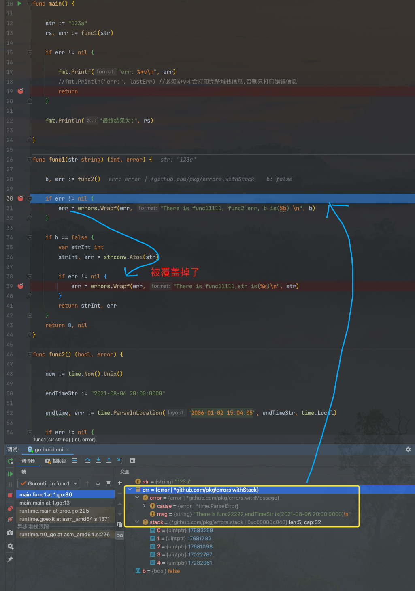

项目中 main调func1，func1调取func2...


这样就会出现很多的 `if err != nil { log.Printf()}` , 在Kibana上查看时会搜到多条日志, 需要逐级定位, 确定错误抛出的点

希望只有一条, 能清晰看到整个堆栈调用信息


<br>


使用**log.xxxx**方法:

<br>


```go
package main

import (
	"fmt"
	"log"
	"strconv"
	"time"
)

func init() {
	log.SetFlags(log.Lshortfile | log.LstdFlags)
}

func main() {

	str := "123a"
	rs, err := func1(str)

	if err != nil {
		log.Printf("err is (%+v)\n", err)
		return
	}

	fmt.Println("最终结果为:", rs)

}

func func1(str string) (int, error) {

	b, err := func2()

	if err != nil {
		log.Printf("There is func11111,  func2 err(%+v)\n", err)
	}

	if b == false {
		strInt, err := strconv.Atoi(str)

		if err != nil {
			log.Printf("There is func11111, err(%+v)\n", err)
		}
		return strInt, err
	}
	return 0, nil
}

func func2() (bool, error) {

	now := time.Now().Unix()

	endTimeStr := "2021-08-06 20:00:0000"

	endtime, err := time.ParseInLocation("2006-01-02 15:04:05", endTimeStr, time.Local)

	if err != nil {
		log.Printf("There is func22222, err(%+v)\n", err)
		return false, err
	}

	if endtime.Unix() > now {
		return true, nil
	}

	return false, nil

}
```

执行结果:


```go
2021/06/07 21:52:56 vs.go:56: There is func22222, err(parsing time "2021-08-06 20:00:0000": extra text: "00")
2021/06/07 21:52:56 vs.go:33: There is func11111,  func2 err(parsing time "2021-08-06 20:00:0000": extra text: "00")
2021/06/07 21:52:56 vs.go:40: There is func11111, err(strconv.Atoi: parsing "123a": invalid syntax)
2021/06/07 21:52:56 vs.go:20: err is (strconv.Atoi: parsing "123a": invalid syntax)
```

<br>


使用**errors.Wrapf**方法:


<br>

```go
package main

import (
	"fmt"
	"github.com/pkg/errors"
	"strconv"
	"time"
)

func main() {

	str := "123a"
	rs, err := func1(str)

	if err != nil {

		fmt.Printf("err: %+v\n", err)
		//fmt.Println("err:", lastErr) //必须%+v才会打印完整堆栈信息,否则只打印错误信息
		return
	}

	fmt.Println("最终结果为:", rs)

}

func func1(str string) (int, error) {

	b, err := func2()

	if err != nil {
		err = errors.Wrapf(err, "There is func11111, func2 err, b is(%b) \n", b)
	}

	if b == false {
		var strInt int
		strInt, err = strconv.Atoi(str)

		if err != nil {
			err = errors.Wrapf(err, "There is func11111,str is(%s)\n", str)
		}
		return strInt, err
	}
	return 0, nil
}

func func2() (bool, error) {

	now := time.Now().Unix()

	endTimeStr := "2021-08-06 20:00:0000"

	endtime, err := time.ParseInLocation("2006-01-02 15:04:05", endTimeStr, time.Local)

	if err != nil {
		err = errors.Wrapf(err, "There is func22222,endTimeStr is(%s)\n", endTimeStr)
		return false, err
	}

	if endtime.Unix() > now {
		return true, nil
	}

	return false, nil

}

```

执行:

```go
err: strconv.Atoi: parsing "123a": invalid syntax
There is func11111,str is(123a)

main.func1
        /Users/fliter/go/src/shuang/llog/1.go:39
main.main
        /Users/fliter/go/src/shuang/llog/1.go:13
runtime.main
        /usr/local/Cellar/go/1.16.3/libexec/src/runtime/proc.go:225
runtime.goexit
        /usr/local/Cellar/go/1.16.3/libexec/src/runtime/asm_amd64.s:1371
```


<br>

注意赋值这步, 必不可少！

有一个问题, 即对于f1调f2,f2调f3这种, 如果f3发生error, 可以逐级将error抛出.  
但如果一个方法里有两个error, 则第二条会覆盖掉第一条,如上 `err = errors.Wrapf(err, "There is func11111, func2 err, b is(%b) \n", b)`这一条就被覆盖了

<br>


```go
// Wrapf returns an error annotating err with a stack trace
// at the point Wrapf is called, and the format specifier.
// If err is nil, Wrapf returns nil.
func Wrapf(err error, format string, args ...interface{}) error {
	if err == nil {
		return nil
	}
	err = &withMessage{
		cause: err,
		msg:   fmt.Sprintf(format, args...),
	}
	return &withStack{
		err,
		callers(),
	}
}
```


```go

func callers() *stack {
	const depth = 32
	var pcs [depth]uintptr
	n := runtime.Callers(3, pcs[:])
	var st stack = pcs[0:n]
	return &st
}
```


```go
// Callers fills the slice pc with the return program counters of function invocations
// on the calling goroutine's stack. The argument skip is the number of stack frames
// to skip before recording in pc, with 0 identifying the frame for Callers itself and
// 1 identifying the caller of Callers.
// It returns the number of entries written to pc.
//
// To translate these PCs into symbolic information such as function
// names and line numbers, use CallersFrames. CallersFrames accounts
// for inlined functions and adjusts the return program counters into
// call program counters. Iterating over the returned slice of PCs
// directly is discouraged, as is using FuncForPC on any of the
// returned PCs, since these cannot account for inlining or return
// program counter adjustment.
func Callers(skip int, pc []uintptr) int {
	// runtime.callers uses pc.array==nil as a signal
	// to print a stack trace. Pick off 0-length pc here
	// so that we don't let a nil pc slice get to it.
	if len(pc) == 0 {
		return 0
	}
	return callers(skip, pc)
}
```

```go
func callers(skip int, pcbuf []uintptr) int {
	sp := getcallersp()
	pc := getcallerpc()
	gp := getg()
	var n int
	systemstack(func() {
		n = gentraceback(pc, sp, 0, gp, skip, &pcbuf[0], len(pcbuf), nil, nil, 0)
	})
	return n
}
```





<br>

---

<br>

参考:

[golang 打印error的堆栈信息](https://blog.csdn.net/fwhezfwhez/article/details/82854986)

[Go错误处理最佳实践](https://lailin.xyz/post/go-training-03.html)