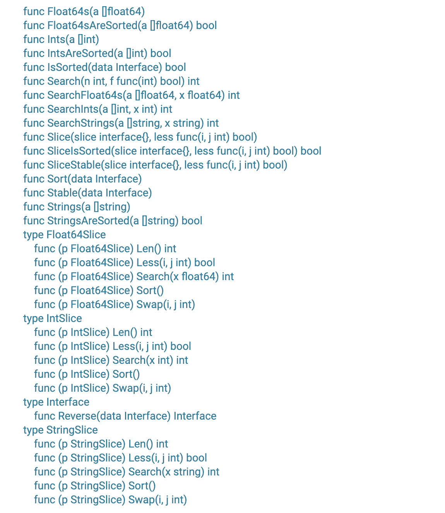

### 对普通其他类型,使用sort.Slice

<br>

sort包直接支持的只有**int/float64/string**等寥寥几个数据类型,其他则没有直接的函数供调用.

如**sort.Strings()**只接收`[]string`的参数, **sort.Ints()**只接收`[]int`类型.

如果要对`[]int64`排序就不能直接调用了.





sort包提供了一个非常灵活的函数`sort.Slice(slice interface{}, less func(i, j int) bool)`,第一个参数是待排序的切片.第二个参数是一个函数,该函数接收两个index值,返回 `slice[i] < slice[j]`这个bool值,从而控制是asc还是desc


<br>


```go
package main

import (
	"fmt"
	"math/rand"
	"sort"
	"time"
)

func main() {

	var length = 15
	var list []int


	// 以时间戳为种子生成随机数，保证每次生成的数据不重复
	r := rand.New(rand.NewSource(time.Now().UnixNano()))

	for i := 0; i < length; i++ {
		list = append(list, r.Intn(1000))
	}
	fmt.Println("待排序数组为:", list)
	
	
	sort.Slice(list, func(i, j int) bool {
		return list[i] < list[j]
	})

	fmt.Println("排序后的数组为:",list)

}
```

<br>


输出为:

```shell
待排序数组为: [357 718 763 394 716 361 384 198 832 189 640 364 776 84 110]
排序后的数组为: [84 110 189 198 357 361 364 384 394 640 716 718 763 776 832]
```


<br>

如果要求稳定排序,可使用`sort.SliceStable()`


<br>

---

<br>

### 对结构体类型,使用sort.Interface


<br>

http://c.biancheng.net/view/81.html

https://www.google.com/search?q=golang+int64+%E6%8E%92%E5%BA%8F&oq=golang+int64+%E6%8E%92%E5%BA%8F&aqs=chrome..69i57j0l7.5142j0j1&sourceid=chrome&ie=UTF-8


---


<br>


更多阅读:

[排序算法汇总](https://dashen.tech/2019/03/26/%E6%8E%92%E5%BA%8F%E7%AE%97%E6%B3%95%E6%B1%87%E6%80%BB/)

[sort包源码分析](https://dashen.tech/2020/10/25/sort%E5%8C%85%E6%BA%90%E7%A0%81%E5%88%86%E6%9E%90/)
