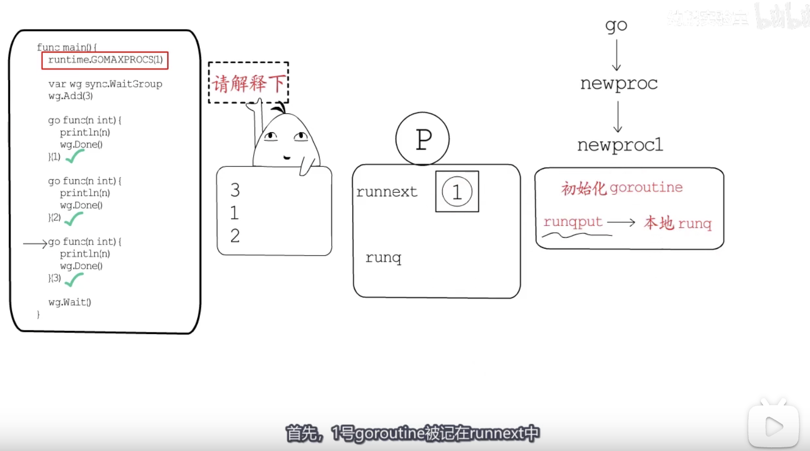
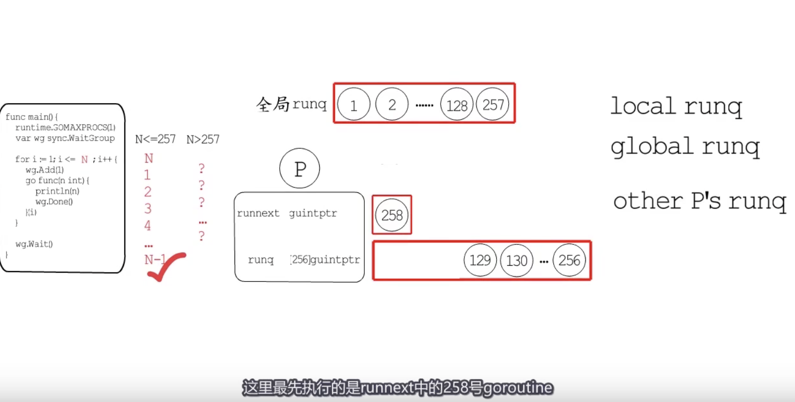

本文是对[卷卷面试题](https://www.bilibili.com/video/BV19b4y1i74w)的学习与记录

<br>


go 关键字会被编译器转化为对*runtime.newproc*函数的调用。该函数的主要逻辑：先切换到系统栈，然后调用*newproc1*函数，分配并初始化一个新的g，再通过*runqput*把新的g添加到当前P的本地runq中。


```go
package main

import (
	"runtime"
	"sync"
)

func main() {

	// 任一时刻，只允许一个M执行Go代码； 就像单核CPU上的多线程那样
	runtime.GOMAXPROCS(1)

	var wg sync.WaitGroup

	wg.Add(3)

	go func(n int) {
		println(n)
		wg.Done()
	}(1)

	go func(n int) {
		println(n)
		wg.Done()
	}(2)

	go func(n int) {
		println(n)
		wg.Done()
	}(3)

	wg.Wait()

}
```

输出:

```go
3
1
2
```

<br>

之所以如此，是因为 P不仅有一个本地runq，还有一个runnext字段，用来保存下次要运行的g。 newproc1中调用runqput时会用到这个runnext





调度goroutine执行时，通过runqget获取待执行的g。runqget也会对runnext特殊处理：**优先调度runnext这里记录的g，再按顺序调度本地runq中记录的g**

所以是3-1-2


<br>


如果创建更多的goroutine，结果也如此吗？


```go
package main

import (
	"runtime"
	"sync"
)

func main() {

	// 任一时刻，只允许一个M执行Go代码； 就像单核CPU上的多线程那样
	runtime.GOMAXPROCS(1)

	var wg sync.WaitGroup

	for i := 1; i <= 280; i++ {
		wg.Add(1)
		go func(n int) {
			println(n)
			wg.Done()
		}(i)
	}

	wg.Wait()

}
```


4个goroutine输出的是 4,1,2,3
5个goroutine输出的是 5,1,2,3,4

直到257个gorutine，都是这样的规律, 即  *N,1,2,....,(N-1)*


<br>

当多于257个goutine时，


第258号goutine会把257号挤走，但本地runq已满，所以第257号goroutine，会和本地runq中前一半的g，一同进入到全局runq中，


先从本地runq中获取待执行的g，没有的话，再从全局runq获取。还没有的话，就去其他P那里steal一部分(一半)，





所以可能会以为，先执行258号，而后是129，130...,256。最后才是全局队列中的1，2，...128，257


实际并非如此...


实际执行会发现，第1号，2号goroutine，会穿插在258，129，....258之间被执行。

这个问题与runq的排队逻辑无关，属于调度逻辑的范畴


runtime.schedule，每隔61个schedtick，就会优先尝试从**全局runq**中获取goroutine，这是为了避免在每个P的本地runq都很繁忙时，全局runq中的goroutine迟迟得不到调度的情况。


<br>


- 本地runq的排队逻辑(runnext)

- 全局runq，每隔61个schedtick会优先从全局runq中拿一个goroutine去执行


<br>


更多阅读


[迷惑的 goroutine 执行顺序](https://qcrao.com/2021/05/24/confusing-goroutine-running-orders/)

[Go 调度的本质](https://qcrao.com/2021/05/20/go-schedule-under-the-hood/)