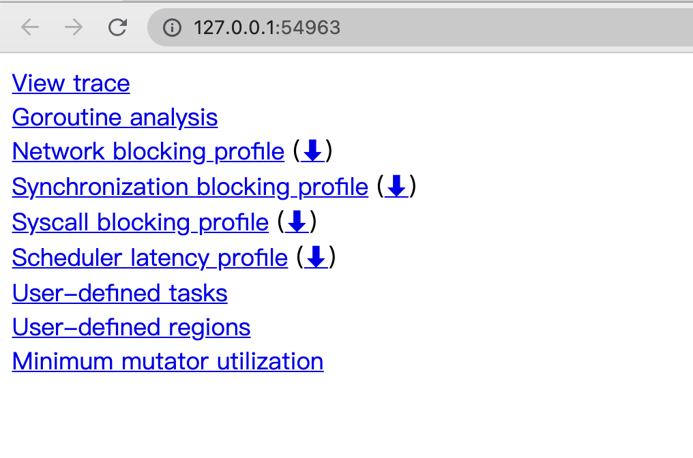
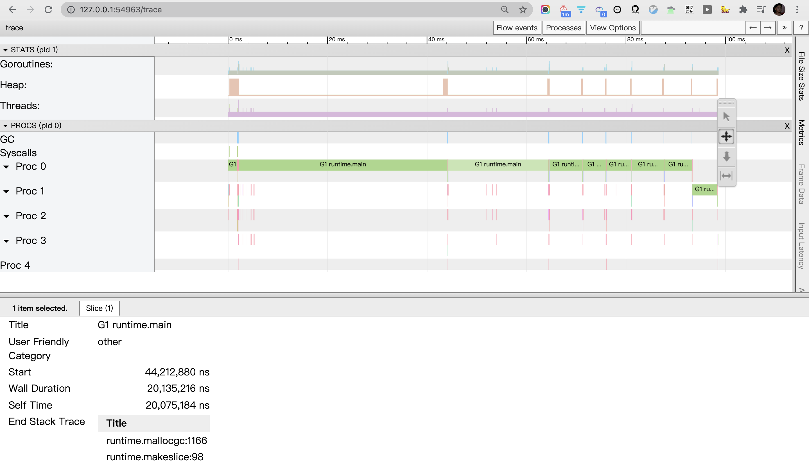

```go
package main

// 1<<10 即2的10次方，即1K。  1<<20即1M  2的8次方为256，1<<28即256M
func allocate() {
	_ = make([]byte, 1<<28)
}
func main() {
	for n := 1; n < 10; n++ {
		allocate()
	}
}
```

<br>


### 自带方式


<br>


该部分来自 [Go 语言问题集(Go Questions)-6. 如何观察 Go GC？](https://www.bookstack.cn/read/qcrao-Go-Questions/spilt.6.GC-GC.md)


<br>


#### GODEBUG=gctrace=1

<br>


go build xxx.go

GODEBUG=gctrace=1 ./xxx


```go
gc 1 @0.002s 1%: 0.020+0.11+0.002 ms clock, 0.16+0.052/0.10/0.038+0.019 ms cpu, 256->256->0 MB, 257 MB goal, 8 P

gc 2 @0.041s 0%: 0.022+0.11+0.002 ms clock, 0.18+0.049/0.051/0.028+0.019 ms cpu, 256->256->0 MB, 257 MB goal, 8 P

gc 3 @0.049s 0%: 0.020+0.073+0.001 ms clock, 0.16+0.042/0.030/0.051+0.014 ms cpu, 256->256->0 MB, 257 MB goal, 8 P

gc 4 @0.054s 0%: 0.017+0.087+0.001 ms clock, 0.13+0.038/0.034/0.019+0.012 ms cpu, 256->256->0 MB, 257 MB goal, 8 P

gc 5 @0.058s 0%: 0.018+0.061+0.001 ms clock, 0.14+0.030/0.025/0.012+0.012 ms cpu, 256->256->0 MB, 257 MB goal, 8 P

gc 6 @0.063s 0%: 0.018+0.042+0.001 ms clock, 0.14+0.027/0.026/0.024+0.012 ms cpu, 256->256->0 MB, 257 MB goal, 8 P

gc 7 @0.069s 0%: 0.016+0.033+0.001 ms clock, 0.13+0.024/0.027/0.012+0.012 ms cpu, 256->256->0 MB, 257 MB goal, 8 P

gc 8 @0.073s 0%: 0.016+0.071+0 ms clock, 0.13+0.034/0.017/0.005+0.005 ms cpu, 256->256->0 MB, 257 MB goal, 8 P
```

上方记录属于 *用户代码向运行时申请内存产生的垃圾回收*

以 `gc 2 @0.041s 0%:  0.022+0.11+0.002 ms clock,  0.18+0.049/0.051/ 0.028+0.019 ms cpu, 256->256->0 MB, 257 MB goal, 8 P` 为例：


gc 2@0.001s2%:0.018+1.1+0.029 ms clock,0.22+0.047/0.074/ 0.048+0.34 ms cpu,4->7->3 MB,5 MB goal,12 P

|  字段   | 含义  |
|  ----  | ----  |
| gc 2  | 第二个 GC 周期 |
| 0%    | 该 GC 周期中 CPU 的使用率 |
| ---  | --- |
| 0.022  | 标记开始时， STW 所花费的时间（wall clock） |
| 0.11  | 标记过程中，并发标记所花费的时间（wall clock） |
| 0.002  | 标记终止时， STW 所花费的时间（wall clock） |
| ---  | ---|
| 0.18  | 标记开始时， STW 所花费的时间（cpu time） |
| 0.049  | 标记过程中，标记辅助所花费的时间（cpu time） |
| 0.051  | 标记过程中，并发标记所花费的时间（cpu time） |
| 0.028  | 标记过程中，GC 空闲的时间（cpu time） |
| 0.019  | 标记终止时， STW 所花费的时间（cpu time） |
| ---  | --- |
| 256  | 标记开始时，堆的大小的实际值 |
| 256  | 标记结束时，堆的大小的实际值 |
| 0  | 标记结束时，标记为存活的对象大小 |
| 257  | 标记结束时，堆大小的预测值 |
| ---  | --- |
| 8  | P 的数量 |


<br>


<font size=1 color="grey">
wall clock 是指开始执行到完成所经历的实际时间，包括其他程序和本程序所消耗的时间；cpu time 是指特定程序使用 CPU 的时间；二者存在如下关系：

- wall clock < cpu time: 充分利用多核
- wall clock ≈ cpu time: 未并行执行
- wall clock > cpu time: 多核优势不明显

</font>

<br>

以上程序执行还有一种可能的返回值：

```go
scvg:8 KB released
scvg: inuse:3, idle:60, sys:63, released:57, consumed:6(MB)
```

含义如下：

|  字段   | 含义  |
|  ----  | ----  |
| 8 KB released | 向操作系统归还了 8 KB 内存 |
| 3    | 已经分配给用户代码、正在使用的总内存大小 (MB) |
| 60 | 空闲以及等待归还给操作系统的总内存大小（MB） |
| 63  | 通知操作系统中保留的内存大小（MB） |
| 57  | 已经归还给操作系统的（或者说还未正式申请）的内存大小（MB） |
| 6  | 已经从操作系统中申请的内存大小（MB） |


<br>


#### go tool trace


<br>


```go
package main

import (
	"os"
	"runtime/trace"
)

// 1<<10 即2的10次方，即1K
func allocate() {
	_ = make([]byte, 1<<28)
}
func main() {
	f, _ := os.Create("trace_256m.out")
	defer f.Close()
	trace.Start(f)
	defer trace.Stop()

	for n := 1; n < 10; n++ {
		allocate()
	}
}
```

<br>

运行如上代码，将生成一个`trace_256m.out`文件


使用 `go tool trace trace_256m.out`, 将自动打开浏览器








更详细使用可参考

[性能分析工具](https://dashen.tech/2021/03/01/%E6%80%A7%E8%83%BD%E5%88%86%E6%9E%90%E5%B7%A5%E5%85%B7/)


<br>


#### debug.ReadGCStats


<br>


此方式可直接实现对感兴趣指标的监控，如每隔一秒钟监控一次 GC 的状态：

```go
package main

import (
	"fmt"
	"runtime"
	"runtime/debug"
	"time"
)

func printGCStats() {
	t := time.NewTicker(time.Second)
	s := debug.GCStats{}
	for {
		select {
		case <-t.C:
			debug.ReadGCStats(&s)
			fmt.Printf("gc %d last@%v, PauseTotal %v\n", s.NumGC, s.LastGC, s.PauseTotal)
		}
	}
}

func main() {
	go printGCStats()

	for n := 1; n < 100000; n++ {
		allocate()
	}
}

// 1<<10 即2的10次方，即1K。  1<<20即1M. 1<<28=256M
func allocate() {
	_ = make([]byte, 1<<28)
}

```

<br>

输出为：

```go
gc 193 last@20xx-xx-xx 21:28:00.687708 +0800 CST, PauseTotal 4.099753ms
gc 404 last@20xx-xx-xx 21:28:01.689369 +0800 CST, PauseTotal 8.10266ms
gc 617 last@20xx-xx-xx 21:28:02.689289 +0800 CST, PauseTotal 12.034994ms
gc 828 last@20xx-xx-xx 21:28:03.688104 +0800 CST, PauseTotal 16.030454ms
gc 1029 last@20xx-xx-xx 21:28:04.689737 +0800 CST, PauseTotal 20.737255ms
gc 1238 last@20xx-xx-xx 21:28:05.68598 +0800 CST, PauseTotal 24.46508ms
gc 1451 last@20xx-xx-xx 21:28:06.689495 +0800 CST, PauseTotal 28.538742ms
gc 1660 last@20xx-xx-xx 21:28:07.685889 +0800 CST, PauseTotal 32.635618ms
gc 1865 last@20xx-xx-xx 21:28:08.687902 +0800 CST, PauseTotal 37.071374ms
gc 2076 last@20xx-xx-xx 21:28:09.688949 +0800 CST, PauseTotal 41.0627ms
gc 2285 last@20xx-xx-xx 21:28:10.688493 +0800 CST, PauseTotal 45.44829ms
gc 2496 last@20xx-xx-xx 21:28:11.689987 +0800 CST, PauseTotal 49.741249ms
gc 2702 last@20xx-xx-xx 21:28:12.689267 +0800 CST, PauseTotal 54.465249ms
```


<br>


#### runtime.ReadMemStats


<br>


直接通过运行时的内存相关的 API 进行监控


```go
package main

import (
	"fmt"
	"runtime"
	"runtime/debug"
	"time"
)


func main() {
	
	go printMemStats()

	for n := 1; n < 100000; n++ {
		allocate()
	}
}

// 1<<10 即2的10次方，即1K。  1<<20即1M. 1<<28=256M
func allocate() {
	_ = make([]byte, 1<<28)
}

func printMemStats() {
	t := time.NewTicker(time.Second)
	s := runtime.MemStats{}
	for {
		select {
		case <-t.C:
			runtime.ReadMemStats(&s)
			fmt.Printf("gc %d last@%v, next_heap_size@%vMB\n", s.NumGC, time.Unix(int64(time.Duration(s.LastGC).Seconds()), 0), s.NextGC/(1<<20))
		}
	}
}

```

输出为：

```go
gc 200 last@20xx-xx-xx21:30:07 +0800 CST, next_heap_size@4MB
gc 411 last@20xx-xx-xx21:30:08 +0800 CST, next_heap_size@4MB
gc 616 last@20xx-xx-xx21:30:09 +0800 CST, next_heap_size@4MB
gc 827 last@20xx-xx-xx21:30:10 +0800 CST, next_heap_size@257MB
gc 1037 last@20xx-xx-xx21:30:11 +0800 CST, next_heap_size@4MB
gc 1227 last@20xx-xx-xx21:30:12 +0800 CST, next_heap_size@4MB
gc 1417 last@20xx-xx-xx21:30:13 +0800 CST, next_heap_size@4MB
gc 1610 last@20xx-xx-xx21:30:14 +0800 CST, next_heap_size@4MB
gc 1812 last@20xx-xx-xx21:30:15 +0800 CST, next_heap_size@4MB
gc 1994 last@20xx-xx-xx21:30:16 +0800 CST, next_heap_size@4MB
gc 2167 last@20xx-xx-xx21:30:17 +0800 CST, next_heap_size@4MB
gc 2352 last@20xx-xx-xx21:30:18 +0800 CST, next_heap_size@4MB
```


<br>


---


<br>


### 第三方包

<br>


https://toutiao.io/posts/494797/app_preview


https://www.google.com.hk/search?q=golang+scavenge&oq=golang+scavenge&aqs=chrome..69i57j0i512j0i8i30l2.1659j0j1&sourceid=chrome&ie=UTF-8


https://github.com/bmhatfield/go-runtime-metrics


https://github.com/pkujhd/goloader


https://github.com/coldnight/go-memory-allocator-visual-guide


 
