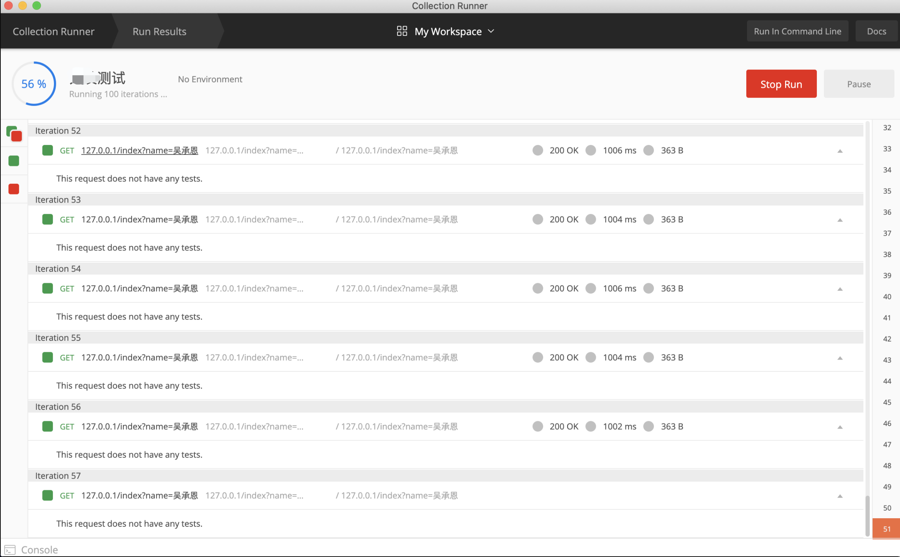
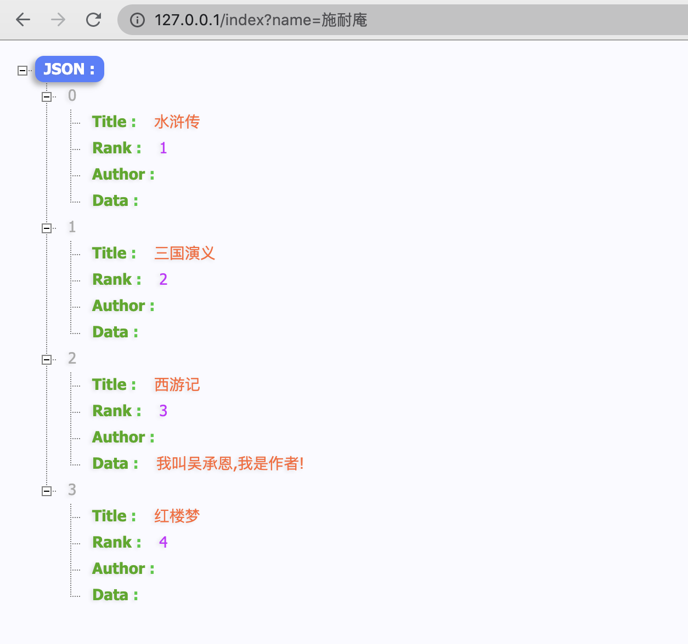

## <font color="#2F4F4F">**简述:**</font>


<br>


<font color="#A0522D">在 [关于range二三事](https://dashen.tech/2018/10/03/%E5%85%B3%E4%BA%8Erange%E4%BA%8C%E4%B8%89%E4%BA%8B/) 第二个case中,介绍了对于指针类型的 切片/map变量A 的循环,要格外注意, 迭代出的value作用域是整个方法而非循环体内. 

改进办法:在循环体中引入中间变量,"暂存"下每次迭代的value的值</font>


<br>

但对于这个A,如果是全局变量,则又极有可能出现问题:

```go
package main

import (
	"fmt"
)

type UserInfo struct {
	Name string
	Age  int
}

var (
	defaultInfo    = UserInfo{Name: "fliter", Age: 26}
	defaultInfoSli = []*UserInfo{&defaultInfo}
)

func main() {
	
	for _, v := range defaultInfoSli {
		tmp := v

		//go func() {
		tmp.Age = 100
		//}()
	}
	//time.Sleep(1e9)
	fmt.Println(defaultInfoSli[0].Age)
}
```

<br>

**defaultInfoSli**迭代出的`v`为指针类型,tmp仍为指针类型,对其赋值,会改变全局变量**defaultInfoSli**的值


<br>

---

<br>


## <font color="#2F4F4F">**复现:**</font>

<br>


在具体业务场景中,服务启动时初始化(取数据库或redis,或读取配置文件,加载到内存中)了一个全局变量.每个http请求过来,golang都会有一个新的协程去处理相关逻辑. 对于某个具体方法内的变量,对每次请求都是独立和隔离(每次请求都相当于一个个cellar,彼此之间不会有干涉和影响), 但对于永久存在内存中的全局变量,如果有对其写操作,每次请求都会影响该全局变量. 当出现并发请求如用户x和y同时请求接口, 两次请求都会改写全局变量, 这时就很可能出现返回的x和y的数据错乱

<br>


Demo如下:

```go
package main

import (
	"encoding/json"
	"fmt"
	"github.com/davecgh/go-spew/spew"
	"log"
	"net/http"
)

type BookInfo struct {
	Title string
	Rank  int
	Data  interface{}
}

var (
	defaultBook1 = BookInfo{Title: "水浒传", Rank: 1}
	defaultBook2 = BookInfo{Title: "三国演义", Rank: 2}
	defaultBook3 = BookInfo{Title: "西游记", Rank: 3}
	defaultBook4 = BookInfo{Title: "红楼梦", Rank: 4}

	DefaultBookSli = []*BookInfo{&defaultBook1, &defaultBook2, &defaultBook3, &defaultBook4}
)

type CommonParams struct {
	ID   int64
	Name string
}

var (
	ModuleHandlers = map[int]func(params *CommonParams) *BookInfo{
		1: HandleTypeOne,
		2: HandleTypeTwo,
		3: HandleTypeThree,
		4: HandleTypeFour,
	}
)

func main() {

	fmt.Println(DefaultBookSli)

	http.HandleFunc("/index", deal) //设置访问的路由

	err := http.ListenAndServe(":80", nil) //设置监听的端口
	if err != nil {
		log.Fatal("ListenAndServe: ", err)
	}

}

func deal(w http.ResponseWriter, r *http.Request) {

	name := r.URL.Query().Get("name")

	//fmt.Println("name值为:", name)

	par := &CommonParams{
		ID:   0,
		Name: name,
	}

	// 获取相关数据
	for _, v := range DefaultBookSli {

		module := v

		//fmt.Println("module is:", module)
		//fmt.Println("排序为:", module.Rank)

		m := ModuleHandlers[module.Rank](par)

		// 填充模块数据
		if m.Data != nil {
			module.Data = m.Data
		}

		// (如果需要),重写模块标题(在此不需要)
		//if m.Title != "" {
		//	module.Title = m.Title
		//}
	}

	//time.Sleep(1e9) //此处等待并不是因为协程,而是方便测试,不加这个等待,执行100次秒速就完成. 加这个等待是为了方便模拟"几个用户同时请求"
	//fmt.Println(DefaultBookSli[0].Rank)

	spew.Dump(DefaultBookSli)

	rsJson, _ := json.Marshal(DefaultBookSli)

	//fmt.Println(string(rsJson))    //这个写入到w的是输出到客户端的
	fmt.Fprintf(w, string(rsJson)) //这个写入到w的是输出到客户端的

}

func HandleTypeOne(p *CommonParams) *BookInfo {

	res := ""
	if p.Name == "施耐庵" {
		res = "我叫施耐庵,我是作者!"
	}
	return &BookInfo{Data: res}
}

func HandleTypeTwo(p *CommonParams) *BookInfo {

	res := ""
	if p.Name == "罗贯中" {
		res = "我叫罗贯中,我是作者!"
	}
	return &BookInfo{Data: res}
}

func HandleTypeThree(p *CommonParams) *BookInfo {

	res := ""
	if p.Name == "吴承恩" {

		res = "我叫吴承恩,我是作者!"
	}
	return &BookInfo{Data: res}
}

func HandleTypeFour(p *CommonParams) *BookInfo {

	res := ""
	if p.Name == "曹雪芹" {
		res = "我叫曹雪芹,我是作者!"
	}

	return &BookInfo{Data: res}
}

```

<br>

带着参数x, 使用[Postman进行串行调用](https://www.cnblogs.com/stm32stm32/p/10434399.html)100次,



<br>


同时再访问这个接口,带参数y,此时可以发现,出现了数据错乱:





---

<br>

## <font color="#2F4F4F">**修改方案:**</font>

<br>


在`module := v`这一步,实际上module依然是指针类型.

可以`module := *v`,这样module就不是指针类型,也就不会出现如上问题.

<br>


当时问题紧急,直接在里面新加了一个临时变量,即:

```go
	// 获取相关数据
	for _, v := range DefaultBookSli {

		module := v

		var temModule = &BookInfo{
			Title: module.Title,
			Rank:  module.Rank,
		}
		
		m := ModuleHandlers[temModule.Rank](par)

		// 填充模块数据
		if m.Data != nil {
			module.Data = m.Data
		}
	}
```

<br>

---


<br>


详细过程参见 私有笔记 [并发写全局变量导致的数据错乱问题](https://note.youdao.com/web/#/file/WEB058d4e136c3ee281320806fd45e3b07a/note/WEB6c29aebf58ba0868bdeef60f7e6bac40/),印象深刻的一次体验
