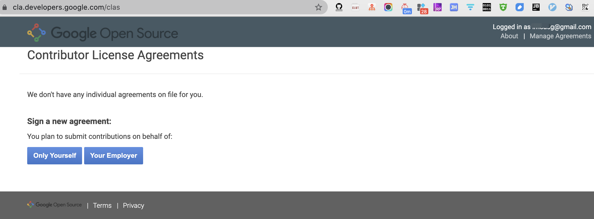
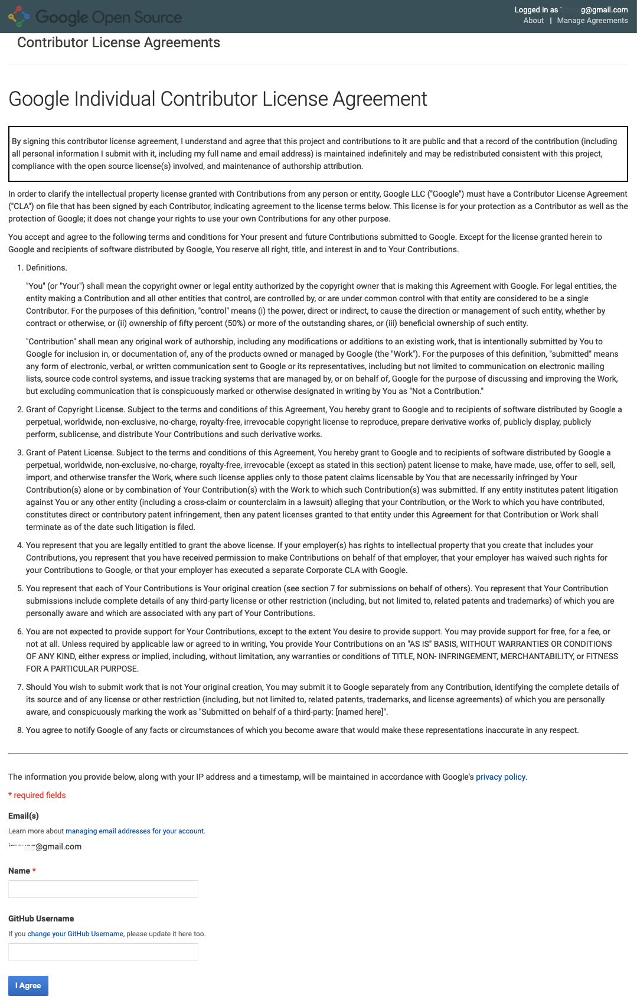
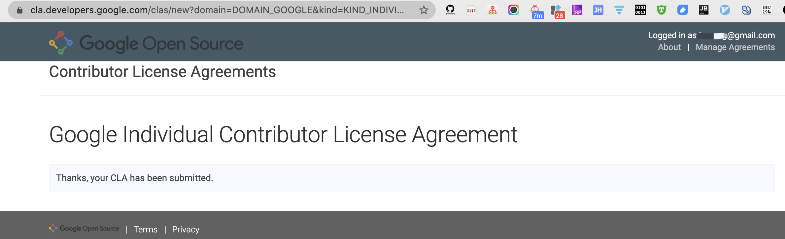
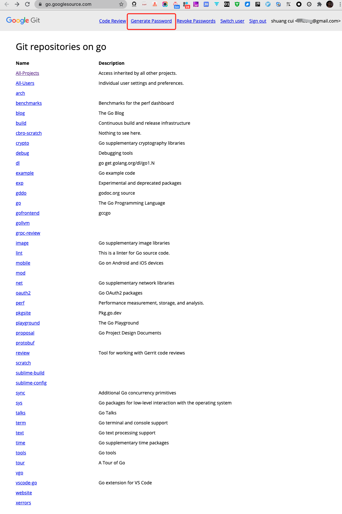
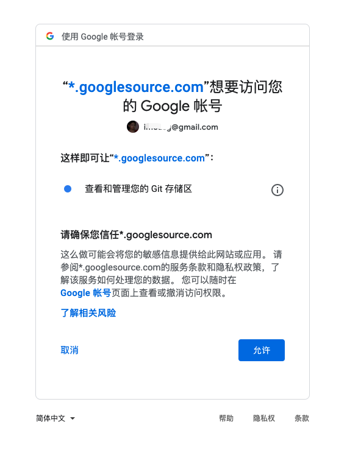
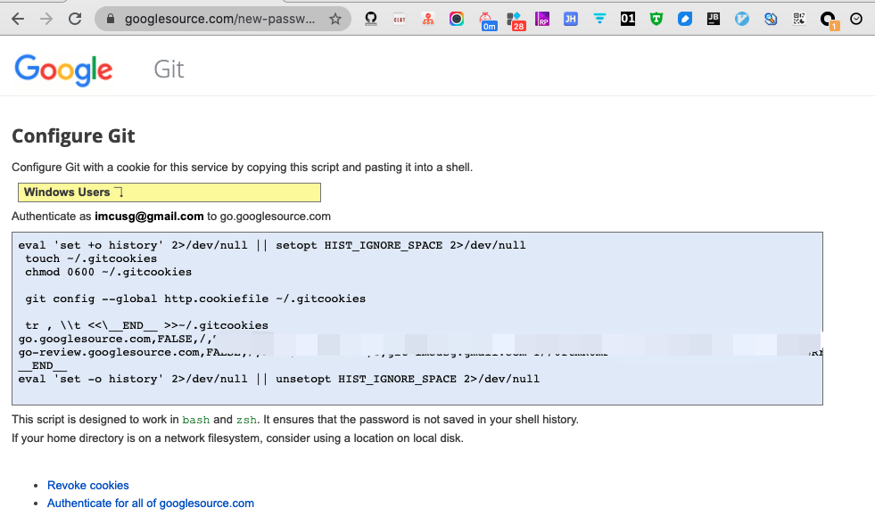
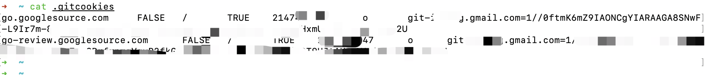
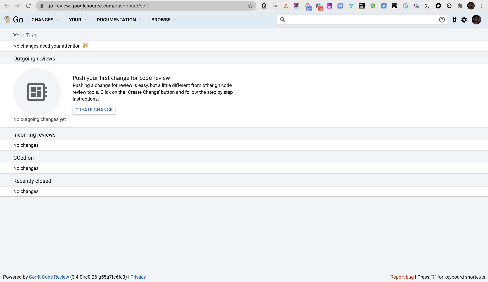
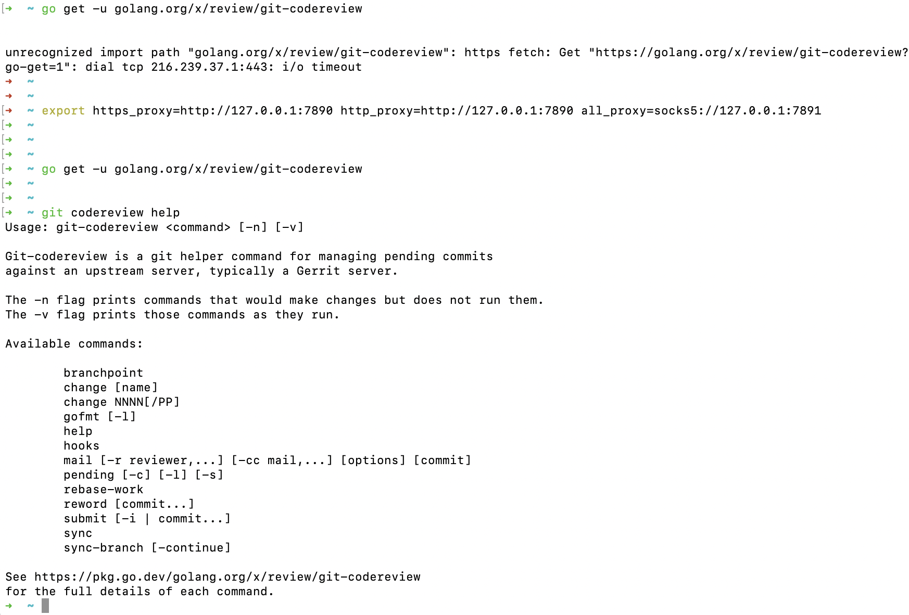

[Contribution Guide](https://golang.org/doc/contribute)


<br>


## Becoming a contributor


<br>

### Overview

<br>


The first step is registering as a Go contributor and configuring your environment. Here is a checklist of the required steps to follow:

* **Step 0**: Decide on a single Google Account you will be using to contribute to Go. Use that account for all the following steps and make sure that `git` is configured to create commits with that account's e-mail address.
* **Step 1**: [Sign and submit](https://cla.developers.google.com/clas) a CLA (Contributor License Agreement).
* **Step 2**: Configure authentication credentials for the Go Git repository. Visit [go.googlesource.com](https://go.googlesource.com/), click "Generate Password" in the page's top right menu bar, and follow the instructions.
* **Step 3**: Register for Gerrit, the code review tool used by the Go team, by [visiting this page](https://go-review.googlesource.com/login/). The CLA and the registration need to be done only once for your account.
* **Step 4**: Install `git-codereview` by running `go get -u golang.org/x/review/git-codereview`

If you prefer, there is an automated tool that walks through these steps. Just run:

<pre>$ go get -u golang.org/x/tools/cmd/go-contrib-init
$ cd /code/to/edit
$ go-contrib-init
</pre>

The rest of this chapter elaborates on these instructions. If you have completed the steps above (either manually or through the tool), jump to [Before contributing code](https://golang.org/doc/contribute#before_contributing).


<br>


---


<br>

### Step 0: Select a Google Account  && Step 1: Contributor License Agreement

<br>








<details>
<summary><b>Google Individual Contributor License Agreement:</b></summary>

```lua
By signing this contributor license agreement, I understand and agree that this project and contributions to it are public and that a record of the contribution (including all personal information I submit with it, including my full name and email address) is maintained indefinitely and may be redistributed consistent with this project, compliance with the open source license(s) involved, and maintenance of authorship attribution.

In order to clarify the intellectual property license granted with Contributions from any person or entity, Google LLC ("Google") must have a Contributor License Agreement ("CLA") on file that has been signed by each Contributor, indicating agreement to the license terms below. This license is for your protection as a Contributor as well as the protection of Google; it does not change your rights to use your own Contributions for any other purpose.

You accept and agree to the following terms and conditions for Your present and future Contributions submitted to Google. Except for the license granted herein to Google and recipients of software distributed by Google, You reserve all right, title, and interest in and to Your Contributions.

Definitions.

"You" (or "Your") shall mean the copyright owner or legal entity authorized by the copyright owner that is making this Agreement with Google. For legal entities, the entity making a Contribution and all other entities that control, are controlled by, or are under common control with that entity are considered to be a single Contributor. For the purposes of this definition, "control" means (i) the power, direct or indirect, to cause the direction or management of such entity, whether by contract or otherwise, or (ii) ownership of fifty percent (50%) or more of the outstanding shares, or (iii) beneficial ownership of such entity.

"Contribution" shall mean any original work of authorship, including any modifications or additions to an existing work, that is intentionally submitted by You to Google for inclusion in, or documentation of, any of the products owned or managed by Google (the "Work"). For the purposes of this definition, "submitted" means any form of electronic, verbal, or written communication sent to Google or its representatives, including but not limited to communication on electronic mailing lists, source code control systems, and issue tracking systems that are managed by, or on behalf of, Google for the purpose of discussing and improving the Work, but excluding communication that is conspicuously marked or otherwise designated in writing by You as "Not a Contribution."

Grant of Copyright License. Subject to the terms and conditions of this Agreement, You hereby grant to Google and to recipients of software distributed by Google a perpetual, worldwide, non-exclusive, no-charge, royalty-free, irrevocable copyright license to reproduce, prepare derivative works of, publicly display, publicly perform, sublicense, and distribute Your Contributions and such derivative works.

Grant of Patent License. Subject to the terms and conditions of this Agreement, You hereby grant to Google and to recipients of software distributed by Google a perpetual, worldwide, non-exclusive, no-charge, royalty-free, irrevocable (except as stated in this section) patent license to make, have made, use, offer to sell, sell, import, and otherwise transfer the Work, where such license applies only to those patent claims licensable by You that are necessarily infringed by Your Contribution(s) alone or by combination of Your Contribution(s) with the Work to which such Contribution(s) was submitted. If any entity institutes patent litigation against You or any other entity (including a cross-claim or counterclaim in a lawsuit) alleging that your Contribution, or the Work to which you have contributed, constitutes direct or contributory patent infringement, then any patent licenses granted to that entity under this Agreement for that Contribution or Work shall terminate as of the date such litigation is filed.

You represent that you are legally entitled to grant the above license. If your employer(s) has rights to intellectual property that you create that includes your Contributions, you represent that you have received permission to make Contributions on behalf of that employer, that your employer has waived such rights for your Contributions to Google, or that your employer has executed a separate Corporate CLA with Google.

You represent that each of Your Contributions is Your original creation (see section 7 for submissions on behalf of others). You represent that Your Contribution submissions include complete details of any third-party license or other restriction (including, but not limited to, related patents and trademarks) of which you are personally aware and which are associated with any part of Your Contributions.

You are not expected to provide support for Your Contributions, except to the extent You desire to provide support. You may provide support for free, for a fee, or not at all. Unless required by applicable law or agreed to in writing, You provide Your Contributions on an "AS IS" BASIS, WITHOUT WARRANTIES OR CONDITIONS OF ANY KIND, either express or implied, including, without limitation, any warranties or conditions of TITLE, NON- INFRINGEMENT, MERCHANTABILITY, or FITNESS FOR A PARTICULAR PURPOSE.

Should You wish to submit work that is not Your original creation, You may submit it to Google separately from any Contribution, identifying the complete details of its source and of any license or other restriction (including, but not limited to, related patents, trademarks, and license agreements) of which you are personally aware, and conspicuously marking the work as "Submitted on behalf of a third-party: [named here]".

You agree to notify Google of any facts or circumstances of which you become aware that would make these representations inaccurate in any respect.

```

</details>


<br>

---


<br>


### Step 2: Configure git authentication 

<br>

配置git身份认证


The main Go repository is located at [go.googlesource.com](https://go.googlesource.com/), a Git server hosted by Google. Authentication on the web server is made through your Google account, but you also need to configure `git` on your computer to access it. Follow these steps:

1. Visit [go.googlesource.com](https://go.googlesource.com/) and click on "Generate Password" in the page's top right menu bar. You will be redirected to accounts.google.com to sign in.
2. After signing in, you will be taken to a page with the title "Configure Git". This page contains a personalized script that when run locally will configure Git to hold your unique authentication key. This key is paired with one that is generated and stored on the server, analogous to how SSH keys work.
3. Copy and run this script locally in your terminal to store your secret authentication token in a `.gitcookies` file. If you are using a Windows computer and running `cmd`, you should instead follow the instructions in the yellow box to run the command; otherwise run the regular script.









在终端执行这段脚本,身份验证令牌就存储在了`.gitcookies`文件中





<br>

---

<br>

### Step 3: Create a Gerrit account

<br>

Gerrit is an open-source tool used by Go maintainers to discuss and review code submissions.

To register your account, visit [go-review.googlesource.com/login/](https://go-review.googlesource.com/login/) and sign in once using the same Google Account you used above.





<br>

---

<br>


### Step 4: Install the git-codereview command [¶](https://golang.org/doc/contribute#git-codereview_install)


<br>


Changes to Go must be reviewed before they are accepted, no matter who makes the change. A custom `git` command called `git-codereview` simplifies sending changes to Gerrit.

Install the `git-codereview` command by running,

<pre>$ go get -u golang.org/x/review/git-codereview
</pre>

Make sure `git-codereview` is installed in your shell path, so that the `git` command can find it. Check that

<pre>$ git codereview help
</pre>

prints help text, not an error. If it prints an error, make sure that `$GOPATH/bin` is in your `$PATH`.

On Windows, when using git-bash you must make sure that `git-codereview.exe` is in your `git` exec-path. Run `git --exec-path` to discover the right location then create a symbolic link or just copy the executable from `$GOPATH/bin` to this directory.


<br>




<br>


---


<br>

## Before contributing code

<br>


The project welcomes code patches, but to make sure things are well coordinated you should discuss any significant change before starting the work. It's recommended that you signal your intention to contribute in the issue tracker, either by [filing a new issue](https://golang.org/issue/new) or by claiming an [existing one](https://golang.org/issues).


<br>


### Where to contribute

<br>

The Go project consists of the main [go](https://go.googlesource.com/go) repository, which contains the source code for the Go language, as well as many golang.org/x/... repositories. These contain the various tools and infrastructure that support Go. For example, [golang.org/x/pkgsite](https://go.googlesource.com/pkgsite) is for [pkg.go.dev](https://pkg.go.dev/), [golang.org/x/playground](https://go.googlesource.com/playground) is for the Go playground, and [golang.org/x/tools](https://go.googlesource.com/tools) contains a variety of Go tools, including the Go language server, [gopls](https://golang.org/s/gopls). You can see a list of all the golang.org/x/... repositories on [go.googlesource.com](https://go.googlesource.com/).

<br>


### Check the issue tracker

<br>

Whether you already know what contribution to make, or you are searching for an idea, the [issue tracker](https://github.com/golang/go/issues) is always the first place to go. Issues are triaged to categorize them and manage the workflow.

The majority of the golang.org/x/... repos also use the main Go issue tracker. However, a few of these repositories manage their issues separately, so please be sure to check the right tracker for the repository to which you would like to contribute.

Most issues will be marked with one of the following workflow labels:

* **NeedsInvestigation**: The issue is not fully understood and requires analysis to understand the root cause.
* **NeedsDecision**: the issue is relatively well understood, but the Go team hasn't yet decided the best way to address it. It would be better to wait for a decision before writing code. If you are interested in working on an issue in this state, feel free to "ping" maintainers in the issue's comments if some time has passed without a decision.
* **NeedsFix**: the issue is fully understood and code can be written to fix it.

You can use GitHub's search functionality to find issues to help out with. Examples:

* Issues that need investigation: [`is:issue is:open label:NeedsInvestigation`](https://github.com/golang/go/issues?q=is%3Aissue+is%3Aopen+label%3ANeedsInvestigation)
* Issues that need a fix: [`is:issue is:open label:NeedsFix`](https://github.com/golang/go/issues?q=is%3Aissue+is%3Aopen+label%3ANeedsFix)
* Issues that need a fix and have a CL: [`is:issue is:open label:NeedsFix "golang.org/cl"`](https://github.com/golang/go/issues?q=is%3Aissue+is%3Aopen+label%3ANeedsFix+%22golang.org%2Fcl%22)
* Issues that need a fix and do not have a CL: [`is:issue is:open label:NeedsFix NOT "golang.org/cl"`](https://github.com/golang/go/issues?q=is%3Aissue+is%3Aopen+label%3ANeedsFix+NOT+%22golang.org%2Fcl%22)

<br>


### Open an issue for any new problem

<br>

Excluding very trivial changes, all contributions should be connected to an existing issue. Feel free to open one and discuss your plans. This process gives everyone a chance to validate the design, helps prevent duplication of effort, and ensures that the idea fits inside the goals for the language and tools. It also checks that the design is sound before code is written; the code review tool is not the place for high-level discussions.

When planning work, please note that the Go project follows a [six-month development cycle](https://golang.org/wiki/Go-Release-Cycle) for the main Go repository. The latter half of each cycle is a three-month feature freeze during which only bug fixes and documentation updates are accepted. New contributions can be sent during a feature freeze, but they will not be merged until the freeze is over. The freeze applies to the entire main repository as well as to the code in golang.org/x/... repositories that is needed to build the binaries included in the release. See the lists of packages vendored into [the standard library](https://github.com/golang/go/blob/master/src/vendor/modules.txt) and the [`go` command](https://github.com/golang/go/blob/master/src/cmd/vendor/modules.txt).

Significant changes to the language, libraries, or tools must go through the [change proposal process](https://golang.org/s/proposal-process) before they can be accepted.

Sensitive security-related issues (only!) should be reported to [security@golang.org](mailto:security@golang.org).


<br>


---


参考:


[成为Go贡献者](https://note.youdao.com/web/#/file/WEBcc2225f0c10e1aa23870676901ecfd76/note/WEBc7ca8f6bb2c9707fad95c33b634cd32c/)