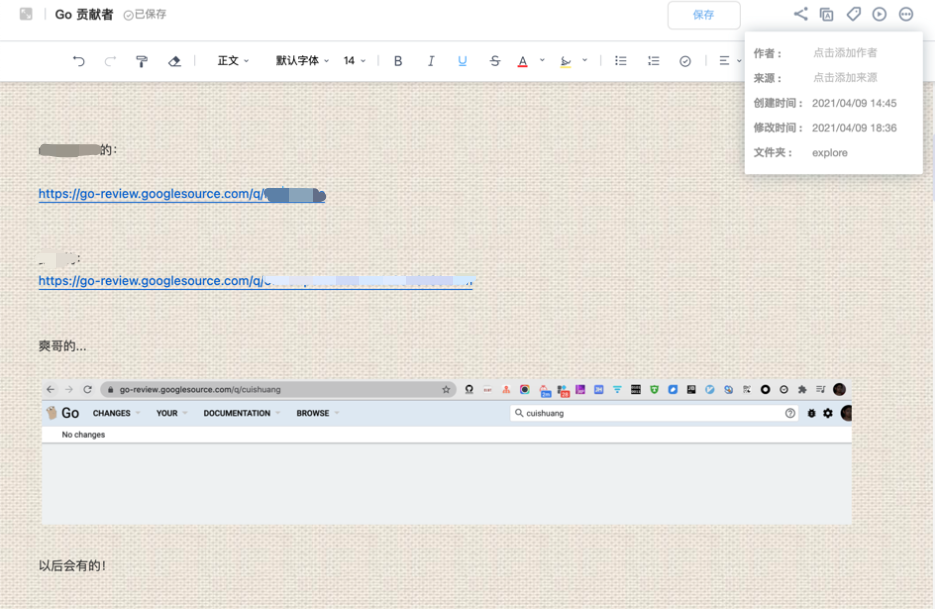
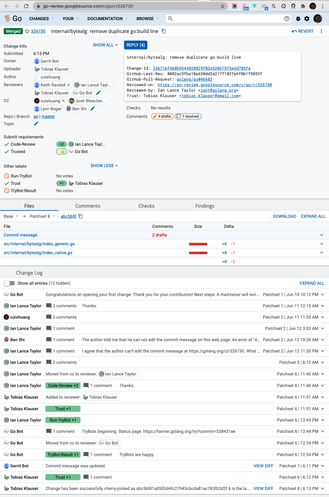
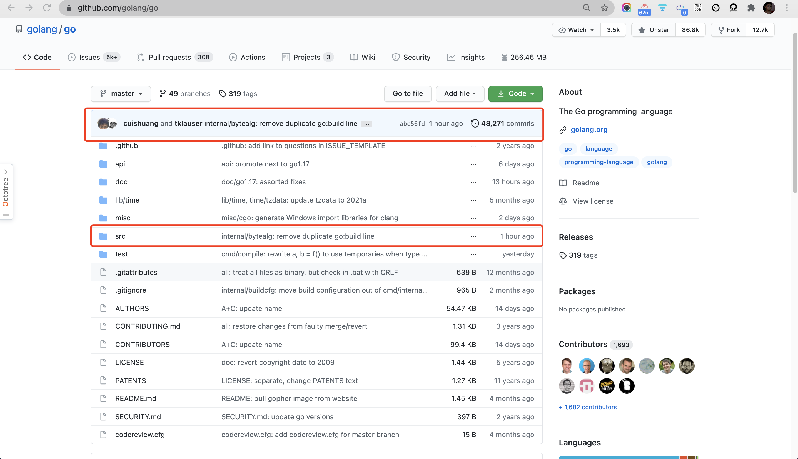
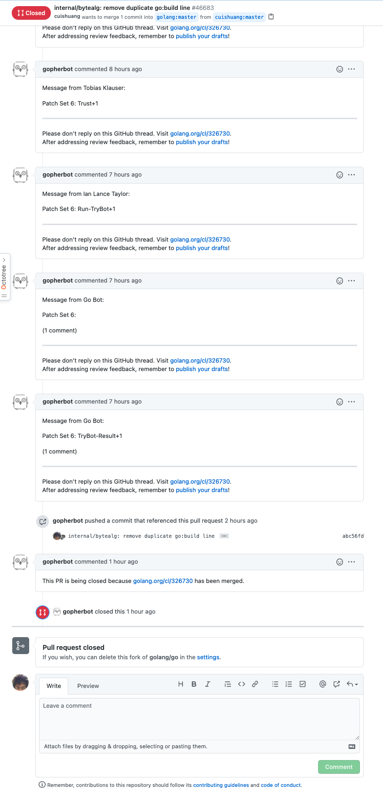
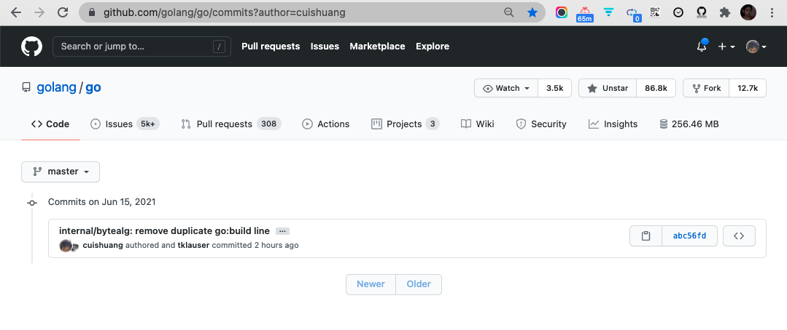
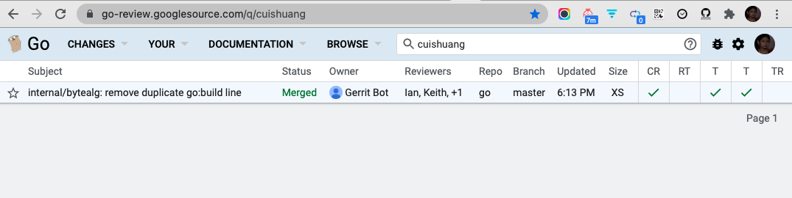

在这篇[成为Go贡献者](https://dashen.tech/2021/04/10/%E6%88%90%E4%B8%BAGo%E8%B4%A1%E7%8C%AE%E8%80%85/) 完成不多时,就如愿以偿,为Golang做出了[微小贡献](https://github.com/golang/go/commit/abc56fd1a0505d4fc27943cbcda81ac783fb2d2f)





<br>


在研究[Rabin–Karp算法](https://dashen.tech/2021/06/11/%E5%AD%97%E7%AC%A6%E4%B8%B2%E5%8C%B9%E9%85%8D%E7%9A%84Rabin%E2%80%93Karp%E7%AE%97%E6%B3%95/)时, 翻阅[internal/bytealg包](),发现了两行重复的 *go build* 指令,如获至宝, 当晚就提了[pull request](https://github.com/golang/go/pull/46683)


之后*gopherbot*会commented,提供一个 [go-review.googlesource.com](https://go-review.googlesource.com/c/go/+/326730)的链接. 在这里, Reviewers们会对这次CL进行code review,并做出评论.


我这次的Reviewers是鼎鼎大名的[Ian Lance Taylor](https://research.google/people/author37504/),Go Team核心成员, 至今还身在开源第一线, 乐此不疲. 作为gccgo的作者,大佬在GCC社区也很活跃




过程中有很多不解,如那个REPLY我无法编辑,请教了编译器领域的[Ben Shi](https://github.com/benshi001),大佬给Go提交了数万行代码,commits次数常年居于[前50](https://github.com/golang/go/graphs/contributors), 不折不扣的当下国内Go语言贡献第一人.


但由于是我第一次提交CL,有很多格式不规范的地方,[Ian大佬](https://www.linkedin.com/in/ianlancetaylor/)都不厌其烦耐心指正,令我惊叹其严谨负责, 诧讶这么一位高屋建瓴成名多时的前辈,竟可以事无巨细更不厌其烦,去指正这些看似无关紧要并无技术含量的问题.

任何一个行业中，总有一小批想想就很兴奋的大师级人物，ta们远远走在前面，背景缥缈而伟岸，却让懵懵懂懂的后来者，不乏追随的勇气和梦想。


(感觉浪费了大佬们的时间,愧疚..)


需要按[这个格式](https://github.com/golang/go/wiki/CommitMessage)来提交,如:

```sh
net/http: frob the quux before blarfing(包名:改动)

[longer description here in the body] (更长的描述,也可不填)

Fixes #nnnn (只写#数字即可,不用加 golang/go)
```

<br>

解决掉问题后, 使得**TryBots are happy.**, 之后就*Change has been successfully cherry-picked*. 这样这次改动就合并到了Go项目中, 之前在Github提的PR也会关闭







<br>



<br>

这无足轻重的[一次改动](https://github.com/golang/go/commits?author=cuishuang),于golang只是大河浩瀚浪花一点,对我却是[里程碑式的一大步](https://go-review.googlesource.com/q/cuishuang). 更希望这是深入理解源码的进军号角,更是引玉之砖再启潘江陆海

**Go Go Go！**

<br>





