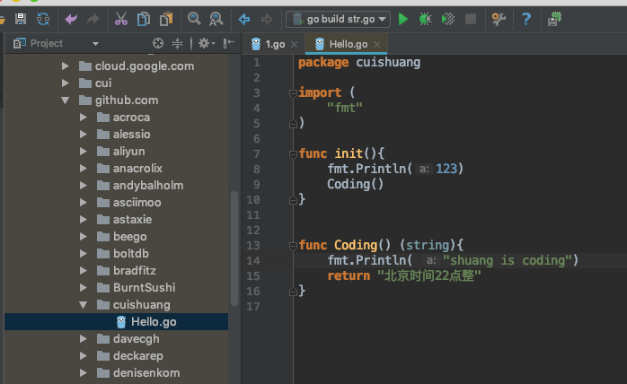

<br>

Go中"_"(下划线)，可简单理解为"舍弃/不使用",如对某个未使用的变量a, _=a后就不会报unused的错误,这个简明易懂无甚好说;

当import包时,在包前加_,仅调用包中的初始化函数即init(),而不会使用(也没法使用)包中其他函数/方法,如对当前文件1.go,import _"github.com/go-sql-driver/mysql",并不能调用其中的方法,仅仅是**完成了初始化**.

这几个字如何理解?又怎样实现?

就这么个简单的问题,通过搜索很难得出再进一步的理解,大多是复制粘贴,制造数字垃圾.

经过动手躬行,得出了以下理解:

- 对于1.go,在执行main.go之前,会先执行_"github.com/go-sql-driver/mysql"的init()函数

- 写一个demo如图





---

回到之前举的import _"github.com/go-sql-driver/mysql"这个包的例子,尝试搞清楚它具体做了啥,初始化完成了什么;


这个包里的driver.go引入了"database/sql"和"database/sql/driver"两个包,
sql.Register("mysql", &MySQLDriver{}),这步即对sql包做了修改，把mysql的驱动加了进去


- 关于此包更深层次的实现,即怎样把mysql驱动加了进去,择日有时间再研究


---


其实在golang中,下划线(underscore)大致有[4种用途](https://note.youdao.com/web/#/file/recent/note/WEBcfee3f427efcf46ead78176c4a6548f8/?search=%E4%B8%8B%E5%88%92%E7%BA%BF)

<br>

除去上面提到的两种,还可以

* 用在变量

```go
type T struct{}
var _ I = T{}

其中 I为interface
```
上面用来判断 type T是否实现了I,用作类型断言，如果T没有实现借口I，则编译错误.


* 用在入参或出参时, 省略某些变量的名称

```go
package main

import "fmt"

func main() {

	fmt.Println(f1(1, 3, 5, 7, 9))

	m, n, p, q := f2()

	fmt.Println(m, n, p, q)

}

func f1(a, b, c, d, _ int) string {

	return fmt.Sprintf("四个数的和为:%d", a+b+c+d)
}

func f2() (x, y int, _ string, total bool) {
	x = 271828
	y = 314159
	total = false

	return x, y, "爽哥", total
}
```

结果为:

```go
四个数的和为:16
271828 314159 爽哥 false
```


