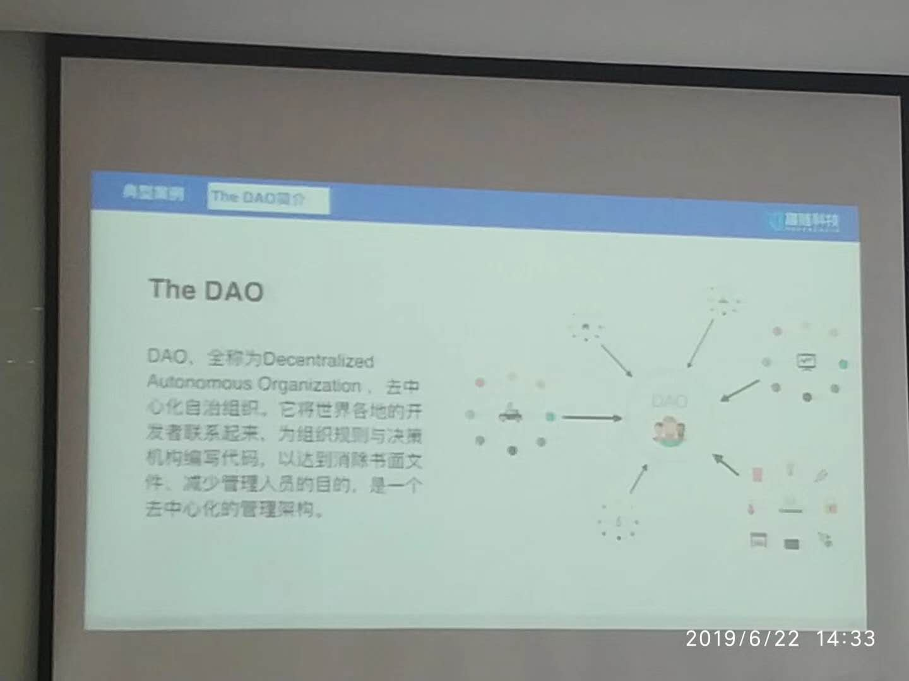
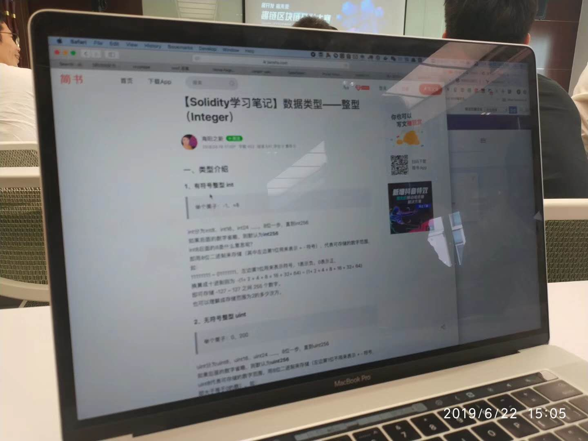

在脸书推出Libra，比特币借势大涨10%再破1万美刀关口，这大半年极少参加活动的我，在家门口参加了一场区块链沙龙。问了几个问题，在此记录:

 

1).听闻某个打掉以太坊许多市值的漏洞，是借由整型溢出，当超出2的256次方时，会出现该问题。我疑惑无论go中的int64还是java中的long，皆占8个字节即64个比特位，即能最大表征2的64次方无符号整数，为什么这里说是2的256次方？

解答是智能合约里常用的Solidity，整型最大范围是2的256次方，与主流编程语言有所差异。

2).限制btc们发展的一大瓶颈是其基于工作量计算实在太过耗时，实现不了微信支付宝们的秒付，而介绍中cita在不同场景下实现了2900笔/秒和15000笔/秒，是借由分布式做微服务实现的吗？一致性如何保证?

回答:主要不是，主要是修改了工作量证明的条约。原来一比交易需要全网50%以上算力证明，这是最耗时的。而许多场景，不需要这样高的级别和规格。有点像电影的分级制度。

3).脑洞大开一下，互联网像水和电一样嵌入一个现代人日常生活，改变了社会的方方面面，不啻一场革命。如果区块链果真也能称“一场革命”，那未来大概会与现在有何不同？还有法定货币吗？还需要公证处吗？还需要各种审计各种稽查吗？

回答:法定货币不太可能消失，也许是多种形态共存，像现在电子支付和现金支付等并行。银行等怕被革命，倒逼改革，都密切关注着区块链。

