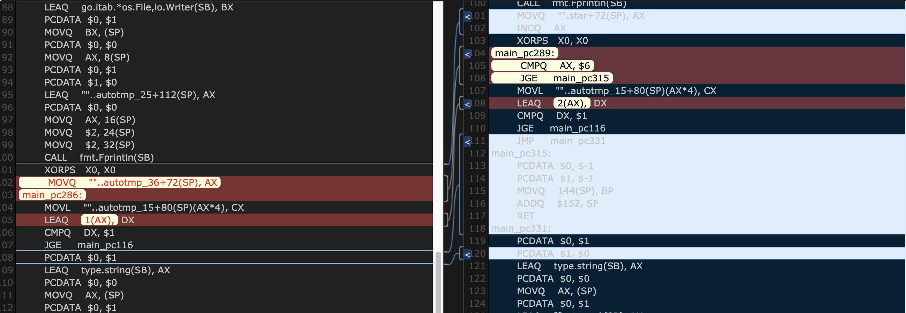
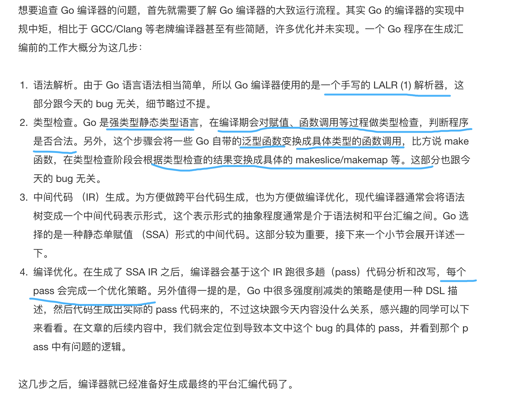
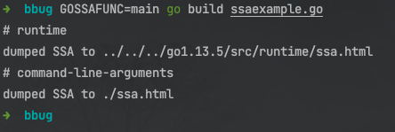
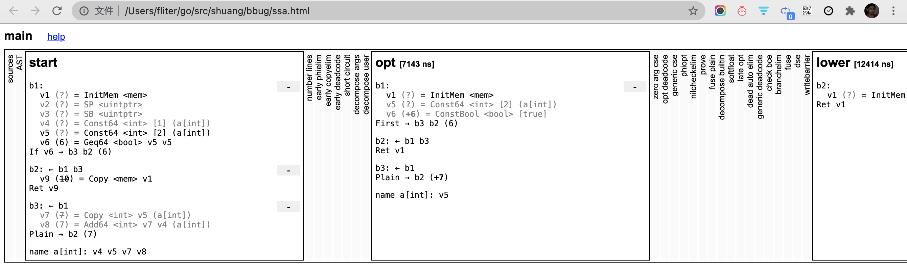
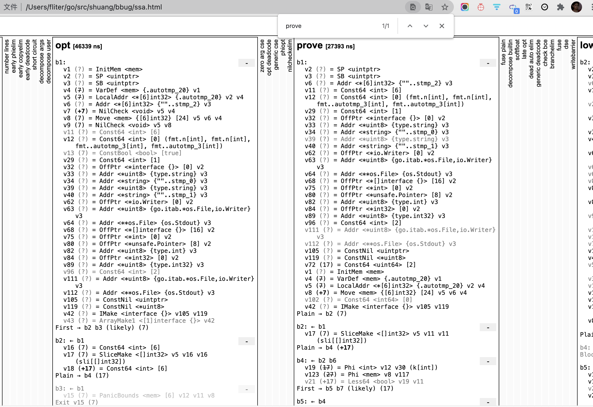
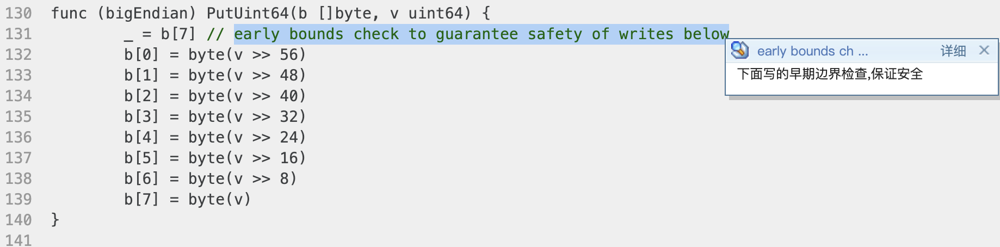
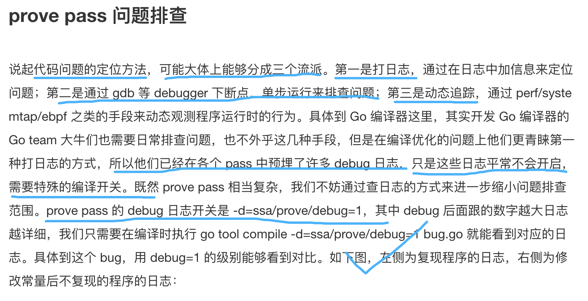
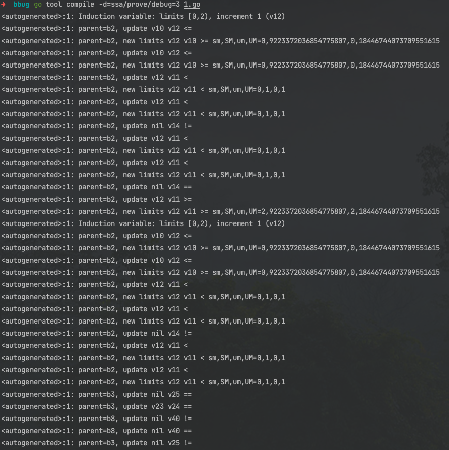
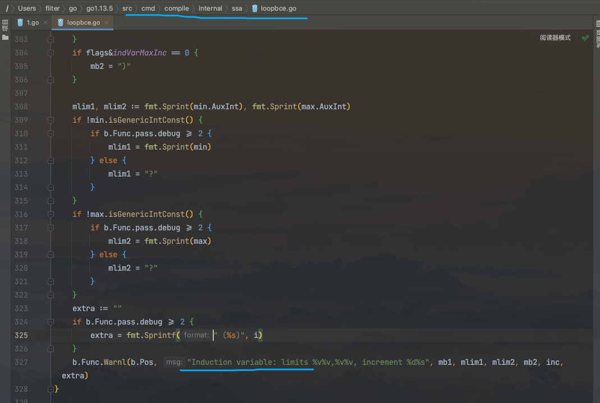
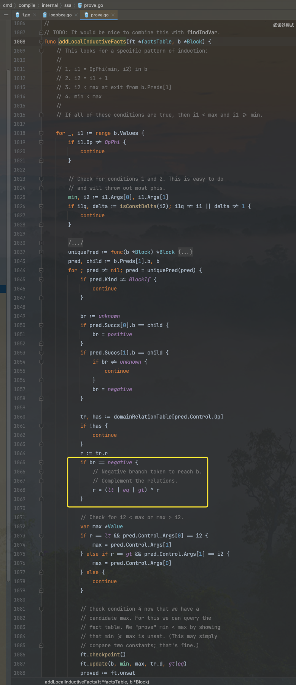

看到[一例 Go 编译器代码优化 bug 定位和修复解析](https://www.infoq.cn/article/FRp5ZxKkJjH3EFfGW8qx)这样一篇文章,感觉有些意思. 在此复现和记录


在Go 1.16版本下,是没有[这个bug](https://github.com/golang/go/issues/40367)的(已修复). 参照[gvm:灵活的Go版本管理工具](https://dashen.tech/2021/05/30/gvm-%E7%81%B5%E6%B4%BB%E7%9A%84Go%E7%89%88%E6%9C%AC%E7%AE%A1%E7%90%86%E5%B7%A5%E5%85%B7/) 将Go版本切至有问题的1.13.5(或1.14.6)

<br>

```go
➜  go version
go version go1.13.5 darwin/amd64
```

<br>


```go
package main

import "fmt"

func main() {

	sli := []int32{1, 2, 3, 4, 5, 6}

	// 如果是这种方式声明的sli, 依然会出bug
	//var sli []int32
	//sli = []int32{1, 2, 3, 4, 5, 6}

	// 如果是这种方式声明的sli, 则不会出bug
	//sli := make([]int32, 0)
	//sli = append(sli, 1, 2, 3, 4, 5, 6)

	for k, v := range sli { //如果把sli改为 []int32{1, 2, 3, 4, 5, 6},也不会出bug

		if k+1 < 1 { //去掉这个不会被执行进,没啥用的判断,则也不会出bug; 改为if k+2 < 2 {,也不会出bug
			panic("")
		}

		fmt.Println("=========")

		fmt.Println(k, v)
	}
}

```

执行结果:

```go
=========
0 1
=========
1 2
=========
2 3
=========
3 4
=========
4 5
=========
5 6
=========
6 622680
=========
7 192
=========
8 17477952
=========
9 0
=========
10 17733712
=========
11 0
=========
12 17475456
=========
13 0
=========
14 622792
=========
15 192
=========
16 17475584

...

```

<br>


[在线 查看&比对 给定程序编译产出的汇编结果](https://godbolt.org/z/s9sWc4).  该网站好评!





<br>


> 其实 Go 的编译器的实现中规中矩，相比于 GCC/Clang 等老牌编译器甚至有些简陋，许多优化并未实现



<br>

"Go 编译器提供了非常方便的功能，可以查看各个优化 pass 前后的 SSA IR，只需要在编译时，增加一个 GOSSAFUNC=xxx 环境变量即可，xxx 即为想要分析的函数的名字，因为 Go 编译器内部的优化都是函数级别的。比如上图的例子，只需要运行 `GOSSAFUNC=main go build ssaexample.go`，编译器就会将 SSA IR 结果输出到当前目录的 `ssa.html` 中，用浏览器打开即可。"




用浏览器打开当前目录的 *ssa.html*:





<br>


执行 `GOSSAFUNC=main go build 1.go `

浏览器打开:




<br>


prove pass 的功能是对全局中 SSA 值的取值范围做一个推断,这样就可以消除掉许多不必要的分支判断


 Go 是内存安全的语言，所以所有的 slice 取元素操作都需要做一个检查，来判断取元素用的下标是否超出了 slice 的范围，这个操作叫做 `bound check`。但是实际上，很多代码中在编译期就能确定这个下标是否越界，那么我们就可以将原本需要在运行期做 bound check 的检查给消除掉，这步优化叫做 `bound check elimination` (即 **BCE**)


 如下 [这样的写法](https://golang.org/src/encoding/binary/binary.go#L130)在Go源码中非常多


 

 可参考 [Go 官方标准编译器中所做的优化 之 Bounds Check Elimination](https://dashen.tech/2021/06/07/Go-%E5%AE%98%E6%96%B9%E6%A0%87%E5%87%86%E7%BC%96%E8%AF%91%E5%99%A8%E4%B8%AD%E6%89%80%E5%81%9A%E7%9A%84%E4%BC%98%E5%8C%96/#12-Bounds-Check-Elimination)


<br>

 


  

  
   


通过日志中的关键字, 能找到只有 findIndVar 和 addLocalInductiveFacts 这两个函数中会打这条日志，结合上下文和相关注释不难看出实际上问题是出在 [addLocalInductiveFacts](https://golang.org/src/cmd/compile/internal/ssa/prove.go#L1098) 这个函数上。addLocalInductiveFacts 具体是什么功能呢？从注释中不难看出，这里的功能是匹配到一种特殊的代码 pattern，即类似 repeat until 的逻辑，在循环末尾判断某个条件是否成立


   

<br>


[修复](https://github.com/golang/go/commit/7f8608047644ca34bad1728d5e2dbef041a1b3f2)


[详细](https://go-review.googlesource.com/c/go/+/244579/)